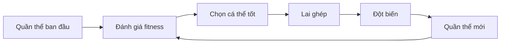
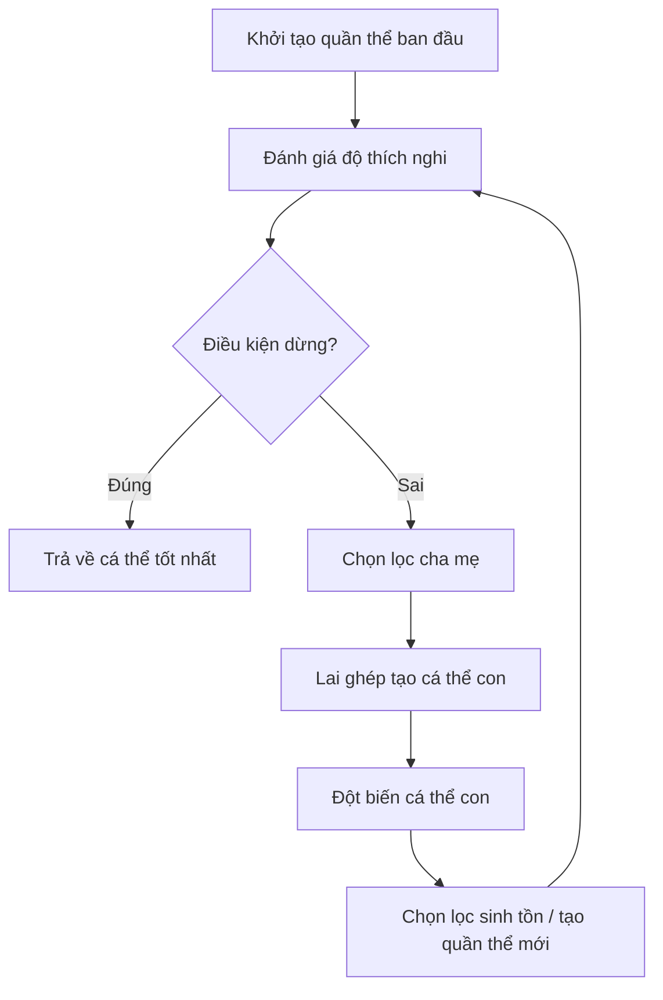
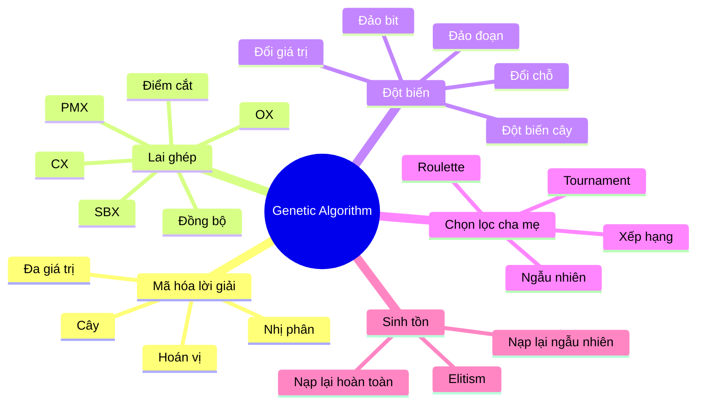
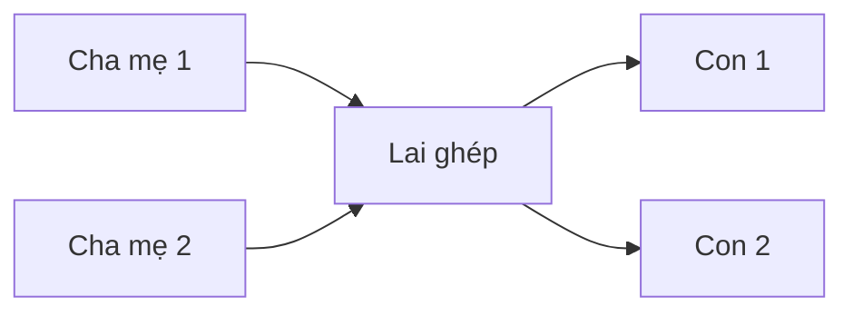
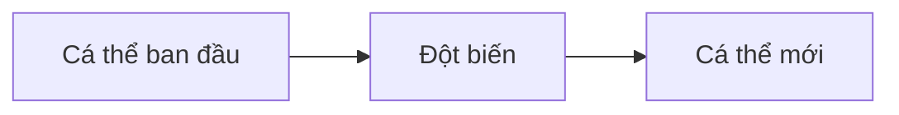
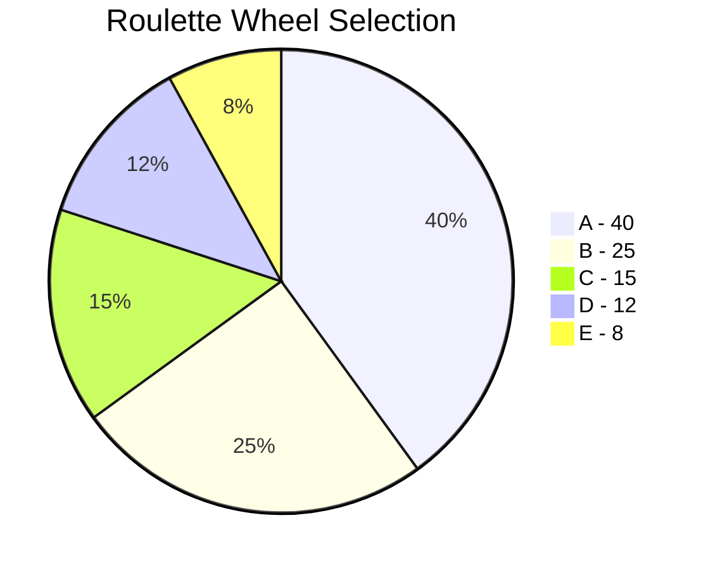
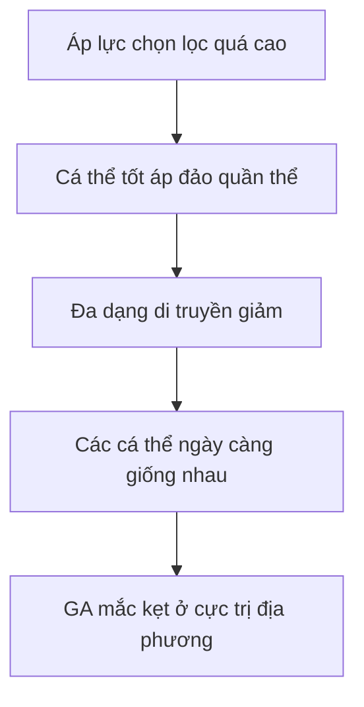
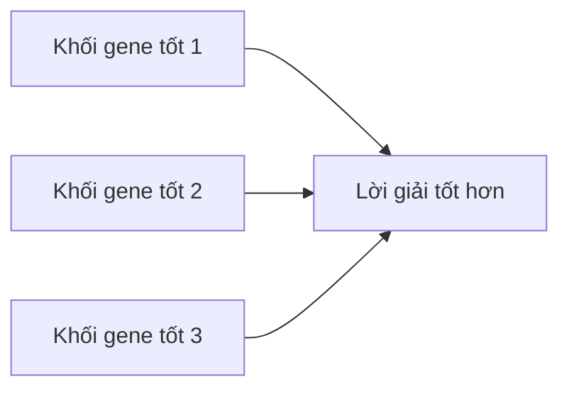

# Chương 2: Giải Thuật Di Truyền

## Genetic Algorithms — GA

> Nội dung chương này hệ thống hóa phần **Giải thuật di truyền** từ tài liệu bài giảng và mở rộng thêm phần giải thích, ví dụ, sơ đồ, mã giả và cài đặt Python. 

---

## Mục tiêu bài học

Sau chương này, bạn sẽ có thể:

* Hiểu **Giải thuật di truyền — Genetic Algorithms (GA)** là gì.
* Nắm được các thành phần cơ bản của GA: **cá thể, quần thể, fitness, lai ghép, đột biến, chọn lọc**.
* Phân biệt các kiểu **mã hóa lời giải**: nhị phân, đa giá trị, hoán vị, cây.
* Hiểu các toán tử di truyền: **crossover, mutation, selection, survival selection**.
* Biết cách đọc và viết **sơ đồ thuật toán GA**.
* Cài đặt được một GA đơn giản bằng Python.

---

# 1. Tổng quan về Giải thuật di truyền

## 1.1. GA là gì?

**Giải thuật di truyền (Genetic Algorithm — GA)** là một thuật toán tối ưu và tìm kiếm lấy cảm hứng từ quá trình **tiến hóa tự nhiên**.

GA mô phỏng các cơ chế sinh học như:

* **Di truyền**
* **Chọn lọc tự nhiên**
* **Lai ghép**
* **Đột biến**
* **Sinh tồn của cá thể thích nghi tốt**

Thay vì tìm lời giải bằng công thức trực tiếp, GA duy trì một **quần thể nhiều lời giải ứng viên**, sau đó để các lời giải đó cạnh tranh, lai ghép và biến đổi qua nhiều thế hệ.

```text
GA = Quần thể lời giải
   + Đánh giá độ thích nghi
   + Chọn lọc cá thể tốt
   + Lai ghép tạo cá thể mới
   + Đột biến duy trì đa dạng
   + Lặp qua nhiều thế hệ
```

---

## 1.2. Lịch sử nghiên cứu GA

GA bắt đầu được nghiên cứu mạnh từ **những năm 1970**, gắn với các nhà nghiên cứu tiêu biểu:

* **John Holland**
* **Kenneth DeJong**
* **David Goldberg**

Trong đó, John Holland được xem là người đặt nền móng lý thuyết cho GA với tác phẩm *Adaptation in Natural and Artificial Systems*.

---

## 1.3. GA thường dùng cho bài toán nào?

GA đặc biệt phù hợp với các bài toán:

| Nhóm bài toán            | Ví dụ                              |
| ------------------------ | ---------------------------------- |
| Tối ưu hóa rời rạc       | Knapsack, TSP, lập lịch            |
| Tối ưu hóa tổ hợp        | Chọn tập con, phân công tài nguyên |
| Không gian tìm kiếm lớn  | Không thể vét cạn toàn bộ lời giải |
| Hàm mục tiêu phức tạp    | Không có đạo hàm, không tuyến tính |
| Bài toán nhiều ràng buộc | Lập lịch thi, lập lịch sản xuất    |

GA **không nhất thiết nhanh**, nhưng có khả năng tìm lời giải tốt trong những không gian tìm kiếm rất lớn.

---

# 2. Tư tưởng cốt lõi của GA

GA dựa trên một ý tưởng đơn giản:

> Cá thể tốt có nhiều khả năng được chọn để sinh sản. Qua nhiều thế hệ, các đặc điểm tốt được giữ lại, kết hợp và cải thiện dần.



Mỗi vòng lặp được gọi là một **thế hệ**.

---

# 3. Các khái niệm cơ bản trong GA

## 3.1. Biểu diễn lời giải

**Biểu diễn lời giải** là cách ánh xạ một lời giải thật của bài toán thành một chuỗi gen để GA có thể xử lý.

Ví dụ:

```text
Bài toán: Chọn 5 món đồ cho balo

Lời giải thật:
Chọn món 1, 3, 5

Mã hóa nhị phân:
1 0 1 0 1
```

Trong đó:

* `1`: chọn món đồ
* `0`: không chọn món đồ

---

## 3.2. Cá thể

**Cá thể** là một lời giải đã được mã hóa.

```text
Cá thể = chuỗi gen đại diện cho một lời giải
```

Ví dụ:

```text
10110100
```

Chuỗi trên có thể đại diện cho một phương án chọn đồ, một lịch trình, một thứ tự đi qua các thành phố hoặc một vector tham số.

---

## 3.3. Quần thể

**Quần thể** là tập hợp nhiều cá thể.

```text
Quần thể P = {
    10110100,
    11100100,
    00110111,
    10001110
}
```

GA không chỉ làm việc với một lời giải duy nhất, mà làm việc với **một tập lời giải** để tăng khả năng khám phá không gian tìm kiếm.

---

## 3.4. Hàm thích nghi

**Hàm thích nghi — fitness function** dùng để đánh giá chất lượng của cá thể.

```text
Fitness càng cao → cá thể càng tốt
```

Ví dụ bài toán OneMax:

```text
Cá thể: 10110100
Fitness = số bit 1 = 4
```

Với bài toán cực tiểu hóa chi phí `cost(x)`, ta có thể chuyển sang fitness dạng cực đại:

```text
fitness(x) = 1 / (1 + cost(x))
```

hoặc:

```text
fitness(x) = C - cost(x)
```

---

# 4. Sơ đồ thuật toán GA tổng quát



---

# 5. Các thành phần chính của GA

Một GA hoàn chỉnh thường gồm 5 thành phần:

| Thành phần             | Vai trò                                    |
| ---------------------- | ------------------------------------------ |
| **Mã hóa lời giải**    | Biến lời giải thật thành chuỗi gen         |
| **Lai ghép**           | Kết hợp hai cá thể cha mẹ để tạo con       |
| **Đột biến**           | Biến đổi ngẫu nhiên một phần cá thể        |
| **Chọn lọc cha mẹ**    | Chọn cá thể được sinh sản                  |
| **Đấu tranh sinh tồn** | Quyết định cá thể nào sống sang thế hệ sau |



---

# 6. Mã hóa lời giải

## 6.1. Mã hóa nhị phân

Mã hóa nhị phân dùng chuỗi bit `0/1`.

```text
Genotype space = {0, 1}^L
```

Ví dụ:

```text
10110010
```

Kiểu mã hóa này phù hợp với:

* Bài toán chọn / không chọn
* Knapsack
* Feature selection
* OneMax
* Tối ưu tổ hợp rời rạc

### Ví dụ

```text
Có 8 món đồ:

Gene:      1 0 1 1 0 0 1 0
Ý nghĩa:   Chọn món 1, 3, 4, 7
```

---

## 6.2. Mã hóa đa giá trị

Trong mã hóa đa giá trị, mỗi gene có thể nhận giá trị không chỉ là `0/1`, mà có thể là:

* Số nguyên
* Số thực
* Giá trị rời rạc
* Giá trị liên tục
* Tập hữu hạn hoặc vô hạn

Ví dụ:

```text
[1.7, 2.3, 5.6, 5.2]
```

hoặc:

```text
[A, C, B, A]
```

hoặc:

```text
[Black, White, Yellow, Yellow]
```

Kiểu mã hóa này phù hợp với:

| Loại gene    | Bài toán phù hợp                    |
| ------------ | ----------------------------------- |
| Số nguyên    | Lập lịch, phân công                 |
| Số thực      | Tối ưu tham số, tối ưu hàm liên tục |
| Nhãn rời rạc | Phân cụm, chọn loại tài nguyên      |

---

## 6.3. Mã hóa hoán vị

Mã hóa hoán vị dùng một thứ tự sắp xếp của các gene.

Ví dụ:

```text
[1, 3, 6, 7, 8, 2, 5, 4, 9]
```

Kiểu mã hóa này phù hợp với các bài toán liên quan đến **thứ tự**.

Ví dụ điển hình:

* Traveling Salesman Problem — TSP
* Lập lịch thứ tự công việc
* Vehicle Routing Problem
* Bài toán sắp xếp tuyến đường

Với mã hóa hoán vị, cần chú ý:

> Lai ghép thông thường có thể tạo cá thể lỗi, ví dụ bị trùng thành phố hoặc thiếu thành phố. Vì vậy cần dùng các toán tử chuyên biệt như OX, PMX, CX.

---

## 6.4. Mã hóa cây

Mã hóa cây dùng để biểu diễn lời giải có cấu trúc cây.

Một số dạng mã hóa cây:

| Dạng mã hóa         | Mô tả                                                  |
| ------------------- | ------------------------------------------------------ |
| **Mã hóa cạnh**     | Liệt kê các cạnh của cây                               |
| **Mã hóa đỉnh cha** | Mỗi đỉnh lưu thông tin đỉnh cha                        |
| **Prufer**          | Biểu diễn cây bằng vector số nguyên độ dài `n - 2`     |
| **NetKeys**         | Gán độ ưu tiên cho cạnh, chọn cạnh không tạo chu trình |

---

### 6.4.1. Mã hóa cạnh

Ví dụ cây có các cạnh:

```text
(1, 2), (1, 3), (3, 4), (3, 5)
```

Mã hóa cạnh:

```text
[(1, 2), (1, 3), (3, 4), (3, 5)]
```

---

### 6.4.2. Mã hóa đỉnh cha

Chọn một đỉnh làm gốc. Mỗi đỉnh còn lại lưu lại đỉnh cha của nó.

Ví dụ:

```text
Parent(1) = 1
Parent(2) = 1
Parent(3) = 1
Parent(4) = 3
Parent(5) = 3
```

---

### 6.4.3. Mã hóa Prufer

Prufer dùng một vector số nguyên để biểu diễn cây.

Với cây có `n` đỉnh:

```text
Độ dài mã Prufer = n - 2
```

#### Quy trình mã hóa Prufer

```text
Bước 1: Đánh nhãn các đỉnh từ 1 đến n.
Bước 2: Tìm đỉnh lá có id nhỏ nhất.
Bước 3: Lấy đỉnh kề với đỉnh lá đó, thêm vào mã Prufer.
Bước 4: Xóa đỉnh lá và cạnh liên quan.
Bước 5: Lặp lại cho đến khi cây còn 2 đỉnh.
```

#### Quy trình giải mã Prufer

```text
Bước 1: Tìm tập đỉnh không xuất hiện trong mã Prufer.
Bước 2: Chọn đỉnh nhỏ nhất trong tập đó.
Bước 3: Nối nó với phần tử đầu tiên của mã Prufer.
Bước 4: Xóa phần tử đã dùng khỏi mã Prufer.
Bước 5: Cập nhật tập đỉnh.
Bước 6: Khi còn 2 đỉnh, nối chúng lại.
```

---

### 6.4.4. NetKeys

NetKeys hoạt động bằng cách:

```text
Gán độ ưu tiên cho mỗi cạnh
→ Sắp xếp cạnh theo độ ưu tiên
→ Thêm cạnh lần lượt nếu không tạo chu trình
→ Tạo cây khung
```

Ưu điểm:

* Mềm dẻo
* Dễ áp dụng trên đồ thị

Nhược điểm:

* Độ dư thừa mã hóa cao
* Vector mã hóa có thể rất dài

---

# 7. Hàm thích nghi

## 7.1. Vai trò của fitness

Fitness dùng để trả lời câu hỏi:

> Cá thể này tốt đến mức nào?

Ví dụ với bài toán OneMax:

```text
Cá thể A = 10110100 → fitness = 4
Cá thể B = 11111100 → fitness = 6
```

Cá thể B tốt hơn cá thể A.

---

## 7.2. Fitness có thể khác hàm mục tiêu

Trong nhiều bài toán, **fitness không nhất thiết trùng hoàn toàn với hàm mục tiêu**.

Ví dụ bài toán có ràng buộc:

```text
Tối đa hóa giá trị balo
Nhưng tổng trọng lượng không được vượt quá W
```

Ta có thể định nghĩa:

```text
fitness = total_value - penalty
```

Trong đó:

```text
penalty = mức phạt nếu vượt quá trọng lượng
```

---

# 8. Lai ghép trong GA

## 8.1. Lai ghép là gì?

**Lai ghép — crossover** là quá trình kết hợp hai cá thể cha mẹ để sinh ra cá thể con.

Mục tiêu:

> Kết hợp các đặc điểm tốt từ hai cá thể cha mẹ để tạo ra lời giải mới tốt hơn.



---

## 8.2. Phân loại các phương pháp lai ghép

| Kiểu mã hóa          | Toán tử lai ghép phù hợp            |
| -------------------- | ----------------------------------- |
| Nhị phân, đa giá trị | Lai ghép điểm cắt, lai ghép đồng bộ |
| Hoán vị              | OX, PMX, CX                         |
| Số thực              | SBX                                 |
| Cây                  | Lai ghép trộn cạnh                  |

---

## 8.3. Lai ghép theo điểm cắt

### Một điểm cắt

```text
Cha 1:  1 0 1 | 1 0 0 1 0
Cha 2:  0 1 1 | 0 1 1 0 1

Con 1:  1 0 1 | 0 1 1 0 1
Con 2:  0 1 1 | 1 0 0 1 0
```

### Hai điểm cắt

```text
Cha 1:  1 0 | 1 1 0 | 0 1 0
Cha 2:  0 1 | 1 0 1 | 1 0 1

Con 1:  1 0 | 1 0 1 | 0 1 0
Con 2:  0 1 | 1 1 0 | 1 0 1
```

### N điểm cắt

Dùng nhiều điểm cắt để trao đổi nhiều đoạn gene giữa hai cá thể cha mẹ.

Lai ghép điểm cắt thường phù hợp với:

```text
Mã hóa nhị phân
Mã hóa đa giá trị dạng chuỗi
```

---

## 8.4. Lai ghép đồng bộ

Còn gọi là **uniform crossover**.

Tại mỗi vị trí gene, lấy ngẫu nhiên một số thực:

```text
u ∈ [0, 1]
```

Quy tắc:

```text
Nếu u < 0.5  → lấy gene từ cha
Nếu u >= 0.5 → lấy gene từ mẹ
```

Ví dụ:

```text
Cha 1:  1 0 1 1 0 0 1 0
Cha 2:  0 1 1 0 1 1 0 1
Mask:   A B B A A B A B

Con:    1 1 1 1 0 1 1 1
```

---

# 9. Lai ghép trên mã hóa hoán vị

## 9.1. Vì sao cần toán tử riêng?

Với hoán vị, mỗi gene chỉ được xuất hiện đúng một lần.

Ví dụ hợp lệ:

```text
[1, 2, 3, 4, 5]
```

Ví dụ không hợp lệ:

```text
[1, 2, 2, 4, 5]
```

Do đó, nếu dùng crossover thông thường, con có thể bị trùng gene hoặc thiếu gene.

---

## 9.2. Order Crossover — OX

Quy trình:

```text
Bước 1: Chọn 2 điểm lai.
Bước 2: Sao chép đoạn giữa 2 điểm từ cha 1 sang con.
Bước 3: Điền các gene còn thiếu theo thứ tự xuất hiện ở cha 2.
```

Ví dụ:

```text
Cha 1:  1 2 | 3 4 5 | 6 7 8
Cha 2:  4 6 | 2 8 7 | 5 1 3

Con:    _ _ | 3 4 5 | _ _ _
Điền tiếp theo thứ tự từ cha 2, bỏ gene đã có.
```

OX phù hợp với bài toán mà **thứ tự tương đối** của gene quan trọng.

---

## 9.3. Partially Mapped Crossover — PMX

PMX dùng cơ chế ánh xạ giữa hai đoạn được chọn.

Quy trình:

```text
Bước 1: Chọn 2 điểm lai.
Bước 2: Sao chép đoạn giữa từ cha 1 sang con.
Bước 3: Dùng ánh xạ giữa cha 1 và cha 2 để điền gene còn thiếu.
Bước 4: Đảm bảo con vẫn là một hoán vị hợp lệ.
```

PMX phù hợp với bài toán cần giữ quan hệ vị trí tương đối giữa các gene.

---

## 9.4. Cycle Crossover — CX

CX tìm các chu trình giữa hai cha mẹ.

Ý tưởng:

```text
Gene ở vị trí này trong cha 1 tương ứng với gene nào ở cha 2?
Tiếp tục lần theo quan hệ đó để tạo thành chu trình.
```

Sau đó sao chép các chu trình xen kẽ từ cha mẹ để tạo con.

CX thường dùng cho mã hóa hoán vị.

---

# 10. Lai ghép trên mã hóa số thực

## 10.1. Simulated Binary Crossover — SBX

SBX là toán tử lai ghép dùng cho cá thể có gene là số thực.

Với hai cha mẹ `p1`, `p2`, tạo hai con `c1`, `c2`.

### Bước 1

Lấy ngẫu nhiên:

```text
u ∈ [0, 1]
```

### Bước 2

Tính hệ số `β`:

```text
Nếu u <= 0.5:

β = 2 * u^(1 / (η + 1))

Nếu u > 0.5:

β = 1 / (2 * (1 - u)^(1 / (η + 1)))
```

Trong đó:

```text
η: hệ số phân bố, thường từ 2 đến 10
η càng cao → con càng gần cha mẹ
```

### Bước 3

Sinh hai cá thể con:

```text
c1 = 0.5 * ((1 + β) * p1 + (1 - β) * p2)

c2 = 0.5 * ((1 - β) * p1 + (1 + β) * p2)
```

Đặc điểm:

* Con nằm gần cha mẹ.
* Giúp duy trì đặc tính tốt.
* Phù hợp với tối ưu liên tục.

---

# 11. Lai ghép trên mã hóa cây

## 11.1. Lai ghép trộn cạnh

Ý tưởng:

```text
Trộn tập cạnh của hai cây cha mẹ
→ Thu được tập cạnh E
→ Dùng PrimRST để sinh cây khung ngẫu nhiên trên E
```

Phù hợp với các bài toán cần biểu diễn lời giải dưới dạng cây.

Ví dụ:

* Thiết kế mạng
* Cây khung tối ưu
* Cấu trúc phân cấp
* Một số bài toán định tuyến

---

# 12. Đột biến trong GA

## 12.1. Đột biến là gì?

**Đột biến — mutation** là thao tác thay đổi ngẫu nhiên một phần cá thể.

Mục tiêu:

* Tạo đa dạng di truyền
* Tránh mất gene tốt
* Giúp GA thoát khỏi cực trị địa phương
* Khám phá vùng tìm kiếm mới



---

## 12.2. Các phương pháp đột biến

| Phương pháp      | Áp dụng với                  |
| ---------------- | ---------------------------- |
| Đảo bit          | Mã hóa nhị phân              |
| Đổi chỗ          | Nhị phân, hoán vị            |
| Đổi giá trị      | Số nguyên, số thực           |
| Đảo đoạn         | Nhị phân, hoán vị, số nguyên |
| Đột biến cây     | Mã hóa cây                   |
| Đột biến đa thức | Số thực                      |

---

## 12.3. Đảo bit

Áp dụng với mã hóa nhị phân.

```text
Trước:  1 0 1 1 0 0 1 0
Sau:    1 1 1 1 0 1 1 0
          ^         ^
```

Bit `0` đổi thành `1`, bit `1` đổi thành `0`.

---

## 12.4. Đổi chỗ

Chọn hai vị trí bất kỳ rồi đổi chỗ gene tại hai vị trí đó.

Ví dụ:

```text
Trước:  1 2 3 4 5 6 7 8 9
Chọn:       ^       ^
Sau:    1 2 7 4 5 6 3 8 9
```

Phù hợp với:

* Mã hóa hoán vị
* Một số mã hóa nhị phân hoặc số nguyên

---

## 12.5. Đổi giá trị

Áp dụng với gene số nguyên hoặc số thực.

Ví dụ:

```text
Trước: [1.7, 2.3, 5.6, 5.2]
Sau:   [1.7, 2.1, 5.6, 5.2]
```

Một gene được cộng hoặc trừ một lượng nhỏ.

---

## 12.6. Đảo đoạn

Chọn hai vị trí, đảo ngược đoạn nằm giữa.

```text
Trước:  1 2 3 4 5 6 7 8 9
Chọn:       |-------|
Sau:    1 2 7 6 5 4 3 8 9
```

Phù hợp với:

* Hoán vị
* Nhị phân
* Số nguyên

---

## 12.7. Đột biến cây

Với mã hóa cây, có thể:

```text
Cắt một cây con
→ Gắn cây con đó vào vị trí khác
```

Hoặc thay một cây con bằng cây con mới.

---

## 12.8. Đột biến đa thức

Áp dụng với biểu diễn số thực.

Đặc điểm:

* Cá thể con thường gần cá thể cha mẹ.
* Là toán tử **parent-centric**.
* Phù hợp với tối ưu liên tục.

---

# 13. Chọn lọc cha mẹ

## 13.1. Chọn lọc là gì?

Chọn lọc quyết định cá thể nào được chọn để sinh sản.

Mục tiêu:

> Cá thể có fitness tốt hơn nên có cơ hội sinh sản cao hơn.

Các phương pháp chọn lọc cha mẹ:

* Chọn lọc ngẫu nhiên
* Roulette Wheel Selection
* Rank Selection
* Tournament Selection

---

## 13.2. Chọn lọc ngẫu nhiên

Cá thể cha mẹ được chọn hoàn toàn ngẫu nhiên.

Ưu điểm:

* Đơn giản
* Giữ đa dạng cao

Nhược điểm:

* Không ưu tiên cá thể tốt
* Hội tụ chậm

---

## 13.3. Chọn lọc theo bánh xe Roulette

Mỗi cá thể được chọn với xác suất tỉ lệ thuận với fitness.

Công thức:

```text
p_i = fitness_i / tổng_fitness
```

Ví dụ:

| Cá thể | Fitness | Xác suất chọn |
| ------ | ------: | ------------: |
| A      |      40 |           40% |
| B      |      25 |           25% |
| C      |      15 |           15% |
| D      |      12 |           12% |
| E      |       8 |            8% |



Quy trình:

```text
Bước 1: Tính tổng fitness F.
Bước 2: Tính xác suất chọn từng cá thể.
Bước 3: Tính xác suất tích lũy.
Bước 4: Sinh số ngẫu nhiên r trong [0, 1].
Bước 5: Chọn cá thể có khoảng tích lũy chứa r.
```

---

## 13.4. Chọn lọc theo thứ hạng

Thay vì dùng fitness gốc, ta xếp hạng các cá thể.

Ví dụ:

```text
Hạng 1: cá thể tốt nhất
Hạng 2: cá thể tốt thứ hai
...
```

Sau đó chọn theo thứ hạng.

Ưu điểm:

* Tránh cá thể quá mạnh áp đảo quần thể
* Ổn định hơn Roulette khi fitness chênh lệch lớn

Nhược điểm:

* Cần sắp xếp quần thể
* Có thể hội tụ chậm hơn

---

## 13.5. Chọn lọc giao đấu — Tournament Selection

Quy trình:

```text
Bước 1: Chọn ngẫu nhiên k cá thể.
Bước 2: So sánh fitness của chúng.
Bước 3: Cá thể tốt nhất thắng và được chọn làm cha/mẹ.
```

Ví dụ với `k = 3`:

```text
Chọn ngẫu nhiên: A, C, D
Fitness:
A = 10
C = 18
D = 15

C thắng tournament.
```

Đặc điểm:

| Tham số | Ý nghĩa                                                   |
| ------- | --------------------------------------------------------- |
| `k` nhỏ | Áp lực chọn lọc thấp, giữ đa dạng                         |
| `k` lớn | Áp lực chọn lọc cao, hội tụ nhanh hơn nhưng dễ hội tụ sớm |

Tournament Selection rất phổ biến vì đơn giản và hiệu quả.

---

# 14. Đấu tranh sinh tồn

## 14.1. Đấu tranh sinh tồn là gì?

Sau khi tạo cá thể con, cần quyết định:

> Cá thể nào được giữ lại cho thế hệ sau?

Các phương pháp chính:

* Nạp lại hoàn toàn
* Nạp lại ngẫu nhiên
* Giữ lại cá thể ưu tú
* Áp dụng phương pháp chọn lọc cha mẹ

---

## 14.2. Nạp lại hoàn toàn

Sinh ra số con bằng số cá thể cha mẹ, sau đó thay thế toàn bộ quần thể cũ bằng quần thể con.

Ưu điểm:

* Tạo thay đổi mạnh
* Giảm nguy cơ mắc kẹt cục bộ

Nhược điểm:

* Có thể mất cá thể tốt
* Chất lượng quần thể có thể giảm

---

## 14.3. Nạp lại ngẫu nhiên

Sau khi sinh `k` con, chọn ngẫu nhiên `k` cá thể trong quần thể cũ để thay thế.

Ưu điểm:

* Dễ cài đặt
* Duy trì một phần quần thể cũ

Nhược điểm:

* Có thể loại mất cá thể tốt

---

## 14.4. Giữ lại cá thể ưu tú — Elitism

Luôn giữ lại một số cá thể tốt nhất từ thế hệ hiện tại sang thế hệ sau.

Ví dụ:

```text
Quần thể có 100 cá thể
Elitism size = 2

→ Giữ nguyên 2 cá thể tốt nhất
→ 98 cá thể còn lại được tạo bằng lai ghép và đột biến
```

Ưu điểm:

* Đảm bảo lời giải tốt nhất không bị mất
* Fitness tốt nhất không giảm qua các thế hệ

Nhược điểm:

* Nếu elitism quá mạnh, quần thể mất đa dạng
* Dễ hội tụ sớm

---

# 15. Hội tụ sớm trong GA

## 15.1. Hội tụ sớm là gì?

**Hội tụ sớm — premature convergence** xảy ra khi quần thể trở nên quá giống nhau trước khi tìm được lời giải tốt.

Khi đó, GA bị mắc kẹt ở một cực trị địa phương.



---

## 15.2. Dấu hiệu hội tụ sớm

* Fitness tốt nhất không cải thiện trong nhiều thế hệ.
* Fitness trung bình gần bằng fitness tốt nhất.
* Các cá thể trong quần thể gần như giống nhau.
* Đột biến không tạo được cải thiện đáng kể.

---

## 15.3. Cách khắc phục

| Nguyên nhân                        | Cách khắc phục                               |
| ---------------------------------- | -------------------------------------------- |
| Tournament size quá lớn            | Giảm `k`                                     |
| Mutation rate quá thấp             | Tăng `pm`                                    |
| Quần thể quá nhỏ                   | Tăng population size                         |
| Elitism quá mạnh                   | Giảm số cá thể elite                         |
| Fitness bị cá thể siêu trội áp đảo | Dùng rank selection hoặc fitness scaling     |
| Quần thể mất đa dạng               | Restart một phần quần thể, niching, crowding |

---

# 16. Định lý Schema và Building Block

## 16.1. Schema là gì?

Schema là một khuôn mẫu mô tả nhiều chuỗi có chung một số vị trí gene.

Ký hiệu `*` nghĩa là vị trí bất kỳ.

Ví dụ:

```text
Schema H = 1 * * 0 * * * 1
```

Schema này đại diện cho mọi chuỗi độ dài 8 có:

```text
Bit 1 = 1
Bit 4 = 0
Bit 8 = 1
```

Các vị trí còn lại tự do.

---

## 16.2. Hai đại lượng quan trọng

| Đại lượng                  | Ý nghĩa                                                |
| -------------------------- | ------------------------------------------------------ |
| `o(H)` — bậc của schema    | Số vị trí xác định cụ thể                              |
| `δ(H)` — độ dài định nghĩa | Khoảng cách giữa vị trí xác định đầu tiên và cuối cùng |

Ví dụ:

```text
H = 1 * * 0 * * * 1
```

Ta có:

```text
o(H) = 3
δ(H) = 8 - 1 = 7
```

---

## 16.3. Ý nghĩa của Định lý Schema

Định lý Schema nói rằng:

> Các schema có fitness trung bình cao, bậc thấp và độ dài định nghĩa ngắn sẽ có xu hướng tăng số lượng qua nhiều thế hệ.

Nói đơn giản:

```text
Những khối gene ngắn, tốt, dễ bảo toàn
→ được chọn lọc nhiều hơn
→ ít bị phá vỡ bởi crossover và mutation
→ xuất hiện ngày càng nhiều
```

---

## 16.4. Building Block Hypothesis

**Building Block Hypothesis** cho rằng GA hoạt động bằng cách:

```text
Tìm các khối gene nhỏ tốt
→ Nhân bản chúng
→ Kết hợp chúng
→ Tạo lời giải lớn tốt hơn
```



---

# 17. Tham số điều khiển GA

| Tham số                    | Ý nghĩa                  | Giá trị thường dùng    |
| -------------------------- | ------------------------ | ---------------------- |
| Population size `N`        | Số cá thể trong quần thể | 50 — 500               |
| Crossover probability `pc` | Xác suất lai ghép        | 0.6 — 0.9              |
| Mutation probability `pm`  | Xác suất đột biến        | `1/L` đến `0.05`       |
| Number of generations      | Số thế hệ                | Vài trăm đến vài nghìn |
| Elitism size               | Số cá thể ưu tú giữ lại  | 1 — 5% quần thể        |
| Tournament size `k`        | Áp lực chọn lọc          | 2 — 5                  |

---

# 18. Pseudocode GA tổng quát

```text
Khởi tạo quần thể P gồm N cá thể ngẫu nhiên

Đánh giá fitness của từng cá thể trong P

Lặp cho đến khi đạt điều kiện dừng:

    Chọn một số cá thể tốt nhất để giữ lại nếu dùng elitism

    Lặp đến khi tạo đủ quần thể mới:

        Chọn cha mẹ bằng phương pháp selection

        Lai ghép cha mẹ với xác suất pc

        Đột biến cá thể con với xác suất pm

        Thêm cá thể con vào quần thể mới

    Đánh giá fitness của quần thể mới

    Cập nhật cá thể tốt nhất

Trả về cá thể tốt nhất
```

---

# 19. Cài đặt Python: GA giải bài toán OneMax

Bài toán **OneMax**:

> Tìm chuỗi nhị phân độ dài `L` sao cho số bit `1` là lớn nhất.

Fitness:

```text
fitness = số lượng bit 1
```

```python
import random

# =========================
# Tham số GA
# =========================

CHROMOSOME_LENGTH = 40
POPULATION_SIZE = 100
N_GENERATIONS = 150
PC = 0.8
PM = 1.0 / CHROMOSOME_LENGTH
TOURNAMENT_K = 3
ELITISM_SIZE = 2


def init_individual():
    """Sinh một cá thể nhị phân ngẫu nhiên."""
    return [random.randint(0, 1) for _ in range(CHROMOSOME_LENGTH)]


def fitness(individual):
    """Fitness của bài toán OneMax = số bit 1."""
    return sum(individual)


def tournament_selection(population, fitnesses, k=TOURNAMENT_K):
    """Chọn một cá thể bằng tournament selection."""
    contestants = random.sample(list(zip(population, fitnesses)), k)
    winner = max(contestants, key=lambda x: x[1])
    return winner[0][:]


def single_point_crossover(parent1, parent2):
    """Lai ghép một điểm."""
    point = random.randint(1, len(parent1) - 1)

    child1 = parent1[:point] + parent2[point:]
    child2 = parent2[:point] + parent1[point:]

    return child1, child2


def bit_flip_mutation(individual, pm=PM):
    """Đột biến đảo bit."""
    for i in range(len(individual)):
        if random.random() < pm:
            individual[i] = 1 - individual[i]
    return individual


def run_ga():
    population = [init_individual() for _ in range(POPULATION_SIZE)]
    fitnesses = [fitness(ind) for ind in population]

    best_individual = max(population, key=fitness)
    best_fitness = fitness(best_individual)

    for generation in range(N_GENERATIONS):

        # Giữ lại cá thể ưu tú
        ranked = sorted(
            zip(population, fitnesses),
            key=lambda x: x[1],
            reverse=True
        )

        new_population = [ind[:] for ind, _ in ranked[:ELITISM_SIZE]]

        # Sinh quần thể mới
        while len(new_population) < POPULATION_SIZE:
            parent1 = tournament_selection(population, fitnesses)
            parent2 = tournament_selection(population, fitnesses)

            if random.random() < PC:
                child1, child2 = single_point_crossover(parent1, parent2)
            else:
                child1, child2 = parent1[:], parent2[:]

            child1 = bit_flip_mutation(child1)
            child2 = bit_flip_mutation(child2)

            new_population.append(child1)

            if len(new_population) < POPULATION_SIZE:
                new_population.append(child2)

        population = new_population
        fitnesses = [fitness(ind) for ind in population]

        generation_best = max(population, key=fitness)
        generation_best_fitness = fitness(generation_best)

        if generation_best_fitness > best_fitness:
            best_individual = generation_best[:]
            best_fitness = generation_best_fitness

        if generation % 20 == 0 or best_fitness == CHROMOSOME_LENGTH:
            avg_fitness = sum(fitnesses) / len(fitnesses)
            print(
                f"Thế hệ {generation:3d}: "
                f"best = {best_fitness}, "
                f"avg = {avg_fitness:.2f}"
            )

        if best_fitness == CHROMOSOME_LENGTH:
            print(f"Đã tìm thấy lời giải tối ưu ở thế hệ {generation}.")
            break

    print("\nCá thể tốt nhất:", "".join(map(str, best_individual)))
    print("Fitness tốt nhất:", best_fitness, "/", CHROMOSOME_LENGTH)

    return best_individual, best_fitness


if __name__ == "__main__":
    random.seed(42)
    run_ga()
```

---

# 20. Ứng dụng thực tế của GA

| Lĩnh vực         | Ứng dụng                                           |
| ---------------- | -------------------------------------------------- |
| Tối ưu tổ hợp    | Knapsack, TSP, bin packing                         |
| Lập lịch         | Lập lịch thi, lập lịch sản xuất, phân ca           |
| Kỹ thuật         | Thiết kế mạch, tối ưu kết cấu, tối ưu khí động học |
| Machine Learning | Feature selection, hyperparameter tuning           |
| Tài chính        | Tối ưu danh mục đầu tư                             |
| Logistics        | Định tuyến phương tiện, tối ưu vận chuyển          |
| Mạng máy tính    | Thiết kế mạng, định tuyến                          |
| Game AI          | Tiến hóa chiến thuật chơi game                     |

---

# 21. Bảng tổng kết nhanh

| Thành phần     | Câu hỏi cần trả lời                  |
| -------------- | ------------------------------------ |
| Mã hóa         | Lời giải được biểu diễn như thế nào? |
| Fitness        | Cá thể tốt hay xấu được đo ra sao?   |
| Selection      | Cá thể nào được chọn làm cha mẹ?     |
| Crossover      | Cha mẹ tạo con bằng cách nào?        |
| Mutation       | Con được biến đổi ngẫu nhiên ra sao? |
| Survival       | Cá thể nào sống sang thế hệ sau?     |
| Stop condition | Khi nào thuật toán dừng?             |

---

# 22. Điều cần ghi nhớ

* **GA** là thuật toán tiến hóa kinh điển, thường dùng cho bài toán tối ưu rời rạc và tổ hợp.
* Một lời giải được mã hóa thành **cá thể**, nhiều cá thể tạo thành **quần thể**.
* **Fitness function** quyết định cá thể nào tốt hơn.
* **Selection** chọn cá thể có khả năng sinh sản.
* **Crossover** kết hợp thông tin từ cha mẹ.
* **Mutation** tạo biến đổi ngẫu nhiên để duy trì đa dạng.
* **Elitism** giúp giữ lại cá thể tốt nhất nhưng dùng quá nhiều có thể gây hội tụ sớm.
* Các kiểu mã hóa khác nhau cần toán tử lai ghép và đột biến khác nhau.
* Với mã hóa hoán vị, cần dùng toán tử chuyên biệt như **OX, PMX, CX**.
* Với mã hóa số thực, có thể dùng **SBX** và **đột biến đa thức**.
* Với mã hóa cây, có thể dùng **mã hóa cạnh, đỉnh cha, Prufer, NetKeys**.

---

# 23. Tóm tắt chương

Trong chương này, ta đã học về **Giải thuật di truyền — Genetic Algorithms**, một trong những thuật toán nền tảng nhất của tính toán tiến hóa.

GA hoạt động bằng cách duy trì một quần thể lời giải, đánh giá chúng bằng hàm thích nghi, sau đó lặp lại quá trình chọn lọc, lai ghép, đột biến và chọn lọc sinh tồn để tạo ra các thế hệ lời giải ngày càng tốt hơn.

Điểm quan trọng nhất khi áp dụng GA là phải thiết kế đúng:

```text
Mã hóa lời giải
+ Fitness function
+ Toán tử lai ghép
+ Toán tử đột biến
+ Cơ chế chọn lọc
+ Cơ chế sinh tồn
```

Nếu các thành phần này phù hợp với bài toán, GA có thể tìm được lời giải rất tốt trong những không gian tìm kiếm lớn mà các phương pháp vét cạn hoặc tối ưu truyền thống khó xử lý.
