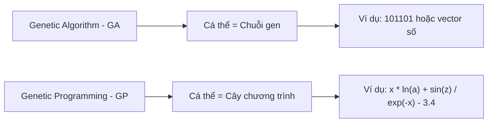
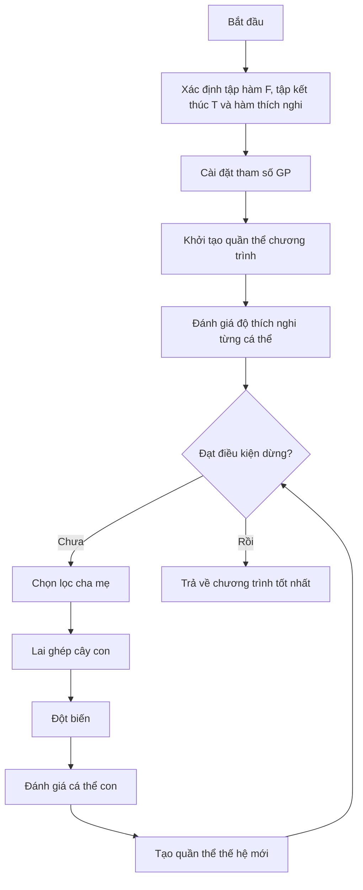
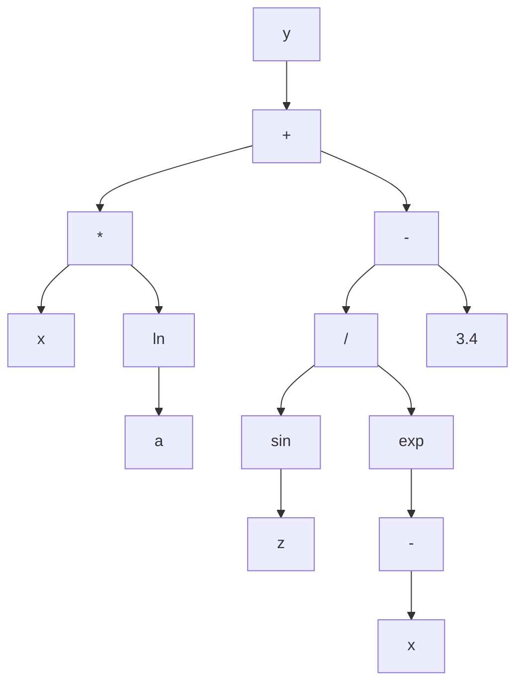
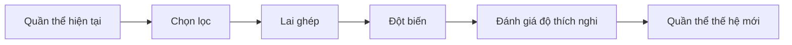
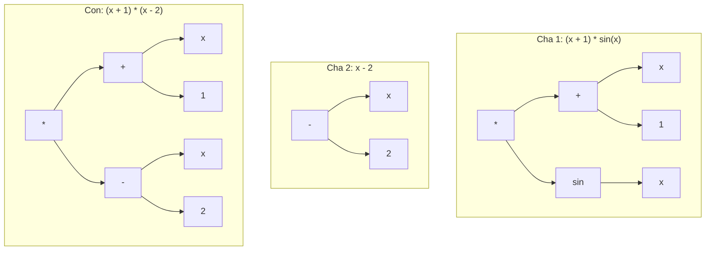
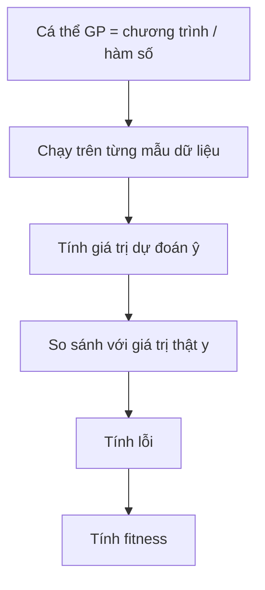
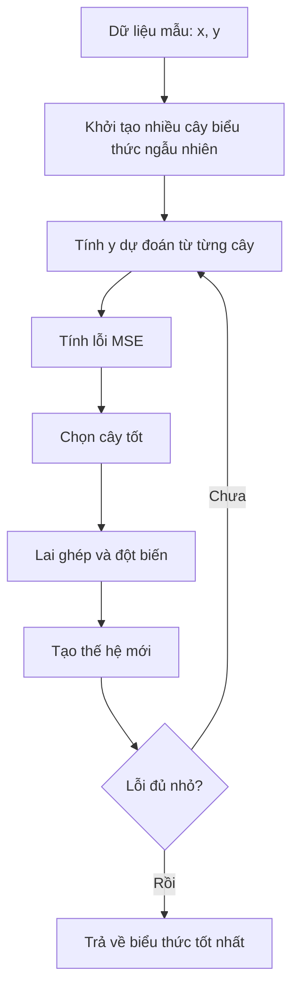

# Chương 3: Lập Trình Di Truyền

## Genetic Programming - GP

Ở Chương 2, ta đã học **Giải thuật di truyền - Genetic Algorithm (GA)**, trong đó mỗi cá thể thường được biểu diễn bằng một chuỗi có độ dài cố định như chuỗi bit, vector số thực hoặc chuỗi số nguyên.

Sang chương này, ta học một nhánh đặc biệt hơn của tính toán tiến hóa: **Lập trình di truyền - Genetic Programming (GP)**.

Khác với GA, trong GP, mỗi cá thể không còn là một chuỗi gen đơn giản mà là **một chương trình máy tính**, **một hàm số**, hoặc **một biểu thức toán học** được biểu diễn dưới dạng **cây cú pháp**.

---

## Mục Tiêu Bài Học

Sau chương này, bạn sẽ:

* Hiểu **Genetic Programming - GP** là gì.
* Biết điểm giống và khác nhau giữa **GA** và **GP**.
* Hiểu cách biểu diễn cá thể trong GP bằng **cây cấu trúc / cây cú pháp**.
* Nắm được khái niệm:

  * **Tập hàm - Function set**
  * **Tập kết thúc - Terminal set**
* Hiểu các toán tử chính trong GP:

  * Chọn lọc
  * Lai ghép
  * Đột biến
  * Đánh giá độ thích nghi
* Biết các loại đột biến phổ biến trong GP.
* Hiểu cách GP được dùng trong bài toán **hồi quy ký hiệu - Symbolic Regression**.
* Nhận biết vấn đề **bloat** và cách khắc phục.

---

# 1. Genetic Programming Là Gì?

**Genetic Programming - GP** là một thuật toán tiến hóa dùng để tìm kiếm hoặc tối ưu hóa **chương trình máy tính**, **hàm số**, hoặc **biểu thức toán học**.

Có thể xem GP là một dạng đặc biệt của **Genetic Algorithm - GA**.

Trong GA, cá thể thường là:

```text
[1, 0, 1, 1, 0, 0, 1]
```

hoặc:

```text
[2.5, -1.2, 0.7, 4.1]
```

Nhưng trong GP, cá thể có thể là một chương trình hoặc biểu thức như:

```text
x * ln(a) + sin(z) / exp(-x) - 3.4
```

Biểu thức này được biểu diễn dưới dạng cây.

---

## Ý Tưởng Chính Của GP

Thay vì con người viết sẵn chương trình giải bài toán, GP cố gắng để máy tính **tự tiến hóa ra chương trình tốt nhất**.

Nói cách khác:

> GP tìm một chương trình tối ưu trong không gian tất cả các chương trình có thể, sao cho chương trình đó đạt hiệu suất tốt nhất theo một hàm đánh giá cho trước.

Ví dụ:

* Tìm hàm số khớp với dữ liệu.
* Tìm biểu thức dự đoán giá nhà.
* Sinh luật điều khiển robot.
* Tối ưu kiến trúc mạng neural.
* Tự động sinh chương trình nhỏ để giải bài toán.

---

# 2. So Sánh GA Và GP

| Tiêu chí              | Genetic Algorithm - GA             | Genetic Programming - GP                  |
| --------------------- | ---------------------------------- | ----------------------------------------- |
| Cách biểu diễn cá thể | Chuỗi gen / nhiễm sắc thể          | Cây chương trình / cây biểu thức          |
| Độ dài cá thể         | Thường cố định                     | Có thể thay đổi                           |
| Cá thể đại diện cho   | Một lời giải hoặc bộ tham số       | Một hàm số hoặc chương trình              |
| Toán tử lai ghép      | Cắt và trao đổi đoạn chuỗi         | Trao đổi cây con                          |
| Toán tử đột biến      | Thay đổi alen / bit / giá trị      | Thay đổi nút, cây con, toán tử            |
| Kết quả đầu ra        | Vector tham số tối ưu              | Chương trình hoặc biểu thức tối ưu        |
| Ví dụ                 | Tối ưu lịch thi, trọng số, tham số | Tìm công thức toán học, sinh chương trình |

---

## Sơ Đồ So Sánh Trực Quan



---

# 3. Sơ Đồ Tổng Quát Của Genetic Programming

Sơ đồ hoạt động của GP khá giống với GA.



---

# 4. Mã Giả Thuật Toán GP

```text
begin
    Xác định tập hàm, tập kết thúc và hàm thích nghi;

    Cài đặt các tham số cho GP:
        - Kích thước quần thể
        - Số thế hệ
        - Xác suất lai ghép
        - Xác suất đột biến
        - Độ sâu tối đa của cây

    Khởi tạo quần thể ban đầu P;

    Tính toán độ thích nghi cho từng cá thể trong P;

    while chưa đạt điều kiện dừng do
        Chọn các cặp cha mẹ từ quần thể hiện tại P;

        Áp dụng toán tử lai ghép và đột biến
        để tạo ra quần thể con O;

        Tính toán độ thích nghi cho từng cá thể trong O;

        Chọn lọc các cá thể tốt cho thế hệ sau;

        Cập nhật quần thể P;
    end while

    Trả về cá thể có độ thích nghi tốt nhất;
end
```

---

# 5. Biểu Diễn Cá Thể Trong GP

Trong GP, mỗi cá thể được biểu diễn dưới dạng **cây cấu trúc** hoặc **cây cú pháp**.

Một cây GP gồm hai loại nút:

| Thành phần | Ý nghĩa                               |
| ---------- | ------------------------------------- |
| Nút trong  | Là toán tử hoặc hàm                   |
| Nút lá     | Là biến, hằng số hoặc giá trị đầu vào |

---

## 5.1. Tập Hàm - Function Set

**Tập hàm** là tập các toán tử hoặc hàm có thể xuất hiện tại các nút trong của cây.

Ví dụ:

```text
F = { +, -, *, /, ln, sin, exp }
```

Một số nhóm hàm thường gặp:

| Nhóm       | Ví dụ                                    |
| ---------- | ---------------------------------------- |
| Toán học   | `+`, `-`, `*`, `/`, `exp`, `log`, `sqrt` |
| Lượng giác | `sin`, `cos`, `tan`                      |
| Logic      | `and`, `or`, `xor`, `not`                |
| Điều kiện  | `if-then-else`                           |
| So sánh    | `>`, `<`, `>=`, `<=`, `==`               |

---

## 5.2. Tập Kết Thúc - Terminal Set

**Tập kết thúc** là tập các phần tử có thể xuất hiện ở nút lá.

Ví dụ:

```text
T = { x, a, z, 3.4 }
```

Tập kết thúc có thể gồm:

| Loại               | Ví dụ                         |
| ------------------ | ----------------------------- |
| Biến đầu vào       | `x`, `a`, `z`, `price`, `age` |
| Hằng số            | `1`, `2.5`, `3.4`, `-1`       |
| Giá trị ngẫu nhiên | `rand()`                      |
| Module cơ bản      | Các hàm con không có đối số   |

---

# 6. Ví Dụ Cây Biểu Diễn Chương Trình

Xét biểu thức:

```text
y := x * ln(a) + sin(z) / exp(-x) - 3.4
```

Tập kết thúc:

```text
T = { x, a, z, 3.4 }
```

Tập hàm:

```text
F = { *, +, -, /, ln, sin, exp }
```

Biểu thức trên có thể được biểu diễn bằng cây như sau:



Cây trên tương ứng với biểu thức:

```text
y = x * ln(a) + sin(z) / exp(-x) - 3.4
```

Trong đó:

* Các nút `+`, `-`, `*`, `/`, `ln`, `sin`, `exp` là **nút hàm**.
* Các nút `x`, `a`, `z`, `3.4` là **nút kết thúc**.

---

# 7. Cách Khởi Tạo Cá Thể Trong GP

Khi khởi tạo một cá thể GP, ta cần sinh ra một cây ngẫu nhiên.

Quy tắc cơ bản:

* Nút gốc thường được chọn từ **tập hàm**.
* Nút không phải gốc có thể được chọn từ:

  * Tập hàm
  * Tập kết thúc
* Nếu chọn từ tập kết thúc, nút đó trở thành **nút lá**.
* Nếu chọn từ tập hàm, nút đó trở thành **nút trong**.
* Số nhánh con của một nút phụ thuộc vào số đối số của hàm tại nút đó.

Ví dụ:

| Hàm            | Số đối số | Số nhánh con |
| -------------- | --------: | -----------: |
| `+`            |         2 |            2 |
| `-`            |         2 |            2 |
| `*`            |         2 |            2 |
| `/`            |         2 |            2 |
| `sin`          |         1 |            1 |
| `ln`           |         1 |            1 |
| `exp`          |         1 |            1 |
| `if-then-else` |         3 |            3 |

---

## Các Phương Pháp Khởi Tạo Phổ Biến

| Phương pháp              | Cách hoạt động                                                 | Đặc điểm                                  |
| ------------------------ | -------------------------------------------------------------- | ----------------------------------------- |
| **Full**                 | Các nút trong đều là hàm cho đến độ sâu tối đa, lá là terminal | Cây đầy đủ, cân đối                       |
| **Grow**                 | Mỗi nút có thể là hàm hoặc terminal                            | Cây đa dạng hơn, không nhất thiết cân đối |
| **Ramped Half-and-Half** | Kết hợp Full và Grow ở nhiều độ sâu khác nhau                  | Phổ biến nhất, tạo quần thể đa dạng       |

---

# 8. Điều Kiện Đóng Và Điều Kiện Đầy Đủ

Khi thiết kế GP, tập hàm và tập kết thúc cần thỏa hai điều kiện quan trọng.

---

## 8.1. Điều Kiện Đóng - Closure Property

**Điều kiện đóng** yêu cầu mọi hàm trong tập hàm phải xử lý được mọi giá trị đầu vào có thể xuất hiện.

Ví dụ, nếu dùng phép chia `/`, cần xử lý trường hợp chia cho 0.

Thay vì dùng phép chia thường:

```text
a / b
```

ta dùng **phép chia bảo vệ**:

```text
protected_divide(a, b):
    nếu |b| rất nhỏ:
        trả về 1
    ngược lại:
        trả về a / b
```

Tương tự:

| Hàm       | Vấn đề     | Cách bảo vệ                   |
| --------- | ---------- | ----------------------------- |
| `/`       | Chia cho 0 | Protected division            |
| `log(x)`  | `x <= 0`   | Dùng `log(abs(x) + epsilon)`  |
| `sqrt(x)` | `x < 0`    | Dùng `sqrt(abs(x))`           |
| `exp(x)`  | Tràn số    | Giới hạn miền giá trị của `x` |

---

## 8.2. Điều Kiện Đầy Đủ - Sufficiency Property

**Điều kiện đầy đủ** yêu cầu tập hàm và tập kết thúc phải đủ mạnh để biểu diễn được lời giải mong muốn.

Ví dụ:

Nếu bài toán cần tìm hàm dạng:

```text
y = sin(x) + x^2
```

mà tập hàm chỉ có:

```text
F = { +, -, *, / }
```

thì GP có thể biểu diễn được phần `x^2`, nhưng khó biểu diễn chính xác phần `sin(x)`.

Do đó cần bổ sung:

```text
sin
```

vào tập hàm.

---

# 9. Các Toán Tử Trong Genetic Programming

GP thường sử dụng các toán tử chính sau:



---

# 10. Chọn Lọc Trong GP

Các phương pháp chọn lọc cha mẹ trong GP tương tự như trong GA.

Một số phương pháp phổ biến:

| Phương pháp              | Ý tưởng                                         |
| ------------------------ | ----------------------------------------------- |
| Roulette Wheel Selection | Cá thể tốt có xác suất được chọn cao hơn        |
| Tournament Selection     | Chọn ngẫu nhiên vài cá thể, lấy cá thể tốt nhất |
| Rank Selection           | Xếp hạng cá thể rồi chọn theo hạng              |
| Elitism                  | Giữ lại cá thể tốt nhất qua thế hệ sau          |

Trong GP, **Tournament Selection** rất thường được dùng vì đơn giản và hiệu quả.

---

# 11. Lai Ghép Trong GP

## 11.1. Ý Tưởng

Toán tử lai ghép trong GP thường là **lai ghép cây con - Subtree Crossover**.

Cách thực hiện:

1. Chọn ngẫu nhiên một cây con từ cá thể cha.
2. Chọn ngẫu nhiên một cây con từ cá thể mẹ.
3. Trao đổi hai cây con đó.
4. Tạo ra cá thể con mới.

---

## 11.2. Minh Họa Lai Ghép

Giả sử có hai cá thể cha mẹ:

```text
Cha 1: (x + 1) * sin(x)
Cha 2: x - 2
```

Nếu chọn cây con `sin(x)` ở cha 1 và cây con `x - 2` ở cha 2, sau khi lai ghép ta có thể tạo ra:

```text
Con: (x + 1) * (x - 2)
```

Sơ đồ:



---

## 11.3. Đặc Điểm Của Lai Ghép GP

Lai ghép trong GP giúp:

* Kết hợp các cấu trúc tốt từ nhiều cá thể.
* Tạo ra chương trình mới.
* Khám phá không gian chương trình rộng hơn.
* Tăng khả năng tìm được lời giải tốt.

Tuy nhiên, lai ghép cũng có thể tạo ra cây quá lớn hoặc không hiệu quả, vì vậy thường cần giới hạn:

* Độ sâu tối đa.
* Số nút tối đa.
* Kích thước cây con được trao đổi.

---

# 12. Đột Biến Trong GP

Đột biến giúp duy trì sự đa dạng của quần thể, tránh việc thuật toán bị kẹt ở cực trị cục bộ.

Trong GP có nhiều loại đột biến.

---

## 12.1. Đột Biến Nút Trong

**Đột biến nút trong** là thay thế hàm tại một nút trong bằng một hàm khác trong tập hàm.

Ví dụ:

```text
(x + y)
```

đột biến nút `+` thành `*`:

```text
(x * y)
```

Điều kiện:

* Hàm mới thường phải có cùng số đối số với hàm cũ.
* Ví dụ `+`, `-`, `*`, `/` đều có 2 đối số nên có thể thay thế nhau.

---

## 12.2. Đột Biến Nút Kết Thúc

**Đột biến nút kết thúc** là thay thế biến hoặc hằng tại nút lá bằng một biến hoặc hằng khác.

Ví dụ:

```text
(x + 1)
```

đột biến `1` thành `3.4`:

```text
(x + 3.4)
```

hoặc đột biến `x` thành `z`:

```text
(z + 1)
```

---

## 12.3. Đột Biến Đảo

**Đột biến đảo** chọn ngẫu nhiên một nút trong và đảo hai nút con của nó.

Ví dụ:

```text
(x - y)
```

sau khi đảo:

```text
(y - x)
```

Với các toán tử không giao hoán như `-` và `/`, đột biến đảo có thể làm thay đổi mạnh kết quả.

---

## 12.4. Đột Biến Phát Triển Cây

**Đột biến phát triển cây** chọn một nút ngẫu nhiên và thay toàn bộ cây con tại nút đó bằng một cây con mới được sinh ngẫu nhiên.

Ví dụ:

```text
(x + 1) * sin(x)
```

chọn cây con `sin(x)` và thay bằng `x - 2`:

```text
(x + 1) * (x - 2)
```

Đây là loại đột biến mạnh, có thể tạo ra thay đổi lớn trong cấu trúc chương trình.

---

## 12.5. Đột Biến Gauss

**Đột biến Gauss** áp dụng cho nút lá chứa hằng số.

Ví dụ:

```text
x + 3.4
```

Thêm nhiễu Gauss vào `3.4`:

```text
3.4 + noise
```

Nếu `noise = 0.2`, ta được:

```text
x + 3.6
```

Loại đột biến này phù hợp khi cây chứa các hằng số thực.

---

## 12.6. Đột Biến Cắt Tỉa Cây

**Đột biến cắt tỉa cây** chọn một nút và thay toàn bộ cây con tại nút đó bằng một terminal.

Ví dụ:

```text
(x + 1) * (sin(z) / exp(-x))
```

nếu cắt tỉa cây con `sin(z) / exp(-x)` và thay bằng `a`, ta được:

```text
(x + 1) * a
```

Đột biến này giúp giảm kích thước cây và chống lại hiện tượng **bloat**.

---

## Bảng Tổng Hợp Các Loại Đột Biến

| Loại đột biến           | Cách thực hiện             | Tác dụng                  |
| ----------------------- | -------------------------- | ------------------------- |
| Đột biến nút trong      | Thay hàm ở nút trong       | Thay đổi toán tử          |
| Đột biến nút kết thúc   | Thay biến/hằng ở nút lá    | Thay đổi dữ liệu đầu vào  |
| Đột biến đảo            | Đảo vị trí hai nút con     | Thay đổi thứ tự tính toán |
| Đột biến phát triển cây | Thay cây con bằng cây mới  | Tạo thay đổi lớn          |
| Đột biến Gauss          | Thêm nhiễu vào hằng số     | Tinh chỉnh hằng số thực   |
| Đột biến cắt tỉa        | Thay cây con bằng terminal | Làm cây gọn hơn           |

---

# 13. Đánh Giá Độ Thích Nghi Trong GP

Mỗi cá thể GP là một chương trình hoặc hàm số. Để đánh giá cá thể đó, ta chạy nó trên một tập dữ liệu mẫu.

Giả sử có tập dữ liệu:

```text
X = {mẫu 1, mẫu 2, ..., mẫu N}
```

Mỗi mẫu gồm đầu vào và đầu ra mong muốn.

Ví dụ:

```text
Input:  a, x, z
Output: y
```

Một cá thể GP biểu diễn hàm:

```text
ŷ = f(a, x, z)
```

Ta so sánh giá trị dự đoán `ŷ` với giá trị thật `y`.

---

## 13.1. Quy Trình Đánh Giá



---

## 13.2. Dùng MSE Làm Fitness

Một cách phổ biến là dùng **Mean Squared Error - MSE**:

```text
MSE = (1/N) * Σ(ŷᵢ - yᵢ)²
```

Trong đó:

* `ŷᵢ` là giá trị dự đoán của cá thể GP.
* `yᵢ` là giá trị thật.
* `N` là số mẫu dữ liệu.

Với bài toán tối ưu lỗi:

```text
Fitness càng nhỏ càng tốt.
```

---

# 14. Ví Dụ Đánh Giá Fitness

Giả sử có một tập dữ liệu gồm các mẫu:

| Mẫu |  a |  x |   z | y thật |
| --: | -: | -: | --: | -----: |
|   1 |  2 |  1 | 0.5 |    3.2 |
|   2 |  3 |  2 | 1.0 |    7.8 |
|   3 |  4 | -1 | 0.3 |   -2.1 |

Một cá thể GP biểu diễn chương trình:

```text
ŷ = x * ln(a) + sin(z) / exp(-x) - 3.4
```

Quy trình đánh giá:

1. Với mỗi mẫu, thay `a`, `x`, `z` vào chương trình.
2. Tính giá trị dự đoán `ŷ`.
3. So sánh `ŷ` với `y thật`.
4. Tính lỗi bình phương.
5. Lấy trung bình lỗi trên toàn bộ tập dữ liệu.
6. Giá trị trung bình đó là fitness.

---

# 15. Bài Toán Kinh Điển: Symbolic Regression

Một trong những ứng dụng nổi tiếng nhất của GP là **hồi quy ký hiệu - Symbolic Regression**.

Bài toán:

> Cho một tập điểm dữ liệu, hãy tìm một biểu thức toán học khớp tốt nhất với dữ liệu đó.

Ví dụ, ta có dữ liệu được sinh từ hàm ẩn:

```text
y = x² + x
```

Nhưng thuật toán không biết trước công thức này.

GP chỉ biết:

* Tập dữ liệu mẫu.
* Tập hàm: `+, -, *, /`
* Tập kết thúc: `x`, các hằng số.
* Hàm fitness đo lỗi dự đoán.

Sau nhiều thế hệ, GP có thể tìm được biểu thức tương đương:

```text
x * x + x
```

hoặc:

```text
x * (x + 1)
```

---

## Sơ Đồ Symbolic Regression Với GP



---

# 16. Vấn Đề Bloat Trong GP

Vì cá thể GP là cây có kích thước thay đổi, nên cây có thể ngày càng phình to qua các thế hệ.

Hiện tượng này gọi là **bloat**.

---

## 16.1. Bloat Là Gì?

**Bloat** là hiện tượng cây chương trình trở nên rất lớn, có nhiều nhánh dư thừa, nhưng fitness không cải thiện tương ứng.

Ví dụ:

```text
x
```

có thể bị biến thành:

```text
(((x + 0) * 1) - 0)
```

Hai biểu thức cho kết quả giống nhau, nhưng biểu thức thứ hai dài hơn và tốn chi phí tính toán hơn.

---

## 16.2. Tác Hại Của Bloat

| Tác hại                 | Giải thích                                  |
| ----------------------- | ------------------------------------------- |
| Tốn thời gian tính toán | Cây lớn hơn cần nhiều phép tính hơn         |
| Tốn bộ nhớ              | Lưu trữ nhiều nút hơn                       |
| Khó hiểu                | Biểu thức cuối cùng khó diễn giải           |
| Giảm khả năng tổng quát | Cây quá phức tạp có thể overfit dữ liệu     |
| Làm chậm tiến hóa       | Lai ghép, đột biến và đánh giá đều chậm hơn |

---

## 16.3. Cách Khắc Phục Bloat

| Cách khắc phục         | Mô tả                                     |
| ---------------------- | ----------------------------------------- |
| Giới hạn độ sâu tối đa | Không cho cây vượt quá độ sâu cho trước   |
| Giới hạn số nút        | Không cho cây vượt quá số nút tối đa      |
| Parsimony pressure     | Phạt những cây quá lớn trong hàm fitness  |
| Đột biến cắt tỉa cây   | Thay cây con lớn bằng terminal            |
| Simplification         | Rút gọn biểu thức sau khi sinh cây        |
| Kiểm soát lai ghép     | Không chấp nhận con quá lớn sau crossover |

Ví dụ dùng phạt kích thước cây:

```text
fitness = MSE + α * tree_size
```

Trong đó:

* `MSE` là lỗi dự đoán.
* `tree_size` là số nút của cây.
* `α` là hệ số phạt.

Cây càng lớn thì fitness càng bị phạt.

---

# 17. Cài Đặt Minh Họa GP Bằng Python

Ví dụ sau minh họa GP đơn giản cho bài toán tìm biểu thức gần với:

```text
y = x² + x
```

```python
import random
import math

FUNCTIONS = ['+', '-', '*']
TERMINALS = ['x', 1.0, 2.0]


def random_tree(max_depth, depth=0):
    if depth >= max_depth or (depth > 0 and random.random() < 0.3):
        return random.choice(TERMINALS)

    op = random.choice(FUNCTIONS)
    left = random_tree(max_depth, depth + 1)
    right = random_tree(max_depth, depth + 1)

    return (op, left, right)


def eval_tree(tree, x):
    if tree == 'x':
        return x

    if isinstance(tree, (int, float)):
        return tree

    op, left, right = tree
    lv = eval_tree(left, x)
    rv = eval_tree(right, x)

    if op == '+':
        return lv + rv
    if op == '-':
        return lv - rv
    if op == '*':
        return lv * rv

    raise ValueError(f"Toán tử không hợp lệ: {op}")


def tree_to_str(tree):
    if not isinstance(tree, tuple):
        return str(tree)

    op, left, right = tree
    return f"({tree_to_str(left)} {op} {tree_to_str(right)})"


def tree_size(tree):
    if not isinstance(tree, tuple):
        return 1

    _, left, right = tree
    return 1 + tree_size(left) + tree_size(right)


def all_subtree_paths(tree, path=()):
    paths = [path]

    if isinstance(tree, tuple):
        _, left, right = tree
        paths += all_subtree_paths(left, path + (1,))
        paths += all_subtree_paths(right, path + (2,))

    return paths


def get_subtree(tree, path):
    node = tree

    for step in path:
        node = node[step]

    return node


def replace_subtree(tree, path, new_subtree):
    if not path:
        return new_subtree

    op, left, right = tree

    if path[0] == 1:
        return (op, replace_subtree(left, path[1:], new_subtree), right)

    return (op, left, replace_subtree(right, path[1:], new_subtree))


def crossover(parent1, parent2):
    path1 = random.choice(all_subtree_paths(parent1))
    path2 = random.choice(all_subtree_paths(parent2))

    subtree2 = get_subtree(parent2, path2)

    return replace_subtree(parent1, path1, subtree2)


def mutate(tree, max_depth=3, rate=0.1):
    if random.random() > rate:
        return tree

    path = random.choice(all_subtree_paths(tree))
    new_subtree = random_tree(max_depth)

    return replace_subtree(tree, path, new_subtree)


def fitness(tree, data):
    mse = sum((eval_tree(tree, x) - y) ** 2 for x, y in data) / len(data)

    # Parsimony pressure: phạt cây quá lớn
    penalty = 0.001 * tree_size(tree)

    return mse + penalty


def tournament_select(population, fitness_values, k=3):
    contenders = random.sample(list(zip(population, fitness_values)), k)

    return min(contenders, key=lambda item: item[1])[0]


def genetic_programming(data, pop_size=60, n_generations=40, max_depth=4):
    population = [random_tree(max_depth) for _ in range(pop_size)]

    best_tree = None
    best_fitness = math.inf

    for generation in range(n_generations):
        fitness_values = [fitness(individual, data) for individual in population]

        best_index = fitness_values.index(min(fitness_values))

        if fitness_values[best_index] < best_fitness:
            best_tree = population[best_index]
            best_fitness = fitness_values[best_index]

        new_population = [population[best_index]]

        while len(new_population) < pop_size:
            parent1 = tournament_select(population, fitness_values)
            parent2 = tournament_select(population, fitness_values)

            child = crossover(parent1, parent2)
            child = mutate(child, max_depth=max_depth, rate=0.2)

            if tree_size(child) <= 30:
                new_population.append(child)
            else:
                new_population.append(parent1)

        population = new_population

    return best_tree, best_fitness


if __name__ == "__main__":
    random.seed(42)

    data = [(x, x ** 2 + x) for x in [-2.0, -1.0, 0.0, 1.0, 2.0, 3.0]]

    best_tree, best_fit = genetic_programming(data)

    print("Biểu thức tốt nhất:", tree_to_str(best_tree))
    print("Fitness:", round(best_fit, 5))
```

---

# 18. Ứng Dụng Của Genetic Programming

| Lĩnh vực                     | Ứng dụng                          |
| ---------------------------- | --------------------------------- |
| Hồi quy ký hiệu              | Tìm công thức toán học từ dữ liệu |
| Tối ưu kiến trúc mạng neural | Tìm cấu trúc mạng phù hợp         |
| Tài chính                    | Sinh luật giao dịch               |
| Robot                        | Tiến hóa chương trình điều khiển  |
| Xử lý ảnh                    | Tìm bộ lọc hoặc đặc trưng ảnh     |
| Sinh chương trình            | Tự động tạo chương trình nhỏ      |
| Khoa học dữ liệu             | Khám phá quan hệ ẩn trong dữ liệu |
| Điều khiển tự động           | Sinh luật điều khiển hệ thống     |

---

# 19. Câu Hỏi Ôn Tập Nhanh

## 1. Có thể coi Genetic Programming là gì?

GP có thể được coi là **một thuật toán di truyền đặc biệt**, trong đó cá thể là chương trình hoặc hàm số thay vì chuỗi gen thông thường.

---

## 2. GP có giống GA không?

Có. GP có sơ đồ tổng quát giống GA:

```text
Khởi tạo → Đánh giá → Chọn lọc → Lai ghép → Đột biến → Thế hệ mới
```

Nhưng khác ở cách biểu diễn cá thể.

---

## 3. Điểm khác biệt chính giữa GA và GP là gì?

* GA biểu diễn cá thể dưới dạng **chuỗi alen**.
* GP biểu diễn cá thể dưới dạng **cây chương trình**.

---

## 4. Mục tiêu của GP là gì?

Mục tiêu của GP là tìm ra một **chương trình tối ưu** hoặc **hàm số tối ưu** trong không gian các chương trình có thể.

---

## 5. Trong GP, nút lá là gì?

Nút lá là phần tử thuộc **tập kết thúc**, ví dụ:

```text
x, a, z, 3.4
```

---

## 6. Trong GP, nút trong là gì?

Nút trong là phần tử thuộc **tập hàm**, ví dụ:

```text
+, -, *, /, ln, sin, exp
```

---

## 7. Lai ghép trong GP thực hiện như thế nào?

Lai ghép trong GP chọn một cây con từ mỗi cha mẹ và tráo đổi hai cây con đó để tạo cá thể mới.

---

## 8. Fitness trong GP được tính như thế nào?

Fitness được tính bằng cách chạy chương trình trên tập dữ liệu mẫu, so sánh kết quả dự đoán với kết quả thật, sau đó tính lỗi như MSE.

---

# 20. Điều Cần Ghi Nhớ

* **Genetic Programming - GP** là một nhánh của tính toán tiến hóa dùng để tiến hóa chương trình hoặc hàm số.
* Có thể xem GP là một dạng đặc biệt của **Genetic Algorithm - GA**.
* Khác biệt lớn nhất giữa GA và GP là cách biểu diễn cá thể:

  * GA dùng chuỗi.
  * GP dùng cây.
* Một cây GP gồm:

  * **Nút trong** lấy từ tập hàm.
  * **Nút lá** lấy từ tập kết thúc.
* Hai tập quan trọng trong GP là:

  * **Function set - tập hàm**
  * **Terminal set - tập kết thúc**
* Các toán tử chính của GP gồm:

  * Chọn lọc
  * Lai ghép cây con
  * Đột biến cây
  * Đánh giá fitness
* Bài toán kinh điển của GP là **Symbolic Regression**.
* GP dễ gặp hiện tượng **bloat**, tức cây phình to nhưng không cải thiện chất lượng.
* Cách chống bloat gồm giới hạn độ sâu, giới hạn số nút, phạt kích thước cây và cắt tỉa cây.

---

# Tóm Tắt Bài Học

Chương này đã giới thiệu **Lập trình di truyền - Genetic Programming**, một kỹ thuật tiến hóa trong đó mỗi cá thể là một chương trình hoặc hàm số được biểu diễn bằng cây. GP có quy trình tổng quát tương tự GA, nhưng thay vì tiến hóa chuỗi gen cố định, GP tiến hóa trực tiếp cấu trúc chương trình.

Bạn đã học cách xây dựng cá thể GP bằng **tập hàm** và **tập kết thúc**, cách khởi tạo cây, cách thực hiện **lai ghép cây con**, các dạng **đột biến**, cách đánh giá fitness bằng dữ liệu mẫu, và bài toán kinh điển **hồi quy ký hiệu**. Ngoài ra, chương cũng trình bày vấn đề **bloat** — một hiện tượng đặc trưng của GP — cùng các phương pháp kiểm soát kích thước cây.

Ở chương tiếp theo, ta sẽ học **Lập Trình Tiến Hóa - Evolutionary Programming**, một hướng tiếp cận khác trong tính toán tiến hóa, nhấn mạnh vào đột biến và hành vi của cá thể hơn là cấu trúc gen.

---

# Bài luyện tập

## Mục tiêu


## Đề bài


## Yêu cầu hoàn thành

- [ ] 
- [ ] 
- [ ] 

## Kết quả / lời giải


## Ghi chú
