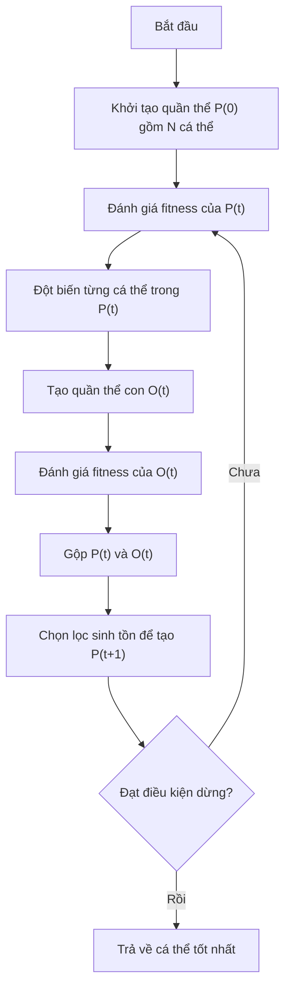
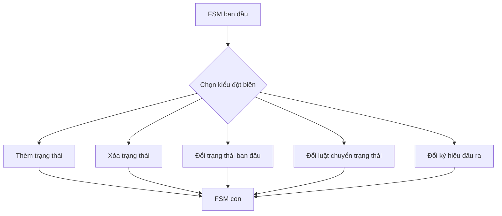
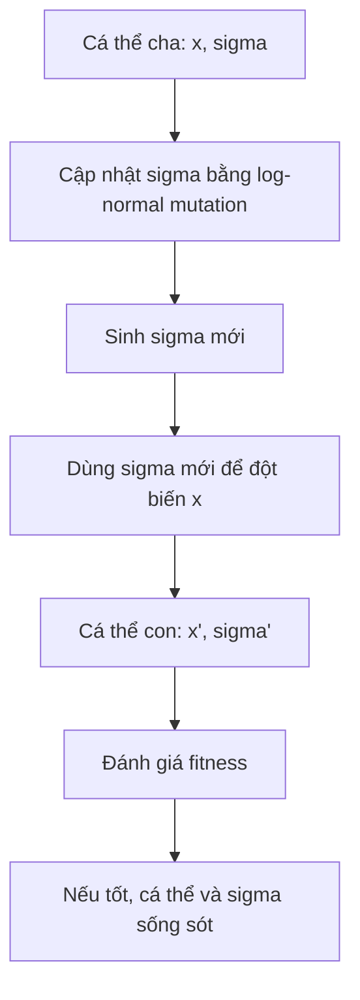
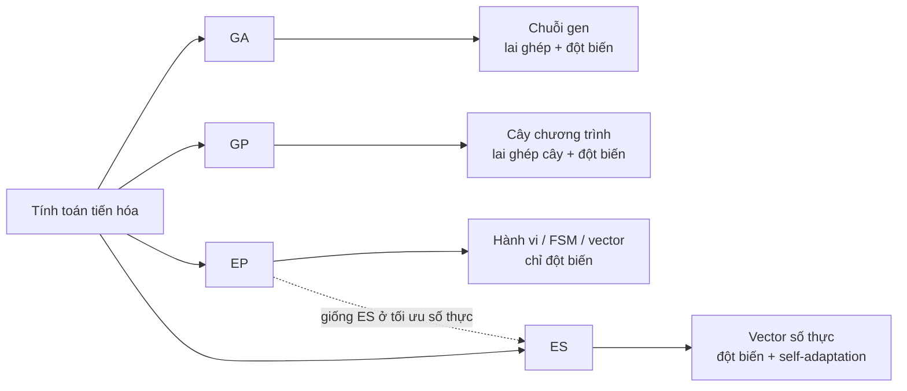

# Chương 4: Lập Trình Tiến Hóa  
## Evolutionary Programming - EP

> **Lập trình tiến hóa (Evolutionary Programming - EP)** là một nhánh của tính toán tiến hóa, tập trung vào việc mô phỏng **hành vi thích nghi** của cá thể thông qua **đột biến** và **chọn lọc sinh tồn**, thay vì mô phỏng trực tiếp cơ chế lai ghép gen như GA hay GP.

Tài liệu bài giảng Chương 4 nhấn mạnh ba nội dung chính: tổng quan EP, các toán tử của EP và ví dụ minh họa gồm tiến hóa máy trạng thái hữu hạn và tối ưu hàm số. :contentReference[oaicite:0]{index=0}

---

## Mục Tiêu Bài Học

Sau chương này, bạn sẽ:

- Hiểu **Lập trình tiến hóa - EP** là gì.
- Phân biệt EP với **GA** và **GP**.
- Hiểu vì sao EP **không sử dụng lai ghép**, chỉ dùng **đột biến**.
- Nắm được quy trình thuật toán EP tổng quát.
- Hiểu các thành phần chính:
  - Biểu diễn cá thể.
  - Đánh giá độ thích nghi.
  - Đột biến.
  - Chọn lọc sinh tồn.
- Biết cách EP áp dụng cho:
  - Tiến hóa máy trạng thái hữu hạn.
  - Tối ưu hàm số thực.
- Hiểu vai trò của **đột biến Gauss** và **tham số sigma** trong EP hiện đại.

---

# 1. Lập Trình Tiến Hóa Là Gì?

**Evolutionary Programming - EP** là một phương pháp tối ưu hóa và học máy lấy cảm hứng từ quá trình tiến hóa tự nhiên.

Khác với GA và GP, EP không tập trung vào việc lai ghép cấu trúc di truyền giữa các cá thể. Thay vào đó, EP xem mỗi cá thể như một thực thể độc lập, tự thay đổi thông qua **đột biến**, sau đó cạnh tranh để tồn tại.

```text
EP = Biểu diễn cá thể + Đột biến + Đánh giá fitness + Chọn lọc sinh tồn
````

EP ban đầu được phát triển để mô phỏng **hành vi thông minh**. Lawrence J. Fogel và cộng sự dùng EP để tiến hóa các **máy trạng thái hữu hạn - Finite State Machine (FSM)** nhằm dự đoán ký hiệu tiếp theo trong một chuỗi quan sát.

Ví dụ:

```text
Chuỗi quan sát: A B A B B A ...
FSM cá thể: nhận ký hiệu hiện tại → chuyển trạng thái → dự đoán ký hiệu tiếp theo
Fitness: số lần dự đoán đúng
```

---

# 2. Điểm Khác Biệt Cốt Lõi Của EP

Điểm quan trọng nhất của EP là:

> **EP không sử dụng lai ghép - crossover. EP chỉ sử dụng đột biến - mutation.**

Trong GA và GP, hai cá thể cha mẹ thường được lai ghép để tạo cá thể con. Nhưng trong EP, mỗi cá thể tự sinh ra phiên bản biến đổi của chính nó thông qua đột biến.

## So sánh EP với GA và GP

| Tiêu chí            | GA - Genetic Algorithm                | GP - Genetic Programming            | EP - Evolutionary Programming                      |
| ------------------- | ------------------------------------- | ----------------------------------- | -------------------------------------------------- |
| Biểu diễn cá thể    | Chuỗi bit, vector số, hoán vị         | Cây chương trình                    | FSM, vector, mảng, cấu trúc tùy bài toán           |
| Toán tử chính       | Lai ghép + đột biến                   | Lai ghép cây + đột biến cây         | Chỉ đột biến                                       |
| Có crossover không? | Có                                    | Có                                  | Không                                              |
| Trọng tâm           | Tối ưu nhiễm sắc thể                  | Tiến hóa chương trình               | Tiến hóa hành vi                                   |
| Chọn lọc            | Chọn cha mẹ hoặc chọn cá thể sống sót | Chọn chương trình tốt               | Chọn lọc sinh tồn giữa cha và con                  |
| Phù hợp với         | Tối ưu tổ hợp, tối ưu số              | Sinh chương trình, mô hình symbolic | Tối ưu hành vi, tối ưu số thực, mô hình thích nghi |

---

# 3. Quy Trình Thuật Toán EP

Thuật toán EP tổng quát gồm 6 bước:

1. **Khởi tạo** quần thể ban đầu `P(0)` gồm `N` cá thể.
2. **Đánh giá** độ thích nghi của từng cá thể trong `P(t)`.
3. **Đột biến** từng cá thể trong `P(t)` để tạo quần thể con `O(t)`.
4. **Đánh giá** độ thích nghi của các cá thể con trong `O(t)`.
5. **Chọn lọc sinh tồn** từ tập cha mẹ và con cái `P(t) ∪ O(t)`.
6. **Lặp lại** cho đến khi đạt điều kiện dừng.

---

## Sơ Đồ Thuật Toán EP



---

# 4. Các Thành Phần Chính Trong EP

## 4.1. Biểu Diễn Cá Thể

Trong EP, cá thể có thể được biểu diễn theo nhiều dạng khác nhau tùy bài toán:

| Dạng biểu diễn         | Ví dụ                                       |
| ---------------------- | ------------------------------------------- |
| Chuỗi nhị phân         | `101011`                                    |
| Vector số thực         | `[1.2, -0.5, 3.7]`                          |
| Danh sách              | Danh sách công việc trong bài toán lập lịch |
| Cây                    | Cây quyết định, cây biểu thức               |
| Máy trạng thái hữu hạn | FSM dùng để dự đoán chuỗi ký hiệu           |

EP không bị ràng buộc vào một kiểu biểu diễn cố định. Điều quan trọng là phải định nghĩa được:

```text
Cá thể được biểu diễn như thế nào?
Đột biến cá thể đó ra sao?
Fitness được tính như thế nào?
```

---

## 4.2. Đánh Giá Độ Thích Nghi

**Fitness** đo mức độ tốt của cá thể đối với bài toán.

Ví dụ:

| Bài toán           | Fitness có thể là                   |
| ------------------ | ----------------------------------- |
| Dự đoán chuỗi      | Số ký hiệu dự đoán đúng             |
| Tối ưu hàm số      | Giá trị hàm mục tiêu                |
| Lập lịch           | Mức độ ít vi phạm ràng buộc         |
| Robot học          | Khoảng cách robot di chuyển được    |
| Điều khiển tự động | Sai số điều khiển càng nhỏ càng tốt |

Với bài toán tối thiểu hóa:

```text
Fitness tốt hơn ⇔ giá trị hàm mục tiêu nhỏ hơn
```

Với bài toán tối đa hóa:

```text
Fitness tốt hơn ⇔ giá trị hàm mục tiêu lớn hơn
```

---

## 4.3. Đột Biến

Đột biến là toán tử trung tâm của EP.

```text
Cha mẹ P(i) → đột biến → Con O(i)
```

Tùy kiểu biểu diễn cá thể, đột biến có thể khác nhau:

| Kiểu cá thể    | Cách đột biến                                               |
| -------------- | ----------------------------------------------------------- |
| Chuỗi bit      | Lật bit 0 ↔ 1                                               |
| Vector số thực | Cộng nhiễu Gauss                                            |
| FSM            | Thêm trạng thái, xóa trạng thái, đổi luật chuyển trạng thái |
| Lịch công việc | Đổi vị trí hai công việc                                    |
| Cây quyết định | Thay đổi một nhánh hoặc điều kiện                           |

---

## 4.4. Chọn Lọc Sinh Tồn

Sau khi tạo cá thể con, EP chọn cá thể sống sót từ tập:

```text
P(t) ∪ O(t)
```

Tức là:

```text
Cha mẹ + Con cái → Chọn ra quần thể thế hệ mới
```

Có nhiều chiến lược chọn lọc sinh tồn:

| Chiến lược                  | Ý tưởng                                             |
| --------------------------- | --------------------------------------------------- |
| Chọn lọc trên tất cả cá thể | Cha và con có cơ hội như nhau                       |
| Tournament selection        | Các cá thể đấu ngẫu nhiên, cá thể tốt hơn thắng     |
| Elitist selection           | Giữ lại một nhóm cá thể tốt nhất chắc chắn sống sót |
| Cull strategy               | Loại bỏ các cá thể kém nhất                         |

---

# 5. Đột Biến Và Chọn Lọc Sinh Tồn Trong EP

## 5.1. Đột Biến Từng Cá Thể

Trong EP, mỗi cá thể cha mẹ sinh ra một cá thể con bằng đột biến.

```text
P(t) = {p1, p2, p3, ..., pN}

Đột biến:

p1 → o1
p2 → o2
p3 → o3
...
pN → oN

O(t) = {o1, o2, o3, ..., oN}
```

Sau đó, cha mẹ và con cái cùng cạnh tranh:

```text
P(t) ∪ O(t) = 2N cá thể
```

Từ `2N` cá thể này, chọn lại `N` cá thể tốt nhất hoặc phù hợp nhất để tạo thế hệ tiếp theo.

---

## 5.2. Tournament Selection

Trong **tournament selection**, mỗi cá thể được so sánh với một số đối thủ ngẫu nhiên.

```text
Với mỗi cá thể i:
    score_i = 0
    Chọn q đối thủ ngẫu nhiên
    Nếu cá thể i tốt hơn đối thủ:
        score_i += 1

Giữ lại N cá thể có score cao nhất
```

Ví dụ với `q = 5`:

```text
Cá thể A đấu với 5 đối thủ.
Nếu A thắng 4 trận → score(A) = 4.
Cá thể có score cao hơn có khả năng sống sót cao hơn.
```

Ưu điểm của tournament selection:

* Dễ cài đặt.
* Không cần chuẩn hóa fitness.
* Giữ được áp lực chọn lọc.
* Vẫn cho cá thể khá tốt có cơ hội tồn tại.
* Giúp duy trì đa dạng quần thể.

---

# 6. Ví Dụ 1: EP Tiến Hóa Máy Trạng Thái Hữu Hạn

## 6.1. Máy Trạng Thái Hữu Hạn Là Gì?

**Finite State Machine - FSM** là một mô hình tính toán gồm các trạng thái và luật chuyển trạng thái.

Một FSM có thể được định nghĩa như sau:

```text
FSM = (S, I, O, ρ, φ)
```

Trong đó:

| Ký hiệu        | Ý nghĩa                              |
| -------------- | ------------------------------------ |
| `S`            | Tập hữu hạn các trạng thái           |
| `I`            | Tập hữu hạn các ký hiệu đầu vào      |
| `O`            | Tập hữu hạn các ký hiệu đầu ra       |
| `ρ: S × I → S` | Hàm chuyển sang trạng thái tiếp theo |
| `φ: S × I → O` | Hàm sinh ký hiệu đầu ra              |

---

## 6.2. Cách FSM Hoạt Động


Ví dụ:

```text
Đầu vào hiện tại: A
Trạng thái hiện tại: S1

FSM quyết định:
- Chuyển sang trạng thái S2
- Xuất ra ký hiệu dự đoán B
```

Nếu ký hiệu thực tế tiếp theo cũng là `B`, FSM được tính là dự đoán đúng.

---

## 6.3. Biểu Diễn Cá Thể FSM

Trong ví dụ bài giảng, một cá thể FSM có thể được mã hóa bằng chuỗi nhị phân 6 bit:

```text
[bit1 bit2 bit3 bit4 bit5 bit6]
```

Ý nghĩa:

| Bit     | Ý nghĩa                           |
| ------- | --------------------------------- |
| Bit 1   | Trạng thái có hoạt động hay không |
| Bit 2   | Ký hiệu đầu vào                   |
| Bit 3-4 | Trạng thái tiếp theo              |
| Bit 5-6 | Ký hiệu đầu ra tiếp theo          |

Ví dụ:

```text
101011
```

Có thể hiểu là:

```text
Trạng thái đang hoạt động
Đầu vào là 0 hoặc 1
Chuyển sang một trạng thái mới
Sinh ra một ký hiệu đầu ra
```

---

## 6.4. Fitness Của FSM

Độ thích nghi của FSM được đo bằng khả năng dự đoán đúng ký hiệu đầu ra.

```text
Fitness = số lần dự đoán đúng / tổng số lần dự đoán
```

Ví dụ:

```text
Chuỗi thật:      A B A B B A
FSM dự đoán:     A B B B A A

Số lần đúng: 4/6
Fitness = 4
```

---

## 6.5. Các Kiểu Đột Biến FSM

Một FSM có thể bị đột biến theo nhiều cách:

1. Thay đổi trạng thái ban đầu.
2. Xóa một trạng thái.
3. Thêm một trạng thái.
4. Thay đổi một luật chuyển trạng thái.
5. Thay đổi ký hiệu đầu ra.
6. Thay đổi trạng thái hoạt động hoặc không hoạt động.



---

# 7. Ví Dụ 2: EP Tối Ưu Hàm Số

Giả sử cần tối thiểu hóa hàm số trên đoạn `[0, 2]`:

```text
f(x) = sin(2πx) · e^x
```

Mỗi cá thể được biểu diễn bằng một vector số thực chỉ gồm một phần tử:

```text
Cá thể = [x]
```

Ví dụ:

```text
P1 = [0.25]
P2 = [1.37]
P3 = [1.92]
```

## 7.1. Khởi Tạo

Mỗi cá thể được khởi tạo ngẫu nhiên đều trong đoạn `[0, 2]`.

```text
x ~ Uniform(0, 2)
```

## 7.2. Fitness

Vì đây là bài toán tối thiểu hóa:

```text
Cá thể tốt hơn ⇔ f(x) nhỏ hơn
```

## 7.3. Đột Biến Gauss

Đột biến được thực hiện bằng cách cộng thêm một nhiễu nhỏ theo phân phối Gauss:

```text
O(i) = P(i) + δi
```

Trong đó:

```text
δi ~ N(0, σi²)
```

Nói cách khác:

```text
Con = Cha + Nhiễu Gauss
```

Ví dụ:

```text
Cha: x = 1.20
Nhiễu: δ = -0.08

Con: x' = 1.20 - 0.08 = 1.12
```

---

# 8. Vai Trò Của Sigma Trong Đột Biến Gauss

Trong đột biến Gauss:

```text
x' = x + N(0, σ²)
```

`σ` quyết định kích thước bước nhảy.

| Giá trị σ | Ý nghĩa       | Hệ quả                                 |
| --------- | ------------- | -------------------------------------- |
| σ lớn     | Bước nhảy lớn | Khám phá rộng, dễ thoát cực trị cục bộ |
| σ nhỏ     | Bước nhảy nhỏ | Khai thác tinh, hội tụ ổn định hơn     |
| σ quá lớn | Quá nhiễu     | Khó hội tụ                             |
| σ quá nhỏ | Quá bảo thủ   | Dễ kẹt tại cực trị cục bộ              |

---

## 8.1. Các Cách Chọn Sigma

Theo bài giảng, `σ` có thể được chọn theo nhiều cách:

| Cách chọn σ                            | Ý tưởng                                    |
| -------------------------------------- | ------------------------------------------ |
| Không đổi                              | Dùng một giá trị nhỏ cố định               |
| Lớn ban đầu, giảm dần                  | Khám phá mạnh ở đầu, khai thác tinh về sau |
| Bằng độ lệch chuẩn của quần thể cha mẹ | Tự phản ánh mức độ phân tán hiện tại       |
| Tự thích nghi                          | σ tiến hóa cùng cá thể                     |

---

## 8.2. Trực Giác Về Sigma


---

# 9. EP Hiện Đại: Vector Nghiệm Và Tham Số Chiến Lược

Trong EP hiện đại, một cá thể thường gồm hai phần:

```text
Cá thể = (x, σ)
```

Trong đó:

```text
x = (x1, x2, ..., xn)
σ = (σ1, σ2, ..., σn)
```

Ý nghĩa:

| Thành phần | Vai trò                                      |
| ---------- | -------------------------------------------- |
| `x`        | Vector nghiệm cần tối ưu                     |
| `σ`        | Vector độ lệch chuẩn đột biến cho từng chiều |

Ví dụ:

```text
x = [1.2, -0.5, 3.1]
σ = [0.3, 0.1, 0.8]

Cá thể = ([1.2, -0.5, 3.1], [0.3, 0.1, 0.8])
```

Mỗi chiều có một `σ` riêng, giúp thuật toán tự học xem biến nào cần thay đổi mạnh, biến nào cần thay đổi nhẹ.

---

# 10. Tự Thích Nghi Sigma

Một điểm mạnh của EP hiện đại là **self-adaptation**:

> Không chỉ nghiệm `x` tiến hóa, mà cả tham số đột biến `σ` cũng tiến hóa.

Công thức thường dùng:

```text
σ'i = σi · exp(τ' · N(0,1) + τ · Ni(0,1))
```

Sau đó dùng `σ'i` để đột biến nghiệm:

```text
x'i = xi + σ'i · Ni(0,1)
```

Trong đó:

| Ký hiệu    | Ý nghĩa                       |
| ---------- | ----------------------------- |
| `N(0,1)`   | Nhiễu Gauss chuẩn dùng chung  |
| `Ni(0,1)`  | Nhiễu Gauss riêng cho chiều i |
| `τ'`       | Tốc độ học toàn cục           |
| `τ`        | Tốc độ học cục bộ             |
| `exp(...)` | Đảm bảo `σ'i` luôn dương      |

---

## Minh Họa Self-Adaptation



Ý nghĩa trực quan:

```text
Nếu sigma lớn tạo ra cá thể tốt → sigma lớn được giữ lại.
Nếu sigma nhỏ giúp hội tụ tốt → sigma nhỏ được giữ lại.
Nếu sigma gây bước nhảy xấu → cá thể bị loại.
```

Nhờ đó, EP tự cân bằng giữa:

```text
Khám phá rộng ↔ Khai thác tinh
```

---

# 11. Pseudocode Tổng Quát Của EP

```text
Khởi tạo quần thể P gồm N cá thể
Đánh giá fitness của từng cá thể trong P

Lặp cho đến khi đạt điều kiện dừng:

    O = rỗng

    Với mỗi cá thể p trong P:
        o = đột_biến(p)
        thêm o vào O

    Đánh giá fitness của từng cá thể trong O

    U = P ∪ O

    Chọn N cá thể tốt nhất hoặc phù hợp nhất từ U
    P = quần thể mới

Trả về cá thể tốt nhất
```

---

# 12. Cài Đặt Python Đơn Giản

Ví dụ dưới đây dùng EP để tối thiểu hóa hàm Sphere:

```text
f(x) = x1² + x2² + ... + xn²
```

Cực tiểu toàn cục:

```text
x = 0
f(x) = 0
```

```python
import numpy as np


def sphere(x):
    """
    Hàm Sphere.
    Cực tiểu toàn cục tại x = 0.
    """
    return np.sum(x ** 2)


def evolutionary_programming(
    dim=5,
    pop_size=30,
    generations=100,
    q_tournament=7,
    bounds=(-5.0, 5.0),
    seed=42
):
    rng = np.random.default_rng(seed)

    # Hệ số học cho self-adaptation
    tau_prime = 1.0 / np.sqrt(2 * dim)
    tau = 1.0 / np.sqrt(2 * np.sqrt(dim))

    # Khởi tạo nghiệm x
    X = rng.uniform(bounds[0], bounds[1], size=(pop_size, dim))

    # Khởi tạo sigma
    Sigma = np.ones((pop_size, dim))

    # Đánh giá fitness ban đầu
    fitness = np.array([sphere(x) for x in X])

    best_idx = np.argmin(fitness)
    best_x = X[best_idx].copy()
    best_f = fitness[best_idx]

    history = [best_f]

    for gen in range(generations):
        # =========================
        # 1. Đột biến sigma
        # =========================
        global_noise = rng.normal(size=(pop_size, 1))
        local_noise = rng.normal(size=(pop_size, dim))

        Sigma_child = Sigma * np.exp(
            tau_prime * global_noise + tau * local_noise
        )

        # =========================
        # 2. Đột biến nghiệm x
        # =========================
        step_noise = rng.normal(size=(pop_size, dim))
        X_child = X + Sigma_child * step_noise

        # Giới hạn nghiệm trong khoảng cho phép
        X_child = np.clip(X_child, bounds[0], bounds[1])

        # Đánh giá cá thể con
        fitness_child = np.array([sphere(x) for x in X_child])

        # =========================
        # 3. Gộp cha mẹ và con
        # =========================
        U_X = np.vstack([X, X_child])
        U_Sigma = np.vstack([Sigma, Sigma_child])
        U_fitness = np.concatenate([fitness, fitness_child])

        total = len(U_fitness)
        scores = np.zeros(total)

        # =========================
        # 4. q-tournament selection
        # =========================
        for i in range(total):
            opponents = rng.choice(total, size=q_tournament, replace=False)

            # Vì là bài toán minimize, fitness nhỏ hơn thì thắng
            scores[i] = np.sum(U_fitness[i] < U_fitness[opponents])

        # Chọn pop_size cá thể có điểm cao nhất
        survivors = np.argsort(-scores)[:pop_size]

        X = U_X[survivors]
        Sigma = U_Sigma[survivors]
        fitness = U_fitness[survivors]

        # Cập nhật nghiệm tốt nhất
        current_best_idx = np.argmin(fitness)

        if fitness[current_best_idx] < best_f:
            best_f = fitness[current_best_idx]
            best_x = X[current_best_idx].copy()

        history.append(best_f)

        if gen % 10 == 0 or gen == generations - 1:
            print(f"Thế hệ {gen:3d} | Fitness tốt nhất = {best_f:.6f}")

    return best_x, best_f, history


if __name__ == "__main__":
    best_x, best_f, history = evolutionary_programming()

    print("\nNghiệm tốt nhất tìm được:")
    print(best_x)

    print("\nGiá trị hàm tại nghiệm tốt nhất:")
    print(best_f)
```

---

# 13. Phân Tích Code

## 13.1. Khởi Tạo Quần Thể

```python
X = rng.uniform(bounds[0], bounds[1], size=(pop_size, dim))
Sigma = np.ones((pop_size, dim))
```

Ý nghĩa:

```text
X      = tập nghiệm ban đầu
Sigma  = độ lệch chuẩn đột biến ban đầu
```

---

## 13.2. Đột Biến Sigma

```python
Sigma_child = Sigma * np.exp(
    tau_prime * global_noise + tau * local_noise
)
```

Ý nghĩa:

```text
Sigma mới = Sigma cũ × hệ số ngẫu nhiên dương
```

Dùng `exp(...)` để đảm bảo:

```text
Sigma_child > 0
```

---

## 13.3. Đột Biến Nghiệm

```python
X_child = X + Sigma_child * step_noise
```

Ý nghĩa:

```text
Nghiệm con = nghiệm cha + nhiễu Gauss
```

Nếu `Sigma_child` lớn, bước nhảy lớn.
Nếu `Sigma_child` nhỏ, bước nhảy nhỏ.

---

## 13.4. Chọn Lọc q-Tournament

```python
scores[i] = np.sum(U_fitness[i] < U_fitness[opponents])
```

Vì đang tối thiểu hóa:

```text
Fitness nhỏ hơn → thắng
```

Sau đó:

```python
survivors = np.argsort(-scores)[:pop_size]
```

Chọn các cá thể có số trận thắng cao nhất.

---

# 14. Ưu Điểm Và Nhược Điểm Của EP

| Ưu điểm                                             | Nhược điểm                                                 |
| --------------------------------------------------- | ---------------------------------------------------------- |
| Không cần thiết kế toán tử lai ghép                 | Không tận dụng được thông tin tổ hợp giữa hai lời giải tốt |
| Dễ triển khai                                       | Có thể hội tụ chậm nếu chỉ dựa vào đột biến                |
| Phù hợp với nhiều kiểu biểu diễn cá thể             | Phụ thuộc nhiều vào cách thiết kế mutation                 |
| Tốt cho tối ưu số thực liên tục                     | Cần chọn hoặc tự thích nghi tham số sigma                  |
| Chọn lọc sinh tồn giúp giữ cá thể tốt               | Tournament selection có thêm siêu tham số q                |
| Có thể áp dụng cho hành vi, FSM, mô hình thích nghi | Với bài toán lớn, chi phí đánh giá fitness có thể cao      |

---

# 15. Ứng Dụng Của EP

| Lĩnh vực                | Ví dụ ứng dụng                                    |
| ----------------------- | ------------------------------------------------- |
| Tối ưu hàm số           | Tối ưu hàm liên tục không có đạo hàm              |
| Điều khiển tự động      | Tối ưu bộ điều khiển PID                          |
| Dự đoán chuỗi thời gian | Dự đoán tín hiệu, chuỗi ký hiệu, dữ liệu cảm biến |
| Máy trạng thái hữu hạn  | Tiến hóa FSM cho bài toán dự báo                  |
| Xử lý tín hiệu          | Tối ưu bộ lọc, tham số xử lý tín hiệu             |
| Robot học               | Tối ưu tham số điều khiển robot                   |
| Lập lịch                | Tối ưu lịch công việc, lịch sản xuất              |
| Học máy                 | Tối ưu trọng số hoặc siêu tham số mô hình         |

---

# 16. So Sánh EP Và ES

Chương sau sẽ học **Chiến lược tiến hóa - Evolution Strategies (ES)**. EP và ES khá giống nhau khi áp dụng cho tối ưu số thực, nhưng vẫn có điểm khác biệt.

| Tiêu chí          | EP                                | ES                                        |
| ----------------- | --------------------------------- | ----------------------------------------- |
| Tên đầy đủ        | Evolutionary Programming          | Evolution Strategies                      |
| Trọng tâm ban đầu | Tiến hóa hành vi, FSM             | Tối ưu tham số số thực                    |
| Toán tử chính     | Đột biến                          | Đột biến, đôi khi có tái tổ hợp           |
| Lai ghép          | Không dùng                        | Có thể có trong một số biến thể           |
| Chọn lọc          | Thường dùng stochastic tournament | Dùng `(μ, λ)` hoặc `(μ + λ)`              |
| Tham số sigma     | Có thể tự thích nghi              | Tự thích nghi là đặc trưng rất quan trọng |
| Ứng dụng mạnh     | Hành vi, FSM, tối ưu số           | Tối ưu kỹ thuật, tối ưu số thực liên tục  |

---

## Sơ Đồ Liên Hệ GA - GP - EP - ES



---

# 17. Điều Cần Ghi Nhớ

* **EP - Evolutionary Programming** là một nhánh của tính toán tiến hóa.
* EP tập trung vào **tiến hóa hành vi thích nghi**.
* EP khác GA và GP ở điểm quan trọng: **không dùng crossover**.
* Toán tử chính của EP là **mutation - đột biến**.
* Mỗi cá thể cha sinh ra một cá thể con bằng đột biến.
* Cha mẹ và con cái cùng cạnh tranh để được giữ lại.
* EP có thể dùng nhiều chiến lược chọn lọc sinh tồn:

  * Tournament selection.
  * Elitist selection.
  * Cull strategy.
* Trong tối ưu số thực, EP thường dùng **đột biến Gauss**:

```text
x' = x + N(0, σ²)
```

* `σ` quyết định kích thước bước nhảy:

  * `σ` lớn → khám phá rộng.
  * `σ` nhỏ → khai thác tinh.
* EP hiện đại có thể dùng **self-adaptation**, tức là `σ` cũng tiến hóa cùng cá thể.

---

# 18. Tóm Tắt Bài Học

Chương này đã giới thiệu **Lập trình tiến hóa - Evolutionary Programming (EP)**, một phương pháp tiến hóa tập trung vào **đột biến** và **chọn lọc sinh tồn**. Khác với GA và GP, EP không dùng lai ghép. Mỗi cá thể tự biến đổi để tạo cá thể con, sau đó cá thể cha và con cùng cạnh tranh để tồn tại trong thế hệ tiếp theo.

EP ban đầu được dùng để tiến hóa **máy trạng thái hữu hạn - FSM** cho bài toán dự đoán chuỗi ký hiệu. Trong các ứng dụng hiện đại, EP thường được dùng để tối ưu hàm số thực bằng cách biểu diễn cá thể dưới dạng vector và dùng **đột biến Gauss**. Tham số `σ` đóng vai trò quyết định kích thước bước nhảy, và có thể được đặt cố định, giảm dần, lấy theo độ lệch chuẩn quần thể hoặc tự thích nghi.

Sang **Chương 5: Chiến lược tiến hóa - Evolution Strategies**, ta sẽ tiếp tục học một nhánh rất gần với EP, đặc biệt trong tối ưu số thực, nhưng có cơ chế chọn lọc đặc trưng như `(μ, λ)-ES`, `(μ + λ)-ES` và các biến thể mạnh như **CMA-ES**.

