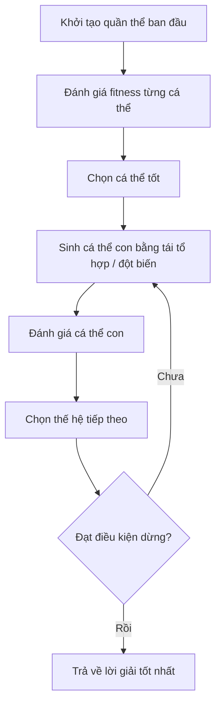
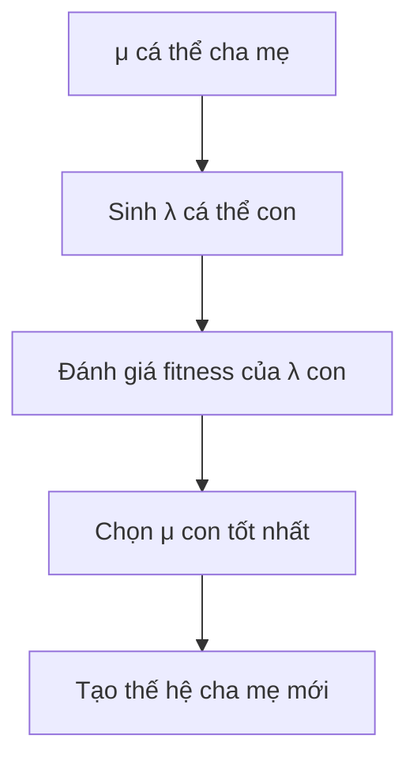
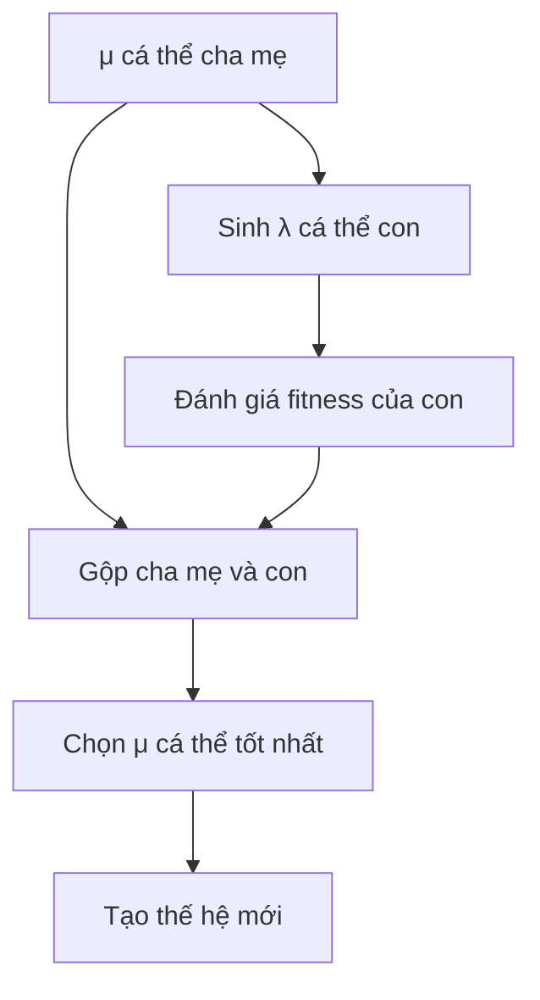
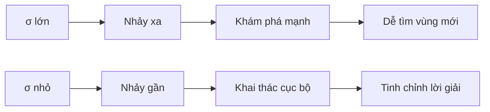
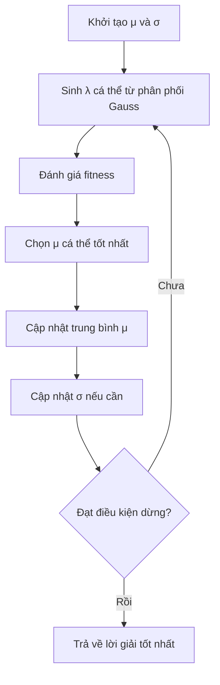
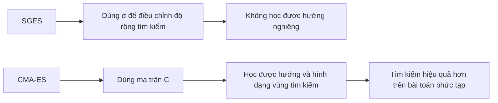
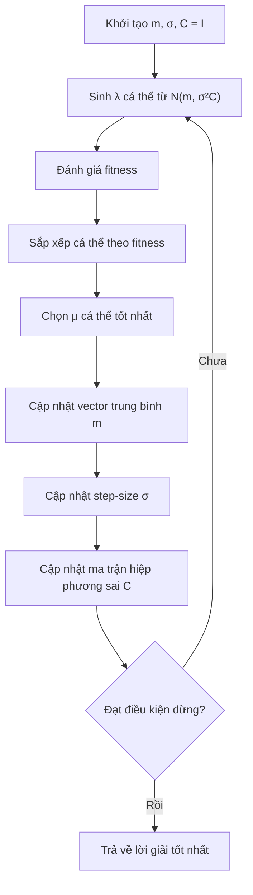

# Chương 5: Chiến Lược Tiến Hóa

> **Evolution Strategies — ES**
> Nguồn nội dung chính từ slide Chương 5 về ES, SGES và CMA-ES. 

---

## Mục Tiêu Bài Học

Sau chương này, bạn sẽ:

* Hiểu **Chiến lược tiến hóa** là gì và vì sao ES phù hợp với bài toán tối ưu số thực.
* Phân biệt ES với **Lập trình tiến hóa — EP** ở Chương 4.
* Nắm được cách biểu diễn cá thể trong ES bằng:

  * vector lời giải `x`
  * tham số chiến lược `σ`
* Hiểu hai cơ chế chọn lọc quan trọng:

  * **(μ, λ)-ES**
  * **(μ + λ)-ES**
* Biết cách hoạt động của:

  * **Đột biến Gauss**
  * **Tự thích nghi tham số σ**
  * **Quy tắc 1/5 thành công**
* Nắm được ý tưởng của:

  * **SGES — Simple Gaussian Evolution Strategies**
  * **CMA-ES — Covariance Matrix Adaptation Evolution Strategies**

---

# 1. Chiến Lược Tiến Hóa Là Gì?

**Chiến lược tiến hóa** hay **Evolution Strategies — ES** là một nhánh của **thuật toán tiến hóa**, được thiết kế chủ yếu cho các bài toán **tối ưu số thực liên tục**.

ES thuộc họ **Evolutionary Algorithms — EA**, lấy cảm hứng từ quá trình chọn lọc tự nhiên:

> Cá thể tốt hơn có khả năng được giữ lại, sinh sản và truyền đặc điểm cho thế hệ sau.

ES đặc biệt phù hợp với các bài toán:

* Hàm mục tiêu là **hộp đen**.
* Không tính được đạo hàm.
* Hàm mục tiêu không lồi.
* Bài toán có nhiễu hoặc khó mô hình hóa chính xác.
* Không gian tìm kiếm là số thực nhiều chiều.

Ví dụ:

```text
Tối ưu f(x), trong đó x = (x1, x2, ..., xn)
```

Mục tiêu là tìm vector `x` sao cho:

```text
f(x) nhỏ nhất hoặc lớn nhất
```

tùy bài toán đang tối thiểu hóa hay tối đa hóa.

---

## 1.1. Bối Cảnh Ra Đời

ES được phát triển vào thập niên 1960 tại **Đại học Kỹ thuật Berlin**, gắn với hai nhà nghiên cứu:

* **Ingo Rechenberg**
* **Hans-Paul Schwefel**

Khác với GA, ES ban đầu không xuất phát từ mô phỏng di truyền trên máy tính, mà từ các thí nghiệm vật lý thực tế trong **hầm gió**.

Ý tưởng ban đầu rất trực quan:

```text
Tạo một biến thể nhỏ của thiết kế hiện tại
→ đo hiệu quả thực tế
→ giữ thiết kế tốt hơn
→ tiếp tục lặp lại
```

Đây chính là tinh thần cốt lõi của ES:

> Tối ưu bằng **đột biến + chọn lọc**, không cần đạo hàm.

---

# 2. ES Khác Gì Với EP?

Ở Chương 4, bạn đã học về **Lập trình tiến hóa — Evolutionary Programming, EP**. ES và EP có nhiều điểm giống nhau, nhưng cũng có khác biệt quan trọng.

| Tiêu chí               | EP                                           | ES                                            |
| ---------------------- | -------------------------------------------- | --------------------------------------------- |
| Kiểu bài toán phổ biến | Dự đoán, tối ưu, mô hình hóa hành vi         | Tối ưu số thực liên tục                       |
| Biểu diễn cá thể       | Thường là vector số thực hoặc máy trạng thái | Vector số thực `x` kèm tham số chiến lược `σ` |
| Toán tử chính          | Đột biến                                     | Đột biến Gauss                                |
| Lai ghép               | Thường không nhấn mạnh                       | Có thể có tái tổ hợp                          |
| Chọn lọc               | Thường dùng tournament giữa cha mẹ và con    | Dùng sơ đồ rõ ràng `(μ, λ)` hoặc `(μ + λ)`    |
| Điểm mạnh              | Mềm dẻo, đơn giản                            | Mạnh trong tối ưu liên tục                    |

Điểm cần nhớ:

> EP nhấn mạnh **đột biến và cạnh tranh**, còn ES nhấn mạnh **đột biến Gauss, chọn lọc có cấu trúc và tự thích nghi tham số tìm kiếm**.

---

# 3. Quy Trình Cơ Bản Của ES

Một thuật toán ES thường hoạt động theo các bước sau:



Quy trình tổng quát:

1. Khởi tạo quần thể gồm nhiều cá thể.
2. Đánh giá độ thích nghi của từng cá thể.
3. Chọn các cá thể tốt.
4. Sinh cá thể con từ cá thể tốt.
5. Đột biến cá thể con.
6. Đánh giá cá thể con.
7. Chọn thế hệ kế tiếp.
8. Lặp lại đến khi đạt điều kiện dừng.

---

# 4. Biểu Diễn Cá Thể Trong ES

Trong ES, một cá thể thường không chỉ chứa lời giải `x`, mà còn chứa cả tham số điều khiển quá trình tìm kiếm.

Một cá thể có dạng:

```text
Cá thể = (x, σ)
```

Trong đó:

| Thành phần            | Ký hiệu                 | Ý nghĩa                         |
| --------------------- | ----------------------- | ------------------------------- |
| Vector biến đối tượng | `x = (x1, x2, ..., xn)` | Lời giải của bài toán           |
| Tham số chiến lược    | `σ = (σ1, σ2, ..., σn)` | Độ lệch chuẩn dùng cho đột biến |
| Fitness               | `f(x)`                  | Mức độ tốt của lời giải         |

Ví dụ:

```text
x = [2.5, -1.2, 0.7]
σ = [0.3, 0.1, 0.5]
```

Nghĩa là:

* Chiều 1 được đột biến với bước nhảy khoảng `0.3`.
* Chiều 2 được đột biến nhẹ hơn, khoảng `0.1`.
* Chiều 3 được phép biến động lớn hơn, khoảng `0.5`.

Trực giác:

> `x` là lời giải hiện tại, còn `σ` là “cách cá thể đó tự tìm kiếm lời giải mới”.

---

# 5. Ký Hiệu `(μ, λ)` Và `(μ + λ)`

Trong ES, hai ký hiệu quan trọng nhất là:

| Ký hiệu | Ý nghĩa                                 |
| ------- | --------------------------------------- |
| `μ`     | Số cá thể cha mẹ                        |
| `λ`     | Số cá thể con được sinh ra ở mỗi thế hệ |

Ví dụ:

```text
(10, 70)-ES
```

nghĩa là:

* Có `10` cá thể cha mẹ.
* Sinh ra `70` cá thể con.
* Chọn `10` cá thể tốt nhất từ nhóm con để làm cha mẹ thế hệ sau.

---

# 6. `(μ, λ)-ES` — Chiến Lược Phẩy

Trong **comma strategy**, chỉ các cá thể con được xét để sống sót.

```text
Cha mẹ → sinh λ con → chọn μ con tốt nhất → thế hệ mới
```

Cha mẹ cũ bị loại bỏ hoàn toàn, kể cả khi cha mẹ tốt hơn con.



Đặc điểm:

* Không giữ lại cha mẹ cũ.
* Cho phép fitness tạm thời giảm.
* Giúp thuật toán tránh bám quá lâu vào lời giải cũ.
* Phù hợp với tự thích nghi tham số `σ`.

Ưu điểm lớn:

> Vì cha mẹ cũ luôn bị loại, thuật toán buộc phải tiếp tục tiến hóa. Điều này giúp tránh tình trạng giữ mãi một cá thể tốt nhưng tham số đột biến `σ` đã không còn phù hợp.

---

# 7. `(μ + λ)-ES` — Chiến Lược Cộng

Trong **plus strategy**, cha mẹ và con cùng cạnh tranh để sống sót.

```text
Cha mẹ + con → chọn μ cá thể tốt nhất → thế hệ mới
```



Đặc điểm:

* Cha mẹ có thể được giữ lại.
* Có tính **elitism**.
* Fitness tốt nhất thường không giảm qua các thế hệ.
* Dễ hội tụ ổn định hơn.
* Nhưng có thể dễ kẹt ở cực trị địa phương.

---

## 7.1. So Sánh `(μ, λ)-ES` Và `(μ + λ)-ES`

| Tiêu chí                          | `(μ, λ)-ES`           | `(μ + λ)-ES`            |
| --------------------------------- | --------------------- | ----------------------- |
| Cha mẹ cũ                         | Bị loại bỏ            | Có thể được giữ lại     |
| Tập chọn lọc                      | Chỉ từ con            | Từ cha mẹ + con         |
| Elitism                           | Không                 | Có                      |
| Fitness tốt nhất                  | Có thể giảm tạm thời  | Thường không giảm       |
| Khả năng thoát cực trị địa phương | Tốt hơn               | Kém hơn                 |
| Phù hợp với tự thích nghi `σ`     | Rất phù hợp           | Có thể giữ `σ` lỗi thời |
| Khi nên dùng                      | Khi cần khám phá mạnh | Khi cần hội tụ ổn định  |

Ghi nhớ nhanh:

```text
(μ, λ): chọn từ con
(μ + λ): chọn từ cha mẹ + con
```

---

# 8. Đột Biến Gauss Trong ES

Đột biến là toán tử quan trọng nhất trong ES.

Công thức cơ bản:

```text
x'i = xi + σi · N(0, 1)
```

Trong đó:

| Thành phần | Ý nghĩa                        |
| ---------- | ------------------------------ |
| `xi`       | Giá trị hiện tại ở chiều thứ i |
| `x'i`      | Giá trị sau đột biến           |
| `σi`       | Độ lệch chuẩn đột biến         |
| `N(0,1)`   | Nhiễu Gauss chuẩn              |

Nếu `σ` lớn:

```text
→ bước nhảy lớn
→ khám phá mạnh
→ dễ thoát vùng hiện tại
```

Nếu `σ` nhỏ:

```text
→ bước nhảy nhỏ
→ tinh chỉnh cục bộ
→ hội tụ chính xác hơn
```

Minh họa trực giác:



---

# 9. Tự Thích Nghi Tham Số `σ`

Một điểm mạnh quan trọng của ES là:

> Tham số đột biến `σ` cũng được tiến hóa cùng với lời giải `x`.

Thay vì người thiết kế phải tự chọn `σ`, ES cho phép thuật toán tự học:

* Khi cần khám phá, `σ` có xu hướng lớn hơn.
* Khi gần cực trị, `σ` có xu hướng nhỏ lại.
* Khi một chiều cần thay đổi mạnh, `σi` của chiều đó có thể lớn.
* Khi một chiều cần ổn định, `σi` có thể nhỏ.

Công thức thường dùng:

```text
σ'i = σi · exp(τ' · N(0,1) + τ · Ni(0,1))

x'i = xi + σ'i · Ni(0,1)
```

Trong đó:

| Ký hiệu   | Ý nghĩa                           |
| --------- | --------------------------------- |
| `σi`      | Độ lệch chuẩn cũ                  |
| `σ'i`     | Độ lệch chuẩn mới                 |
| `τ'`      | Hệ số học toàn cục                |
| `τ`       | Hệ số học cục bộ                  |
| `N(0,1)`  | Nhiễu Gauss chung cho toàn cá thể |
| `Ni(0,1)` | Nhiễu Gauss riêng cho chiều i     |

Vì sao dùng `exp(...)`?

```text
σ'i = σi · exp(...)
```

Vì `exp(...)` luôn dương, nên đảm bảo:

```text
σ'i > 0
```

Điều này rất quan trọng, vì độ lệch chuẩn không thể âm.

---

# 10. Quy Tắc 1/5 Thành Công

**Quy tắc 1/5 thành công** do Rechenberg đề xuất, thường áp dụng cho ES đơn giản dạng `(1+1)-ES`.

Ý tưởng:

> Theo dõi tỷ lệ đột biến thành công. Nếu quá nhiều đột biến thành công, tăng bước nhảy. Nếu quá ít đột biến thành công, giảm bước nhảy.

Một đột biến được xem là thành công nếu:

```text
f(x_con) tốt hơn f(x_cha)
```

Quy tắc:

| Tỷ lệ thành công | Ý nghĩa                          | Hành động      |
| ---------------- | -------------------------------- | -------------- |
| `> 1/5`          | Đang quá thận trọng              | Tăng `σ`       |
| `= 1/5`          | Cân bằng tốt                     | Giữ nguyên `σ` |
| `< 1/5`          | Đột biến quá mạnh, nhiều con xấu | Giảm `σ`       |

Công thức thường gặp:

```text
Nếu tỷ lệ thành công > 1/5:  σ ← σ / c
Nếu tỷ lệ thành công < 1/5:  σ ← σ · c
Nếu tỷ lệ thành công = 1/5:  giữ nguyên σ
```

với:

```text
0.8 ≤ c < 1
```

Ví dụ:

* Nếu `c = 0.85`
* `σ ← σ / 0.85` sẽ làm `σ` tăng lên.
* `σ ← σ · 0.85` sẽ làm `σ` giảm xuống.

---

# 11. Tái Tổ Hợp Trong ES

Ngoài đột biến, ES cũng có thể dùng **tái tổ hợp**.

Tái tổ hợp là quá trình kết hợp thông tin từ nhiều cha mẹ để tạo ra cá thể con.

Có hai kiểu phổ biến:

| Kiểu                  | Công thức                       | Ý nghĩa                    |
| --------------------- | ------------------------------- | -------------------------- |
| Tái tổ hợp trung bình | `x'i = (x_i^(1) + x_i^(2)) / 2` | Lấy trung bình giữa cha mẹ |
| Tái tổ hợp rời rạc    | `x'i` lấy từ cha hoặc mẹ        | Mỗi gen chọn từ một cha mẹ |

Ví dụ tái tổ hợp trung bình:

```text
Cha 1: x = [2, 4, 6]
Cha 2: x = [4, 8, 10]

Con:  x = [3, 6, 8]
```

Ví dụ tái tổ hợp rời rạc:

```text
Cha 1: x = [2, 4, 6]
Cha 2: x = [4, 8, 10]

Con:  x = [2, 8, 6]
```

Trong ES, tái tổ hợp thường đóng vai trò hỗ trợ. Toán tử chính vẫn là:

```text
Đột biến Gauss
```

---

# 12. SGES — Chiến Lược Tiến Hóa Gauss Đơn Giản

**SGES — Simple Gaussian Evolution Strategies** là một dạng ES đơn giản và cổ điển.

SGES giả định rằng các cá thể được sinh ra từ một phân phối Gauss nhiều chiều.

Phân phối có dạng:

```text
pθ(x) ~ N(μ, σ²I)
```

hay viết trực quan:

```text
x = μ + σ · N(0, I)
```

Trong đó:

| Ký hiệu   | Ý nghĩa                  |
| --------- | ------------------------ |
| `μ`       | Trung bình của phân phối |
| `σ`       | Độ lệch chuẩn            |
| `I`       | Ma trận đơn vị           |
| `N(0, I)` | Nhiễu Gauss nhiều chiều  |

---

## 12.1. Quy Trình SGES



Các bước:

1. Khởi tạo tham số phân phối `θ = (μ, σ)`.
2. Sinh `λ` cá thể con từ phân phối Gauss.
3. Đánh giá fitness từng cá thể.
4. Chọn `μ` cá thể tốt nhất.
5. Cập nhật lại `μ` và `σ`.
6. Lặp lại.

---

## 12.2. Hạn Chế Của SGES

SGES đơn giản, dễ hiểu, nhưng có một hạn chế lớn:

> Hình dạng phân phối tìm kiếm gần như không thay đổi linh hoạt theo cấu trúc bài toán.

Nếu dùng:

```text
N(μ, σ²I)
```

thì vùng tìm kiếm thường có dạng hình cầu hoặc elip song song với trục tọa độ.

Điều này gây khó khăn khi bài toán có dạng:

```text
Thung lũng nghiêng
Hướng tối ưu nằm chéo so với trục tọa độ
Các biến có tương quan mạnh
```

Hạn chế chính:

* `σ` cao giúp khám phá mạnh nhưng có thể hội tụ kém.
* `σ` thấp giúp tinh chỉnh nhưng dễ kẹt.
* Không học được tương quan giữa các biến.
* Phân phối không xoay theo hướng tốt của bài toán.

---

# 13. CMA-ES — Chiến Lược Tiến Hóa Thích Ứng Hiệp Phương Sai

**CMA-ES** là viết tắt của:

```text
Covariance Matrix Adaptation Evolution Strategies
```

Dịch là:

```text
Chiến lược tiến hóa thích ứng ma trận hiệp phương sai
```

CMA-ES được phát triển để khắc phục hạn chế của SGES.

Thay vì chỉ dùng:

```text
N(μ, σ²I)
```

CMA-ES dùng:

```text
N(m, σ²C)
```

Trong đó:

| Ký hiệu | Ý nghĩa                                   |
| ------- | ----------------------------------------- |
| `m`     | Trung tâm hoặc vector trung bình hiện tại |
| `σ`     | Step-size, điều khiển phạm vi tìm kiếm    |
| `C`     | Ma trận hiệp phương sai                   |
| `σ²C`   | Hình dạng và độ lớn của vùng tìm kiếm     |

---

## 13.1. Ý Tưởng Chính Của CMA-ES

CMA-ES không chỉ hỏi:

```text
Nên tìm xa hay gần?
```

mà còn hỏi:

```text
Nên tìm theo hướng nào?
```

Ma trận hiệp phương sai `C` giúp thuật toán học được:

* Chiều nào nên biến động mạnh.
* Chiều nào nên ổn định.
* Các biến nào có tương quan với nhau.
* Hướng nào trong không gian tìm kiếm thường tạo ra lời giải tốt.



---

## 13.2. Trực Giác Về Ma Trận Hiệp Phương Sai

Nếu không có hiệp phương sai:

```text
Vùng tìm kiếm giống hình tròn / hình cầu
```

Nếu có hiệp phương sai:

```text
Vùng tìm kiếm có thể thành hình elip
```

Nếu có tương quan giữa các biến:

```text
Hình elip có thể xoay theo hướng tốt
```

Minh họa:

```text
SGES:

      ○
   ○  ●  ○
      ○

CMA-ES:

        ○
      ○
    ●
  ○
○
```

Trong đó:

* `●` là trung tâm hiện tại.
* `○` là các cá thể con được sinh ra.
* CMA-ES cho phép phân phối nghiêng theo hướng có triển vọng.

---

# 14. Quy Trình CMA-ES



Các bước chính:

1. Khởi tạo:

   * `m`: vector trung bình
   * `σ`: step-size
   * `C = I`: ma trận hiệp phương sai ban đầu là ma trận đơn vị

2. Sinh `λ` cá thể:

```text
x_i = m + σ · N(0, C)
```

3. Đánh giá fitness từng cá thể.

4. Sắp xếp cá thể theo fitness.

5. Chọn `μ` cá thể tốt nhất.

6. Cập nhật `m` theo trung bình có trọng số:

```text
m = Σ wi · xi
```

7. Cập nhật `σ`.

8. Cập nhật ma trận hiệp phương sai `C`.

9. Lặp lại.

---

# 15. So Sánh SGES Và CMA-ES

| Tiêu chí                        | SGES                              | CMA-ES                                     |
| ------------------------------- | --------------------------------- | ------------------------------------------ |
| Phân phối                       | `N(μ, σ²I)`                       | `N(m, σ²C)`                                |
| Tham số chính                   | Trung bình `μ`, độ lệch chuẩn `σ` | Trung bình `m`, step-size `σ`, ma trận `C` |
| Hình dạng vùng tìm kiếm         | Cố định, thường song song trục    | Thay đổi linh hoạt                         |
| Học tương quan giữa biến        | Không                             | Có                                         |
| Độ phức tạp                     | Thấp                              | Cao                                        |
| Hiệu quả trên bài toán phức tạp | Trung bình                        | Tốt                                        |
| Dễ cài đặt                      | Dễ                                | Khó hơn                                    |
| Tài nguyên tính toán            | Ít hơn                            | Nhiều hơn                                  |

Ghi nhớ:

> SGES học “đi xa hay gần”, còn CMA-ES học cả “đi xa hay gần” và “đi theo hướng nào”.

---

# 16. Ưu Điểm Và Nhược Điểm Của CMA-ES

## 16.1. Ưu Điểm

CMA-ES có nhiều điểm mạnh:

* Hội tụ nhanh sau số lượng thế hệ tương đối nhỏ.
* Phù hợp với bài toán không có đạo hàm.
* Tốt cho tối ưu số thực liên tục.
* Có thể xử lý không gian tìm kiếm phức tạp.
* Học được tương quan giữa các biến.
* Là baseline mạnh trong tối ưu hộp đen.

## 16.2. Nhược Điểm

Tuy mạnh, CMA-ES cũng có hạn chế:

* Tốn tài nguyên tính toán hơn SGES.
* Phức tạp về mặt toán học.
* Ma trận hiệp phương sai có kích thước `n x n`, nên khi số chiều rất lớn, chi phí tăng mạnh.
* Không phù hợp với mọi bài toán rời rạc hoặc bài toán có ràng buộc phức tạp nếu không thiết kế thêm cơ chế xử lý.

---

# 17. Pseudocode Tổng Quát Cho `(μ, λ)-ES`

```text
Khởi tạo μ cá thể cha mẹ:
    mỗi cá thể gồm (x, σ)

Đánh giá fitness của từng cá thể cha mẹ

Lặp cho đến khi đạt điều kiện dừng:

    Tạo λ cá thể con:

        Chọn một hoặc nhiều cha mẹ

        Tái tổ hợp nếu cần

        Tự thích nghi σ:
            σ' = σ · exp(τ' · N(0,1) + τ · Ni(0,1))

        Đột biến:
            x' = x + σ' · Ni(0,1)

        Đánh giá fitness của con

    Chọn μ cá thể tốt nhất từ λ con

    Cập nhật quần thể cha mẹ

Trả về cá thể tốt nhất từng tìm được
```

---

# 18. Ví Dụ Python: `(μ, λ)-ES` Tối Ưu Hàm Sphere

Hàm Sphere:

```text
f(x) = Σ xi²
```

Cực tiểu toàn cục:

```text
x = 0
f(x) = 0
```

Code minh họa:

```python
import numpy as np


def sphere(x):
    """
    Hàm Sphere.
    Cực tiểu toàn cục tại x = 0.
    """
    return np.sum(x ** 2)


def mu_lambda_es(
    fitness_fn,
    n_dims=10,
    mu=15,
    lam=100,
    n_generations=200,
    x_bound=5.0,
    seed=42
):
    rng = np.random.default_rng(seed)

    # Hệ số học cho tự thích nghi
    tau_global = 1.0 / np.sqrt(2 * n_dims)
    tau_local = 1.0 / np.sqrt(2 * np.sqrt(n_dims))

    # Khởi tạo cha mẹ
    parents_x = rng.uniform(-x_bound, x_bound, size=(mu, n_dims))
    parents_sigma = np.ones(mu)

    best_x = None
    best_f = np.inf
    history = []

    for gen in range(n_generations):
        children_x = np.empty((lam, n_dims))
        children_sigma = np.empty(lam)
        children_f = np.empty(lam)

        for k in range(lam):
            # Chọn ngẫu nhiên một cha mẹ
            p_idx = rng.integers(mu)
            x_parent = parents_x[p_idx]
            sigma_parent = parents_sigma[p_idx]

            # Tự thích nghi sigma
            sigma_child = sigma_parent * np.exp(
                tau_global * rng.normal()
                + tau_local * rng.normal()
            )

            # Tránh sigma quá nhỏ
            sigma_child = max(sigma_child, 1e-6)

            # Đột biến Gauss
            x_child = x_parent + sigma_child * rng.normal(size=n_dims)

            children_x[k] = x_child
            children_sigma[k] = sigma_child
            children_f[k] = fitness_fn(x_child)

        # (μ, λ)-ES: chọn μ con tốt nhất
        best_indices = np.argsort(children_f)[:mu]

        parents_x = children_x[best_indices]
        parents_sigma = children_sigma[best_indices]

        gen_best_f = children_f[best_indices[0]]

        if gen_best_f < best_f:
            best_f = gen_best_f
            best_x = children_x[best_indices[0]].copy()

        history.append(best_f)

        if gen % 20 == 0 or gen == n_generations - 1:
            print(f"Thế hệ {gen:3d} | fitness tốt nhất = {best_f:.6f}")

    return best_x, best_f, history


if __name__ == "__main__":
    best_x, best_f, history = mu_lambda_es(
        sphere,
        n_dims=10,
        mu=15,
        lam=100,
        n_generations=200
    )

    print("\nGiá trị x tốt nhất:")
    print(np.round(best_x, 4))

    print("\nFitness tốt nhất:")
    print(best_f)
```

Khi chạy chương trình, fitness thường giảm dần về gần `0`, cho thấy ES đang tìm dần về cực tiểu của hàm Sphere.

---

# 19. Ứng Dụng Thực Tế Của ES

| Lĩnh vực               | Ứng dụng                                                 |
| ---------------------- | -------------------------------------------------------- |
| Kỹ thuật               | Tối ưu hình dạng cánh máy bay, thân xe, ống dẫn khí      |
| Điều khiển             | Tối ưu tham số PID, bộ điều khiển robot                  |
| Học máy                | Tối ưu siêu tham số, neuroevolution                      |
| Robot học              | Tối ưu dáng đi, quỹ đạo, tham số điều khiển              |
| Mô phỏng               | Tối ưu hệ thống khó có đạo hàm                           |
| Thiết kế               | Tối ưu hình dạng kiến trúc, thiết kế công nghiệp         |
| Reinforcement Learning | Tối ưu chính sách khi gradient khó dùng                  |
| Tối ưu hộp đen         | Bài toán chỉ đánh giá được bằng thử nghiệm hoặc mô phỏng |

---

# 20. Sơ Đồ Tổng Kết Chương

```mermaid
mindmap
  root((Chiến lược tiến hóa - ES))
    Tổng quan
      Thuật toán tiến hóa
      Tối ưu số thực
      Không cần đạo hàm
      Dựa trên quần thể
    Biểu diễn cá thể
      Vector x
      Tham số sigma
      Fitness
    Chọn lọc
      "(μ, λ)-ES"
        Chọn từ con
        Không giữ cha mẹ
      "(μ + λ)-ES"
        Chọn từ cha mẹ và con
        Có elitism
    Đột biến
      Gaussian mutation
      "x' = x + σN(0,1)"
    Tự thích nghi
      Sigma tiến hóa cùng x
      Quy tắc 1/5
    Biến thể
      SGES
        Gaussian đơn giản
        Mean và sigma
      CMA-ES
        Ma trận hiệp phương sai
        Học hướng tìm kiếm
        Mạnh nhưng phức tạp
```

---

# 21. Điều Cần Ghi Nhớ

* **ES** là nhánh thuật toán tiến hóa mạnh cho bài toán **tối ưu số thực liên tục**.
* ES phù hợp khi hàm mục tiêu:

  * không có đạo hàm,
  * không lồi,
  * khó mô hình hóa,
  * chỉ đánh giá được qua mô phỏng hoặc thử nghiệm.
* Cá thể trong ES thường gồm:

```text
(x, σ)
```

trong đó:

```text
x = lời giải
σ = tham số điều khiển đột biến
```

* `(μ, λ)-ES` chọn cá thể tốt nhất từ **λ con**, không giữ cha mẹ.
* `(μ + λ)-ES` chọn cá thể tốt nhất từ **cha mẹ + con**, có elitism.
* Đột biến chính trong ES là **đột biến Gauss**:

```text
x' = x + σ · N(0,1)
```

* **Tự thích nghi** cho phép `σ` tiến hóa cùng lời giải.
* **Quy tắc 1/5 thành công** giúp điều chỉnh `σ` dựa trên tỷ lệ đột biến tốt.
* **SGES** dùng phân phối Gauss đơn giản.
* **CMA-ES** mở rộng SGES bằng cách thích nghi ma trận hiệp phương sai `C`.
* CMA-ES học được cả:

  * phạm vi tìm kiếm,
  * hướng tìm kiếm,
  * tương quan giữa các biến.

---

# 22. Tóm Tắt Bài Học

Chương này giới thiệu **Chiến lược tiến hóa — Evolution Strategies, ES**, một nhóm thuật toán tiến hóa chuyên dùng cho tối ưu số thực liên tục. Khác với GA tập trung nhiều vào crossover và biểu diễn chuỗi, ES tập trung vào **đột biến Gauss**, **chọn lọc có cấu trúc** và **tự thích nghi tham số tìm kiếm**.

Bạn đã học cách cá thể ES mang theo cả lời giải `x` và tham số chiến lược `σ`, cách hai cơ chế chọn lọc `(μ, λ)` và `(μ + λ)` hoạt động, cũng như vai trò của `σ` trong cân bằng giữa khám phá và khai thác.

Phần cuối chương giới thiệu hai biến thể quan trọng:

* **SGES**: đơn giản, dùng phân phối Gauss với trung bình và độ lệch chuẩn.
* **CMA-ES**: mạnh hơn, học cả ma trận hiệp phương sai để thích nghi hướng tìm kiếm.

Tư tưởng lớn nhất của ES là:

> Không chỉ tiến hóa lời giải, mà còn tiến hóa cả **cách tìm kiếm lời giải**.

---

# Bài luyện tập

## Mục tiêu


## Đề bài


## Yêu cầu hoàn thành

- [ ] 
- [ ] 
- [ ] 

## Kết quả / lời giải


## Ghi chú
