# Chương 6: Tiến Hóa Đa Nhiệm

> **Tiến hóa đa nhiệm** là một hướng mở rộng hiện đại của tính toán tiến hóa, trong đó **một quần thể duy nhất** được dùng để giải **nhiều bài toán tối ưu đồng thời**, đồng thời tận dụng khả năng **chuyển giao tri thức** giữa các bài toán. Nội dung chương này được tổng hợp và trình bày lại từ tài liệu bài giảng MFEA. 

---

## Mục Tiêu Bài Học

Sau chương này, bạn sẽ:

* Hiểu **Tiến hóa đa nhiệm** là gì.
* Nắm được khái niệm **MFO — Multifactorial Optimization**.
* Hiểu thuật toán **MFEA — Multifactorial Evolutionary Algorithm**.
* Biết các khái niệm:

  * `factorial cost`
  * `factorial rank`
  * `skill factor`
  * `scalar fitness`
* Hiểu cơ chế **chuyển giao tri thức ngầm** thông qua lai ghép liên tác vụ.
* Hiểu vai trò của tham số `rmp`.
* Phân biệt **MFO / EMT** với **MOO — tối ưu đa mục tiêu**.

---

# 1. Vì Sao Cần Tiến Hóa Đa Nhiệm?

Trong các chương trước, ta đã học các thuật toán tiến hóa như:

* GA — Genetic Algorithm
* GP — Genetic Programming
* EP — Evolutionary Programming
* ES — Evolution Strategies

Các thuật toán này thường theo mô hình:

```text
Một quần thể → Một bài toán tối ưu
```

Ví dụ:

```text
GA giải bài toán A
ES giải bài toán B
EP giải bài toán C
```

Mỗi bài toán được giải riêng, không chia sẻ thông tin với nhau.

---

## Vấn Đề Của Cách Giải Riêng Lẻ

Trong thực tế, nhiều bài toán có liên quan với nhau.

Ví dụ:

| Lĩnh vực          | Các bài toán liên quan                                  |
| ----------------- | ------------------------------------------------------- |
| Logistics         | Định vị kho hàng, định tuyến xe, phân phối hàng hóa     |
| Cloud computing   | Nhiều yêu cầu người dùng cần tối ưu tài nguyên cùng lúc |
| Machine learning  | Tối ưu nhiều mô hình hoặc nhiều tập dữ liệu tương tự    |
| Thiết kế kỹ thuật | Tối ưu nhiều phiên bản sản phẩm cùng họ                 |

Nếu giải riêng từng bài toán, ta sẽ gặp vấn đề:

```text
Bài toán 1 học được tri thức hữu ích
Nhưng bài toán 2 không tận dụng được tri thức đó
```

Điều này gây **lãng phí tri thức**.

---

## Ý Tưởng Của Tiến Hóa Đa Nhiệm

Thay vì giải từng bài toán riêng lẻ:

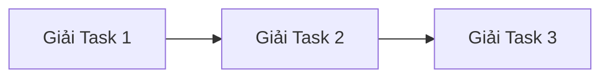

Ta giải nhiều bài toán cùng lúc:

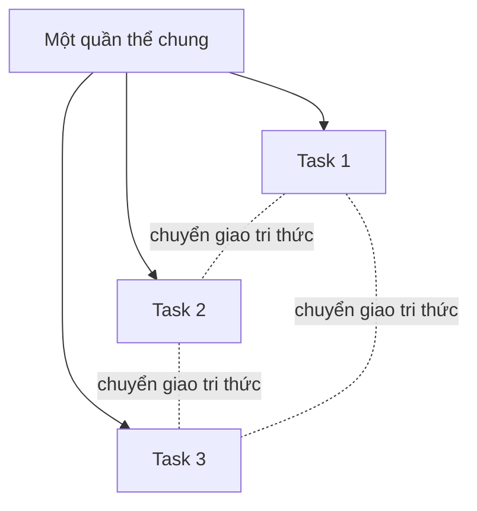

Ý tưởng cốt lõi:

> Một quần thể duy nhất có thể cùng lúc tiến hóa để giải nhiều bài toán, đồng thời cho phép tri thức từ bài toán này hỗ trợ bài toán khác.

---

# 2. Giải Thuật Tiến Hóa Đa Nhân Tố — MFEA

## 2.1. Khái Niệm

**MFEA — Multifactorial Evolutionary Algorithm** là một thuật toán tiến hóa dựa trên quần thể, được dùng để giải nhiều bài toán tối ưu đồng thời.

MFEA có các đặc điểm chính:

* Là thuật toán tối ưu ngẫu nhiên.
* Thuộc lớp **giải thuật tiến hóa**.
* Dựa trên một **quần thể chung**.
* Có thể giải nhiều bài toán tối ưu cùng lúc.
* Tận dụng **chuyển giao tri thức** giữa các bài toán.

---

## 2.2. Động Lực Ra Đời

Một động lực quan trọng của MFEA là các hệ thống tính toán hiện đại, đặc biệt là **hệ thống tính toán đám mây**.

Trong cloud computing:

* Có rất nhiều yêu cầu người dùng gửi đến cùng lúc.
* Mỗi yêu cầu có thể xem như một bài toán tối ưu.
* Các bài toán này có thể có điểm tương đồng.
* Nếu xử lý riêng từng bài toán, hệ thống không tận dụng được tri thức chung.

Ví dụ:

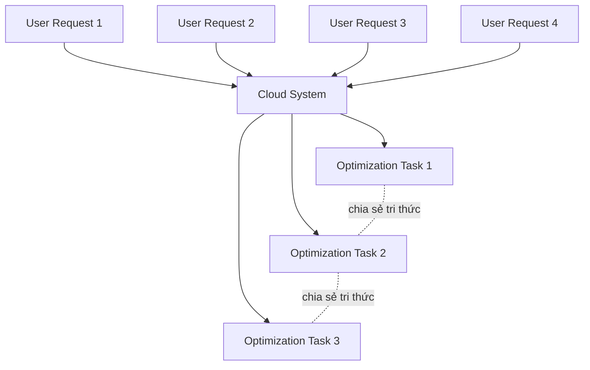

---

# 3. MFO — Multifactorial Optimization

## 3.1. Định Nghĩa

**MFO — Multifactorial Optimization** là mô hình tối ưu trong đó có nhiều bài toán cần được giải đồng thời.

Giả sử có `K` tác vụ:

```text
T1, T2, ..., TK
```

Mỗi tác vụ `Ti` có hàm mục tiêu riêng:

```text
fi: Xi → R
```

Mục tiêu của MFO là tìm ra `K` lời giải tối ưu:

```text
x1*, x2*, ..., xK*
```

sao cho mỗi lời giải tối ưu cho một tác vụ tương ứng.

---

## 3.2. Điểm Quan Trọng

Trong MFO:

* Mỗi task là một bài toán tối ưu riêng.
* Mỗi task có thể có:

  * Không gian tìm kiếm riêng.
  * Số chiều riêng.
  * Hàm mục tiêu riêng.
  * Ràng buộc riêng.
* Tuy nhiên, tất cả được giải bằng **một quần thể chung**.

---

# 4. Không Gian Tìm Kiếm Chung

## 4.1. Vấn Đề

Nếu mỗi bài toán có số chiều khác nhau, làm sao dùng một quần thể chung?

Ví dụ:

| Task   | Số chiều |
| ------ | -------: |
| Task 1 |        5 |
| Task 2 |       12 |
| Task 3 |       20 |

Ta không thể dùng trực tiếp cùng một vector lời giải nếu kích thước mỗi bài toán khác nhau.

---

## 4.2. Ý Tưởng Không Gian Chung

MFEA xây dựng một **Unified Search Space — USS**, tức **không gian tìm kiếm chung**.

Số chiều của không gian chung được chọn là:

```text
D = max(D1, D2, ..., DK)
```

Trong đó:

* `D` là số chiều của không gian chung.
* `Di` là số chiều của task thứ `i`.

---

## 4.3. Minh Họa

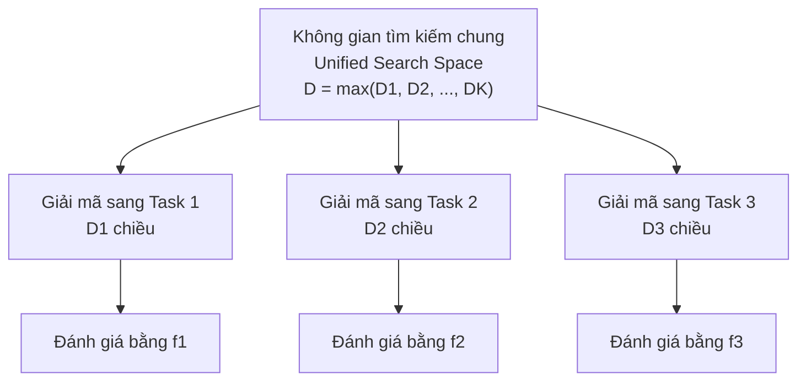

---

## 4.4. Vai Trò Của Không Gian Chung

Không gian tìm kiếm chung là nơi thực hiện các toán tử tiến hóa:

* Khởi tạo cá thể.
* Lai ghép.
* Đột biến.
* Chọn lọc.

Sau đó, khi cần đánh giá trên từng tác vụ, cá thể sẽ được **giải mã** sang không gian riêng của tác vụ đó.

---

# 5. Toán Tử Giải Mã

## 5.1. Khái Niệm

**Giải mã** là quá trình chuyển một cá thể từ không gian chung sang không gian riêng của từng tác vụ.

```text
Cá thể trong USS → Cá thể tương ứng trong Task i
```

---

## 5.2. Ví Dụ

Giả sử ta giải đồng thời:

* Task 1: Bài toán cái túi 12 chiều.
* Task 2: Bài toán TSP 6 thành phố.

Ta dùng một nhiễm sắc thể chung 12 chiều.

```text
Unified chromosome:
[0.8, 0.9, 0.1, 0.9, 0.6, 0.0, 0.2, 0.5, 0.9, 0.4, 0.1, 0.9]
```

Khi giải mã:

| Task     | Cách giải mã                     |
| -------- | -------------------------------- |
| Knapsack | Chuyển thành vector nhị phân 0/1 |
| TSP      | Chuyển thành hoán vị thành phố   |

---

# 6. Các Thuộc Tính Của Cá Thể Trong MFEA

Trong MFEA, mỗi cá thể không chỉ có nhiễm sắc thể, mà còn có các thuộc tính đặc biệt.

---

## 6.1. Factorial Cost

**Factorial cost** `cij` là chi phí của cá thể `pi` khi được đánh giá trên tác vụ `j`.

```text
cij = cost của cá thể pi trên task j
```

Ví dụ:

| Cá thể | Cost Task 1 | Cost Task 2 |
| ------ | ----------: | ----------: |
| p1     |          10 |          50 |
| p2     |          20 |          15 |
| p3     |           5 |          40 |

---

## 6.2. Factorial Rank

**Factorial rank** `rij` là thứ hạng của cá thể `pi` trên task `j`.

Nếu bài toán là tối thiểu hóa:

* Cost thấp hơn → rank tốt hơn.
* Rank 1 là tốt nhất.

Ví dụ:

| Cá thể | Cost Task 1 | Rank Task 1 |
| ------ | ----------: | ----------: |
| p3     |           5 |           1 |
| p1     |          10 |           2 |
| p2     |          20 |           3 |

---

## 6.3. Skill Factor

**Skill factor** `τi` cho biết cá thể `pi` giỏi nhất ở tác vụ nào.

```text
τi = argminj(rij)
```

Nói cách khác:

> Skill factor là task mà cá thể có thứ hạng tốt nhất.

Ví dụ:

| Cá thể | Rank Task 1 | Rank Task 2 | Skill Factor       |
| ------ | ----------: | ----------: | ------------------ |
| p1     |           1 |           4 | Task 1             |
| p2     |           3 |           1 | Task 2             |
| p3     |           2 |           2 | Task 1 hoặc Task 2 |

---

## 6.4. Scalar Fitness

**Scalar fitness** là độ thích nghi tổng hợp của cá thể.

Công thức:

```text
scalar_fitness = 1 / min(factorial_rank)
```

Hay:

```text
ωi = 1 / minj(rij)
```

Ý nghĩa:

* Cá thể có rank tốt nhất càng cao thì scalar fitness càng lớn.
* Scalar fitness được dùng để chọn lọc cá thể trong quần thể chung.

---

## 6.5. Ví Dụ Tổng Hợp

Giả sử có 2 task và 4 cá thể:

| Cá thể | Cost T1 | Cost T2 | Rank T1 | Rank T2 | Skill Factor | Scalar Fitness |
| ------ | ------: | ------: | ------: | ------: | ------------ | -------------: |
| p1     |    0.02 |    5.10 |       1 |       4 | T1           |           1.00 |
| p2     |    3.50 |    0.15 |       4 |       1 | T2           |           1.00 |
| p3     |    1.20 |    2.80 |       2 |       3 | T1           |           0.50 |
| p4     |    2.90 |    1.05 |       3 |       2 | T2           |           0.50 |

Nhận xét:

* `p1` giỏi nhất ở Task 1.
* `p2` giỏi nhất ở Task 2.
* `p1` và `p2` đều có scalar fitness cao nhất.
* Scalar fitness cho phép so sánh cá thể thuộc các task khác nhau trong cùng một quần thể.

---

# 7. Chuyển Giao Tri Thức Trong MFEA

## 7.1. Knowledge Transfer Là Gì?

**Chuyển giao tri thức** là quá trình sử dụng tri thức từ một bài toán để hỗ trợ giải bài toán khác.

Trong MFEA, chuyển giao tri thức xảy ra thông qua:

```text
Lai ghép liên tác vụ
```

Tức là lai ghép giữa hai cá thể có skill factor khác nhau.

---

## 7.2. Hai Loại Chuyển Giao

| Loại chuyển giao  | Ý nghĩa                                     |
| ----------------- | ------------------------------------------- |
| Positive Transfer | Tri thức từ task này giúp task khác tốt hơn |
| Negative Transfer | Tri thức từ task này làm task khác xấu đi   |

---

## 7.3. Minh Họa

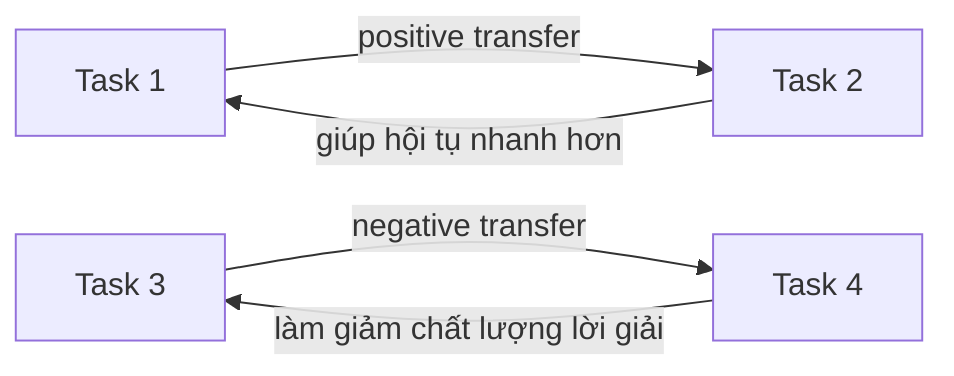

---

## 7.4. Các Quan Hệ Sinh Học Tương Tự

Hiệu quả chuyển giao tri thức có thể hình dung qua các quan hệ trong tự nhiên:

| Quan hệ   | Ý nghĩa trong MFEA                           |
| --------- | -------------------------------------------- |
| Cộng sinh | Cả hai task cùng có lợi                      |
| Kí sinh   | Một task có lợi, task kia bị hại             |
| Hội sinh  | Một task có lợi, task kia không bị ảnh hưởng |
| Hợp tác   | Các task hỗ trợ nhau nhưng không bắt buộc    |

---

# 8. Toán Tử Lai Ghép Trong MFEA

## 8.1. Assortative Mating

Trong tự nhiên, các cá thể thường có xu hướng giao phối với cá thể có đặc điểm tương đồng.

Trong MFEA, điều này được mô phỏng bằng **skill factor**.

---

## 8.2. Intra Crossover

**Intra Crossover** là lai ghép giữa hai cá thể có cùng skill factor.

```text
Parent A: skill factor = Task 1
Parent B: skill factor = Task 1
→ Lai ghép cùng tác vụ
```

Minh họa:

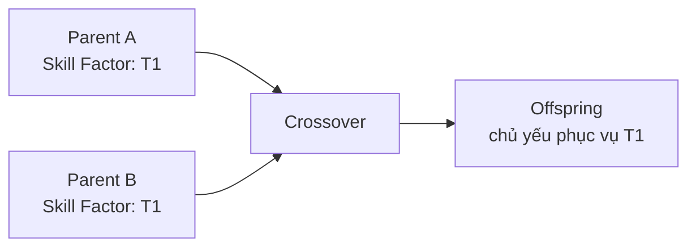

---

## 8.3. Inter Crossover

**Inter Crossover** là lai ghép giữa hai cá thể có skill factor khác nhau.

```text
Parent A: skill factor = Task 1
Parent B: skill factor = Task 2
→ Lai ghép liên tác vụ
```

Đây là cơ chế chính tạo ra **chuyển giao tri thức**.

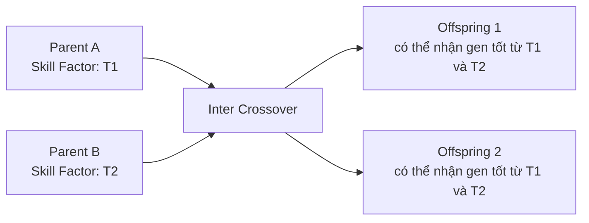

---

# 9. Tham Số `rmp`

## 9.1. Khái Niệm

`rmp` là viết tắt của:

```text
random mating probability
```

Đây là xác suất cho phép hai cá thể thuộc **hai skill factor khác nhau** được lai ghép với nhau.

---

## 9.2. Quy Tắc Lai Ghép

```text
Nếu hai cha mẹ có cùng skill factor:
    Luôn lai ghép

Nếu hai cha mẹ khác skill factor:
    Nếu random() < rmp:
        Lai ghép liên tác vụ
    Ngược lại:
        Không lai ghép liên tác vụ, chỉ đột biến
```

---

## 9.3. Ảnh Hưởng Của `rmp`

| Giá trị `rmp`  | Ảnh hưởng                                                               |
| -------------- | ----------------------------------------------------------------------- |
| `rmp` quá nhỏ  | Ít chuyển giao tri thức, hiệu năng gần giống giải đơn nhiệm             |
| `rmp` vừa phải | Cân bằng giữa khai thác tri thức và tránh nhiễu                         |
| `rmp` quá lớn  | Chuyển giao mạnh, có thể gây negative transfer nếu task không liên quan |

---

## 9.4. Minh Họa

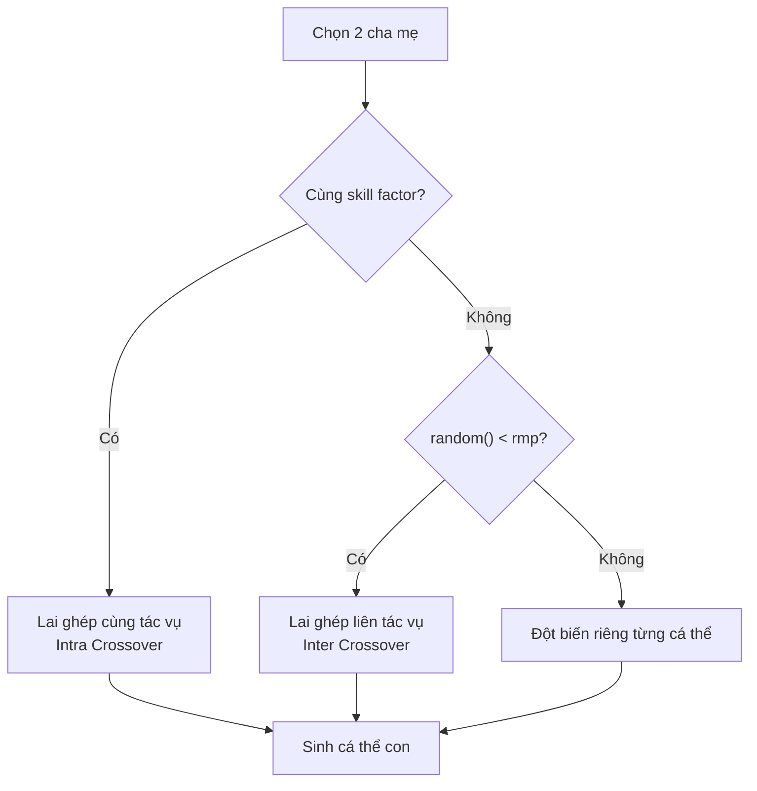

---

# 10. Hạn Chế Chuyển Giao Âm

## 10.1. Negative Transfer

**Negative transfer** xảy ra khi tri thức từ một task làm giảm hiệu quả tối ưu của task khác.

Ví dụ:

```text
Task 1 và Task 2 quá khác nhau
Nhưng rmp lại quá cao
→ Cá thể hai task lai ghép quá nhiều
→ Tri thức không phù hợp bị truyền sang nhau
→ Chất lượng lời giải giảm
```

---

## 10.2. Một Số Cách Hạn Chế

| Phương pháp                  | Ý tưởng                                                                               |
| ---------------------------- | ------------------------------------------------------------------------------------- |
| Tự điều chỉnh `rmp`          | Cho thuật toán học mức độ lai ghép phù hợp, ví dụ MFEA-II                             |
| Chỉ lai ghép task tương đồng | Cố định `rmp`, nhưng chỉ cho phép transfer giữa các task gần nhau                     |
| Đo độ tương đồng task        | Dựa trên phân phối fitness, phân phối gene hoặc lịch sử lai ghép                      |
| Theo dõi chất lượng con      | Nếu inter crossover thường tạo con tốt, tăng transfer; nếu tạo con xấu, giảm transfer |

---

# 11. Vertical Cultural Transmission

## 11.1. Khái Niệm

**Vertical Cultural Transmission** nghĩa là **lan truyền văn hóa theo chiều dọc**.

Trong MFEA, điều này thể hiện ở việc cá thể con kế thừa skill factor từ cha hoặc mẹ.

---

## 11.2. Trường Hợp Lai Ghép

Nếu cá thể con được sinh ra bởi lai ghép:

```text
Con sẽ được gán skill factor giống bố hoặc mẹ
```

Ví dụ:

```text
Parent A: skill factor = T1
Parent B: skill factor = T2

Child có thể nhận:
- skill factor = T1
hoặc
- skill factor = T2
```

---

## 11.3. Trường Hợp Đột Biến

Nếu cá thể con được sinh ra bởi đột biến:

```text
Con giữ skill factor của cá thể gốc
```

Ví dụ:

```text
Parent: skill factor = T1
Mutation → Child: skill factor = T1
```

---

## 11.4. Minh Họa

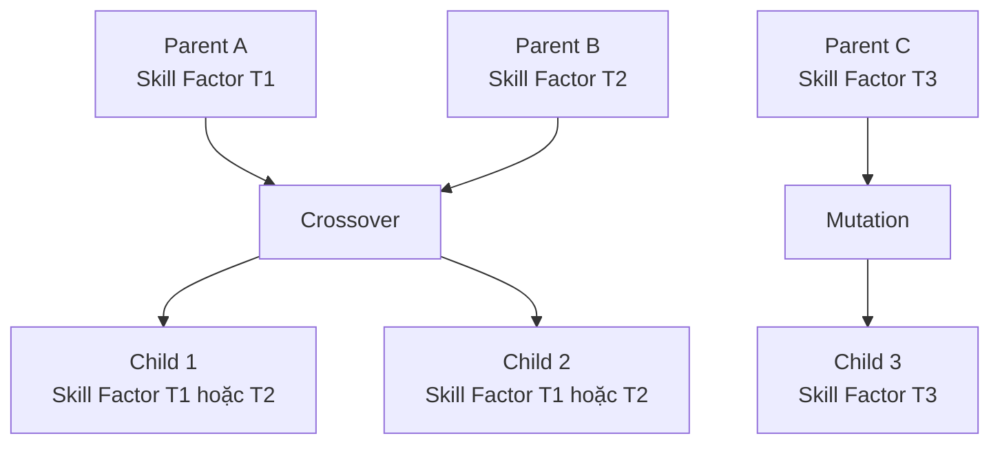

---

# 12. Chọn Lọc Trong MFEA

Việc chọn lọc cá thể trong MFEA dựa trên **scalar fitness**.

Nguyên tắc:

```text
Scalar fitness càng cao
→ Cá thể càng quan trọng trong task của nó
→ Cơ hội sống sót sang thế hệ sau càng lớn
```

---

## Chọn Lọc Sinh Tồn

Sau khi sinh cá thể con:

```text
Quần thể mới = chọn N cá thể tốt nhất từ P ∪ O
```

Trong đó:

* `P` là quần thể cha mẹ.
* `O` là quần thể con.
* Chọn theo scalar fitness.
* Thường dùng cơ chế **elitism**.

---

# 13. Quy Trình Tổng Quát Của MFEA

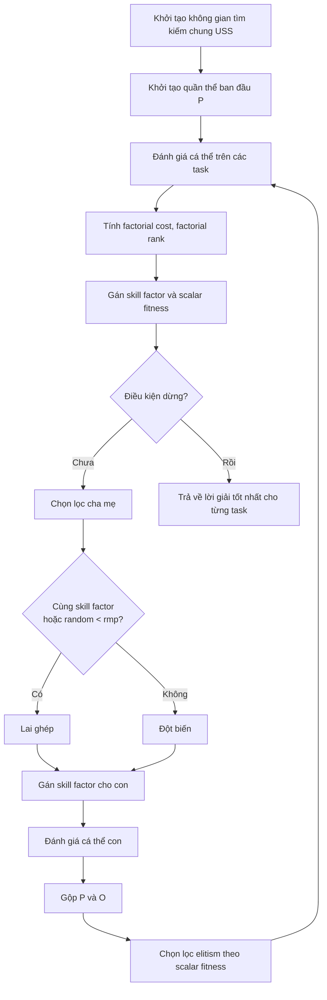

---

# 14. Mã Giả MFEA

```text
Input:
    K      : số lượng tác vụ
    N      : kích thước quần thể
    rmp    : xác suất lai ghép ngẫu nhiên giữa các task
    USS    : không gian tìm kiếm chung

Khởi tạo:
    t = 0
    Khởi tạo quần thể P gồm N cá thể trong USS

Đánh giá ban đầu:
    Với mỗi cá thể pi trong P:
        Đánh giá pi trên tất cả K tác vụ
        Tính factorial cost
        Tính factorial rank
        Gán skill factor
        Tính scalar fitness

Lặp cho đến khi đạt điều kiện dừng:

    O = rỗng

    Trong khi kích thước O < N:

        Chọn hai cá thể cha mẹ pa, pb từ P

        Nếu pa.skill_factor == pb.skill_factor hoặc random() < rmp:
            Thực hiện lai ghép pa và pb
            Sinh ra con oa, ob
            Gán skill factor cho con từ bố hoặc mẹ

        Ngược lại:
            Đột biến pa tạo oa
            Đột biến pb tạo ob
            oa.skill_factor = pa.skill_factor
            ob.skill_factor = pb.skill_factor

        Thêm oa, ob vào O

    Đánh giá các cá thể con theo skill factor tương ứng

    Gộp P và O

    Tính lại factorial rank, scalar fitness

    Chọn N cá thể tốt nhất theo scalar fitness làm quần thể mới

    t = t + 1

Output:
    Lời giải tốt nhất cho từng tác vụ
```

---

# 15. Ví Dụ Ứng Dụng: Logistics

Giả sử một công ty logistics cần giải đồng thời hai bài toán:

## Task 1: Facility Location Problem

Mục tiêu:

```text
Tìm vị trí đặt kho hàng / trung tâm phân phối sao cho chi phí thấp nhất.
```

## Task 2: Routing Problem

Mục tiêu:

```text
Tìm tuyến đường giao hàng tối ưu để giảm chi phí và thời gian vận chuyển.
```

Hai bài toán này liên quan với nhau:

* Vị trí kho ảnh hưởng đến tuyến đường.
* Tuyến đường tốt có thể gợi ý cách bố trí kho hiệu quả hơn.

Dùng MFEA:

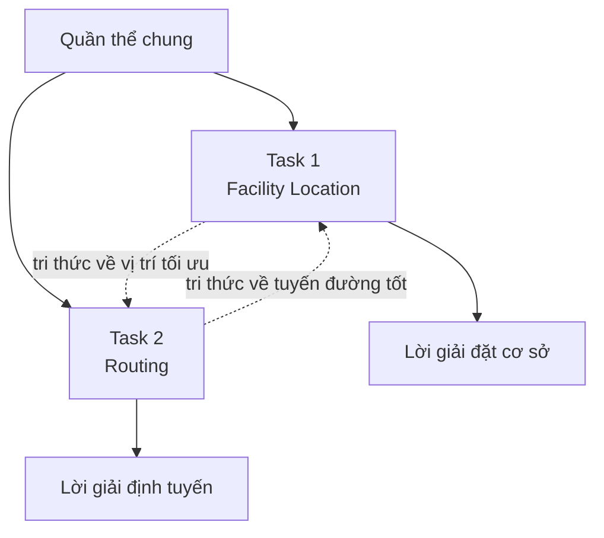

Kết quả:

* Tìm được lời giải cho cả hai task.
* Tận dụng được tri thức qua lại.
* Có thể hội tụ nhanh hơn so với giải riêng từng bài toán.

---

# 16. Ví Dụ TSP Trong MFEA

Một ví dụ thường dùng để minh họa MFEA là giải đồng thời hai bài toán TSP:

* Task 1: TSP 5 thành phố.
* Task 2: TSP 9 thành phố.

Vì Task 2 có số chiều lớn hơn, không gian chung sẽ có kích thước:

```text
D = max(5, 9) = 9
```

Mỗi cá thể trong không gian chung là một hoán vị 9 phần tử.

Khi giải mã:

| Task            | Cách lấy lời giải                     |
| --------------- | ------------------------------------- |
| TSP 5 thành phố | Lấy hoán vị tương ứng với 5 thành phố |
| TSP 9 thành phố | Dùng toàn bộ hoán vị 9 thành phố      |

---

## Nhận Xét

* TSP 5 thành phố có không gian tìm kiếm nhỏ hơn nên thường hội tụ nhanh hơn.
* TSP 9 thành phố khó hơn nên cần nhiều thế hệ hơn.
* Nếu hai task có cấu trúc tương đồng, tri thức từ TSP 9 thành phố có thể giúp TSP 5 thành phố hội tụ nhanh hơn.

---

# 17. Implicit Multitasking Và Explicit Multitasking

## 17.1. Implicit Multitasking

Đặc điểm:

* Dùng một quần thể duy nhất.
* Dùng biểu diễn hợp nhất.
* Chuyển giao tri thức thông qua lai ghép trong không gian chung.
* MFEA là ví dụ điển hình.

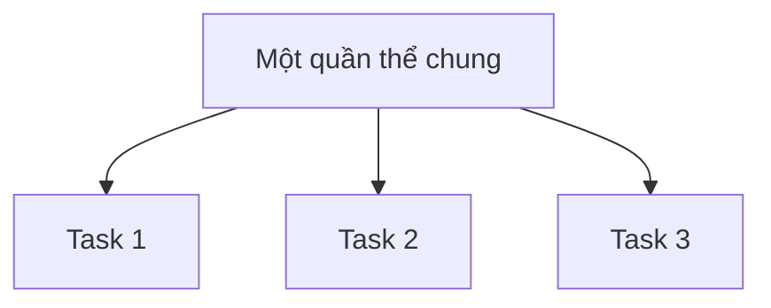

---

## 17.2. Explicit Multitasking

Đặc điểm:

* Mỗi task có quần thể riêng.
* Tri thức được chuyển giao bằng cách trao đổi cá thể hoặc thông tin giữa các quần thể.


---

## 17.3. So Sánh

| Tiêu chí             | Implicit Multitasking             | Explicit Multitasking              |
| -------------------- | --------------------------------- | ---------------------------------- |
| Số quần thể          | Một quần thể chung                | Nhiều quần thể                     |
| Biểu diễn            | Không gian hợp nhất               | Không gian riêng từng task         |
| Chuyển giao tri thức | Qua lai ghép trong quần thể chung | Qua trao đổi cá thể hoặc thông tin |
| Ví dụ                | MFEA                              | Multi-population transfer EA       |

---

# 18. MFEA Khác Gì Với Tiến Hóa Song Song?

MFEA dễ bị nhầm với xử lý tiến hóa song song, nhưng bản chất khác nhau.

| Tiêu chí             | MFEA                                            | Tiến hóa song song                   |
| -------------------- | ----------------------------------------------- | ------------------------------------ |
| Mục tiêu             | Giải nhiều bài toán đồng thời                   | Tăng tốc giải một bài toán           |
| Số bài toán          | Nhiều task                                      | Thường một task                      |
| Chuyển giao tri thức | Có                                              | Không phải mục tiêu chính            |
| Quần thể             | Một quần thể chung hoặc đa quần thể có transfer | Chia nhỏ quần thể để xử lý nhanh hơn |
| Trọng tâm            | Knowledge transfer                              | Hiệu suất tính toán                  |

Ghi nhớ:

```text
MFEA không chỉ là chạy song song.
MFEA là giải nhiều task đồng thời và cho phép chuyển giao tri thức.
```

---

# 19. Phân Biệt MFO Và MOO

Đây là điểm rất quan trọng.

## 19.1. MFO — Multi-task / Multifactorial Optimization

MFO giải **nhiều bài toán khác nhau**.

Ví dụ:

```text
Task 1: Tối ưu tuyến đường
Task 2: Tối ưu vị trí kho
Task 3: Tối ưu lịch giao hàng
```

Mỗi task có thể có:

* Không gian riêng.
* Hàm mục tiêu riêng.
* Lời giải riêng.

---

## 19.2. MOO — Multi-objective Optimization

MOO giải **một bài toán duy nhất**, nhưng có nhiều mục tiêu.

Ví dụ:

```text
Một bài toán thiết kế xe:
- Mục tiêu 1: giảm chi phí
- Mục tiêu 2: tăng độ an toàn
- Mục tiêu 3: giảm trọng lượng
```

Các mục tiêu này có thể xung đột nhau.

---

## 19.3. Bảng So Sánh

| Tiêu chí            | MFO / EMT                           | MOO                                |
| ------------------- | ----------------------------------- | ---------------------------------- |
| Bản chất            | Nhiều bài toán                      | Một bài toán                       |
| Số hàm mục tiêu     | Mỗi task có hàm riêng               | Một bài toán có nhiều hàm mục tiêu |
| Không gian tìm kiếm | Có thể khác nhau giữa các task      | Một không gian chung               |
| Mục tiêu            | Tìm lời giải tốt nhất cho từng task | Tìm tập lời giải trade-off         |
| Kết quả             | `K` lời giải cho `K` task           | Tập Pareto                         |
| Trọng tâm           | Chuyển giao tri thức                | Cân bằng xung đột mục tiêu         |

---

## 19.4. Ghi Nhớ Nhanh

```text
MFO / EMT:
    Nhiều bài toán khác nhau
    → Chia sẻ tri thức để cùng tối ưu

MOO:
    Một bài toán
    → Nhiều mục tiêu xung đột cần đánh đổi
```

---

# 20. Ứng Dụng Thực Tế Của MFEA

| Lĩnh vực          | Ứng dụng                                   |
| ----------------- | ------------------------------------------ |
| Cloud computing   | Tối ưu nhiều yêu cầu tài nguyên cùng lúc   |
| Logistics         | Kết hợp định vị cơ sở và định tuyến        |
| Machine learning  | Tối ưu siêu tham số cho nhiều mô hình      |
| Thiết kế kỹ thuật | Tối ưu nhiều biến thể sản phẩm             |
| TSP / VRP         | Giải nhiều biến thể định tuyến đồng thời   |
| Scheduling        | Lập lịch nhiều dự án hoặc nhiều dây chuyền |
| Neuroevolution    | Tiến hóa mạng nơ-ron cho nhiều tác vụ      |

---

# 21. Ưu Điểm Và Hạn Chế

## 21.1. Ưu Điểm

* Giải được nhiều bài toán trong một lần chạy.
* Tận dụng được tri thức giữa các task.
* Có thể tăng tốc hội tụ.
* Có thể cải thiện chất lượng lời giải nếu task tương đồng.
* Phù hợp với hệ thống có nhiều tác vụ liên quan.

---

## 21.2. Hạn Chế

* Nếu task quá khác nhau, dễ xảy ra negative transfer.
* Việc chọn `rmp` không đơn giản.
* Cần thiết kế không gian tìm kiếm chung hợp lý.
* Việc đo độ tương đồng giữa các task có thể phức tạp.
* Không phải lúc nào đa nhiệm cũng tốt hơn đơn nhiệm.

---

# 22. Công Thức Cần Nhớ

## Không gian tìm kiếm chung

```text
D = max(D1, D2, ..., DK)
```

---

## Factorial Cost

```text
cij = cost của cá thể pi trên task j
```

---

## Factorial Rank

```text
rij = thứ hạng của cá thể pi trên task j
```

---

## Skill Factor

```text
τi = argminj(rij)
```

---

## Scalar Fitness

```text
ωi = 1 / minj(rij)
```

---

# 23. Sơ Đồ Tổng Kết MFEA

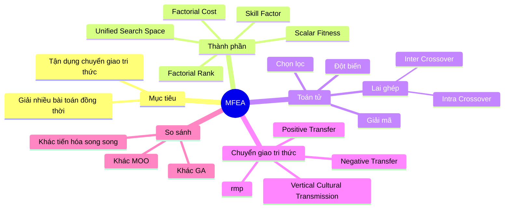

---

# Điều Cần Ghi Nhớ

* **MFEA** là thuật toán tiến hóa đa nhân tố, dùng để giải nhiều bài toán tối ưu đồng thời.
* **MFO** là khung bài toán trong đó có `K` task cần tối ưu cùng lúc.
* MFEA dùng **không gian tìm kiếm chung** để biểu diễn cá thể.
* Các toán tử tiến hóa được thực hiện trong không gian chung.
* Khi đánh giá, cá thể được **giải mã** sang từng task cụ thể.
* **Factorial cost** là chi phí của cá thể trên từng task.
* **Factorial rank** là thứ hạng của cá thể trên từng task.
* **Skill factor** là task mà cá thể làm tốt nhất.
* **Scalar fitness** là độ thích nghi tổng hợp dùng cho chọn lọc.
* **Inter crossover** là cơ chế chính giúp chuyển giao tri thức giữa các task.
* `rmp` điều chỉnh mức độ lai ghép giữa các task khác nhau.
* `rmp` quá cao có thể gây **negative transfer**.
* `rmp` quá thấp làm giảm lợi ích của đa nhiệm.
* **Vertical Cultural Transmission** giúp cá thể con kế thừa skill factor từ cha hoặc mẹ.
* **MFO khác MOO**: MFO là nhiều bài toán; MOO là một bài toán có nhiều mục tiêu.

---

# Tóm Tắt Bài Học

Chương này giới thiệu **Tiến hóa đa nhiệm**, đặc biệt là thuật toán **MFEA — Multifactorial Evolutionary Algorithm**. Khác với các thuật toán tiến hóa truyền thống chỉ tập trung vào một bài toán, MFEA sử dụng một quần thể chung để giải nhiều bài toán tối ưu đồng thời.

Trọng tâm của MFEA là khả năng **chuyển giao tri thức** giữa các tác vụ thông qua lai ghép liên tác vụ. Để làm được điều đó, thuật toán xây dựng một **không gian tìm kiếm chung**, trong đó mọi cá thể đều được biểu diễn thống nhất. Sau đó, cá thể được giải mã sang từng task riêng khi cần đánh giá.

Các khái niệm như **factorial cost**, **factorial rank**, **skill factor** và **scalar fitness** giúp MFEA đánh giá và chọn lọc cá thể trong môi trường đa nhiệm. Tham số `rmp` đóng vai trò như một “van điều tiết” mức độ chuyển giao tri thức giữa các task.

Cuối cùng, cần phân biệt rõ **tiến hóa đa nhiệm** với **tối ưu đa mục tiêu**: tiến hóa đa nhiệm giải nhiều bài toán khác nhau, còn tối ưu đa mục tiêu giải một bài toán có nhiều mục tiêu xung đột.

---

# Bài luyện tập

## Mục tiêu


## Đề bài


## Yêu cầu hoàn thành

- [ ] 
- [ ] 
- [ ] 

## Kết quả / lời giải


## Ghi chú
