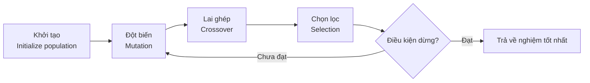
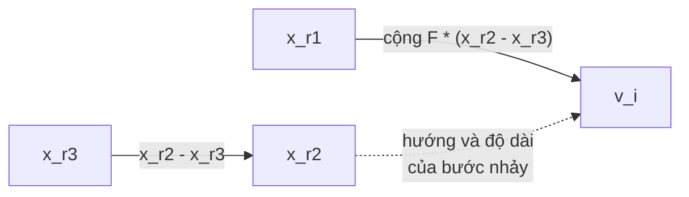
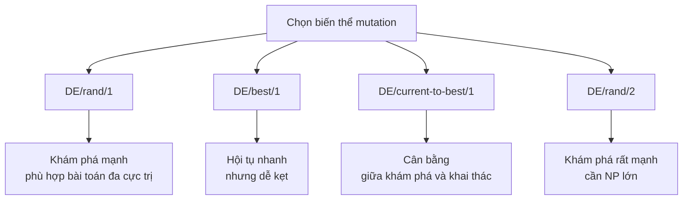
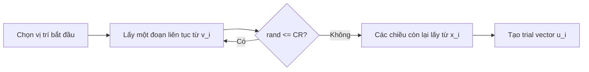
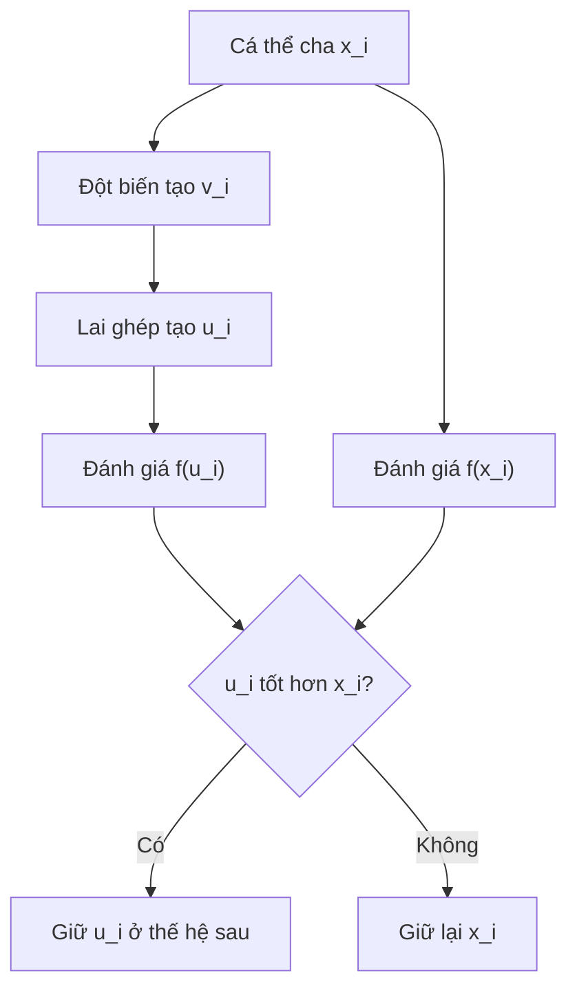
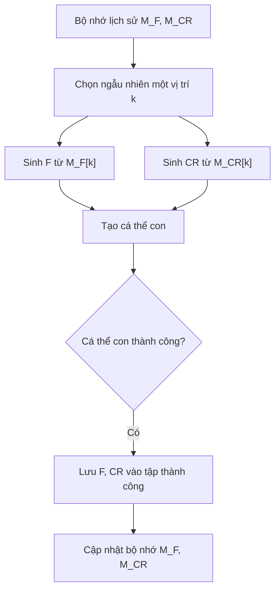

# Chương 7: Tiến Hóa Sai Phân

## Differential Evolution — DE

Nội dung dưới đây được trình bày lại thành markdown tiếng Việt, bám theo slide bài giảng Chương 7 về **Tiến hóa sai phân** và phần nội dung bạn cung cấp. Slide gốc mô tả DE gồm 4 bước chính: **Khởi tạo → Đột biến → Lai ghép → Chọn lọc**, kèm phần hiệu chỉnh tham số `N`, `F`, `CR`. 

---

## Mục Tiêu Bài Học

Sau chương này, bạn sẽ:

* Hiểu **Tiến hóa sai phân** là gì và vì sao DE hiệu quả trong tối ưu số thực.
* Nắm được cách tạo **vector đột biến** bằng sai phân giữa các cá thể.
* Biết cách sử dụng **lai ghép nhị thức** và **lai ghép hàm mũ**.
* Hiểu cơ chế **chọn lọc tham lam một-đối-một**.
* Biết vai trò của ba tham số quan trọng: `NP`, `F`, `CR`.
* Phân biệt DE với GA và ES.

---

# 1. Tiến Hóa Sai Phân Là Gì?

**Tiến hóa sai phân** hay **Differential Evolution — DE** là một thuật toán tối ưu hóa ngẫu nhiên dựa trên quần thể, thuộc nhóm **giải thuật tiến hóa**.

DE thường được dùng cho các bài toán:

* Tối ưu tham số thực.
* Tìm cực trị của hàm nhiều biến.
* Hàm phi tuyến.
* Hàm không khả vi.
* Hàm có nhiều cực trị địa phương.
* Bài toán tối ưu liên tục trong không gian số thực.

Bài toán tổng quát có thể viết như sau:

```text
f : X ⊂ R^D → R
```

Mục tiêu là tìm nghiệm tốt nhất:

```text
x* ∈ X
```

sao cho hàm mục tiêu đạt giá trị nhỏ nhất hoặc lớn nhất tùy bài toán.

Ví dụ với bài toán cực tiểu hóa:

```text
f(x*) ≤ f(x), ∀x ∈ X
```

---

## Ý tưởng cốt lõi của DE

DE không tạo bước nhảy bằng nhiễu ngẫu nhiên đơn giản như nhiều thuật toán khác. Thay vào đó, DE dùng **sự chênh lệch giữa các cá thể trong quần thể** để sinh ra hướng tìm kiếm mới.

Nói cách khác:

> DE học từ chính sự phân bố hiện tại của quần thể.

Nếu quần thể còn phân tán rộng, các sai phân lớn, thuật toán có xu hướng **khám phá mạnh**.
Nếu quần thể đã hội tụ lại gần vùng tốt, các sai phân nhỏ dần, thuật toán tự chuyển sang **khai thác tinh chỉnh**.

---

# 2. Sơ Đồ Tổng Quát Của DE



DE gồm 4 bước chính:

| Bước | Tên      | Vai trò                                            |
| ---- | -------- | -------------------------------------------------- |
| 1    | Khởi tạo | Tạo quần thể ban đầu trong miền tìm kiếm           |
| 2    | Đột biến | Sinh vector đột biến bằng sai phân giữa các cá thể |
| 3    | Lai ghép | Trộn vector đột biến với cá thể hiện tại           |
| 4    | Chọn lọc | Giữ cá thể tốt hơn giữa cha và con                 |

---

# 3. Biểu Diễn Cá Thể Và Quần Thể

Trong DE, mỗi cá thể là một **vector số thực D chiều**:

```text
x_i = (x_i1, x_i2, ..., x_iD)
```

Trong đó:

| Ký hiệu       | Ý nghĩa                                       |
| ------------- | --------------------------------------------- |
| `D`           | Số chiều của bài toán, tức số biến cần tối ưu |
| `NP` hoặc `N` | Kích thước quần thể                           |
| `x_i`         | Cá thể thứ `i`, còn gọi là target vector      |
| `x_i,j`       | Thành phần thứ `j` của cá thể `i`             |
| `G`           | Chỉ số thế hệ                                 |

Ví dụ nếu bài toán có 4 biến:

```text
x_i = (x_i1, x_i2, x_i3, x_i4)
```

thì mỗi cá thể là một lời giải ứng viên trong không gian 4 chiều.

---

# 4. Khởi Tạo Quần Thể

Giả sử mỗi biến `x_j` có giới hạn:

```text
LB_j ≤ x_j ≤ UB_j
```

Quần thể ban đầu được khởi tạo ngẫu nhiên đều trong miền tìm kiếm:

```text
x_i,j(0) = LB_j + rand(0,1) * (UB_j - LB_j)
```

Trong đó:

* `LB_j`: giới hạn dưới của biến thứ `j`.
* `UB_j`: giới hạn trên của biến thứ `j`.
* `rand(0,1)`: số ngẫu nhiên trong khoảng `[0,1]`.

Ví dụ:

```text
D = 4
x1, x2, x3, x4 ∈ [0, 1]
NP = 5
```

Một quần thể ban đầu có thể là:

```text
x1 = (0.2, 0.6, 0.3, 0.4)
x2 = (0.5, 0.7, 0.5, 0.7)
x3 = (0.9, 0.4, 0.3, 0.2)
x4 = (0.4, 0.6, 0.7, 0.4)
x5 = (0.6, 0.1, 0.6, 0.5)
```

---

# 5. Đột Biến Sai Phân

## 5.1. Ý tưởng

Đột biến là phần quan trọng nhất của DE.

Với mỗi cá thể mục tiêu `x_i`, ta chọn ngẫu nhiên ba cá thể khác nhau:

```text
x_r1, x_r2, x_r3
```

với điều kiện:

```text
r1 ≠ r2 ≠ r3 ≠ i
```

Sau đó tạo vector đột biến:

```text
v_i = x_r1 + F * (x_r2 - x_r3)
```

Đây là biến thể phổ biến nhất, gọi là:

```text
DE/rand/1
```

---

## 5.2. Ý nghĩa của công thức

Công thức:

```text
v_i = x_r1 + F * (x_r2 - x_r3)
```

có thể hiểu như sau:

| Thành phần    | Ý nghĩa                                               |
| ------------- | ----------------------------------------------------- |
| `x_r1`        | Vector nền, đóng vai trò điểm xuất phát               |
| `x_r2 - x_r3` | Vector sai phân, biểu diễn hướng và độ lớn chênh lệch |
| `F`           | Hệ số khuếch đại sai phân                             |
| `v_i`         | Vector đột biến                                       |

---

## 5.3. Sơ đồ hình học



Nếu quần thể còn phân tán rộng:

```text
|x_r2 - x_r3| lớn
```

thì bước nhảy lớn, giúp thuật toán khám phá.

Nếu quần thể đã hội tụ:

```text
|x_r2 - x_r3| nhỏ
```

thì bước nhảy nhỏ, giúp thuật toán khai thác vùng nghiệm tốt.

---

# 6. Các Biến Thể Đột Biến Trong DE

Tên biến thể thường có dạng:

```text
DE/<vector_gốc>/<số_vector_sai_phân>
```

Ví dụ:

```text
DE/rand/1
DE/best/1
DE/rand/2
DE/best/2
DE/current-to-best/1
```

---

## Bảng các biến thể phổ biến

| Biến thể               | Công thức                                              | Đặc điểm                                   |
| ---------------------- | ------------------------------------------------------ | ------------------------------------------ |
| `DE/rand/1`            | `v_i = x_r1 + F * (x_r2 - x_r3)`                       | Khám phá tốt, ít bị kẹt cực trị địa phương |
| `DE/best/1`            | `v_i = x_best + F * (x_r1 - x_r2)`                     | Hội tụ nhanh, nhưng dễ hội tụ sớm          |
| `DE/rand/2`            | `v_i = x_r1 + F * (x_r2 - x_r3) + F * (x_r4 - x_r5)`   | Khám phá mạnh hơn, cần quần thể lớn        |
| `DE/best/2`            | `v_i = x_best + F * (x_r1 - x_r2) + F * (x_r3 - x_r4)` | Tăng đa dạng hướng tìm kiếm                |
| `DE/current-to-best/1` | `v_i = x_i + F * (x_best - x_i) + F * (x_r1 - x_r2)`   | Cân bằng giữa hội tụ và đa dạng            |

---

## Sơ đồ chọn biến thể



Trong thực hành, cấu hình phổ biến nhất là:

```text
DE/rand/1/bin
```

Nghĩa là:

* Dùng đột biến `DE/rand/1`.
* Dùng lai ghép nhị thức `binomial crossover`.

---

# 7. Lai Ghép Trong DE

Sau khi tạo vector đột biến `v_i`, DE không dùng trực tiếp `v_i` để thay thế cá thể cũ. Thay vào đó, thuật toán trộn `v_i` với cá thể mục tiêu `x_i` để tạo ra **vector thử nghiệm**:

```text
u_i
```

hay còn gọi là **trial vector**.

Có hai kiểu lai ghép chính:

1. Lai ghép nhị thức — `binomial crossover`.
2. Lai ghép hàm mũ — `exponential crossover`.

---

# 8. Lai Ghép Nhị Thức

## 8.1. Công thức

Với mỗi chiều `j`, ta chọn thành phần từ vector đột biến hoặc giữ lại từ cá thể gốc:

```text
u_i,j = v_i,j nếu rand(0,1) ≤ CR hoặc j = j_rand
u_i,j = x_i,j ngược lại
```

Trong đó:

| Ký hiệu  | Ý nghĩa                                               |
| -------- | ----------------------------------------------------- |
| `CR`     | Xác suất lai ghép                                     |
| `j_rand` | Một vị trí ngẫu nhiên bắt buộc lấy từ vector đột biến |
| `u_i`    | Vector thử nghiệm                                     |
| `v_i`    | Vector đột biến                                       |
| `x_i`    | Cá thể mục tiêu ban đầu                               |

Vai trò của `j_rand` là đảm bảo:

```text
u_i ≠ x_i
```

tức là vector thử nghiệm phải khác cá thể ban đầu ít nhất một chiều.

---

## 8.2. Ví dụ minh họa

Giả sử:

```text
D = 5
CR = 0.7
j_rand = 3
```

| j | `x_i,j` | `v_i,j` | `rand(0,1)` | Điều kiện               | `u_i,j` |
| - | ------: | ------: | ----------: | ----------------------- | ------: |
| 1 |    2.10 |    3.50 |        0.85 | Không lấy `v`           |    2.10 |
| 2 |   -1.30 |   -0.90 |        0.42 | Lấy `v` vì `0.42 ≤ 0.7` |   -0.90 |
| 3 |    4.00 |    4.80 |        0.95 | Lấy `v` vì `j = j_rand` |    4.80 |
| 4 |    0.50 |    0.10 |        0.30 | Lấy `v` vì `0.30 ≤ 0.7` |    0.10 |
| 5 |   -2.00 |   -1.75 |        0.60 | Lấy `v` vì `0.60 ≤ 0.7` |   -1.75 |

Kết quả:

```text
u_i = (2.10, -0.90, 4.80, 0.10, -1.75)
```

---

# 9. Lai Ghép Hàm Mũ

Lai ghép hàm mũ chọn một đoạn liên tục trong vector để lấy từ `v_i`.

Quy trình:

```text
1. Chọn ngẫu nhiên vị trí bắt đầu n.
2. Lấy liên tiếp các thành phần từ v_i.
3. Dừng khi rand(0,1) > CR hoặc đã lấy đủ D thành phần.
4. Các thành phần còn lại lấy từ x_i.
```

Có thể hình dung như sau:



---

## So sánh hai kiểu lai ghép

| Tiêu chí             | Binomial Crossover      | Exponential Crossover                     |
| -------------------- | ----------------------- | ----------------------------------------- |
| Cách chọn thành phần | Chọn độc lập từng chiều | Chọn một đoạn liên tục                    |
| Mức độ phổ biến      | Rất phổ biến            | Ít phổ biến hơn                           |
| Phù hợp với          | Bài toán tổng quát      | Bài toán có biến liên tiếp liên quan mạnh |
| Ký hiệu              | `bin`                   | `exp`                                     |
| Ví dụ                | `DE/rand/1/bin`         | `DE/rand/1/exp`                           |

---

# 10. Chọn Lọc Tham Lam

Sau khi tạo vector thử nghiệm `u_i`, DE so sánh trực tiếp `u_i` với cá thể cha `x_i`.

Với bài toán cực tiểu hóa:

```text
x_i(G+1) = u_i nếu f(u_i) ≤ f(x_i)
x_i(G+1) = x_i ngược lại
```

Với bài toán cực đại hóa:

```text
x_i(G+1) = u_i nếu f(u_i) ≥ f(x_i)
x_i(G+1) = x_i ngược lại
```

---

## Sơ đồ chọn lọc



Đây là cơ chế chọn lọc:

* Đơn giản.
* Tham lam.
* Một-đối-một.
* Không cần sắp xếp toàn quần thể.
* Kích thước quần thể luôn giữ nguyên.

---

# 11. Ví Dụ Minh Họa Một Bước DE

Giả sử cần cực tiểu hóa hàm:

```text
f(x) = x1 + x2 - x3 - x4
```

Với:

```text
D = 4
x1, x2, x3, x4 ∈ [0, 1]
NP = 5
CR = 0.9
F = 0.8
```

Quần thể ban đầu:

```text
I1 = (0.2, 0.6, 0.3, 0.4)
I2 = (0.5, 0.7, 0.5, 0.7)
I3 = (0.9, 0.4, 0.3, 0.2)
I4 = (0.4, 0.6, 0.7, 0.4)
I5 = (0.6, 0.1, 0.6, 0.5)
```

---

## 11.1. Đột biến

Xét cá thể:

```text
I1 = (0.2, 0.6, 0.3, 0.4)
```

Chọn ngẫu nhiên:

```text
I3 = (0.9, 0.4, 0.3, 0.2)
I5 = (0.6, 0.1, 0.6, 0.5)
I2 = (0.5, 0.7, 0.5, 0.7)
```

Tính sai phân:

```text
I5 - I3 = (0.6, 0.1, 0.6, 0.5) - (0.9, 0.4, 0.3, 0.2)
        = (-0.3, -0.3, 0.3, 0.3)
```

Tạo vector đột biến:

```text
V1 = I2 + F * (I5 - I3)

V1 = (0.5, 0.7, 0.5, 0.7) + 0.8 * (-0.3, -0.3, 0.3, 0.3)

V1 = (0.26, 0.46, 0.74, 0.94)
```

---

## 11.2. Lai ghép

Cá thể gốc:

```text
I1 = (0.2, 0.6, 0.3, 0.4)
```

Vector đột biến:

```text
V1 = (0.26, 0.46, 0.74, 0.94)
```

Giả sử chọn:

```text
j_rand = 2
```

và nhờ `CR = 0.9`, các vị trí 1 và 4 cũng lấy từ vector đột biến.

Vector con sinh ra:

```text
O1 = (0.26, 0.46, 0.3, 0.94)
```

---

## 11.3. Chọn lọc

Tính fitness của cá thể cha:

```text
f(I1) = 0.2 + 0.6 - 0.3 - 0.4 = 0.1
```

Tính fitness của cá thể con:

```text
f(O1) = 0.26 + 0.46 - 0.3 - 0.94 = -0.52
```

Vì đây là bài toán cực tiểu hóa:

```text
-0.52 < 0.1
```

nên:

```text
O1 tốt hơn I1
```

Kết luận:

```text
Thay I1 bằng O1 trong thế hệ tiếp theo.
```

---

# 12. Ba Tham Số Cốt Lõi Của DE

DE có ba tham số quan trọng:

```text
NP, F, CR
```

hoặc trong một số tài liệu dùng:

```text
N, F, CR
```

---

## 12.1. Kích thước quần thể — NP

`NP` là số cá thể trong quần thể.

Giá trị thường dùng:

```text
NP ∈ [5D, 10D]
```

Trong đó `D` là số chiều của bài toán.

| NP nhỏ         | NP lớn                    |
| -------------- | ------------------------- |
| Chạy nhanh hơn | Khám phá tốt hơn          |
| Dễ mất đa dạng | Tốn nhiều đánh giá hàm    |
| Dễ hội tụ sớm  | Phù hợp bài toán phức tạp |

Kinh nghiệm:

```text
NP = 10D
```

là lựa chọn khởi đầu tốt cho nhiều bài toán.

---

## 12.2. Hệ số khuếch đại sai phân — F

`F` điều chỉnh độ lớn của vector sai phân:

```text
v_i = x_r1 + F * (x_r2 - x_r3)
```

Giá trị thường dùng:

```text
F ∈ [0.4, 1.0]
```

Một số tài liệu cho phép:

```text
F ∈ [0, 2]
```

Ý nghĩa:

| F nhỏ                     | F lớn                |
| ------------------------- | -------------------- |
| Bước nhảy nhỏ             | Bước nhảy lớn        |
| Khai thác tốt             | Khám phá mạnh        |
| Dễ kẹt cực trị địa phương | Dễ vượt quá vùng tốt |

Kinh nghiệm phổ biến:

```text
F = 0.5
```

---

## 12.3. Xác suất lai ghép — CR

`CR` quyết định mức độ trộn giữa vector đột biến và cá thể gốc.

Giá trị thường dùng:

```text
CR ∈ [0.1, 0.9]
```

hoặc tổng quát:

```text
CR ∈ [0, 1]
```

Ý nghĩa:

| CR nhỏ                               | CR lớn                                  |
| ------------------------------------ | --------------------------------------- |
| Giữ nhiều thành phần của cá thể gốc  | Lấy nhiều thành phần từ vector đột biến |
| Thay đổi ít chiều                    | Thay đổi nhiều chiều                    |
| Phù hợp bài toán biến phụ thuộc mạnh | Phù hợp bài toán biến độc lập hơn       |

Kinh nghiệm phổ biến:

```text
CR = 0.9
```

---

## Cấu hình khởi đầu đề xuất

```text
NP = 10D
F  = 0.5
CR = 0.9
```

---

# 13. Hiệu Chỉnh Tham Số Trong DE

Một số biến thể hiện đại không giữ cố định `F` và `CR`, mà tự điều chỉnh trong quá trình chạy.

## 13.1. jDE

Trong **jDE**, mỗi cá thể có thể tự cập nhật `F` và `CR`.

Ý tưởng:

* Dùng xác suất nhỏ để thay đổi `F`.
* Dùng xác suất nhỏ để thay đổi `CR`.
* Nếu cá thể con thành công, tham số tốt được giữ lại.

Ví dụ:

```text
r1 = r2 = 0.1
F ∈ [0.1, 0.9]
CR ∈ [0, 1]
```

---

## 13.2. SaDE

**SaDE — Self-adaptive Differential Evolution** điều chỉnh tham số dựa trên kinh nghiệm của các thế hệ trước.

Ý tưởng:

* `F` được lấy ngẫu nhiên theo phân phối chuẩn.
* `CR` được sinh theo phân phối chuẩn quanh giá trị trung bình hiện tại.
* Sau một số thế hệ, cập nhật lại giá trị trung bình của `CR` dựa trên các cá thể con thành công.

---

## 13.3. JADE

**JADE** dùng cơ chế thích nghi nâng cao hơn.

Ý tưởng chính:

* `CR` được lấy từ phân phối chuẩn quanh giá trị trung bình `μ_CR`.
* `F` được lấy từ phân phối quanh `μ_F`.
* Sau mỗi giai đoạn, cập nhật `μ_CR` và `μ_F` dựa trên các cá thể con thành công.

JADE giúp DE hoạt động ổn định hơn trên nhiều loại bài toán.

---

## 13.4. SHADE

**SHADE** tiếp tục cải tiến ý tưởng của JADE bằng cách dùng bộ nhớ lịch sử.

SHADE lưu lại các giá trị tốt của:

```text
M_F
M_CR
```

Sau đó, ở mỗi thế hệ, cá thể sẽ lấy tham số từ bộ nhớ này.

Ý tưởng:



---

# 14. Thuật Toán DE/rand/1/bin

## Pseudocode

```text
Khởi tạo quần thể P gồm NP cá thể ngẫu nhiên
Đánh giá fitness của từng cá thể

Lặp cho đến khi đạt điều kiện dừng:

    Với mỗi cá thể x_i trong quần thể:

        1. Đột biến:
            Chọn r1, r2, r3 khác nhau và khác i
            v_i = x_r1 + F * (x_r2 - x_r3)

        2. Lai ghép nhị thức:
            Chọn j_rand ngẫu nhiên
            Với mỗi chiều j:
                Nếu rand(0,1) <= CR hoặc j = j_rand:
                    u_i,j = v_i,j
                Ngược lại:
                    u_i,j = x_i,j

        3. Chọn lọc:
            Nếu f(u_i) tốt hơn hoặc bằng f(x_i):
                x_i thế hệ sau = u_i
            Ngược lại:
                x_i thế hệ sau = x_i

    Cập nhật nghiệm tốt nhất

Trả về nghiệm tốt nhất
```

---

# 15. Cài Đặt Python DE/rand/1/bin

```python
import numpy as np


def sphere(x):
    """
    Hàm benchmark Sphere.
    Cực tiểu toàn cục tại x = (0, 0, ..., 0), f(x) = 0.
    """
    return np.sum(x ** 2)


def differential_evolution(
    fitness_fn,
    D,
    bounds,
    NP=50,
    F=0.5,
    CR=0.9,
    n_generations=100,
    seed=42
):
    rng = np.random.default_rng(seed)

    x_min, x_max = bounds

    # 1. Khởi tạo quần thể
    population = x_min + rng.random((NP, D)) * (x_max - x_min)

    fitness = np.array([fitness_fn(ind) for ind in population])

    best_idx = np.argmin(fitness)
    best = population[best_idx].copy()
    best_fitness = fitness[best_idx]

    history = []

    for gen in range(n_generations):
        new_population = population.copy()
        new_fitness = fitness.copy()

        for i in range(NP):
            # 2. Đột biến DE/rand/1
            candidates = [idx for idx in range(NP) if idx != i]
            r1, r2, r3 = rng.choice(candidates, 3, replace=False)

            v_i = population[r1] + F * (population[r2] - population[r3])

            # Giữ vector trong miền hợp lệ
            v_i = np.clip(v_i, x_min, x_max)

            # 3. Lai ghép nhị thức
            x_i = population[i]
            u_i = x_i.copy()

            j_rand = rng.integers(D)

            for j in range(D):
                if rng.random() <= CR or j == j_rand:
                    u_i[j] = v_i[j]

            # 4. Chọn lọc tham lam
            u_fitness = fitness_fn(u_i)

            if u_fitness <= fitness[i]:
                new_population[i] = u_i
                new_fitness[i] = u_fitness

        population = new_population
        fitness = new_fitness

        # Cập nhật nghiệm tốt nhất
        gen_best_idx = np.argmin(fitness)
        gen_best_fitness = fitness[gen_best_idx]

        if gen_best_fitness < best_fitness:
            best_fitness = gen_best_fitness
            best = population[gen_best_idx].copy()

        history.append(best_fitness)

        if gen % 10 == 0 or gen == n_generations - 1:
            print(f"Thế hệ {gen:3d} | Fitness tốt nhất: {best_fitness:.8f}")

    return best, best_fitness, history


if __name__ == "__main__":
    D = 10

    best_solution, best_value, history = differential_evolution(
        fitness_fn=sphere,
        D=D,
        bounds=(-5.0, 5.0),
        NP=10 * D,
        F=0.5,
        CR=0.9,
        n_generations=100
    )

    print("\nLời giải tốt nhất:")
    print(np.round(best_solution, 4))

    print("\nGiá trị hàm mục tiêu:")
    print(best_value)
```

---

# 16. So Sánh DE Với GA Và ES

| Tiêu chí            | GA                                 | ES                                  | DE                           |
| ------------------- | ---------------------------------- | ----------------------------------- | ---------------------------- |
| Biểu diễn cá thể    | Chuỗi bit, số nguyên, số thực      | Vector số thực + tham số chiến lược | Vector số thực trực tiếp     |
| Toán tử chính       | Lai ghép, đột biến                 | Đột biến Gauss, tự thích nghi       | Sai phân giữa các cá thể     |
| Cách tạo bước nhảy  | Thường phụ thuộc xác suất đột biến | Dựa trên độ lệch chuẩn `σ`          | Dựa trên chênh lệch quần thể |
| Chọn lọc            | Roulette, tournament, rank-based   | `(μ, λ)` hoặc `(μ + λ)`             | Một-đối-một, tham lam        |
| Số tham số          | Nhiều                              | Trung bình đến nhiều                | Ít: `NP`, `F`, `CR`          |
| Phù hợp             | Tổ hợp, rời rạc, số thực           | Tối ưu số thực                      | Tối ưu số thực liên tục      |
| Độ phức tạp cài đặt | Trung bình                         | Cao hơn                             | Thấp                         |

Điểm mạnh nhất của DE là:

> Không cần mã hóa nhị phân như GA, cũng không cần cơ chế tự thích nghi phức tạp như ES, nhưng vẫn đạt hiệu quả cao nhờ khai thác thông tin hình học từ quần thể.

---

# 17. Ứng Dụng Thực Tế Của DE

| Lĩnh vực           | Ứng dụng                                     |
| ------------------ | -------------------------------------------- |
| Học máy            | Tối ưu siêu tham số, tối ưu hàm mất mát      |
| Mạng nơ-ron        | Tối ưu trọng số mạng nhỏ                     |
| Điều khiển tự động | Tối ưu tham số PID                           |
| Xử lý tín hiệu     | Thiết kế bộ lọc số                           |
| Xử lý ảnh          | Phân đoạn ảnh, khôi phục ảnh, tối ưu tham số |
| Kỹ thuật điện      | Phân bố công suất kinh tế                    |
| Tài chính          | Tối ưu danh mục đầu tư                       |
| Hóa học            | Hiệu chỉnh tham số mô hình phản ứng          |
| Công nghiệp        | Thiết kế tối ưu, mô phỏng kỹ thuật           |

DE đặc biệt phù hợp khi:

* Biến quyết định là số thực.
* Hàm mục tiêu khó đạo hàm.
* Không gian tìm kiếm nhiều cực trị.
* Cần thuật toán dễ cài đặt.
* Không muốn tinh chỉnh quá nhiều tham số.

---

# 18. Điều Cần Ghi Nhớ

* **Differential Evolution — DE** là thuật toán tối ưu tiến hóa dựa trên quần thể.
* DE làm việc trực tiếp với **vector số thực**, không cần mã hóa nhị phân.
* Bốn bước chính của DE là:

```text
Khởi tạo → Đột biến → Lai ghép → Chọn lọc
```

* Công thức đột biến phổ biến nhất:

```text
v_i = x_r1 + F * (x_r2 - x_r3)
```

* `F` điều chỉnh độ lớn bước nhảy.
* `CR` điều chỉnh mức độ lai ghép.
* `NP` quyết định kích thước quần thể.
* Chọn lọc trong DE là **tham lam một-đối-một**.
* Cấu hình phổ biến ban đầu:

```text
NP = 10D
F = 0.5
CR = 0.9
```

* Các biến thể nâng cao như `jDE`, `SaDE`, `JADE`, `SHADE` giúp tự điều chỉnh tham số trong quá trình chạy.

---

# 19. Tóm Tắt Bài Học

Trong chương này, bạn đã học về **Tiến hóa sai phân — Differential Evolution**, một thuật toán tối ưu số thực đơn giản nhưng rất mạnh.

Trọng tâm của DE nằm ở toán tử **đột biến sai phân**, nơi vector mới được tạo bằng cách cộng một vector nền với sai phân có trọng số giữa hai cá thể khác trong quần thể. Sau đó, DE dùng lai ghép để tạo vector thử nghiệm và dùng chọn lọc tham lam để quyết định cá thể nào được giữ lại.

DE nổi bật vì:

* Dễ cài đặt.
* Ít tham số.
* Làm việc trực tiếp trên số thực.
* Có khả năng tự điều chỉnh bước tìm kiếm theo độ phân tán quần thể.
* Hiệu quả trên nhiều bài toán tối ưu liên tục.

Ở chương tiếp theo, ta sẽ chuyển sang một hướng khác của trí tuệ bầy đàn:

```text
Chương 8: Tối Ưu Bầy Đàn — Particle Swarm Optimization, PSO
```

Khác với DE mô phỏng tiến hóa, PSO lấy cảm hứng từ hành vi di chuyển hợp tác của đàn chim, đàn cá và mở đầu cho nhóm thuật toán **Swarm Intelligence — Trí tuệ bầy đàn**.
