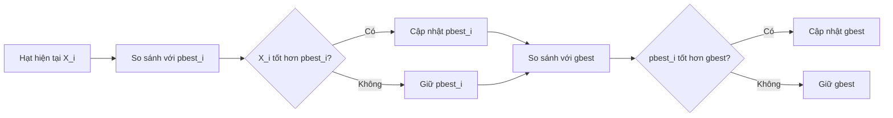
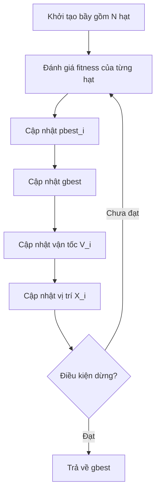
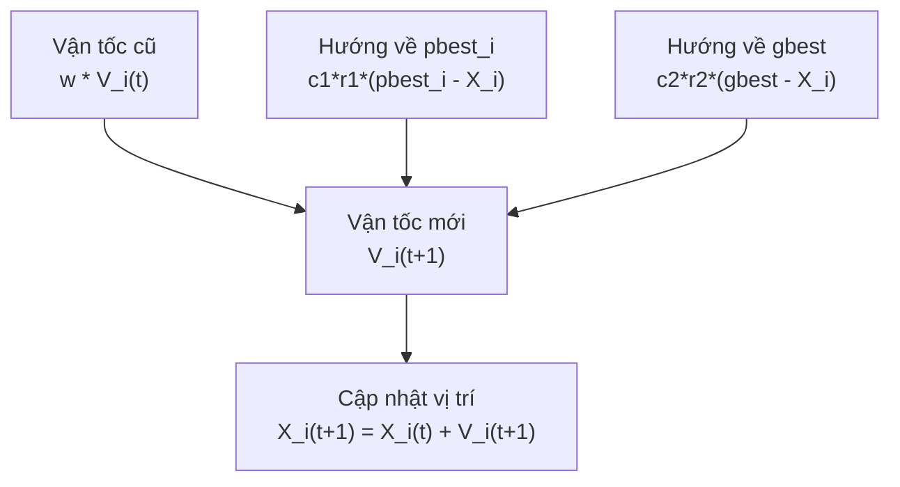
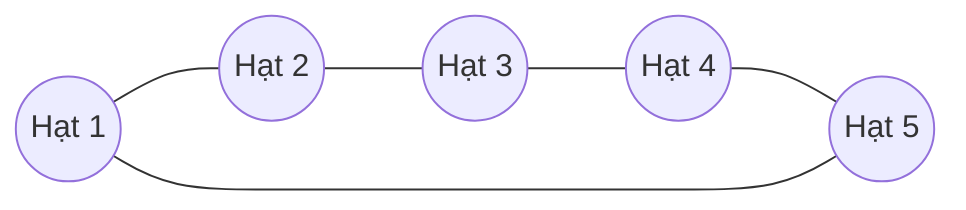
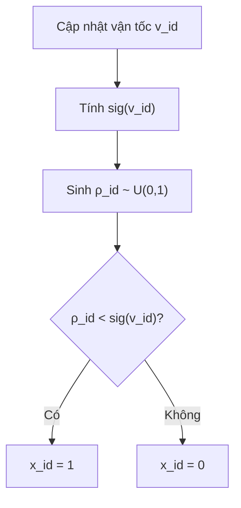
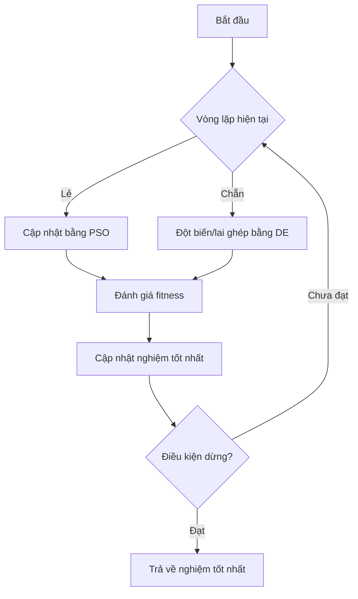

# Chương 8: Tối Ưu Bầy Đàn

## Particle Swarm Optimization — PSO

Nội dung dưới đây được trình bày lại thành markdown tiếng Việt, tổng hợp từ phần bạn cung cấp và slide bài giảng Chương 8. Slide gốc giới thiệu PSO là thuật toán tối ưu dựa trên quần thể, do **Kennedy & Eberhart** đề xuất năm 1995, lấy cảm hứng từ hành vi xã hội của **bầy chim** và **đàn cá**. 

---

## Mục Tiêu Bài Học

Sau chương này, bạn sẽ:

* Hiểu **Tối ưu bầy đàn — Particle Swarm Optimization, PSO** là gì.
* Nắm được các thành phần chính: **bầy**, **hạt**, **vị trí**, **vận tốc**, **pbest**, **gbest**.
* Hiểu công thức cập nhật vận tốc gồm các thành phần: **quán tính**, **nhận thức cá nhân**, **ảnh hưởng xã hội**.
* Biết vai trò của các tham số `w`, `c1`, `c2`, `φ1`, `φ2`.
* Hiểu cách giới hạn vận tốc bằng `vmax`.
* Biết PSO nhị phân và một số biến thể PSO lai như **GA-PSO**, **EPSO**, **DEPSO**.
* Cài đặt được vòng lặp PSO cơ bản bằng Python.

---

# 1. PSO Là Gì?

**Tối ưu bầy đàn** hay **Particle Swarm Optimization — PSO** là một thuật toán tối ưu hóa dựa trên quần thể, thuộc nhóm **Trí tuệ bầy đàn — Swarm Intelligence**.

PSO được giới thiệu bởi:

```text
James Kennedy và Russell Eberhart, năm 1995
```

Ý tưởng của PSO lấy cảm hứng từ hành vi xã hội trong tự nhiên, ví dụ:

* Đàn chim bay tìm thức ăn.
* Đàn cá di chuyển tránh kẻ săn mồi.
* Các cá thể trong bầy vừa học từ bản thân, vừa học từ các cá thể khác.

Trong PSO, mỗi lời giải ứng viên được gọi là một **hạt — particle**. Các hạt không sinh con, không lai ghép, không đột biến như GA hay DE. Thay vào đó, chúng **di chuyển trong không gian tìm kiếm** dựa trên kinh nghiệm cá nhân và kinh nghiệm chung của bầy.

---

## So sánh PSO với các thuật toán tiến hóa trước đó

| Tiêu chí                     | GA / DE / ES                 | PSO                             |
| ---------------------------- | ---------------------------- | ------------------------------- |
| Đơn vị cơ bản                | Cá thể trong quần thể        | Hạt trong bầy                   |
| Cơ chế tạo lời giải mới      | Chọn lọc, lai ghép, đột biến | Di chuyển vị trí                |
| Bộ nhớ cá nhân               | Thường không rõ ràng         | Có `pbest`                      |
| Bộ nhớ tập thể               | Thông qua chọn lọc           | Có `gbest` hoặc `lbest`         |
| Cảm hứng                     | Tiến hóa sinh học            | Hành vi xã hội bầy đàn          |
| Cá thể có bị thay thế không? | Có thể bị thay thế           | Không, hạt tồn tại và di chuyển |

> Trong PSO, mỗi hạt giống như một “người tìm kiếm” trong không gian lời giải: nó nhớ nơi tốt nhất mình từng đến và cũng biết nơi tốt nhất mà bầy từng phát hiện.

---

# 2. Các Thành Phần Của Thuật Toán PSO

## 2.1. Swarm — Bầy

**Swarm** là tập hợp nhiều hạt cùng tham gia tìm kiếm lời giải.

```text
S = {particle_1, particle_2, ..., particle_N}
```

Trong đó:

| Ký hiệu      | Ý nghĩa                |
| ------------ | ---------------------- |
| `S`          | Bầy                    |
| `N`          | Số lượng hạt trong bầy |
| `particle_i` | Hạt thứ `i`            |

---

## 2.2. Particle — Hạt

Mỗi **particle** là một ứng viên lời giải của bài toán.

Một hạt gồm các thông tin chính:

| Thành phần               | Ký hiệu              | Ý nghĩa                             |
| ------------------------ | -------------------- | ----------------------------------- |
| Vị trí                   | `X_i`                | Lời giải hiện tại của hạt           |
| Vận tốc                  | `V_i`                | Hướng và tốc độ di chuyển           |
| Vị trí tốt nhất cá nhân  | `P_i` hoặc `pbest_i` | Nơi tốt nhất hạt từng đạt được      |
| Vị trí tốt nhất toàn bầy | `P_g` hoặc `gbest`   | Nơi tốt nhất toàn bầy từng tìm thấy |

---

## 2.3. Vị trí của hạt

Vị trí của hạt `i` trong không gian `n` chiều:

```text
X_i = (x_i1, x_i2, ..., x_in) ∈ R^n
```

Vị trí chính là một lời giải cụ thể.

Ví dụ nếu bài toán có 3 biến:

```text
X_i = (2.1, -0.5, 4.8)
```

thì hạt `i` đang đại diện cho lời giải:

```text
x1 = 2.1
x2 = -0.5
x3 = 4.8
```

---

## 2.4. Vận tốc của hạt

Vận tốc của hạt `i`:

```text
V_i = (v_i1, v_i2, ..., v_in) ∈ R^n
```

Vận tốc quyết định hạt sẽ di chuyển như thế nào ở vòng lặp tiếp theo.

Nếu:

```text
X_i = (2.0, 3.0)
V_i = (0.5, -1.0)
```

thì vị trí mới là:

```text
X_i mới = (2.0 + 0.5, 3.0 - 1.0)
        = (2.5, 2.0)
```

---

# 3. pbest Và gbest

PSO dựa vào hai loại bộ nhớ quan trọng.

## 3.1. pbest — Personal Best

`pbest_i` là vị trí tốt nhất mà hạt `i` từng đạt được trong quá khứ.

```text
pbest_i = vị trí tốt nhất của riêng hạt i
```

Nếu hạt đang ở vị trí mới tốt hơn `pbest_i`, ta cập nhật:

```text
pbest_i = X_i hiện tại
```

---

## 3.2. gbest — Global Best

`gbest` là vị trí tốt nhất mà toàn bộ bầy từng tìm thấy.

```text
gbest = vị trí tốt nhất trong tất cả pbest_i
```

Nếu một hạt tìm được vị trí tốt hơn `gbest`, ta cập nhật:

```text
gbest = pbest_i mới
```

---

## 3.3. Ý nghĩa trực quan

| Bộ nhớ  | Ý nghĩa                                       |
| ------- | --------------------------------------------- |
| `pbest` | “Tôi từng tìm thấy vị trí tốt nhất ở đâu?”    |
| `gbest` | “Cả bầy từng tìm thấy vị trí tốt nhất ở đâu?” |



---

# 4. Quy Trình Thuật Toán PSO

Các bước cơ bản của PSO:

1. Khởi tạo một bầy gồm `N` hạt.
2. Đánh giá độ thích nghi của mỗi hạt.
3. Cập nhật vị trí tốt nhất cá nhân `pbest_i`.
4. Cập nhật vị trí tốt nhất toàn bầy `gbest`.
5. Cập nhật vận tốc và vị trí của từng hạt.
6. Lặp lại cho đến khi đạt điều kiện dừng.

---

## Sơ đồ tổng quát



---

# 5. Công Thức Cập Nhật Vận Tốc

Đây là phần quan trọng nhất của PSO.

Công thức cơ bản trong slide:

```text
V_i(t+1) = V_i(t)
         + φ1 * r1 * (P_i - X_i(t))
         + φ2 * r2 * (P_g - X_i(t))
```

Trong nhiều tài liệu hiện đại, công thức thường thêm trọng số quán tính `w`:

```text
V_i(t+1) = w * V_i(t)
         + c1 * r1 * (pbest_i - X_i(t))
         + c2 * r2 * (gbest - X_i(t))
```

Trong đó:

| Ký hiệu                    | Ý nghĩa                      |
| -------------------------- | ---------------------------- |
| `V_i(t)`                   | Vận tốc hiện tại của hạt `i` |
| `V_i(t+1)`                 | Vận tốc mới                  |
| `X_i(t)`                   | Vị trí hiện tại của hạt      |
| `pbest_i` hoặc `P_i`       | Vị trí tốt nhất cá nhân      |
| `gbest` hoặc `P_g`         | Vị trí tốt nhất toàn bầy     |
| `r1`, `r2`                 | Số ngẫu nhiên trong `[0, 1]` |
| `c1`, `c2` hoặc `φ1`, `φ2` | Hệ số gia tốc                |
| `w`                        | Trọng số quán tính           |

---

## Ba thành phần trong vận tốc

| Thành phần        | Công thức                   | Ý nghĩa                              |
| ----------------- | --------------------------- | ------------------------------------ |
| Quán tính         | `w * V_i(t)`                | Giữ xu hướng di chuyển cũ            |
| Nhận thức cá nhân | `c1 * r1 * (pbest_i - X_i)` | Kéo hạt về nơi tốt nhất của chính nó |
| Xã hội            | `c2 * r2 * (gbest - X_i)`   | Kéo hạt về nơi tốt nhất của cả bầy   |



---

# 6. Công Thức Cập Nhật Vị Trí

Sau khi có vận tốc mới, vị trí của hạt được cập nhật:

```text
X_i(t+1) = X_i(t) + V_i(t+1)
```

Ý nghĩa:

* Vận tốc cho biết hạt nên đi theo hướng nào.
* Vị trí mới là kết quả sau khi hạt “bay” theo vận tốc đó.
* Sau khi đến vị trí mới, hạt tiếp tục được đánh giá fitness.

---

# 7. Vai Trò Của Các Tham Số

## 7.1. Hệ số gia tốc `φ1`, `φ2` hoặc `c1`, `c2`

Trong slide, hai hệ số gia tốc được ký hiệu là:

```text
φ1, φ2
```

Trong nhiều tài liệu khác, chúng được ký hiệu là:

```text
c1, c2
```

| Tham số        | Ý nghĩa                                 |
| -------------- | --------------------------------------- |
| `φ1` hoặc `c1` | Mức độ hạt tin vào kinh nghiệm cá nhân  |
| `φ2` hoặc `c2` | Mức độ hạt tin vào kinh nghiệm toàn bầy |

Nếu hệ số quá nhỏ:

```text
Bước nhảy nhỏ → hội tụ chậm
```

Nếu hệ số quá lớn:

```text
Bước nhảy quá mạnh → dao động lớn → khó hội tụ
```

Kinh nghiệm thường dùng:

```text
φ1 + φ2 ≤ 4
```

Ví dụ phổ biến:

```text
c1 = 2.0
c2 = 2.0
```

---

## 7.2. Trọng số quán tính `w`

`w` điều chỉnh mức độ giữ lại vận tốc cũ.

| Giá trị `w`  | Ảnh hưởng                       |
| ------------ | ------------------------------- |
| `w` lớn      | Khám phá mạnh hơn               |
| `w` nhỏ      | Khai thác tốt hơn               |
| `w` giảm dần | Đầu kỳ khám phá, cuối kỳ hội tụ |

Chiến lược phổ biến:

```text
w giảm tuyến tính từ 0.9 xuống 0.4
```

---

## 7.3. Giới hạn vận tốc `vmax`

Nếu không giới hạn, hạt có thể bay quá xa khỏi miền tìm kiếm.

Trong slide, vận tốc tối đa ở chiều `d` được chọn:

```text
vmax = UB_d - LB_d
```

Quy tắc điều chỉnh:

```text
Nếu v_id > vmax  thì v_id = vmax
Nếu v_id < -vmax thì v_id = -vmax
```

Trong thực tế, người ta cũng hay chọn:

```text
vmax = 10% đến 20% độ rộng miền tìm kiếm
```

---

# 8. Topology Trong PSO: gbest Và lbest

Topology quyết định hạt học thông tin xã hội từ ai.

## 8.1. gbest topology

Trong **gbest PSO**, mọi hạt đều học từ hạt tốt nhất toàn bầy.

```text
Mỗi hạt bị kéo về cùng một gbest
```

Ưu điểm:

* Hội tụ nhanh.
* Dễ cài đặt.
* Phù hợp bài toán đơn giản.

Nhược điểm:

* Dễ mất đa dạng.
* Dễ kẹt cực trị địa phương.

---

## 8.2. lbest topology

Trong **lbest PSO**, mỗi hạt chỉ học từ nhóm lân cận.

Ví dụ topology vòng:



Ưu điểm:

* Duy trì đa dạng tốt hơn.
* Ít kẹt cực trị địa phương hơn.

Nhược điểm:

* Hội tụ chậm hơn.
* Cài đặt phức tạp hơn gbest.

---

## So sánh gbest và lbest

| Tiêu chí                  | gbest             | lbest                            |
| ------------------------- | ----------------- | -------------------------------- |
| Thông tin xã hội          | Tốt nhất toàn bầy | Tốt nhất trong lân cận           |
| Tốc độ hội tụ             | Nhanh             | Chậm hơn                         |
| Đa dạng                   | Thấp hơn          | Cao hơn                          |
| Nguy cơ kẹt local optimum | Cao hơn           | Thấp hơn                         |
| Phù hợp                   | Bài toán đơn giản | Bài toán phức tạp, nhiều cực trị |

---

# 9. Ví Dụ Minh Họa PSO Một Chiều

Bài toán trong slide:

```text
Tìm giá trị lớn nhất của hàm:
f(x) = -x^2 + 5x + 20

với:
-10 ≤ x ≤ 10
```

Đây là bài toán tối ưu một chiều.

---

## 9.1. Khởi tạo

Khởi tạo bầy với 9 hạt:

```text
x1 = -9.6
x2 = -6.0
x3 = -2.6
x4 = -1.1
x5 = 0.6
x6 = 2.3
x7 = 2.8
x8 = 8.3
x9 = 10.0
```

Gán vận tốc ban đầu:

```text
v_j = 0, với mọi j = 1, ..., 9
```

---

## 9.2. Đánh giá fitness

Tính giá trị hàm mục tiêu:

| Hạt | Vị trí `x` |  `f(x)` |
| --- | ---------: | ------: |
| 1   |       -9.6 | -120.16 |
| 2   |       -6.0 |  -46.00 |
| 3   |       -2.6 |    0.24 |
| 4   |       -1.1 |   13.29 |
| 5   |        0.6 |   22.64 |
| 6   |        2.3 |   26.21 |
| 7   |        2.8 |   26.16 |
| 8   |        8.3 |   -7.39 |
| 9   |       10.0 |  -30.00 |

Vì bài toán là cực đại hóa, hạt tốt nhất ban đầu là:

```text
x6 = 2.3
f(x6) = 26.21
```

Do đó:

```text
gbest = 2.3
```

---

## 9.3. Cập nhật vận tốc

Công thức:

```text
v_j(t+1) = v_j(t)
         + c1 * r1 * (pbest_j - x_j(t))
         + c2 * r2 * (gbest - x_j(t))
```

Ở vòng đầu, vì:

```text
pbest_j = x_j
```

nên thành phần cá nhân bằng 0:

```text
pbest_j - x_j = 0
```

Vận tốc chủ yếu bị kéo về `gbest`.

Ví dụ với hạt 1:

```text
x1 = -9.6
gbest = 2.3
r2 = 0.876
c2 = 1
```

```text
v1 = 0 + 0.876 * (2.3 - (-9.6))
   = 0.876 * 11.9
   = 10.4244
```

---

## 9.4. Cập nhật vị trí

Công thức:

```text
x_j(t+1) = x_j(t) + v_j(t+1)
```

Ví dụ:

```text
x1 mới = -9.6 + 10.4244
       = 0.8244
```

Một số vị trí mới trong slide:

| Hạt | Vị trí mới |
| --- | ---------: |
| 1   |     0.8244 |
| 2   |     1.2708 |
| 3   |     1.6924 |
| 4   |     1.8784 |
| 5   |     2.0892 |
| 6   |     2.3000 |
| 7   |     2.3620 |
| 8   |     3.0440 |
| 9   |     3.2548 |

Sau đó tiếp tục đánh giá fitness, cập nhật `pbest`, cập nhật `gbest`, rồi lặp lại.

---

# 10. PSO Nhị Phân — Binary PSO

## 10.1. Ý tưởng

**Binary PSO** là biến thể của PSO dành cho bài toán nhị phân, tức lời giải có dạng:

```text
x_id ∈ {0, 1}
```

Ví dụ:

```text
X_i = (1, 0, 1, 1, 0)
```

Binary PSO phù hợp với các bài toán:

* Chọn đặc trưng trong học máy.
* Bài toán ba lô.
* Bài toán lập lịch dạng nhị phân.
* Bài toán chọn/tắt các thành phần trong hệ thống.

---

## 10.2. Cập nhật vận tốc trong Binary PSO

Vận tốc vẫn được cập nhật tương tự PSO liên tục:

```text
v_id(t) = v_id(t-1)
        + φ1 * r1 * (p_id - x_id(t-1))
        + φ2 * r2 * (p_gd - x_id(t-1))
```

Nhưng trong Binary PSO, vận tốc không còn là bước dịch chuyển trực tiếp. Nó được hiểu là **mức độ xác suất để bit nhận giá trị 1**.

---

## 10.3. Hàm sigmoid

Dùng hàm sigmoid để chuyển vận tốc thành xác suất:

```text
sig(v_id) = 1 / (1 + exp(-v_id))
```

Sau đó sinh số ngẫu nhiên:

```text
ρ_id ~ U(0, 1)
```

Quy tắc cập nhật bit:

```text
x_id = 1 nếu ρ_id < sig(v_id)
x_id = 0 nếu ρ_id ≥ sig(v_id)
```

---

## Sơ đồ Binary PSO



---

# 11. Các Biến Thể Của PSO

Slide bài giảng liệt kê một số nhóm biến thể PSO quan trọng:

| Biến thể            | Ý tưởng chính                                |
| ------------------- | -------------------------------------------- |
| Binary PSO          | Áp dụng cho bài toán nhị phân                |
| Hybrid PSO          | Kết hợp PSO với thuật toán khác              |
| Adaptive PSO        | Tự tinh chỉnh tham số trong quá trình tối ưu |
| Multi-objective PSO | Giải bài toán nhiều mục tiêu                 |
| Constrained PSO     | Giải bài toán có ràng buộc phức tạp          |

---

# 12. PSO Lai Với GA — GA-PSO

**GA-PSO** kết hợp ưu điểm của:

* **PSO**: học từ kinh nghiệm cá nhân và bầy đàn.
* **GA**: chọn lọc tự nhiên, lai ghép, tạo gene mới.

Ý tưởng chính:

* Tăng tốc hội tụ.
* Tạo thêm cá thể mới có mã gene mới.
* Thay thế cá thể có fitness thấp bằng cá thể tốt hơn.
* Duy trì đa dạng tốt hơn PSO thuần.


---

# 13. Evolutionary PSO — EPSO

**EPSO** là PSO có thêm tư tưởng tiến hóa.

Các điểm chính:

* Kết hợp chiến lược chọn lọc.
* Tự thích nghi tham số trong quá trình tối ưu.
* Thêm trọng số ảnh hưởng của các thành phần vào vận tốc chung.
* Đột biến trọng số và cá thể tốt nhất.
* Có thể dùng chiến lược sinh tồn như **giao đấu ngẫu nhiên**.

Công thức ý tưởng:

```text
V_i' = w_i0 * V_i
     + w_i1 * (P_i - X_i)
     + w_i2 * (P_g - X_i)

X_i' = X_i + V_i'
```

Trong đó các trọng số `w_i0`, `w_i1`, `w_i2` có thể được tiến hóa hoặc đột biến.

---

# 14. PSO Lai Với DE — DEPSO

**DEPSO** kết hợp:

```text
Differential Evolution + Particle Swarm Optimization
```

Ý tưởng:

* PSO giúp hạt di chuyển theo kinh nghiệm cá nhân và bầy đàn.
* DE giúp tạo đột biến sai phân để tăng đa dạng.
* Các toán tử DE được áp dụng lên các cá thể tốt để tránh rơi vào tối ưu cục bộ.

---

## Cơ chế luân phiên

Một cách triển khai DEPSO:

| Vòng lặp      | Thuật toán hoạt động |
| ------------- | -------------------- |
| Vòng lặp lẻ   | PSO                  |
| Vòng lặp chẵn | DE                   |



---

## Ưu điểm của DEPSO

* Dễ cài đặt hơn nhiều biến thể phức tạp khác.
* Phù hợp bài toán tối ưu liên tục.
* Giảm nguy cơ kẹt tối ưu cục bộ.
* Có khả năng xử lý bài toán tối ưu động.
* Ứng dụng được trong nhiều lĩnh vực như:

  * Xử lý ảnh.
  * Xử lý tiếng nói.
  * Xử lý video.
  * Neural networks.
  * Bài toán định tuyến.

---

# 15. Pseudocode PSO Tổng Quát

```text
Khởi tạo N hạt:
    Với mỗi hạt i:
        Khởi tạo vị trí X_i ngẫu nhiên
        Khởi tạo vận tốc V_i
        pbest_i = X_i

Đánh giá fitness của từng hạt
gbest = hạt tốt nhất ban đầu

Lặp cho đến khi đạt điều kiện dừng:

    Với mỗi hạt i:

        Sinh r1, r2 ngẫu nhiên trong [0, 1]

        Cập nhật vận tốc:
            V_i = w * V_i
                + c1 * r1 * (pbest_i - X_i)
                + c2 * r2 * (gbest - X_i)

        Giới hạn vận tốc:
            V_i = clip(V_i, -vmax, vmax)

        Cập nhật vị trí:
            X_i = X_i + V_i

        Giới hạn vị trí trong miền tìm kiếm

        Đánh giá fitness tại X_i

        Nếu X_i tốt hơn pbest_i:
            pbest_i = X_i

        Nếu pbest_i tốt hơn gbest:
            gbest = pbest_i

Trả về gbest
```

---

# 16. Cài Đặt Python PSO Cơ Bản

Ví dụ dưới đây dùng PSO để cực tiểu hóa hàm Sphere:

```text
f(x) = sum(x_i^2)
```

Cực tiểu toàn cục:

```text
x = (0, 0, ..., 0)
f(x) = 0
```

```python
import numpy as np


def sphere(x):
    """
    Hàm Sphere.
    Cực tiểu toàn cục tại x = 0.
    """
    return np.sum(x ** 2)


def pso(
    fitness_fn,
    dim=10,
    n_particles=30,
    n_iters=100,
    bounds=(-5.12, 5.12),
    w_max=0.9,
    w_min=0.4,
    c1=2.0,
    c2=2.0,
    v_max_ratio=0.2,
    seed=42
):
    rng = np.random.default_rng(seed)

    lower, upper = bounds
    search_range = upper - lower
    v_max = v_max_ratio * search_range

    # Khởi tạo vị trí và vận tốc
    X = rng.uniform(lower, upper, size=(n_particles, dim))
    V = rng.uniform(-v_max, v_max, size=(n_particles, dim))

    # Khởi tạo pbest
    pbest = X.copy()
    pbest_values = np.array([fitness_fn(x) for x in pbest])

    # Khởi tạo gbest
    best_idx = np.argmin(pbest_values)
    gbest = pbest[best_idx].copy()
    gbest_value = pbest_values[best_idx]

    history = [gbest_value]

    for t in range(n_iters):
        # Giảm dần w từ w_max về w_min
        w = w_max - (w_max - w_min) * (t / n_iters)

        r1 = rng.random(size=(n_particles, dim))
        r2 = rng.random(size=(n_particles, dim))

        # Cập nhật vận tốc
        V = (
            w * V
            + c1 * r1 * (pbest - X)
            + c2 * r2 * (gbest - X)
        )

        # Giới hạn vận tốc
        V = np.clip(V, -v_max, v_max)

        # Cập nhật vị trí
        X = X + V

        # Giới hạn vị trí trong miền tìm kiếm
        X = np.clip(X, lower, upper)

        # Đánh giá fitness
        values = np.array([fitness_fn(x) for x in X])

        # Cập nhật pbest
        improved = values < pbest_values
        pbest[improved] = X[improved]
        pbest_values[improved] = values[improved]

        # Cập nhật gbest
        best_idx = np.argmin(pbest_values)
        if pbest_values[best_idx] < gbest_value:
            gbest = pbest[best_idx].copy()
            gbest_value = pbest_values[best_idx]

        history.append(gbest_value)

        if t % 10 == 0 or t == n_iters - 1:
            print(f"Vòng lặp {t:3d} | Fitness tốt nhất: {gbest_value:.8f}")

    return gbest, gbest_value, history


if __name__ == "__main__":
    best_x, best_value, history = pso(
        fitness_fn=sphere,
        dim=10,
        n_particles=30,
        n_iters=100
    )

    print("\nLời giải tốt nhất:")
    print(np.round(best_x, 4))

    print("\nGiá trị hàm mục tiêu:")
    print(best_value)
```

---

# 17. So Sánh PSO Với GA Và DE

| Tiêu chí        | GA                          | DE                      | PSO                                  |
| --------------- | --------------------------- | ----------------------- | ------------------------------------ |
| Đơn vị          | Nhiễm sắc thể / cá thể      | Vector cá thể           | Hạt                                  |
| Biểu diễn       | Chuỗi bit, số thực, hoán vị | Vector số thực          | Vị trí + vận tốc                     |
| Lai ghép        | Có                          | Có                      | Không                                |
| Đột biến        | Có                          | Có, bằng sai phân       | Không theo nghĩa cổ điển             |
| Chọn lọc        | Có                          | Tham lam một-đối-một    | Không chọn lọc trực tiếp             |
| Cơ chế chính    | Di truyền học               | Sai phân giữa cá thể    | Học cá nhân + học xã hội             |
| Bộ nhớ cá nhân  | Không rõ                    | Không rõ                | Có `pbest`                           |
| Bộ nhớ toàn cục | Qua quần thể                | Qua cá thể tốt nhất     | Có `gbest`                           |
| Phù hợp         | Tổ hợp, rời rạc, số thực    | Tối ưu số thực liên tục | Tối ưu số thực liên tục, tối ưu động |

---

# 18. Ứng Dụng Thực Tế Của PSO

| Lĩnh vực        | Ví dụ ứng dụng                                  |
| --------------- | ----------------------------------------------- |
| Học máy         | Tối ưu siêu tham số, chọn đặc trưng             |
| Neural Networks | Tối ưu trọng số, kiến trúc mạng                 |
| Xử lý ảnh       | Phân đoạn ảnh, chọn ngưỡng, khôi phục ảnh       |
| Xử lý tiếng nói | Tối ưu tham số mô hình nhận dạng                |
| Xử lý video     | Theo dõi đối tượng, tối ưu tham số xử lý        |
| Điều khiển      | Tối ưu PID, điều khiển robot                    |
| Mạng máy tính   | Định tuyến, phân bổ tài nguyên                  |
| Tài chính       | Tối ưu danh mục đầu tư                          |
| Bài toán động   | Tối ưu trong môi trường thay đổi theo thời gian |

---

# 19. Ưu Điểm Và Hạn Chế Của PSO

## Ưu điểm

* Dễ cài đặt.
* Ít tham số hơn nhiều thuật toán tiến hóa cổ điển.
* Hội tụ nhanh.
* Phù hợp với bài toán tối ưu liên tục.
* Có thể mở rộng sang nhị phân, đa mục tiêu, ràng buộc.
* Dễ lai ghép với GA, DE, ES.

## Hạn chế

* Dễ hội tụ sớm nếu `gbest` quá mạnh.
* Cần kiểm soát vận tốc.
* Hiệu quả phụ thuộc vào tham số `w`, `c1`, `c2`.
* Với bài toán nhiều cực trị, PSO chuẩn có thể kẹt local optimum.
* Với bài toán rời rạc, cần biến thể như Binary PSO.

---

# 20. Điều Cần Ghi Nhớ

* **PSO** là thuật toán tối ưu dựa trên **trí tuệ bầy đàn**.
* Được giới thiệu bởi **Kennedy & Eberhart năm 1995**.
* Mỗi hạt có:

  * Vị trí `X_i`.
  * Vận tốc `V_i`.
  * Vị trí tốt nhất cá nhân `pbest_i`.
  * Vị trí tốt nhất toàn bầy `gbest`.
* Công thức vận tốc gồm:

  * Thành phần quán tính.
  * Thành phần nhận thức cá nhân.
  * Thành phần xã hội.
* Công thức cập nhật vị trí:

```text
X_i(t+1) = X_i(t) + V_i(t+1)
```

* Hệ số gia tốc quá nhỏ làm hội tụ chậm.
* Hệ số gia tốc quá lớn có thể làm thuật toán không hội tụ.
* Thường dùng:

```text
φ1 + φ2 ≤ 4
```

* Cần giới hạn vận tốc bằng `vmax`.
* Binary PSO dùng sigmoid để chuyển vận tốc thành xác suất bit bằng 1.
* Các biến thể quan trọng:

  * GA-PSO.
  * EPSO.
  * DEPSO.
  * Adaptive PSO.
  * Multi-objective PSO.

---

# 21. Tóm Tắt Bài Học

Chương này giới thiệu **Tối ưu bầy đàn — Particle Swarm Optimization, PSO**, một thuật toán lấy cảm hứng từ hành vi xã hội của bầy chim và đàn cá. Khác với GA hay DE, PSO không dùng lai ghép, đột biến hay chọn lọc trực tiếp. Thay vào đó, mỗi hạt liên tục di chuyển trong không gian tìm kiếm dựa trên **kinh nghiệm cá nhân** và **kinh nghiệm của bầy**.

Bạn đã học các thành phần chính của PSO gồm `X_i`, `V_i`, `pbest_i`, `gbest`, công thức cập nhật vận tốc, công thức cập nhật vị trí, cách kiểm soát vận tốc bằng `vmax`, cũng như các biến thể như **Binary PSO**, **GA-PSO**, **EPSO** và **DEPSO**.

Ở chương tiếp theo, ta tiếp tục nhóm **Trí tuệ bầy đàn** với:

```text
Chương 9: Tối Ưu Đàn Kiến — Ant Colony Optimization, ACO
```

ACO lấy cảm hứng từ cách đàn kiến tìm đường bằng vết **pheromone**, đặc biệt hiệu quả cho các bài toán tối ưu tổ hợp như **TSP**, định tuyến và lập lịch.
