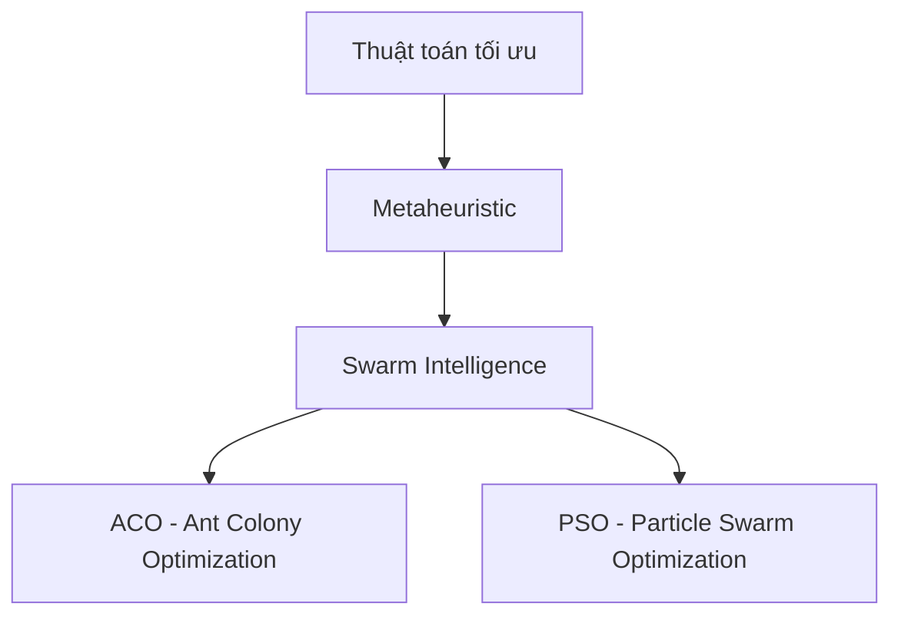
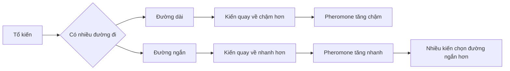
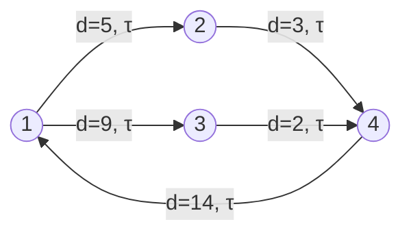
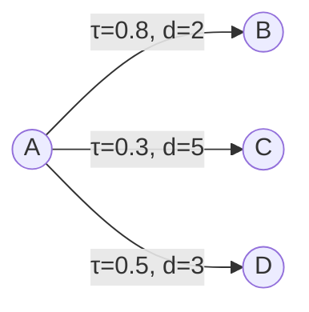
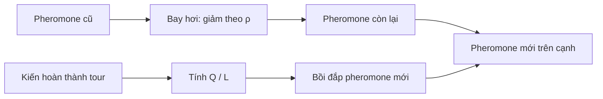
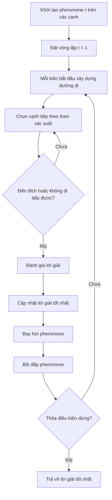
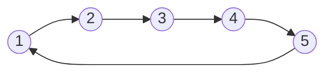
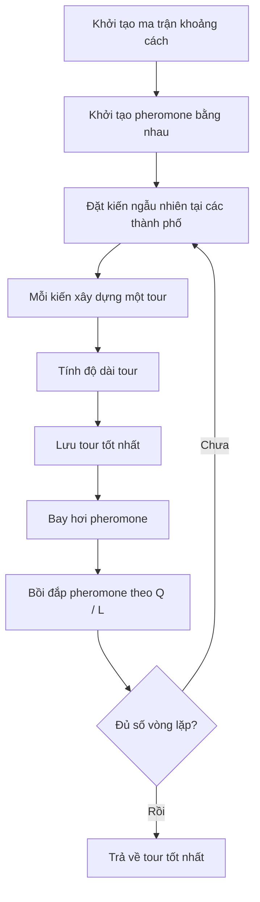

# Chương 9: Tối Ưu Đàn Kiến

## Ant Colony Optimization — ACO

> **Tối ưu đàn kiến (Ant Colony Optimization - ACO)** là một thuật toán tối ưu dựa trên **trí thông minh bầy đàn**, lấy cảm hứng từ cách đàn kiến thật tìm đường đi ngắn nhất từ tổ đến nguồn thức ăn bằng dấu vết **pheromone**. Nội dung chương được hệ thống hóa từ bài giảng Chương 9 về ACO. 

---

## Mục Tiêu Bài Học

Sau chương này, bạn sẽ:

* Hiểu **ACO là gì**, lịch sử ra đời và vị trí của ACO trong nhóm **Swarm Intelligence**.
* Nắm được cơ chế sinh học: **kiến tìm thức ăn, để lại pheromone, pheromone bay hơi**.
* Biết cách chuyển bài toán tối ưu rời rạc thành **đồ thị có trọng số**.
* Hiểu công thức chọn cạnh tiếp theo dựa trên:

  * **pheromone** `τ`
  * **heuristic** `η`
  * tham số `α`, `β`
* Biết cách cập nhật pheromone bằng:

  * **bay hơi**
  * **bồi đắp**
  * **kiến tinh hoa**
* Áp dụng ACO cho các bài toán như **TSP**, định tuyến, lập lịch, logistics.

---

# 1. ACO Là Gì?

**Tối ưu đàn kiến (Ant Colony Optimization - ACO)** là một họ thuật toán **metaheuristic** được giới thiệu bởi **Marco Dorigo** vào đầu những năm 1990.

ACO thuộc nhóm:



ACO đặc biệt phù hợp với các bài toán:

* tối ưu rời rạc
* tối ưu tổ hợp
* tìm đường đi
* bài toán trên đồ thị
* bài toán có lời giải được xây dựng từng bước

Ví dụ điển hình nhất là **TSP — Traveling Salesman Problem**, tức bài toán người du lịch.

---

# 2. Lịch Sử Ra Đời Của ACO

ACO được phát triển từ nghiên cứu tiến sĩ của **Marco Dorigo** tại **Politecnico di Milano** vào đầu thập niên 1990.

Thuật toán đầu tiên trong họ ACO là:

> **Ant System — AS**

Sau đó, nhiều biến thể mạnh hơn được phát triển:

| Biến thể                      | Đặc điểm chính                                                       |
| ----------------------------- | -------------------------------------------------------------------- |
| **AS — Ant System**           | Phiên bản gốc, mọi kiến đều đóng góp pheromone                       |
| **ACS — Ant Colony System**   | Thêm cập nhật cục bộ, thiên về khai thác lời giải tốt                |
| **MMAS — Max-Min Ant System** | Giới hạn pheromone trong khoảng `[τ_min, τ_max]` để tránh hội tụ sớm |
| **Elitist Ant System**        | Tăng trọng số cho lời giải tốt nhất bằng “kiến tinh hoa”             |

---

# 3. Ý Tưởng Sinh Học Của ACO

Trong tự nhiên, kiến gần như không có khả năng quan sát toàn cục. Tuy nhiên, cả đàn vẫn có thể tìm ra đường đi tốt nhờ cơ chế **pheromone**.

Quá trình diễn ra như sau:

1. Ban đầu, kiến đi **ngẫu nhiên** để tìm thức ăn.
2. Khi tìm thấy thức ăn, kiến quay về tổ và để lại **pheromone** trên đường đi.
3. Kiến khác có xu hướng chọn đường có **nồng độ pheromone cao hơn**.
4. Đường ngắn được đi qua nhiều lần hơn trong cùng thời gian.
5. Vì vậy, đường ngắn tích lũy pheromone nhanh hơn.
6. Pheromone cũng **bay hơi dần**, giúp đàn kiến không bị kẹt vào một đường sai quá sớm.



Ý tưởng quan trọng:

> Đường càng tốt thì càng được nhiều kiến đi qua.
> Càng nhiều kiến đi qua thì pheromone càng tăng.
> Pheromone càng tăng thì đường đó càng có khả năng được chọn tiếp.

Đây là cơ chế **phản hồi dương**.

---

# 4. ACO Thuộc Nhóm Thuật Toán Nào?

ACO là thuật toán:

| Thuộc tính                      | Giải thích                                                                  |
| ------------------------------- | --------------------------------------------------------------------------- |
| **Dựa trên quần thể**           | Có nhiều cá thể kiến cùng tìm kiếm                                          |
| **Metaheuristic**               | Không đảm bảo tối ưu tuyệt đối, nhưng tìm lời giải tốt trong không gian lớn |
| **Swarm Intelligence**          | Dựa trên trí thông minh bầy đàn                                             |
| **Tối ưu rời rạc**              | Phù hợp với bài toán tổ hợp, đồ thị, đường đi                               |
| **Xây dựng lời giải từng bước** | Kiến không có lời giải sẵn, mà tạo lời giải bằng cách chọn từng cạnh        |

So với PSO:

| Tiêu chí            | PSO                 | ACO                       |
| ------------------- | ------------------- | ------------------------- |
| Không gian tìm kiếm | Liên tục            | Rời rạc / tổ hợp          |
| Cá thể              | Hạt                 | Kiến                      |
| Thông tin chia sẻ   | `pbest`, `gbest`    | Pheromone                 |
| Dạng lời giải       | Vector số thực      | Đường đi / chuỗi lựa chọn |
| Ứng dụng mạnh       | Tối ưu hàm liên tục | TSP, routing, scheduling  |

---

# 5. Biểu Diễn Bài Toán Bằng Đồ Thị

Để giải một bài toán bằng ACO, ta thường chuyển bài toán về dạng đồ thị:

```text
G = (V, E, w)
```

Trong đó:

| Ký hiệu  | Ý nghĩa                               |
| -------- | ------------------------------------- |
| `V`      | Tập đỉnh                              |
| `E`      | Tập cạnh                              |
| `w(i,j)` | Trọng số / chi phí của cạnh `(i,j)`   |
| `τ(i,j)` | Pheromone trên cạnh `(i,j)`           |
| `η(i,j)` | Độ hấp dẫn heuristic của cạnh `(i,j)` |

Với bài toán TSP:

| Thành phần | Ý nghĩa                          |
| ---------- | -------------------------------- |
| Đỉnh       | Thành phố                        |
| Cạnh       | Đường nối giữa hai thành phố     |
| Trọng số   | Khoảng cách giữa hai thành phố   |
| Kiến       | Tác nhân xây dựng một tour       |
| Tour       | Thứ tự đi qua các thành phố      |
| Mục tiêu   | Tìm tour có tổng độ dài nhỏ nhất |



---

# 6. Quá Trình Xây Dựng Đường Đi Cho Một Con Kiến

Giả sử kiến `k` đang ở nút `u`.

Kiến cần chọn nút tiếp theo `v` trong tập các nút lân cận mà nó chưa đi qua:

```text
v ∈ adjᵏ(u)
```

Xác suất chọn cạnh `(u, v)` được tính bằng:

```text
                 [τ(u,v)]^α · [η(u,v)]^β
pᵏ(u,v) = -----------------------------------------
           Σ [τ(u,w)]^α · [η(u,w)]^β
          w ∈ adjᵏ(u)
```

Trong đó:

| Ký hiệu   | Ý nghĩa                                       |
| --------- | --------------------------------------------- |
| `τ(u,v)`  | Pheromone trên cạnh `(u,v)`                   |
| `η(u,v)`  | Mức độ hấp dẫn của cạnh `(u,v)`               |
| `α`       | Mức độ quan trọng của pheromone               |
| `β`       | Mức độ quan trọng của heuristic               |
| `adjᵏ(u)` | Tập các nút mà kiến `k` có thể đi tiếp từ `u` |

Thông thường:

```text
η(i,j) = 1 / w(i,j)
```

Nghĩa là:

> Cạnh càng ngắn thì `η` càng lớn, càng hấp dẫn.

---

## Ví Dụ Trực Quan

Giả sử kiến đang ở nút `A`, có thể đi đến `B`, `C`, hoặc `D`.



Nhận xét:

| Cạnh    |  Pheromone | Khoảng cách | Khả năng được chọn |
| ------- | ---------: | ----------: | ------------------ |
| `A → B` |        Cao |        Ngắn | Cao nhất           |
| `A → C` |       Thấp |         Dài | Thấp nhất          |
| `A → D` | Trung bình |  Trung bình | Trung bình         |

---

# 7. Vai Trò Của `α` Và `β`

Hai tham số `α` và `β` quyết định kiến sẽ tin vào yếu tố nào nhiều hơn.

| Trường hợp        | Ý nghĩa                                   |
| ----------------- | ----------------------------------------- |
| `α = 0`           | Bỏ qua pheromone, chỉ dựa vào heuristic   |
| `β = 0`           | Bỏ qua heuristic, chỉ dựa vào pheromone   |
| `α` lớn           | Khai thác kinh nghiệm quá khứ mạnh hơn    |
| `β` lớn           | Thiên về chọn cạnh ngắn / chi phí thấp    |
| `α`, `β` cân bằng | Vừa học từ đàn, vừa dùng thông tin cục bộ |

Lưu ý quan trọng:

> Nếu `α` quá lớn, thuật toán dễ bị hội tụ sớm vì kiến quá phụ thuộc vào pheromone cũ.
> Nếu `β` quá lớn, thuật toán trở nên gần giống chiến lược tham lam, chỉ thích cạnh ngắn trước mắt.

---

# 8. Cập Nhật Pheromone

Sau khi các kiến hoàn thành đường đi, pheromone được cập nhật qua hai bước:

## 8.1. Bay Hơi Pheromone

```text
τ(i,j) ← (1 - ρ) · τ(i,j)
```

Trong đó:

| Ký hiệu     | Ý nghĩa                  |
| ----------- | ------------------------ |
| `ρ`         | Tốc độ bay hơi pheromone |
| `0 < ρ ≤ 1` | Điều kiện thường dùng    |

Nếu `ρ` lớn:

* pheromone cũ bị quên nhanh
* tăng khả năng khám phá
* nhưng học chậm hơn

Nếu `ρ` nhỏ:

* pheromone cũ được giữ lâu
* dễ khai thác lời giải tốt
* nhưng dễ hội tụ sớm

---

## 8.2. Bồi Đắp Pheromone

Sau khi bay hơi, kiến bồi đắp pheromone lên các cạnh mà nó đã đi qua:

```text
τ(i,j) ← τ(i,j) + δ(i,j)
```

Trong đó:

```text
δ(i,j) = Σ δᵏ(i,j)
```

Với mỗi kiến `k`:

```text
δᵏ(i,j) = Q / Lᵏ   nếu cạnh (i,j) thuộc tour Tᵏ
δᵏ(i,j) = 0        nếu cạnh (i,j) không thuộc tour Tᵏ
```

| Ký hiệu   | Ý nghĩa                                           |
| --------- | ------------------------------------------------- |
| `Tᵏ`      | Hành trình của kiến `k`                           |
| `Lᵏ`      | Chiều dài hành trình của kiến `k`                 |
| `Q`       | Hằng số kinh nghiệm                               |
| `δᵏ(i,j)` | Lượng pheromone kiến `k` để lại trên cạnh `(i,j)` |

Vì:

```text
δᵏ(i,j) = Q / Lᵏ
```

nên:

> Tour càng ngắn thì `Lᵏ` càng nhỏ, lượng pheromone bồi đắp càng lớn.

---

# 9. Công Thức Cập Nhật Tổng Quát

Kết hợp bay hơi và bồi đắp:

```text
τ(i,j) ← (1 - ρ) · τ(i,j) + δ(i,j)
```

Có thể hiểu như sau:



---

# 10. Thành Phần Kiến Tinh Hoa

Một biến thể thường dùng là thêm **kiến tinh hoa**.

Ý tưởng:

> Các cạnh thuộc lời giải tốt nhất sẽ được thưởng thêm pheromone.

Công thức:

```text
τ(i,j) ← (1 - ρ) · τ(i,j) + δ(i,j) + b · δ_best(i,j)
```

Trong đó:

```text
δ_best(i,j) = Q / L_best   nếu (i,j) thuộc tour tốt nhất
δ_best(i,j) = 0            nếu ngược lại
```

| Ký hiệu  | Ý nghĩa                                     |
| -------- | ------------------------------------------- |
| `b`      | Trọng số kiến tinh hoa                      |
| `L_best` | Độ dài tour tốt nhất                        |
| `δ_best` | Pheromone thưởng thêm cho lời giải tốt nhất |

Cơ chế này giúp thuật toán hội tụ nhanh hơn, nhưng nếu `b` quá lớn thì cũng dễ làm thuật toán kẹt vào lời giải cục bộ.

---

# 11. Giải Thuật ACO Tổng Quát

## Input

```text
Đồ thị G(V, E, w)
Đỉnh nguồn s
Đỉnh đích t
Số lượng kiến N
Các tham số α, β, ρ, Q
Điều kiện dừng
```

## Output

```text
Đường đi tốt nhất từ s đến t
```

## Quy Trình



---

# 12. Pseudocode

```text
Khởi tạo pheromone τ(i,j) cho mọi cạnh (i,j)

best_solution ← rỗng
best_cost ← vô cùng

Trong khi chưa thỏa điều kiện dừng:

    Với mỗi kiến k trong đàn:

        Đặt kiến k tại nút bắt đầu

        Trong khi kiến chưa hoàn thành lời giải:

            Xác định tập cạnh có thể đi tiếp

            Tính xác suất chọn từng cạnh:
                p(u,v) ∝ τ(u,v)^α · η(u,v)^β

            Chọn cạnh tiếp theo bằng roulette wheel

            Di chuyển kiến sang nút mới

        Tính chi phí lời giải của kiến k

        Nếu lời giải tốt hơn best_solution:
            Cập nhật best_solution

    Bay hơi pheromone:
        τ(i,j) ← (1 - ρ) · τ(i,j)

    Bồi đắp pheromone:
        τ(i,j) ← τ(i,j) + Q / Lᵏ
        với các cạnh thuộc hành trình của kiến k

Trả về best_solution
```

---

# 13. ACO Cho Bài Toán TSP

## Phát biểu bài toán TSP

Cho `n` thành phố và khoảng cách giữa các cặp thành phố.

Yêu cầu:

* xuất phát từ một thành phố bất kỳ
* đi qua mỗi thành phố đúng một lần
* quay lại thành phố ban đầu
* tổng quãng đường là nhỏ nhất



Trong ACO:

| Thành phần TSP | Thành phần ACO      |
| -------------- | ------------------- |
| Thành phố      | Đỉnh                |
| Đường nối      | Cạnh                |
| Khoảng cách    | Trọng số            |
| Tour           | Lời giải            |
| Kiến           | Tác nhân xây tour   |
| Pheromone      | Kinh nghiệm tập thể |

---

## Quy Trình ACO Giải TSP



---

# 14. Cài Đặt Python Đơn Giản Cho TSP

```python
import numpy as np

np.random.seed(42)

# 1. Tọa độ các thành phố
cities = np.array([
    [0, 0],
    [2, 4],
    [5, 2],
    [7, 6],
    [1, 7],
    [6, 0],
])

n_cities = len(cities)

# 2. Ma trận khoảng cách
dist = np.zeros((n_cities, n_cities))

for i in range(n_cities):
    for j in range(n_cities):
        dist[i, j] = np.linalg.norm(cities[i] - cities[j])

# 3. Heuristic eta = 1 / distance
with np.errstate(divide="ignore"):
    eta = 1.0 / dist

np.fill_diagonal(eta, 0)

# 4. Tham số ACO
n_ants = 10
n_iterations = 100

alpha = 1.0
beta = 3.0
rho = 0.5
Q = 100.0

tau0 = 1.0
pheromone = np.full((n_cities, n_cities), tau0)


def build_tour(start_city):
    unvisited = set(range(n_cities))
    unvisited.remove(start_city)

    tour = [start_city]
    current = start_city

    while unvisited:
        candidates = list(unvisited)

        weights = np.array([
            (pheromone[current, j] ** alpha) * (eta[current, j] ** beta)
            for j in candidates
        ])

        probs = weights / weights.sum()

        next_city = np.random.choice(candidates, p=probs)

        tour.append(next_city)
        unvisited.remove(next_city)
        current = next_city

    return tour


def tour_length(tour):
    total = 0.0

    for i in range(len(tour)):
        a = tour[i]
        b = tour[(i + 1) % len(tour)]
        total += dist[a, b]

    return total


best_tour = None
best_length = np.inf

for iteration in range(n_iterations):
    all_tours = []
    all_lengths = []

    # Mỗi kiến xây một tour
    for ant in range(n_ants):
        start = np.random.randint(n_cities)

        tour = build_tour(start)
        length = tour_length(tour)

        all_tours.append(tour)
        all_lengths.append(length)

        if length < best_length:
            best_length = length
            best_tour = tour

    # Bay hơi pheromone
    pheromone *= (1 - rho)

    # Bồi đắp pheromone
    for tour, length in zip(all_tours, all_lengths):
        deposit = Q / length

        for i in range(len(tour)):
            a = tour[i]
            b = tour[(i + 1) % len(tour)]

            pheromone[a, b] += deposit
            pheromone[b, a] += deposit

print("Tour tốt nhất:", best_tour)
print("Độ dài tốt nhất:", round(best_length, 4))
```

---

# 15. Giải Thích Code

| Phần code                | Ý nghĩa                                    |
| ------------------------ | ------------------------------------------ |
| `cities`                 | Tọa độ các thành phố                       |
| `dist`                   | Ma trận khoảng cách                        |
| `eta = 1 / dist`         | Heuristic, cạnh càng ngắn càng hấp dẫn     |
| `pheromone`              | Ma trận pheromone                          |
| `build_tour()`           | Một con kiến xây dựng tour                 |
| `tour_length()`          | Tính tổng độ dài tour                      |
| `pheromone *= (1 - rho)` | Bay hơi pheromone                          |
| `deposit = Q / length`   | Tour càng ngắn, pheromone bồi đắp càng lớn |

---

# 16. Các Tham Số Thường Dùng

Trong tài liệu bài giảng, một cấu hình tham số thường được dùng là:

```text
α = 1
β = 5
ρ = 0.5
Q = 100
b = 5
```

Ý nghĩa:

| Tham số   | Vai trò                                        |
| --------- | ---------------------------------------------- |
| `α = 1`   | Pheromone có ảnh hưởng vừa phải                |
| `β = 5`   | Heuristic có ảnh hưởng mạnh, ưu tiên cạnh ngắn |
| `ρ = 0.5` | Mỗi vòng lặp bay hơi 50% pheromone             |
| `Q = 100` | Lượng pheromone bồi đắp cơ sở                  |
| `b = 5`   | Trọng số cho kiến tinh hoa                     |

---

# 17. So Sánh ACO Và GA

| Tiêu chí                | GA                           | ACO                         |
| ----------------------- | ---------------------------- | --------------------------- |
| Cách biểu diễn lời giải | Chromosome / hoán vị         | Đường đi được xây từng bước |
| Cơ chế học              | Lai ghép, đột biến, chọn lọc | Pheromone và heuristic      |
| Tri thức lưu ở đâu?     | Trong cá thể                 | Trên cạnh của đồ thị        |
| Có cha mẹ / con cái?    | Có                           | Không                       |
| Phù hợp mạnh với        | Nhiều dạng tối ưu            | Bài toán đồ thị, đường đi   |
| Rủi ro                  | Mất đa dạng quần thể         | Pheromone hội tụ quá sớm    |

Điểm khác biệt cốt lõi:

> GA tiến hóa một quần thể lời giải hoàn chỉnh.
> ACO tiến hóa một hệ thống pheromone dùng chung để các kiến xây dựng lời giải mới.

---

# 18. Ứng Dụng Thực Tế Của ACO

| Lĩnh vực           | Ví dụ                             |
| ------------------ | --------------------------------- |
| Định tuyến mạng    | Tìm đường truyền dữ liệu tối ưu   |
| Logistics          | Tối ưu tuyến giao hàng            |
| TSP / VRP          | Người du lịch, nhiều xe giao hàng |
| Lập lịch           | Lập lịch sản xuất, thời khóa biểu |
| Robot              | Tìm đường cho robot di chuyển     |
| Quản lý tài nguyên | Phân bổ tài nguyên trong hệ thống |
| Khai phá dữ liệu   | Chọn đặc trưng, phân cụm          |
| Chuỗi cung ứng     | Tối ưu vận chuyển và phân phối    |

---

# 19. Ưu Điểm Và Hạn Chế

## Ưu điểm

* Phù hợp với bài toán tối ưu tổ hợp.
* Dễ hiểu, dễ mô phỏng.
* Có khả năng tìm lời giải tốt trong không gian rất lớn.
* Cơ chế pheromone giúp tận dụng kinh nghiệm tập thể.
* Có thể kết hợp với heuristic cục bộ.

## Hạn chế

* Cần hiệu chỉnh tham số cẩn thận.
* Có thể hội tụ sớm nếu pheromone quá mạnh.
* Tốn thời gian nếu số lượng kiến, số vòng lặp hoặc kích thước đồ thị lớn.
* Không đảm bảo tìm được nghiệm tối ưu tuyệt đối.

---

# 20. Điều Cần Ghi Nhớ

* **ACO** là thuật toán tối ưu lấy cảm hứng từ hành vi tìm thức ăn của đàn kiến.
* ACO thuộc nhóm **Swarm Intelligence** và là thuật toán **dựa trên quần thể**.
* Kiến xây dựng lời giải bằng cách chọn từng cạnh trên đồ thị.
* Mỗi cạnh có:

  * `τ(i,j)` — pheromone
  * `η(i,j)` — heuristic
* Xác suất chọn cạnh:

```text
p(i,j) ∝ τ(i,j)^α · η(i,j)^β
```

* Cập nhật pheromone gồm:

```text
Bay hơi:   τ(i,j) ← (1 - ρ) · τ(i,j)

Bồi đắp:  τ(i,j) ← τ(i,j) + Q / L
```

* `α` điều khiển ảnh hưởng của pheromone.
* `β` điều khiển ảnh hưởng của heuristic.
* `ρ` điều khiển tốc độ bay hơi.
* `Q` điều khiển lượng pheromone bồi đắp.
* ACO phù hợp nhất với bài toán tối ưu rời rạc như **TSP, routing, scheduling, logistics**.

---

# Tóm Tắt Chương

Trong chương này, bạn đã học về **Tối ưu đàn kiến — ACO**, một thuật toán trí thông minh bầy đàn mô phỏng cách kiến thật tìm đường đi ngắn nhất nhờ pheromone.

ACO hoạt động bằng cách cho nhiều kiến cùng xây dựng lời giải trên đồ thị. Mỗi kiến chọn đường đi dựa trên sự kết hợp giữa **pheromone quá khứ** và **heuristic hiện tại**. Sau mỗi vòng lặp, pheromone được cập nhật để tăng cường các cạnh thuộc lời giải tốt và giảm dần các cạnh ít hiệu quả thông qua cơ chế bay hơi.

ACO đặc biệt mạnh với các bài toán tối ưu tổ hợp như **TSP**, định tuyến mạng, lập lịch và logistics. Đây là một trong những thuật toán tiêu biểu nhất của nhóm **Swarm Intelligence**, bên cạnh PSO đã học ở chương trước.
