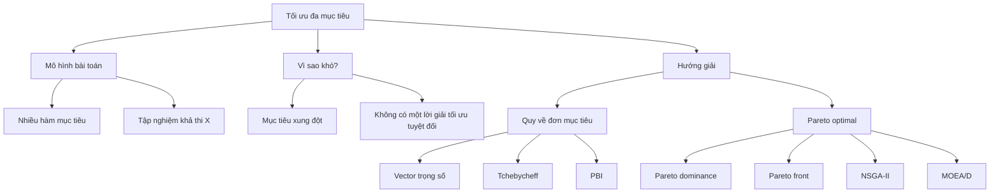
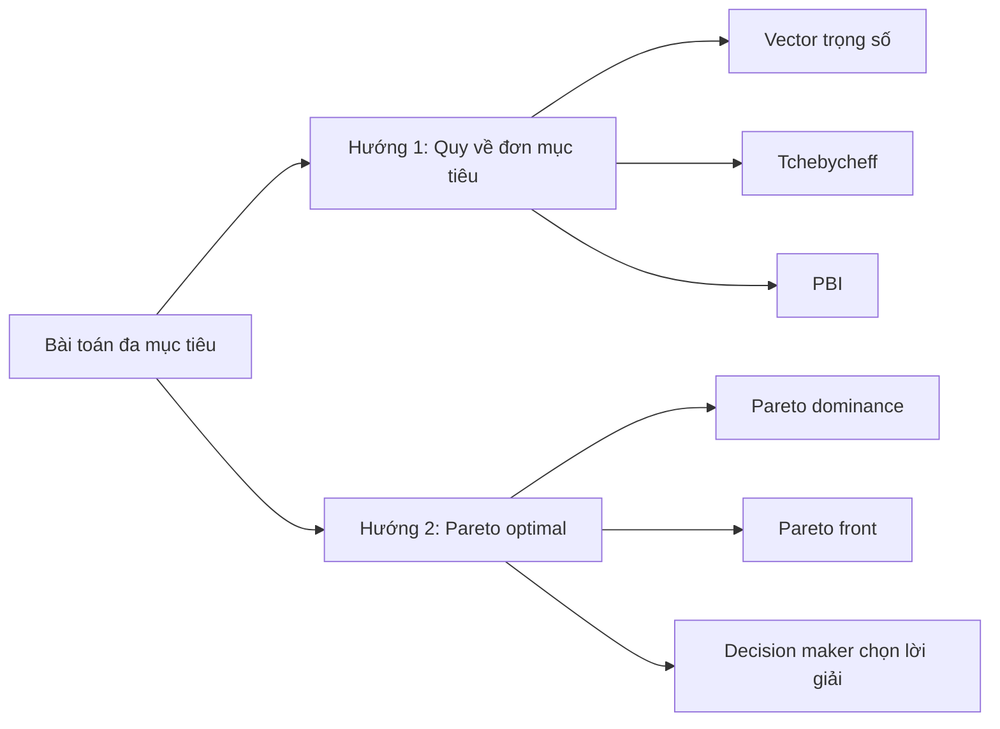
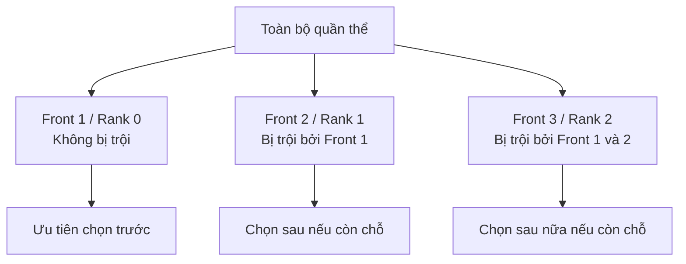
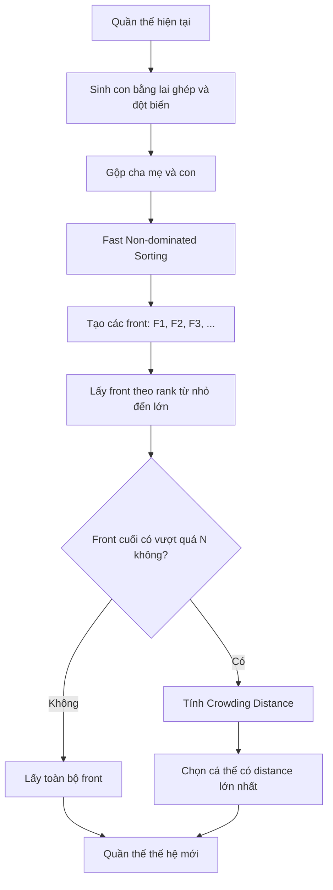
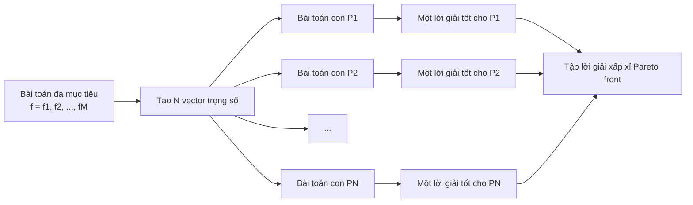

# Chương 10: Tối Ưu Đa Mục Tiêu

> Nội dung được hệ thống hóa từ ghi chú và slide Chương 10 bạn cung cấp.  

---

## Mục tiêu bài học

Sau chương này, bạn sẽ:

* Hiểu bài toán **tối ưu đa mục tiêu** là gì.
* Biết cách mô hình hóa bài toán có nhiều hàm mục tiêu.
* Hiểu vì sao các mục tiêu thường **xung đột** với nhau.
* Nắm được hai hướng giải chính:

  * Quy về bài toán **đơn mục tiêu**.
  * Dựa trên **Pareto optimal**.
* Hiểu các khái niệm:

  * **Pareto dominance**
  * **Pareto optimal**
  * **Pareto front**
  * **Non-dominated Rank**
  * **Crowding Distance**
* Nắm được ý tưởng chính của hai thuật toán:

  * **NSGA-II**
  * **MOEA/D**

---

## Sơ đồ tổng quan chương



---

# 1. Bài toán tối ưu đa mục tiêu

## 1.1. Khái niệm

**Tối ưu đa mục tiêu** là bài toán yêu cầu tối ưu đồng thời **hai hoặc nhiều hàm mục tiêu**.

Ví dụ:

* Tối đa lợi nhuận và tối thiểu rủi ro.
* Tối đa phạm vi phủ sóng và tối thiểu chi phí.
* Tối thiểu thời gian xử lý và tối thiểu tài nguyên sử dụng.

Trong thực tế, các mục tiêu này thường không thể tối ưu hoàn hảo cùng lúc.

---

## 1.2. Mô hình toán học

Giả sử tất cả mục tiêu đều được đưa về dạng **cực tiểu hóa**, bài toán có dạng:

[
\text{Minimize } f(x) = {f_1(x), f_2(x), ..., f_k(x)}
]

Với ràng buộc:

[
x \in X
]

Trong đó:

| Ký hiệu  | Ý nghĩa                           |
| -------- | --------------------------------- |
| (x)      | Một lời giải ứng viên             |
| (X)      | Tập nghiệm khả thi                |
| (f_i(x)) | Hàm mục tiêu thứ (i)              |
| (k)      | Số lượng hàm mục tiêu             |
| (f(x))   | Vector gồm nhiều giá trị mục tiêu |

---

## 1.3. Lưu ý về cực đại hóa và cực tiểu hóa

Nếu bài toán có mục tiêu **cực đại hóa**, ta có thể đổi về cực tiểu hóa bằng cách nhân với (-1).

Ví dụ:

[
\text{Maximize } profit(x)
]

có thể đổi thành:

[
\text{Minimize } -profit(x)
]

Nhờ vậy, khi phân tích thuật toán, ta thường giả sử tất cả mục tiêu đều là **minimize**.

---

# 2. Ví dụ bài toán tối ưu đa mục tiêu

## 2.1. Xây dựng hệ thống mạng

| Mục tiêu   | Diễn giải                    |
| ---------- | ---------------------------- |
| Mục tiêu 1 | Tối đa phạm vi phủ sóng      |
| Mục tiêu 2 | Tối thiểu chi phí triển khai |

Hai mục tiêu này thường xung đột nhau:

* Muốn phủ sóng rộng hơn thì cần nhiều thiết bị hơn.
* Nhiều thiết bị hơn dẫn đến chi phí cao hơn.

---

## 2.2. Lập kế hoạch đầu tư

| Mục tiêu   | Diễn giải        |
| ---------- | ---------------- |
| Mục tiêu 1 | Tối đa lợi nhuận |
| Mục tiêu 2 | Tối thiểu rủi ro |

Thông thường:

* Lợi nhuận cao thường đi kèm rủi ro cao.
* Rủi ro thấp thường cho lợi nhuận thấp hơn.

---

# 3. Vì sao không có một lời giải tối ưu cho tất cả mục tiêu?

Trong bài toán đơn mục tiêu, ta thường tìm một lời giải tốt nhất.

Nhưng trong bài toán đa mục tiêu, các hàm mục tiêu thường **xung đột** nhau.

Điều này có nghĩa là:

> Cải thiện một mục tiêu có thể làm xấu đi mục tiêu khác.

---

## 3.1. Ví dụ xung đột giữa hai hàm mục tiêu

Xét bài toán cực tiểu hóa hai hàm:

[
f_1(x) = x^2
]

[
f_2(x) = 9 - x
]

với:

[
x \in \mathbb{R}
]

So sánh hai giá trị (x = 3) và (x = 5):

| Giá trị (x) | (f_1(x) = x^2) | (f_2(x) = 9 - x) |
| ----------: | -------------: | ---------------: |
|     (x = 3) |            (9) |              (6) |
|     (x = 5) |           (25) |              (4) |

Nhận xét:

* (x = 3) tốt hơn cho (f_1), vì (9 < 25).
* (x = 5) tốt hơn cho (f_2), vì (4 < 6).
* Không thể nói tuyệt đối (x = 3) hay (x = 5) tốt hơn nếu không biết ta ưu tiên mục tiêu nào.

---

## 3.2. Ý nghĩa

Trong tối ưu đa mục tiêu, thay vì tìm một lời giải duy nhất, ta thường tìm một **tập lời giải cân bằng** giữa các mục tiêu.

Tập lời giải này gọi là:

> **Tập nghiệm Pareto** hoặc **biên Pareto**.

---

# 4. Hai hướng tiếp cận giải bài toán đa mục tiêu

Có hai hướng tiếp cận chính:



---

# 5. Hướng tiếp cận 1: Quy về bài toán đơn mục tiêu

## 5.1. Ý tưởng

Ta biến nhiều hàm mục tiêu thành một hàm mục tiêu duy nhất.

Sau đó, ta có thể dùng các thuật toán tối ưu đơn mục tiêu đã học như:

* GA
* ES
* DE
* PSO
* ACO

---

## 5.2. Một số phương pháp quy về đơn mục tiêu

| Phương pháp     | Ý tưởng chính                                       |
| --------------- | --------------------------------------------------- |
| Vector trọng số | Cộng các mục tiêu theo trọng số                     |
| Tchebycheff     | Tối thiểu hóa độ lệch lớn nhất so với điểm lý tưởng |
| PBI             | Penalty-based Boundary Intersection                 |

---

# 6. Vector trọng số

## 6.1. Nguyên lý

Ta định nghĩa vector trọng số:

[
\lambda = (\lambda_1, \lambda_2, ..., \lambda_d)
]

sao cho:

[
\lambda_1 + \lambda_2 + ... + \lambda_d = 1
]

Trong đó:

* (\lambda_i \geq 0)
* Trọng số càng lớn thì mục tiêu tương ứng càng được ưu tiên.

---

## 6.2. Công thức mục tiêu mới

Với (d) hàm mục tiêu, ta xây dựng hàm đơn mục tiêu:

[
g(X|\lambda) = \lambda_1 f_1(X) + \lambda_2 f_2(X) + ... + \lambda_d f_d(X)
]

Hay viết gọn:

[
g(X|\lambda) = \sum_{i=1}^{d} \lambda_i f_i(X)
]

---

## 6.3. Ví dụ

Giả sử có hai mục tiêu:

[
f = (f_1, f_2)
]

Chọn vector trọng số:

[
\lambda = (0.3, 0.7)
]

Khi đó mục tiêu mới là:

[
f' = 0.3 f_1 + 0.7 f_2
]

Ý nghĩa:

* (f_1) chiếm 30% mức độ ưu tiên.
* (f_2) chiếm 70% mức độ ưu tiên.
* Thuật toán sẽ ưu tiên tối ưu (f_2) nhiều hơn.

---

## 6.4. Ưu điểm và hạn chế

| Ưu điểm                             | Hạn chế                                     |
| ----------------------------------- | ------------------------------------------- |
| Dễ hiểu, dễ cài đặt                 | Cần chọn trọng số trước                     |
| Có thể dùng thuật toán đơn mục tiêu | Mỗi bộ trọng số thường chỉ cho một lời giải |
| Tính toán đơn giản                  | Có thể bỏ sót vùng Pareto không lồi         |

---

# 7. Tchebycheff

## 7.1. Nguyên lý

Phương pháp Tchebycheff cũng dùng vector trọng số:

[
\lambda = (\lambda_1, \lambda_2, ..., \lambda_d)
]

Nhưng thay vì cộng tuyến tính các mục tiêu, nó đo độ lệch lớn nhất so với một điểm tham chiếu lý tưởng.

---

## 7.2. Điểm tham chiếu lý tưởng

Định nghĩa điểm tham chiếu:

[
Z^* = (Z_1^*, Z_2^*, ..., Z_d^*)
]

Trong đó:

[
Z_i^* = \min {f_i(X)}
]

Nghĩa là (Z_i^*) là giá trị tốt nhất tìm được cho mục tiêu thứ (i).

---

## 7.3. Công thức Tchebycheff

Mục tiêu mới là:

[
g(X|\lambda, Z^*) =
\max_{1 \leq i \leq d}
\left{
\lambda_i \left(f_i(X) - Z_i^*\right)
\right}
]

Thuật toán sẽ cực tiểu hóa:

[
g(X|\lambda, Z^*)
]

---

## 7.4. Ý nghĩa trực quan

Phương pháp Tchebycheff cố gắng làm cho lời giải không quá tệ ở bất kỳ mục tiêu nào.

Thay vì hỏi:

> Tổng điểm có tốt không?

Tchebycheff hỏi:

> Mục tiêu tệ nhất đang lệch bao xa so với điểm lý tưởng?

---

# 8. Hướng tiếp cận 2: Pareto optimal

## 8.1. Ý tưởng

Thay vì ép nhiều mục tiêu thành một mục tiêu duy nhất, ta giữ nguyên bản chất đa mục tiêu của bài toán.

Ta so sánh các lời giải bằng khái niệm:

> **Tính trội Pareto — Pareto dominance**

---

# 9. Pareto dominance

## 9.1. Định nghĩa

Trong bài toán cực tiểu hóa, lời giải (x_1) được gọi là **trội hơn** lời giải (x_2) nếu thỏa mãn cả hai điều kiện:

1. (x_1) không tệ hơn (x_2) ở mọi mục tiêu.
2. (x_1) tốt hơn (x_2) ở ít nhất một mục tiêu.

Ký hiệu:

[
x_1 \prec x_2
]

Nghĩa là:

[
\forall i, f_i(x_1) \leq f_i(x_2)
]

và:

[
\exists j, f_j(x_1) < f_j(x_2)
]

---

## 9.2. Ví dụ

Giả sử có hai lời giải (A) và (B) trong bài toán cực tiểu hóa:

| Lời giải | (f_1) | (f_2) |
| -------- | ----: | ----: |
| (A)      |     3 |     5 |
| (B)      |     4 |     7 |

Ta thấy:

[
f_1(A) < f_1(B)
]

[
f_2(A) < f_2(B)
]

Vậy:

[
A \prec B
]

Nghĩa là (A) trội hơn (B).

---

## 9.3. Trường hợp không ai trội ai

| Lời giải | (f_1) | (f_2) |
| -------- | ----: | ----: |
| (A)      |     3 |     8 |
| (B)      |     5 |     4 |

So sánh:

* (A) tốt hơn ở (f_1).
* (B) tốt hơn ở (f_2).

Vậy không lời giải nào trội hơn lời giải còn lại.

Đây chính là tình huống đánh đổi phổ biến trong tối ưu đa mục tiêu.

---

# 10. Pareto optimal và Pareto front

## 10.1. Pareto optimal

Một lời giải (x^* \in X) được gọi là **Pareto optimal** nếu:

> Không tồn tại lời giải nào khác trong (X) trội hơn (x^*).

Nói cách khác, muốn cải thiện một mục tiêu của (x^*), ta bắt buộc phải làm xấu đi ít nhất một mục tiêu khác.

---

## 10.2. Pareto front

**Pareto front** là tập hợp tất cả các lời giải Pareto optimal trong không gian mục tiêu.


---

## 10.3. Minh họa trực quan

Giả sử ta cực tiểu hóa cả (f_1) và (f_2):

```text
f2
↑
|      o  Bị trội
|   o
|        o
| o
|    ●────●────●────●   Pareto front
|________________________→ f1
```

Các điểm trên **Pareto front** là những lời giải không bị lời giải nào khác trội hơn.

---

# 11. Các thuật toán tiến hóa Pareto điển hình

Một số thuật toán tiến hóa đa mục tiêu phổ biến:

| Thuật toán | Tên đầy đủ                                                    | Ý tưởng chính                                |
| ---------- | ------------------------------------------------------------- | -------------------------------------------- |
| NSGA-II    | Non-dominated Sorting Genetic Algorithm II                    | Sắp xếp không trội + crowding distance       |
| SPEA2      | Strength Pareto Evolutionary Algorithm 2                      | Dùng archive và strength fitness             |
| MOEA/D     | Multi-objective Evolutionary Algorithm based on Decomposition | Phân hoạch thành nhiều bài toán đơn mục tiêu |

---

# 12. GA đơn mục tiêu và GA đa mục tiêu

## 12.1. Điểm giống nhau

| Thành phần      | GA đơn mục tiêu | GA đa mục tiêu |
| --------------- | --------------- | -------------- |
| Mã hóa cá thể   | Có              | Có             |
| Đánh giá cá thể | Có              | Có             |
| Lai ghép        | Có              | Có             |
| Đột biến        | Có              | Có             |
| Quần thể        | Có              | Có             |

---

## 12.2. Điểm khác nhau

| Bước           | GA đơn mục tiêu            | GA đa mục tiêu            |
| -------------- | -------------------------- | ------------------------- |
| Đánh giá       | Một giá trị fitness        | Nhiều giá trị mục tiêu    |
| So sánh cá thể | Dựa trên fitness đơn       | Dựa trên Pareto dominance |
| Chọn lọc       | Chọn cá thể có fitness tốt | Chọn theo rank và đa dạng |
| Kết quả        | Một lời giải tốt nhất      | Một tập lời giải Pareto   |

---

# 13. NSGA và NSGA-II

## 13.1. NSGA là gì?

**NSGA — Non-dominated Sorting Genetic Algorithm** là giải thuật di truyền áp dụng cơ chế **sắp xếp không trội** cho bài toán đa mục tiêu.

Khác biệt chính so với GA truyền thống nằm ở bước:

> Sắp xếp và chọn lọc cá thể.

---

## 13.2. NSGA-II là gì?

**NSGA-II** là phiên bản cải tiến của NSGA.

NSGA-II cải thiện hai điểm chính:

* Giảm độ phức tạp tính toán.
* Duy trì độ đa dạng tốt hơn trong quần thể.

---

# 14. Chọn lọc trong NSGA-II

NSGA-II giải quyết ba câu hỏi chính:

| Câu hỏi                     | Cách giải trong NSGA-II |
| --------------------------- | ----------------------- |
| So sánh hai cá thể thế nào? | Dùng Pareto dominance   |
| Xếp hạng cá thể thế nào?    | Dùng Non-dominated Rank |
| Giữ đa dạng thế nào?        | Dùng Crowding Distance  |

---

# 15. Non-dominated Rank

## 15.1. Ý tưởng

Quần thể được phân lớp thành nhiều **biên Pareto**.

* Biên thứ nhất: rank = 0
* Biên thứ hai: rank = 1
* Biên thứ ba: rank = 2
* …

Rank càng nhỏ thì cá thể càng tốt.

---

## 15.2. Cách phân lớp

### Biên Pareto thứ nhất — rank = 0

Gồm các cá thể không bị bất kỳ cá thể nào khác trội.

### Biên Pareto thứ hai — rank = 1

Gồm các cá thể chỉ bị trội bởi các cá thể ở rank = 0.

### Biên tiếp theo

Tiếp tục tương tự.



---

# 16. Fast Non-dominated Sorting

## 16.1. Thuật toán ngây thơ

Với:

* (N): số cá thể
* (M): số mục tiêu

Độ phức tạp:

| Công việc                            | Độ phức tạp |
| ------------------------------------ | ----------- |
| Kiểm tra một cá thể có bị trội không | (O(MN))     |
| Tìm biên Pareto đầu tiên             | (O(MN^2))   |
| Phân lớp toàn bộ quần thể            | (O(MN^3))   |

Thuật toán ngây thơ khá chậm khi quần thể lớn.

---

## 16.2. Fast Non-dominated Sorting

NSGA-II dùng thuật toán nhanh hơn bằng cách lưu lại kết quả so sánh.

Với mỗi cá thể (p), lưu hai thông tin:

| Ký hiệu | Ý nghĩa                       |
| ------- | ----------------------------- |
| (n_p)   | Số cá thể trội hơn cá thể (p) |
| (S_p)   | Tập các cá thể bị (p) trội    |

Quy trình:

1. So sánh từng cặp cá thể.
2. Tính (n_p) và (S_p) cho mỗi cá thể.
3. Cá thể nào có (n_p = 0) được đưa vào front đầu tiên.
4. Loại front đầu tiên ra khỏi quá trình xét.
5. Cập nhật (n_p) cho các cá thể còn lại.
6. Lặp lại để tìm các front tiếp theo.

Độ phức tạp:

[
O(MN^2)
]

---

# 17. Vấn đề khi chọn theo Non-dominated Rank

Giả sử cần chọn (N) cá thể cho thế hệ tiếp theo.

Ta lấy lần lượt:

1. Toàn bộ rank 0.
2. Toàn bộ rank 1.
3. Toàn bộ rank 2.
4. …

Nhưng có thể xảy ra tình huống:

* Nếu không lấy front cuối thì thiếu cá thể.
* Nếu lấy toàn bộ front cuối thì vượt quá số lượng cần chọn.

Ví dụ:

```text
Cần chọn: 10 cá thể

Rank 0: 4 cá thể → lấy hết, còn thiếu 6
Rank 1: 4 cá thể → lấy hết, còn thiếu 2
Rank 2: 5 cá thể → nếu lấy hết thì vượt quá 10
```

Vậy trong rank 2, ta chỉ được chọn 2 cá thể tốt nhất.

Câu hỏi là:

> Chọn 2 cá thể nào?

Câu trả lời là:

> Dùng Crowding Distance.

---

# 18. Crowding Distance

## 18.1. Khái niệm

**Crowding Distance** là độ đo đánh giá mức độ “đông đúc” xung quanh một cá thể trong không gian mục tiêu.

Ý tưởng:

* Cá thể nằm ở vùng thưa nên được ưu tiên giữ lại.
* Cá thể nằm ở vùng quá đông có thể bị loại bớt.
* Điều này giúp quần thể phủ đều trên Pareto front.

---

## 18.2. Ý nghĩa

| Crowding Distance | Ý nghĩa                                          |
| ----------------- | ------------------------------------------------ |
| Lớn               | Cá thể nằm ở vùng thưa, nên giữ lại              |
| Nhỏ               | Cá thể nằm ở vùng đông, có nhiều cá thể tương tự |
| (\infty)          | Cá thể ở biên, luôn được ưu tiên giữ lại         |

---

## 18.3. Công thức tính

Với mỗi mục tiêu (m):

1. Sắp xếp các cá thể theo giá trị (f_m).
2. Cá thể có giá trị nhỏ nhất và lớn nhất được gán:

[
distance[i] = \infty
]

3. Với các cá thể còn lại:

[
distance[i] =
distance[i] +
\frac{
f_m(i+1) - f_m(i-1)
}{
f_m^{max} - f_m^{min}
}
]

Tổng qua tất cả mục tiêu:

[
CD(i) =
\sum_{m=1}^{M}
\frac{
f_m(i+1) - f_m(i-1)
}{
f_m^{max} - f_m^{min}
}
]

---

# 19. Quy trình chọn lọc trong NSGA-II



---

## 19.1. Các bước cụ thể

### Bước 1

Phân lớp quần thể thành các biên Pareto bằng **Non-dominated Rank**.

### Bước 2

Lấy lần lượt các cá thể theo rank từ nhỏ đến lớn.

### Bước 3

Nếu front cuối bị lẻ, tính **Crowding Distance** cho front đó.

### Bước 4

Chọn các cá thể có Crowding Distance lớn nhất cho đến khi đủ (N) cá thể.

---

# 20. Mã giả NSGA-II

```text
Khởi tạo quần thể P

Lặp cho đến khi thỏa mãn điều kiện dừng:

    1. Đánh giá các hàm mục tiêu cho từng cá thể

    2. Sinh quần thể con Q bằng:
       - Chọn lọc
       - Lai ghép
       - Đột biến

    3. Gộp quần thể:
       R = P ∪ Q

    4. Phân lớp R bằng Fast Non-dominated Sorting:
       F1, F2, F3, ...

    5. Tạo quần thể mới P_new = rỗng

    6. Lấy lần lượt các front tốt nhất:
       Nếu thêm toàn bộ front không vượt quá N:
           Thêm front đó vào P_new
       Ngược lại:
           Tính Crowding Distance
           Sắp xếp giảm dần theo Crowding Distance
           Chọn vừa đủ cá thể còn thiếu

    7. Cập nhật:
       P = P_new

Trả về front tốt nhất F1
```

---

# 21. Đánh giá NSGA-II

## 21.1. Ưu điểm

* Cấu trúc gần giống GA truyền thống.
* Dễ hiểu, dễ triển khai.
* Tốc độ nhanh hơn NSGA.
* Kết quả tốt với nhiều bài toán đa mục tiêu.
* Duy trì đa dạng tốt nhờ Crowding Distance.

---

## 21.2. Nhược điểm

* Có thể kém hiệu quả với một số bài toán có miền xác định phức tạp.
* Khi số mục tiêu quá lớn, Pareto dominance có thể mất khả năng phân biệt tốt.
* Cần thiết kế toán tử lai ghép, đột biến phù hợp với bài toán.

---

# 22. MOEA/D: Thuật toán tiến hóa đa mục tiêu dựa trên phân hoạch

## 22.1. Ý tưởng chính

**MOEA/D** là viết tắt của:

> Multi-Objective Evolutionary Algorithm based on Decomposition

Ý tưởng:

> Phân rã bài toán đa mục tiêu thành nhiều bài toán đơn mục tiêu con, sau đó giải đồng thời các bài toán con này.

---

## 22.2. Phân hoạch

Giả sử bài toán gốc có hai mục tiêu:

[
f = (f_1, f_2)
]

Ta tạo nhiều bài toán con bằng các vector trọng số khác nhau:

[
g_1 = 0.1f_1 + 0.9f_2
]

[
g_2 = 0.2f_1 + 0.8f_2
]

[
g_3 = 0.3f_1 + 0.7f_2
]

[
...
]

[
g_9 = 0.9f_1 + 0.1f_2
]

Mỗi bài toán con sẽ ưu tiên một vùng khác nhau trên Pareto front.

---

## 22.3. Sơ đồ phân hoạch



---

# 23. Hàng xóm trong MOEA/D

## 23.1. Khái niệm

Trong MOEA/D, mỗi bài toán con có một vector trọng số.

Hai bài toán con được xem là gần nhau nếu vector trọng số của chúng gần nhau.

Khoảng cách thường dùng:

[
d(\lambda_i, \lambda_j)
=======================

\sqrt{
\sum_{m=1}^{M}
(\lambda_{im} - \lambda_{jm})^2
}
]

Đây là khoảng cách Euclid giữa hai vector trọng số.

---

## 23.2. Định nghĩa hàng xóm

“Hàng xóm” của bài toán con (i) là (T) bài toán con gần nó nhất trong tổng số (N) bài toán con.

Ký hiệu:

[
B_i = {b_1, b_2, ..., b_T}
]

Trong đó:

* (T) là số lượng hàng xóm.
* (1 \leq T \leq N).
* (B_i) bao gồm cả chính bài toán con (i).

---

## 23.3. Ví dụ

Giả sử:

[
T = 3
]

Mỗi bài toán con có 3 hàng xóm.

Với bài toán con số 2, ba bài toán gần nhất là:

[
1, 2, 3
]

Do đó:

[
B_2 = {1, 2, 3}
]

---

# 24. Cấu trúc thuật toán MOEA/D

MOEA/D gồm ba phần chính:

1. Khởi tạo.
2. Tiến hóa theo thế hệ.
3. Kiểm tra điều kiện dừng.

---

## 24.1. Đầu vào của MOEA/D

| Thành phần          | Ý nghĩa                                               |
| ------------------- | ----------------------------------------------------- |
| (N) vector trọng số | Tạo (N) bài toán con                                  |
| (T)                 | Số hàng xóm của mỗi bài toán con                      |
| Quần thể            | (N) lời giải, mỗi lời giải ứng với một bài toán con   |
| (Z^*)               | Điểm tham chiếu dùng cho Tchebycheff                  |
| EP                  | External Population, lưu các lời giải Pareto tìm được |

---

# 25. Khởi tạo MOEA/D

Các bước khởi tạo:

## Bước 1.1

Khởi tạo quần thể ngoài:

[
EP = \emptyset
]

## Bước 1.2

Xây dựng tập hàng xóm cho từng bài toán con:

[
B_i = {b_1, b_2, ..., b_T}
]

Dựa trên khoảng cách giữa các vector trọng số.

## Bước 1.3

Khởi tạo ngẫu nhiên quần thể:

[
{x_1, x_2, ..., x_N}
]

## Bước 1.4

Khởi tạo điểm tham chiếu:

[
Z^* = (Z_1^*, Z_2^*, ..., Z_M^*)
]

Trong đó:

[
Z_p^* = \min {f_p(x_i)}
]

---

# 26. Tiến hóa theo thế hệ trong MOEA/D

Với mỗi bài toán con (P_i), thực hiện các bước sau.

---

## Bước 2.1. Tạo lời giải mới

Chọn ngẫu nhiên hai lời giải hàng xóm:

[
x_k, x_l
]

với:

[
k, l \in B_i
]

Sau đó:

* Lai ghép:

[
x_k \oplus x_l \rightarrow y
]

* Đột biến:

[
y \rightarrow y'
]

---

## Bước 2.2. Sửa chữa hoặc cải thiện lời giải

Nếu (y') không hợp lệ:

* Sửa chữa để biến thành lời giải hợp lệ.
* Hoặc loại bỏ nếu không thể sửa.

Có thể cải thiện (y') bằng tìm kiếm cục bộ nếu bài toán cho phép.

---

## Bước 2.3. Cập nhật điểm tham chiếu

Với mỗi mục tiêu (p):

[
Z_p^* = \min(Z_p^*, f_p(y'))
]

---

## Bước 2.4. Cập nhật các hàng xóm

Với mọi bài toán con (b \in B_i):

Nếu lời giải mới (y') tốt hơn lời giải hiện tại (x_b) theo hàm đánh giá Tchebycheff:

[
g(y'|\lambda_b, Z^*) \leq g(x_b|\lambda_b, Z^*)
]

thì thay:

[
x_b = y'
]

---

## Bước 2.5. Cập nhật EP

Cập nhật quần thể ngoài (EP):

1. Loại bỏ mọi lời giải trong (EP) bị (y') trội.
2. Nếu (y') không bị lời giải nào trong (EP) trội, thêm (y') vào (EP).

---

# 27. Điều kiện dừng của MOEA/D

Thuật toán dừng khi thỏa mãn một trong các điều kiện:

* Đạt số thế hệ tối đa.
* Đạt số lần đánh giá hàm mục tiêu tối đa.
* (EP) không được cải thiện sau nhiều thế hệ.
* Thời gian chạy vượt giới hạn.
* Kết quả đã đủ tốt theo tiêu chí đặt trước.

---

# 28. Đầu ra của MOEA/D

Đầu ra thường là:

[
EP
]

Trong đó (EP) là tập các lời giải không bị trội tìm được trong quá trình tiến hóa.

Có thể xem (EP) là biên Pareto xấp xỉ.

---

# 29. Đánh giá MOEA/D

## 29.1. Ưu điểm

* Tốc độ nhanh.
* Độ phức tạp tương đương GA thông thường.
* Hiệu quả với nhiều bài toán có miền xác định phức tạp.
* Dễ kết hợp với tìm kiếm cục bộ.
* Phù hợp với hướng **memetic computing**.

---

## 29.2. Nhược điểm

* Phụ thuộc nhiều vào cách chọn vector trọng số.
* Nếu vector trọng số phân bố không tốt, Pareto front thu được có thể không đều.
* Việc chọn số hàng xóm (T) ảnh hưởng lớn đến hiệu quả thuật toán.
* Cần chọn hàm phân hoạch phù hợp như weighted sum, Tchebycheff hoặc PBI.

---

# 30. So sánh NSGA-II và MOEA/D

| Tiêu chí        | NSGA-II                                | MOEA/D                                |
| --------------- | -------------------------------------- | ------------------------------------- |
| Ý tưởng chính   | Sắp xếp không trội                     | Phân hoạch bài toán                   |
| Cách chọn lọc   | Non-dominated Rank + Crowding Distance | Cập nhật lời giải theo bài toán con   |
| Duy trì đa dạng | Crowding Distance                      | Vector trọng số                       |
| Đầu ra          | Pareto front xấp xỉ                    | Pareto front xấp xỉ                   |
| Ưu điểm         | Dễ hiểu, gần GA truyền thống           | Nhanh, hiệu quả với bài toán phức tạp |
| Nhược điểm      | Có thể kém khi số mục tiêu lớn         | Phụ thuộc mạnh vào vector trọng số    |

---

# 31. Tóm tắt chương

## 31.1. Các khái niệm quan trọng

| Khái niệm          | Ý nghĩa                                   |
| ------------------ | ----------------------------------------- |
| Tối ưu đa mục tiêu | Tối ưu nhiều mục tiêu cùng lúc            |
| Pareto dominance   | Cách so sánh hai lời giải đa mục tiêu     |
| Pareto optimal     | Lời giải không bị lời giải nào khác trội  |
| Pareto front       | Tập các lời giải Pareto optimal           |
| Non-dominated Rank | Rank của front chứa cá thể                |
| Crowding Distance  | Độ đo giúp duy trì đa dạng                |
| NSGA-II            | Thuật toán dùng rank và crowding distance |
| MOEA/D             | Thuật toán phân hoạch thành bài toán con  |

---

## 31.2. Ghi nhớ nhanh

```text
Tối ưu đơn mục tiêu:
    Tìm 1 lời giải tốt nhất.

Tối ưu đa mục tiêu:
    Tìm nhiều lời giải cân bằng giữa các mục tiêu.

Pareto dominance:
    Một lời giải tốt hơn hoặc bằng ở mọi mục tiêu,
    và tốt hơn thật sự ở ít nhất một mục tiêu.

Pareto front:
    Tập các lời giải không bị trội.

NSGA-II:
    Rank nhỏ hơn tốt hơn.
    Nếu cùng rank, crowding distance lớn hơn tốt hơn.

MOEA/D:
    Chia bài toán đa mục tiêu thành nhiều bài toán đơn mục tiêu con.
```

---

# 32. Câu hỏi ôn tập

1. Bài toán tối ưu đa mục tiêu khác gì bài toán đơn mục tiêu?
2. Vì sao trong bài toán đa mục tiêu thường không có một lời giải tối ưu tuyệt đối?
3. Pareto dominance là gì?
4. Khi nào một lời giải được gọi là Pareto optimal?
5. Pareto front là gì?
6. Vector trọng số có ưu điểm và hạn chế gì?
7. Tchebycheff khác weighted sum ở điểm nào?
8. Non-dominated Rank trong NSGA-II có ý nghĩa gì?
9. Vì sao NSGA-II cần Crowding Distance?
10. MOEA/D phân hoạch bài toán đa mục tiêu như thế nào?
11. Hàng xóm trong MOEA/D được xác định bằng gì?
12. So sánh NSGA-II và MOEA/D.

---

# 33. Kết luận

Tối ưu đa mục tiêu là một mở rộng quan trọng của tối ưu hóa, phù hợp với các bài toán thực tế có nhiều tiêu chí đánh giá đồng thời.

Thay vì tìm một lời giải duy nhất, ta tìm một tập lời giải cân bằng gọi là **Pareto front**. Trong đó:

* **NSGA-II** tiếp cận bằng cách phân lớp lời giải theo mức độ không bị trội và duy trì đa dạng bằng Crowding Distance.
* **MOEA/D** tiếp cận bằng cách phân hoạch bài toán thành nhiều bài toán đơn mục tiêu con và giải song song.

Hai thuật toán này là nền tảng quan trọng trong lĩnh vực **tối ưu đa mục tiêu tiến hóa**.

---

# Bài luyện tập

## Mục tiêu


## Đề bài


## Yêu cầu hoàn thành

- [ ] 
- [ ] 
- [ ] 

## Kết quả / lời giải


## Ghi chú
