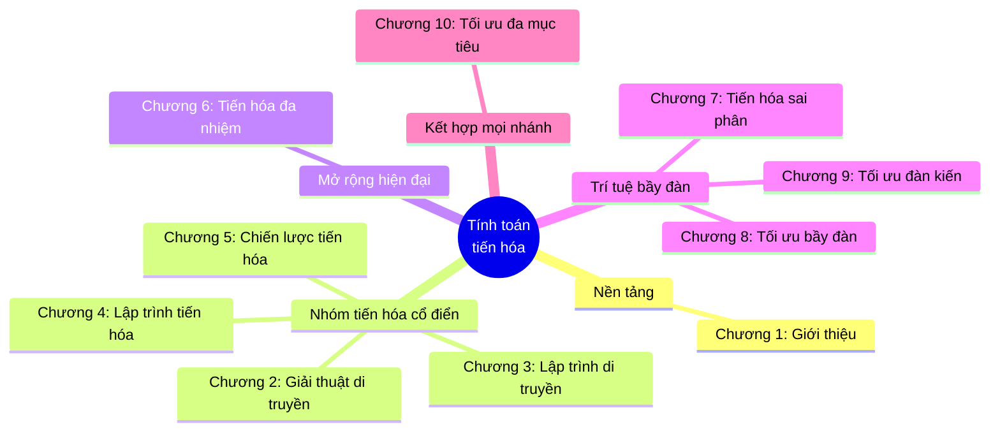

# Khóa Học Tính Toán Tiến Hóa (Evolutionary Computation)

## Thông tin khóa học

| Mục          | Thông tin                                                                                       |
| ------------ | ------------------------------------------------------------------------------------------------ |
| Tên đầy đủ   | **Tính Toán Tiến Hóa — Từ Giải Thuật Di Truyền Đến Tối Ưu Đa Mục Tiêu**                          |
| Chủ đề chính | Genetic Algorithms, Genetic Programming, Evolutionary Programming, Evolution Strategies, Evolutionary Multitasking, Differential Evolution, Particle Swarm Optimization, Ant Colony Optimization, Multi-Objective Optimization |
| Đối tượng    | Sinh viên CNTT/AI đã biết lập trình cơ bản và một ít xác suất thống kê                            |
| Số chương    | **10 chương**                                                                                     |
| Ngôn ngữ     | Tiếng Việt, kèm code minh họa Python                                                              |

---

## Cấu trúc khóa học — 10 Chương

| Chương | Tên chương | Thuật toán / Chủ đề chính | File |
| ------ | ---------- | -------------------------- | ---- |
| 1 | Giới Thiệu Tính Toán Tiến Hóa | Nền tảng: cơ sở sinh học, khung EA tổng quát, No Free Lunch | [01-gioi-thieu-tinh-toan-tien-hoa.md](Chuong%2001%20-%20Gioi%20Thieu%20Tinh%20Toan%20Tien%20Hoa/01-gioi-thieu-tinh-toan-tien-hoa.md) |
| 2 | Giải Thuật Di Truyền | Genetic Algorithms (GA) | [02-giai-thuat-di-truyen.md](Chuong%2002%20-%20Giai%20Thuat%20Di%20Truyen/02-giai-thuat-di-truyen.md) |
| 3 | Lập Trình Di Truyền | Genetic Programming (GP) | [03-lap-trinh-di-truyen.md](Chuong%2003%20-%20Lap%20Trinh%20Di%20Truyen/03-lap-trinh-di-truyen.md) |
| 4 | Lập Trình Tiến Hóa | Evolutionary Programming (EP) | [04-lap-trinh-tien-hoa.md](Chuong%2004%20-%20Lap%20Trinh%20Tien%20Hoa/04-lap-trinh-tien-hoa.md) |
| 5 | Chiến Lược Tiến Hóa | Evolution Strategies (ES) | [05-chien-luoc-tien-hoa.md](Chuong%2005%20-%20Chien%20Luoc%20Tien%20Hoa/05-chien-luoc-tien-hoa.md) |
| 6 | Tiến Hóa Đa Nhiệm | Evolutionary Multitasking (MFEA) | [06-tien-hoa-da-nhiem.md](Chuong%2006%20-%20Tien%20Hoa%20Da%20Nhiem/06-tien-hoa-da-nhiem.md) |
| 7 | Tiến Hóa Sai Phân | Differential Evolution (DE) | [07-tien-hoa-sai-phan.md](Chuong%2007%20-%20Tien%20Hoa%20Sai%20Phan/07-tien-hoa-sai-phan.md) |
| 8 | Tối Ưu Bầy Đàn | Particle Swarm Optimization (PSO) | [08-toi-uu-bay-dan.md](Chuong%2008%20-%20Toi%20Uu%20Bay%20Dan/08-toi-uu-bay-dan.md) |
| 9 | Tối Ưu Đàn Kiến | Ant Colony Optimization (ACO) | [09-toi-uu-dan-kien.md](Chuong%2009%20-%20Toi%20Uu%20Dan%20Kien/09-toi-uu-dan-kien.md) |
| 10 | Tối Ưu Đa Mục Tiêu | Multi-Objective Optimization (NSGA-II) | [10-toi-uu-da-muc-tieu.md](Chuong%2010%20-%20Toi%20Uu%20Da%20Muc%20Tieu/10-toi-uu-da-muc-tieu.md) |

---

## Nội dung mỗi chương

### Chương 1 — Giới Thiệu Tính Toán Tiến Hóa

Bài toán tối ưu là gì và vì sao nó khó (không gian tìm kiếm lớn, NP-Khó, hàm mục tiêu không khả vi); cơ sở sinh học (chọn lọc tự nhiên, di truyền); khung tổng quát của một giải thuật tiến hóa (khởi tạo → đánh giá → chọn lọc → lai ghép → đột biến → chọn lọc sinh tồn); các khái niệm cốt lõi (genotype, phenotype, fitness, quần thể, khai thác/khám phá); bức tranh toàn cảnh và lịch sử phát triển của toàn bộ lĩnh vực.

### Chương 2 — Giải Thuật Di Truyền (GA)

Biểu diễn nhị phân/số nguyên/số thực/hoán vị; các phương pháp chọn lọc (roulette wheel, tournament, rank, elitism); toán tử lai ghép (single-point, two-point, uniform) và đột biến (bit-flip); Định lý Schema; hiện tượng hội tụ sớm; cài đặt GA giải bài toán OneMax bằng Python.

### Chương 3 — Lập Trình Di Truyền (GP)

Biểu diễn lời giải dưới dạng cây cú pháp; tập hàm và tập đầu cuối; các phương pháp khởi tạo cây (Full, Grow, Ramped Half-and-Half); lai ghép/đột biến trên cây; vấn đề bloat; bài toán hồi quy ký hiệu (symbolic regression) minh họa bằng Python.

### Chương 4 — Lập Trình Tiến Hóa (EP)

Đặc trưng không dùng lai ghép, chỉ dùng đột biến; biểu diễn vector số thực với tham số chiến lược tự thích nghi; đột biến Gauss log-normal; chọn lọc cạnh tranh ngẫu nhiên (q-tournament); so sánh EP với GA và ES; cài đặt EP tối ưu hàm Sphere.

### Chương 5 — Chiến Lược Tiến Hóa (ES)

Ký hiệu (μ, λ) và (μ + λ); đột biến Gauss và tự thích nghi độ lệch chuẩn σ; quy tắc 1/5 thành công của Rechenberg; tái tổ hợp trung bình/rời rạc; giới thiệu CMA-ES; cài đặt (μ, λ)-ES bằng Python.

### Chương 6 — Tiến Hóa Đa Nhiệm (Evolutionary Multitasking)

Tối ưu đồng thời nhiều bài toán trong một quần thể chung; không gian tìm kiếm hợp nhất; khái niệm skill factor, factorial rank, scalar fitness trong MFEA; truyền tri thức ngầm qua tham số rmp; phân biệt với tối ưu đa mục tiêu; cài đặt MFEA minh họa với 2 tác vụ.

### Chương 7 — Tiến Hóa Sai Phân (DE)

Đột biến sai phân vector (DE/rand/1, DE/best/1); lai ghép nhị thức (binomial crossover); chọn lọc tham lam (greedy selection); vai trò các tham số NP, F, CR; cài đặt DE/rand/1/bin tối ưu hàm benchmark bằng Python.

### Chương 8 — Tối Ưu Bầy Đàn (PSO)

Khái niệm hạt (particle), vận tốc, pbest/gbest; công thức cập nhật vận tốc gồm quán tính + nhận thức + xã hội; cấu trúc lân cận gbest vs lbest; cài đặt PSO chuẩn tối ưu hàm benchmark bằng Python.

### Chương 9 — Tối Ưu Đàn Kiến (ACO)

Cơ chế pheromone và bay hơi; công thức xác suất chọn cạnh (pheromone × heuristic); các biến thể Ant System, Ant Colony System, Max-Min Ant System; áp dụng giải Bài toán người du lịch (TSP) bằng Python.

### Chương 10 — Tối Ưu Đa Mục Tiêu (Multi-Objective Optimization)

Thống trị Pareto (Pareto dominance) và biên Pareto; thuật toán NSGA-II với fast non-dominated sorting và crowding distance; sơ lược SPEA2, MOEA/D; các chỉ số đánh giá (Hypervolume, Spread); cài đặt non-dominated sorting bằng Python; tổng kết toàn bộ hành trình 10 chương của khóa học.

---

## Yêu cầu trước khi học

* Biết lập trình cơ bản (đọc hiểu và chạy được code Python).
* Có kiến thức nền về xác suất thống kê (phân phối, kỳ vọng, độ lệch chuẩn).
* Không yêu cầu biết trước về tối ưu hóa hay trí tuệ nhân tạo — các khái niệm này được xây dựng dần từ Chương 1.

## Cách sử dụng khóa học

Các chương được thiết kế để đọc **tuần tự từ 1 đến 10**, vì mỗi chương đều so sánh và tham chiếu ngược lại thuật toán ở các chương trước. Mỗi chương đều có:

* Mục tiêu bài học rõ ràng ở đầu chương.
* Sơ đồ Mermaid minh họa quy trình thuật toán.
* Pseudocode và code Python có thể chạy thử trực tiếp.
* Mục "Điều Cần Ghi Nhớ" và "Tóm Tắt Bài Học" ở cuối để ôn tập nhanh.
