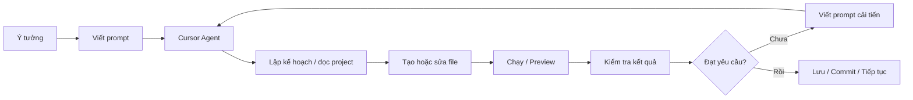

# 001 — Bài luyện tập Day 1: Welcome to the Course — Building a 3D Game with Cursor AI

> **Tuần:** Week 1 — Vibe Coding Foundation\
> **Module:** Week 1 Day 1 — Introduction to AI Coding Agents\
> **Công cụ chính:** Cursor AI\
> **Chủ đề:** AI Coding Agent, project folder, prompt, tạo file, kiểm tra kết quả và lặp lại prompt\
> **Hình thức:** Trắc nghiệm + Đúng/Sai + Điền đáp án + Tình huống + Thực hành\
> **Điểm bài kiểm tra kiến thức:** 100 điểm\
> **Thời lượng gợi ý:** 35–50 phút\
> **Mức độ:** Cơ bản → vận dụng

---

## 1. Mục tiêu bài luyện tập

Sau khi hoàn thành bài này, học viên có thể:

- [ ] Giải thích được **AI Coding Agent** là gì bằng ngôn ngữ của mình.
- [ ] Phân biệt được **editor**, **project folder**, **AI Agent** và **file được sinh ra**.
- [ ] Nhận biết được các khu vực chính trong giao diện Cursor.
- [ ] Hiểu quy trình từ **prompt ngôn ngữ tự nhiên → AI lập kế hoạch → tạo/sửa file → kiểm tra kết quả**.
- [ ] Biết vì sao kết quả do AI sinh ra có thể khác nhau giữa các người dùng.
- [ ] Viết được một prompt đủ rõ để yêu cầu Agent xây dựng một tính năng đơn giản.
- [ ] Biết kiểm tra file Agent tạo ra thay vì chỉ tin vào câu trả lời trong khung chat.
- [ ] Biết lặp lại prompt để cải tiến sản phẩm.
- [ ] Nhận biết các thao tác cần thận trọng khi Agent yêu cầu quyền hoặc chạy lệnh.
- [ ] Hoàn thành một mini-project 3D/FPS đơn giản với Cursor.

---

## 2. Kiến thức cần nhớ trước khi làm bài

### 2.1. Sơ đồ quy trình cơ bản



### 2.2. Ba khu vực giao diện cần nhớ

| Khu vực | Chức năng |
|---|---|
| **Left Pane** | Xem file và thư mục của project |
| **Middle Pane** | Mở và chỉnh sửa nội dung code |
| **Right Pane / Agent** | Gửi yêu cầu bằng ngôn ngữ tự nhiên cho AI Agent |

### 2.3. Project trong Cursor là gì?

Trong bài học, project có thể hiểu đơn giản là **một thư mục trên máy tính chứa toàn bộ file liên quan đến sản phẩm đang làm**.

Ví dụ:

```text
Home
└── Projects
    └── Instant
        ├── index.html
        ├── style.css
        └── script.js
```

> Cấu trúc thực tế có thể khác vì Agent có thể chọn cách tổ chức project khác nhau.

### 2.4. Prompt mẫu của bài

```text
Please build a website for a 3D first-person shooter game in an arena
against one computer opponent controlled by arrow keys and space bar to shoot.
```

Prompt này cung cấp các thành phần chính:

- loại sản phẩm: website;
- thể loại: 3D first-person shooter;
- môi trường: arena;
- đối thủ: một computer opponent;
- điều khiển: arrow keys;
- hành động bắn: space bar.

---

# 3. Phần A — Trắc nghiệm một đáp án

> **12 câu × 3 điểm = 36 điểm**

### Câu 1

Mục đích chính của bài học Day 1 là gì?

- A. Học toàn bộ cú pháp JavaScript.
- B. Trải nghiệm nhanh khả năng của AI coding agent bằng cách tạo một sản phẩm thực tế.
- C. Học thiết kế cơ sở dữ liệu.
- D. Cài đặt Docker và Kubernetes.

**Đáp án:** B

### Câu 2

Cursor được giới thiệu trong bài như thế nào?

- A. Một phần mềm chỉ dùng để thiết kế 3D.
- B. Một game engine.
- C. Một code editor tích hợp AI coding agent.
- D. Một trình duyệt web.

**Đáp án:** C

### Câu 3

Trong bài học, thao tác **Open Project** về bản chất là:

- A. Mở một video.
- B. Chọn một thư mục làm workspace/project.
- C. Kết nối với một database.
- D. Mở một file `.exe`.

**Đáp án:** B

### Câu 4

Khu vực bên trái của giao diện Cursor thường dùng để:

- A. Xem file và thư mục.
- B. Điều khiển nhân vật trong game.
- C. Chọn model 3D.
- D. Tạo tài khoản Cursor.

**Đáp án:** A

### Câu 5

Khu vực giữa của editor chủ yếu dùng để:

- A. Hiển thị và chỉnh sửa code.
- B. Chọn hệ điều hành.
- C. Thanh toán subscription.
- D. Chọn ảnh đại diện.

**Đáp án:** A

### Câu 6

Khu vực Agent/chat dùng để:

- A. Chỉ xem thông báo hệ thống.
- B. Gửi yêu cầu bằng ngôn ngữ tự nhiên cho AI.
- C. Lưu ảnh.
- D. Tạo tài khoản Windows.

**Đáp án:** B

### Câu 7

File được nhắc đến như một file Agent bắt đầu tạo trong demo là:

- A. `game.exe`
- B. `index.html`
- C. `database.sql`
- D. `README.pdf`

**Đáp án:** B

### Câu 8

Điều nào sau đây giải thích đúng nhất vì sao hai học viên có thể nhận kết quả khác nhau?

- A. AI luôn tạo cùng một kết quả.
- B. Kết quả có thể phụ thuộc model, setting, prompt, quyền truy cập và cách Agent diễn giải yêu cầu.
- C. Chỉ phụ thuộc màu giao diện.
- D. Chỉ phụ thuộc tên project.

**Đáp án:** B

### Câu 9

Sau khi Agent tạo code, hành động tốt nhất là:

- A. Không cần xem code, chỉ tin rằng Agent đã làm đúng.
- B. Xóa project.
- C. Mở file, chạy/preview, kiểm tra và tiếp tục sửa nếu cần.
- D. Đổi tên máy tính.

**Đáp án:** C

### Câu 10

Ví dụ nào thể hiện **iterative prompting**?

- A. Chỉ gửi một prompt và không bao giờ xem lại.
- B. Sau phiên bản đầu, yêu cầu thêm health bar, score counter hoặc game-over screen.
- C. Chỉ đổi tên folder.
- D. Đóng Cursor ngay sau khi Agent tạo file.

**Đáp án:** B

### Câu 11

Một prompt tốt cho Agent nên:

- A. Chỉ có một từ như “game”.
- B. Mơ hồ để AI tự đoán toàn bộ.
- C. Nêu rõ sản phẩm, tính năng, hành vi hoặc tiêu chí mong muốn.
- D. Không cần mô tả đầu ra.

**Đáp án:** C

### Câu 12

Khi Agent yêu cầu quyền thực hiện một hành động, học viên nên:

- A. Luôn bấm chấp nhận mà không đọc.
- B. Đọc hành động, hiểu phạm vi thay đổi rồi mới quyết định.
- C. Tắt máy.
- D. Xóa tài khoản.

**Đáp án:** B

---

# 4. Phần B — Đúng / Sai

> **8 câu × 2 điểm = 16 điểm**

### Câu 13

Cursor chỉ có thể trả lời câu hỏi và không thể sửa file trong project.

- [ ] Đúng
- [ ] Sai

**Đáp án:** Sai

### Câu 14

Project folder là nơi chứa các file của sản phẩm đang xây dựng.

- [ ] Đúng
- [ ] Sai

**Đáp án:** Đúng

### Câu 15

Học viên bắt buộc phải nhận được giao diện và code giống hệt instructor.

- [ ] Đúng
- [ ] Sai

**Đáp án:** Sai

### Câu 16

Natural language prompt có thể được dùng để yêu cầu Agent tạo code.

- [ ] Đúng
- [ ] Sai

**Đáp án:** Đúng

### Câu 17

Nếu phiên bản đầu chưa tốt, có thể tiếp tục viết prompt để cải tiến.

- [ ] Đúng
- [ ] Sai

**Đáp án:** Đúng

### Câu 18

Một AI coding workflow tốt không cần bước kiểm tra kết quả.

- [ ] Đúng
- [ ] Sai

**Đáp án:** Sai

### Câu 19

Trong bài, `Instant` là tên project folder được dùng trong demo.

- [ ] Đúng
- [ ] Sai

**Đáp án:** Đúng

### Câu 20

AI coding agent luôn tạo ra output hoàn toàn xác định và giống nhau ở mọi lần chạy.

- [ ] Đúng
- [ ] Sai

**Đáp án:** Sai

---

# 5. Phần C — Điền đáp án ngắn

> **8 câu × 3 điểm = 24 điểm**

> Khi làm trên bản HTML tương tác, hệ thống sẽ bỏ qua khác biệt chữ hoa/chữ thường và chấp nhận một số cách viết tương đương.

### Câu 21

Tên thư mục project được dùng trong demo là gì?

**Trả lời:** `________________________`

**Đáp án:** `Instant`

### Câu 22

File HTML được Agent bắt đầu tạo trong demo có tên là gì?

**Trả lời:** `________________________`

**Đáp án:** `index.html`

### Câu 23

Phím nào được dùng để bắn trong prompt mẫu?

**Trả lời:** `________________________`

**Đáp án:** `Space` / `Space bar`

### Câu 24

Nhóm phím nào được dùng để di chuyển trong prompt mẫu?

**Trả lời:** `________________________`

**Đáp án:** `Arrow keys`

### Câu 25

Điền từ còn thiếu:

> AI coding agent có thể tạo và ______ file trong project.

**Trả lời:** `________________________`

**Đáp án:** `sửa` / `edit`

### Câu 26

Điền từ còn thiếu:

> Một yêu cầu viết bằng ngôn ngữ tự nhiên gửi cho Agent được gọi là ______.

**Trả lời:** `________________________`

**Đáp án:** `prompt`

### Câu 27

Sau khi Agent tạo phiên bản đầu, học viên nên chạy hoặc ______ sản phẩm để kiểm tra.

**Trả lời:** `________________________`

**Đáp án:** `preview` / `xem trước`

### Câu 28

Quá trình liên tục yêu cầu Agent cải tiến sản phẩm qua nhiều prompt được gọi là ______ prompting.

**Trả lời:** `________________________`

**Đáp án:** `iterative`

---

# 6. Phần D — Câu hỏi tình huống

> **4 câu × 6 điểm = 24 điểm**

### Câu 29

Bạn gửi prompt:

```text
Build a game.
```

Agent tạo ra một game nhưng không có FPS, không có arena và không có đối thủ.

Cách xử lý tốt nhất là:

- A. Kết luận Cursor không hoạt động.
- B. Viết prompt mới cụ thể hơn về thể loại, arena, opponent, controls và điều kiện thắng/thua.
- C. Xóa toàn bộ máy tính.
- D. Chỉ đổi tên project.

**Đáp án:** B

---

### Câu 30

Agent thông báo đã hoàn thành nhưng bạn không thấy game chạy.

Bạn nên làm gì trước?

- A. Mở các file Agent vừa tạo, xác định entry point và thử chạy/preview project.
- B. Tin rằng game chắc chắn đúng.
- C. Bỏ qua lỗi.
- D. Chuyển sang một project khác ngay.

**Đáp án:** A

---

### Câu 31

Agent muốn chạy một lệnh hoặc sửa cấu hình mà bạn chưa hiểu.

Cách làm phù hợp nhất là:

- A. Chấp nhận ngay mọi quyền.
- B. Đọc lệnh/thay đổi, hỏi Agent giải thích tác dụng và phạm vi ảnh hưởng trước khi chấp nhận.
- C. Xóa Cursor.
- D. Tắt mạng vĩnh viễn.

**Đáp án:** B

---

### Câu 32

Phiên bản đầu của game đã chạy nhưng gameplay còn đơn giản.

Prompt cải tiến nào tốt nhất?

- A. `better`
- B. `fix`
- C. `Make the arena more futuristic, add a player health bar, enemy health bar, score counter, start screen, and game-over state. Keep the existing arrow-key movement and Space-to-shoot controls.`
- D. `hello`

**Đáp án:** C

---

# 7. Phiếu trả lời nhanh

| Câu | Trả lời | Câu | Trả lời |
|---:|---|---:|---|
| 1 |  | 17 |  |
| 2 |  | 18 |  |
| 3 |  | 19 |  |
| 4 |  | 20 |  |
| 5 |  | 21 |  |
| 6 |  | 22 |  |
| 7 |  | 23 |  |
| 8 |  | 24 |  |
| 9 |  | 25 |  |
| 10 |  | 26 |  |
| 11 |  | 27 |  |
| 12 |  | 28 |  |
| 13 |  | 29 |  |
| 14 |  | 30 |  |
| 15 |  | 31 |  |
| 16 |  | 32 |  |

---

# 8. Cách chấm điểm

## 8.1. Thang điểm kiến thức

| Phần | Số câu | Điểm/câu | Tổng |
|---|---:|---:|---:|
| A — Trắc nghiệm | 12 | 3 | 36 |
| B — Đúng/Sai | 8 | 2 | 16 |
| C — Điền đáp án | 8 | 3 | 24 |
| D — Tình huống | 4 | 6 | 24 |
| **Tổng** | **32** |  | **100** |

## 8.2. Xếp loại

| Điểm | Đánh giá |
|---:|---|
| 90–100 | Rất tốt — hiểu rõ workflow cơ bản của AI Coding Agent |
| 80–89 | Tốt — đủ kiến thức để tiếp tục bài tiếp theo |
| 65–79 | Đạt — nên ôn lại prompting và quy trình kiểm tra |
| 50–64 | Cần luyện thêm |
| < 50 | Nên học lại lesson và làm lại bài |

---

# 9. Bài thực hành — Instant FPS Mini Project

> Phần này dùng để kiểm tra khả năng thao tác thực tế, không cộng vào 100 điểm kiến thức nếu giảng viên không muốn.

## 9.1. Nhiệm vụ

Tạo project:

```text
Projects/Instant
```

Sau đó sử dụng Cursor Agent để yêu cầu tạo một website game có tối thiểu:

- góc nhìn first-person hoặc giả lập first-person;
- một arena;
- một đối thủ do máy điều khiển;
- di chuyển bằng phím mũi tên;
- bắn bằng Space;
- có phản hồi khi bắn trúng;
- có điều kiện thắng hoặc game-over;
- có nút bắt đầu/chơi lại.

## 9.2. Prompt khởi đầu gợi ý

```text
Build a browser-based 3D first-person shooter prototype.

Requirements:
- Arena-style environment.
- One computer-controlled opponent.
- Arrow keys move the player.
- Space bar shoots.
- Show player health and enemy health.
- Add a score counter.
- Add start, win/lose, and restart states.
- Keep the project simple enough to run locally.
- Organize the code clearly.
- After implementation, explain which files you created and how I can run the project.
```

## 9.3. Prompt cải tiến vòng 2

```text
Review the current game before changing anything.

Improve it with:
1. A more futuristic arena.
2. Better visual feedback when a shot is fired.
3. A visible crosshair.
4. Clear hit feedback.
5. A simple enemy AI that moves toward or around the player.
6. A game-over screen.

Do not remove the current movement and shooting controls.
After editing, test the main gameplay flow and summarize what changed.
```

## 9.4. Prompt kiểm tra vòng 3

```text
Audit this project for obvious bugs.

Check:
- page startup,
- keyboard controls,
- shooting,
- enemy behavior,
- health reduction,
- win/lose conditions,
- restart behavior,
- console errors.

Fix the issues you find.
Then give me a short test checklist I can run manually.
```

---

# 10. Checklist thực hành

- [ ] Đã cài/mở Cursor.
- [ ] Đã tạo hoặc chọn đúng folder `Instant`.
- [ ] Đã gửi prompt đầu tiên cho Agent.
- [ ] Đã quan sát Agent tạo hoặc sửa file.
- [ ] Đã mở ít nhất một file code mà Agent tạo.
- [ ] Đã chạy hoặc preview project.
- [ ] Đã kiểm tra Console nếu project có lỗi.
- [ ] Đã thử di chuyển nhân vật.
- [ ] Đã thử thao tác bắn.
- [ ] Đã kiểm tra đối thủ.
- [ ] Đã gửi ít nhất một prompt cải tiến.
- [ ] Đã kiểm tra lại sau khi Agent sửa code.
- [ ] Có thể giải thích file entry point của project.
- [ ] Có thể mô tả ít nhất một điểm Agent làm chưa đúng ở phiên bản đầu.
- [ ] Có thể mô tả cách prompt thứ hai giúp cải thiện sản phẩm.

---

# 11. Rubric chấm bài thực hành

| Tiêu chí | 0 điểm | 1 điểm | 2 điểm |
|---|---|---|---|
| Project mở đúng | Không có project | Có folder nhưng sai cấu trúc | Project mở và hoạt động |
| Prompt rõ ràng | Mơ hồ | Có một số yêu cầu | Có mục tiêu + tính năng + controls |
| Agent tạo file | Không | Tạo nhưng không kiểm tra | Tạo và học viên kiểm tra |
| Game chạy | Không chạy | Chạy một phần | Chạy được flow chính |
| Movement | Không | Có lỗi lớn | Hoạt động |
| Shooting | Không | Có nhưng lỗi | Hoạt động |
| Enemy | Không | Tĩnh/không rõ | Có hành vi cơ bản |
| Iteration | Không | Sửa một lần mơ hồ | Có prompt cải tiến rõ ràng |
| Testing | Không | Chỉ nhìn bằng mắt | Có test checklist |
| Giải thích | Không giải thích được | Giải thích một phần | Giải thích được workflow |

**Tổng gợi ý:** 20 điểm.

---

# 12. Câu hỏi tự luận ngắn

> Không bắt buộc chấm tự động. Dùng để thảo luận sau bài.

### Câu 1

Tại sao khóa học lại bắt đầu bằng demo thay vì lý thuyết?

### Câu 2

Điểm khác biệt lớn nhất giữa chatbot chỉ trả lời và coding agent làm việc trong project là gì?

### Câu 3

Vì sao không nên đánh giá chất lượng Agent chỉ dựa trên việc nó nói “Done”?

### Câu 4

Nếu hai học viên nhận hai kết quả khác nhau từ cùng một prompt, điều đó có nhất thiết nghĩa là một người làm sai không? Giải thích.

### Câu 5

Viết lại prompt FPS ban đầu theo cách rõ hơn và có tiêu chí kiểm tra cụ thể.

---

# 13. Đáp án và giải thích

## Phần A

| Câu | Đáp án | Giải thích |
|---:|:---:|---|
| 1 | B | Bài mở đầu ưu tiên trải nghiệm “build ngay” để học viên thấy giá trị của AI agent. |
| 2 | C | Cursor là code editor có tích hợp AI coding agent. |
| 3 | B | Trong workflow desktop, project thường là folder/workspace chứa source code. |
| 4 | A | Left Pane thường là file explorer. |
| 5 | A | Middle Pane là vùng editor. |
| 6 | B | Agent nhận yêu cầu ngôn ngữ tự nhiên và thao tác trên project. |
| 7 | B | `index.html` là file được nhắc trong demo. |
| 8 | B | Output có thể thay đổi theo model, setting, context và prompt. |
| 9 | C | Luôn kiểm tra file và chạy sản phẩm. |
| 10 | B | Iteration nghĩa là tiếp tục prompt để cải tiến. |
| 11 | C | Prompt cụ thể giúp Agent hiểu yêu cầu tốt hơn. |
| 12 | B | Quyền/lệnh nên được đọc và hiểu trước khi chấp nhận. |

## Phần B

| Câu | Đáp án |
|---:|:---:|
| 13 | Sai |
| 14 | Đúng |
| 15 | Sai |
| 16 | Đúng |
| 17 | Đúng |
| 18 | Sai |
| 19 | Đúng |
| 20 | Sai |

## Phần C

| Câu | Đáp án chấp nhận |
|---:|---|
| 21 | Instant |
| 22 | index.html |
| 23 | Space / Space bar |
| 24 | Arrow keys / phím mũi tên |
| 25 | sửa / edit / modify |
| 26 | prompt |
| 27 | preview / xem trước / chạy thử |
| 28 | iterative |

## Phần D

| Câu | Đáp án |
|---:|:---:|
| 29 | B |
| 30 | A |
| 31 | B |
| 32 | C |

---

# 14. Ảnh minh họa nên chèn vào bài

## Ảnh 1 — Giao diện Cursor / Agent

**Vị trí chèn:** sau mục “Kiến thức cần nhớ”.

**Caption gợi ý:**

> Giao diện Cursor với vùng code editor và AI Agent hỗ trợ đọc, tạo và sửa code trong project.

**Nguồn nên ưu tiên:** website hoặc tài liệu chính thức của Cursor.

---

## Ảnh 2 — Agent đang sửa code / diff

**Vị trí chèn:** trước Phần A.

**Caption gợi ý:**

> Ví dụ Agent tạo hoặc sửa code trực tiếp trong workspace. Học viên cần quan sát diff và kiểm tra thay đổi thay vì chỉ đọc câu trả lời chat.

---

## Ảnh 3 — Minh họa game FPS chạy trong trình duyệt

**Vị trí chèn:** trước phần “Instant FPS Mini Project”.

**Caption gợi ý:**

> Hình tham khảo về góc nhìn first-person shooter trong trình duyệt. Bài tập không yêu cầu sản phẩm đạt chất lượng game thương mại.

---

# 15. Ghi chú về phiên bản tương tác

Markdown thuần không có cơ chế JavaScript tiêu chuẩn để tự chấm điểm trên mọi nền tảng.

Vì vậy nên dùng:

```text
001-day-1-cursor-ai-practice.md
```

để lưu nội dung bài học/bài tập, và mở file:

```text
001-day-1-cursor-ai-quiz.html
```

để học viên:

- nhập họ tên;
- chọn đáp án;
- nhập câu trả lời ngắn;
- bấm **Chấm điểm**;
- xem tổng điểm;
- xem điểm từng phần;
- xem câu nào đúng/sai;
- làm lại bài;
- lưu tạm câu trả lời trên trình duyệt.

---

# 16. Yêu cầu hoàn thành

- [ ] Hoàn thành đủ 32 câu.
- [ ] Đạt tối thiểu 65/100.
- [ ] Hoàn thành project `Instant`.
- [ ] Có ít nhất một lần iterative prompting.
- [ ] Chạy hoặc preview được sản phẩm.
- [ ] Tự kiểm tra ít nhất 5 hành vi của game.
- [ ] Có thể giải thích workflow `Prompt → Agent → Files → Run → Review → Iterate`.

---

# 17. Kết quả cần nộp

```text
Instant/
├── source code...
├── screenshot-01.png
├── screenshot-02.png
└── README.md
```

Trong `README.md`, ghi ngắn:

1. Prompt đầu tiên.
2. Prompt cải tiến.
3. Các file chính Agent tạo.
4. Cách chạy project.
5. Lỗi gặp phải.
6. Agent đã sửa lỗi như thế nào.
7. Điều học được sau bài.

---

# 18. Ghi chú cuối bài

Điểm quan trọng nhất của Day 1 không phải là tạo ra một game hoàn hảo.

Mục tiêu là hình thành thói quen:

```text
Mô tả rõ → Cho Agent làm → Quan sát thay đổi → Chạy thử → Kiểm tra → Prompt tiếp
```

AI coding agent mạnh nhất khi người dùng không chỉ “ra lệnh”, mà còn biết **kiểm tra, phản hồi và hướng dẫn vòng tiếp theo**.
