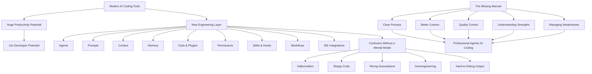
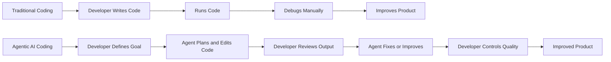
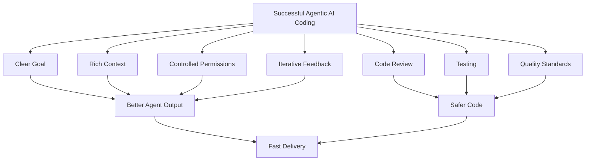

# 003 - Day 1 - The Missing Manual for Agentic AI Coding

## Lesson Information

| Item           | Details                                                                       |
| -------------- | ----------------------------------------------------------------------------- |
| Lesson         | 003                                                                           |
| Duration       | 7 minutes                                                                     |
| Week           | Week 1 - Vibe Coding Foundation                                               |
| Module         | Week 1 Day 1 - Introduction to AI Coding Agents                               |
| Main Topic     | The Missing Manual for Agentic AI Coding                                      |
| Learning Focus | Understanding why AI coding agents need process, context, and quality control |

---

## Lesson Overview

This lesson explains the deeper motivation behind the course.

After the instant hands-on demos in the first two lessons, the instructor steps back and explains why agentic AI coding matters, why it feels overwhelming, and why developers need a clear mental model to use these tools effectively.

The course is positioned as **“The Missing Manual”** for AI coding agents: a practical guide for understanding agents, tools, prompts, context, workflows, memory, permissions, skills, hooks, MCP, and other new layers of modern software development.

The key message is:

> AI coding agents are powerful, but they do not come with an obvious manual. Developers need to learn how to operate them well.

---

## The Motivation Behind the Course

The instructor explains that a major motivation for creating this course came from a post by Andrej Karpathy.

Karpathy described how programming is being dramatically changed by AI. Developers now work with a new layer of abstraction involving agents, sub-agents, prompts, memory, context, tools, permissions, plugins, skills, hooks, workflows, IDE integrations, and more.

This new layer can make programmers much more powerful, but only if they know how to use it properly.

Without a clear mental model, developers may feel behind, confused, or unable to claim the productivity boost that AI tools can offer.

---

## Core Idea of the Lesson

The course exists to help students answer one major question:

```text id="3uv9yq"
How do we use agentic AI coding tools effectively, safely, and professionally?
```

The instructor does not present AI coding as magic. Instead, he frames it as a new engineering layer that must be understood, practiced, and controlled.

Students should finish the course knowing:

* What the major AI coding concepts mean
* How those concepts fit together
* Where AI agents work well
* Where AI agents fail
* How to separate hype from reality
* How to build software faster without losing quality
* How to manage the weaknesses of stochastic AI systems

---

## Why It Is Called “The Missing Manual”

The phrase **“The Missing Manual”** means that AI coding tools feel like a powerful alien technology handed to developers without clear instructions.

Many developers can see that the tools are powerful, but they may not know:

* How to prompt them well
* How to give them enough context
* How to debug their output
* How to control permissions
* How to prevent poor-quality code
* How to avoid overengineering
* How to integrate agents into real workflows
* How to use them on large codebases
* How to manage risk and uncertainty

This course is designed to become that missing guide.

---

## Markdown Diagram: The Missing Manual Problem



---

## Who This Course Is For

The instructor explains that the course is useful for people across a wide range of technical experience.

There are two main learner archetypes.

---

## Audience 1: Aspiring Engineers

The first group includes people who are new to coding or not yet confident as software engineers.

This may include:

* Beginners
* Junior developers
* Non-technical builders
* People writing code for the first time
* People who have coded a little but do not yet feel like experts

For this group, AI agents can help them build complete products with more confidence.

The course aims to show them how to move from simple prompting to real software development workflows.

---

## Audience 2: Experienced Engineers

The second group includes experienced engineers, senior developers, staff engineers, and technical professionals who already know how to code but feel overwhelmed by the fast-changing AI coding landscape.

They may already understand software engineering, but they want to know:

* Which tools matter
* How agents fit into existing engineering workflows
* How to use AI without damaging code quality
* How to scale AI assistance across large repositories
* How to stay productive without losing control
* How to keep enjoying engineering in the AI era

For this group, the course helps connect the dots between traditional engineering and agentic AI coding.

---

## This Course Has Something for Everyone

The instructor emphasizes that students do not need to fit perfectly into only one category.

The course is designed for a wide spectrum of learners.

Some parts may feel advanced for beginners. In those cases, beginners should focus on getting the general idea and keep moving.

Some parts may feel basic for experienced engineers. In those cases, experienced learners can move faster through familiar setup sections and focus on the deeper agentic engineering material.

The course is meant to build a shared foundation while still offering advanced value.

---

## What Students Will Be Able to Do

By the end of the course, students should be able to use AI agents to build, debug, troubleshoot, and improve software products at different levels of complexity.

This includes:

* Small experiments
* Simple web apps
* Browser games
* Business-focused applications
* Existing software products
* Large repositories
* Multi-repository projects
* Team collaboration workflows

The goal is not only to generate code quickly. The goal is to deliver high-quality software faster with the help of AI agents.

---

## Career Relevance

The instructor also points out that agentic AI coding is becoming increasingly relevant in the job market.

More job descriptions now expect developers to know how to work with AI coding tools.

By learning these skills, students can better demonstrate that they understand modern software development workflows involving:

* AI coding agents
* MCP
* Skills
* Hooks
* Tools
* Workflows
* Context management
* Debugging with AI
* Quality control
* Advanced agentic techniques such as Ralph Loops

These skills can help students become more competitive as software development continues to change.

---

## Key Concept: Agentic AI Coding

Agentic AI coding means using AI systems not just as chatbots, but as active coding partners that can plan, edit, create files, run tools, and help solve software engineering problems.

An agentic coding system may involve:

* A language model
* A project directory
* A code editor
* Tools
* File access
* Permissions
* Context
* Memory
* Workflows
* Debugging loops

The developer gives direction, reviews results, and controls quality.

---

## Key Concept: New Layer of Abstraction

Traditional programming already has many layers of abstraction, such as:

* Hardware
* Operating systems
* Programming languages
* Frameworks
* Libraries
* APIs
* Cloud services

Agentic AI coding adds another layer on top.

This new layer includes:

```text id="nbh35u"
Agents
Sub-agents
Prompts
Context
Memory
Modes
Permissions
Tools
Plugins
Skills
Hooks
MCP
LSP
Slash commands
Workflows
IDE integrations
```

To use AI coding well, developers need to understand this new layer and how it interacts with traditional engineering.

---

## Markdown Diagram: Traditional Coding vs Agentic Coding



---

## Key Concept: Strengths and Weaknesses

The instructor makes it clear that he is enthusiastic about agentic AI, but not blindly caught up in the hype.

AI coding tools have significant strengths, but they also have serious weaknesses.

To use them successfully, students must learn both sides.

---

## Strengths of AI Coding Agents

AI coding agents can help developers:

* Build prototypes quickly
* Generate boilerplate code
* Explore ideas
* Refactor code
* Debug issues
* Create tests
* Explain unfamiliar code
* Work across files
* Speed up repetitive tasks
* Support larger development workflows

When used well, they can dramatically increase productivity.

---

## Weaknesses of AI Coding Agents

AI coding agents can also create problems, such as:

* Hallucinated APIs
* Incorrect assumptions
* Poor architecture
* Overengineering
* Sloppy implementation
* Inconsistent style
* Hidden bugs
* Fragile code
* Misunderstood requirements
* Security risks
* Excessive confidence in wrong solutions

These weaknesses mean that the developer must remain in control.

---

## Key Concept: Hype vs Reality

The instructor wants students to separate hype from facts.

AI coding is powerful, but it is not perfect. It does not remove the need for engineering judgment.

A good AI-assisted developer should know:

* When to trust the agent
* When to question the agent
* When to inspect code manually
* When to ask for tests
* When to simplify the solution
* When to reject the generated output
* When to restart with better context

The best results come from combining AI capability with human judgment.

---

## Markdown Diagram: Successful Agentic Coding



---

## Common Problems in AI Coding

The lesson highlights several problems that students will learn to manage throughout the course.

---

### 1. Hallucination

Hallucination happens when the AI invents something that is not true.

In coding, this may include:

* Fake APIs
* Nonexistent libraries
* Incorrect function names
* Wrong documentation assumptions
* Invalid configuration options

Students need to verify what the agent produces.

---

### 2. Slop

“Slop” refers to low-quality AI-generated output that may look acceptable at first but lacks precision, structure, or maintainability.

In software, slop can appear as:

* Messy code
* Unclear naming
* Repeated logic
* Weak error handling
* No tests
* Poor architecture
* Code that works only in the simplest case

The course will teach students how to avoid accepting slop as final output.

---

### 3. Overengineering

AI agents may sometimes build more complexity than needed.

For example, a simple feature may turn into:

* Too many files
* Unnecessary abstractions
* Complicated architecture
* Extra dependencies
* Premature optimization

Developers must learn to guide the agent toward the right level of simplicity.

---

### 4. Wrong Assumptions

AI agents often make assumptions when the prompt is incomplete.

They may assume:

* The wrong framework
* The wrong database
* The wrong architecture
* The wrong user flow
* The wrong business requirement
* The wrong deployment environment

Good context reduces wrong assumptions.

---

### 5. Lack of Quality Control

AI can generate code quickly, but speed does not guarantee quality.

Without quality control, a project may accumulate:

* Bugs
* Security issues
* Inconsistent patterns
* Technical debt
* Unclear logic
* Broken edge cases

The developer must review, test, and improve the output.

---

## Why Process Matters

A clear process helps prevent AI coding from becoming chaotic.

Instead of randomly prompting the agent, students should learn a repeatable workflow.

A strong workflow may include:

```text id="ypu4n7"
1. Define the goal
2. Provide context
3. Ask the agent to plan
4. Review the plan
5. Let the agent implement
6. Test the result
7. Review the code
8. Ask for targeted fixes
9. Repeat until quality is acceptable
```

This process keeps the human in control while still benefiting from AI speed.

---

## Why Context Matters

Context is one of the most important ingredients in AI coding.

The agent performs better when it understands:

* The project structure
* The current codebase
* The intended feature
* The business goal
* The technical constraints
* The coding style
* The testing expectations
* The user experience requirements

Poor context leads to poor output. Good context leads to more useful results.

---

## Why Quality Control Matters

AI-generated code should not be treated as automatically correct.

Students must learn to apply quality control through:

* Code review
* Manual testing
* Automated tests
* Debugging
* Refactoring
* Simplification
* Security checks
* Performance checks
* Clear acceptance criteria

The goal is not just to make the agent produce code. The goal is to produce software that is reliable and maintainable.

---

## The Instructor’s Position on AI Hype

The instructor describes himself as enthusiastic but not naive.

He believes AI coding tools are incredibly powerful and can help developers do amazing things. However, he also believes that these tools have real drawbacks.

Success comes from understanding both:

| Strengths            | Weaknesses        |
| -------------------- | ----------------- |
| Fast prototyping     | Hallucination     |
| Code generation      | Sloppy output     |
| Debugging assistance | Wrong assumptions |
| Refactoring support  | Overengineering   |
| Productivity boost   | Quality risks     |
| Learning support     | Unpredictability  |

The course will help students maximize the strengths and manage the weaknesses.

---

## Relationship to Previous Lessons

Lessons 001 and 002 gave students instant gratification by showing a game being generated with Cursor AI.

Lesson 003 explains the bigger picture.

The first two lessons showed:

```text id="6n3yw6"
AI agents can build something quickly.
```

This lesson explains:

```text id="u95qdf"
To use AI agents professionally, we need a mental model, a process, and quality control.
```

---

## Learning Objectives

By the end of this lesson, students should be able to:

* Understand why the course is called “The Missing Manual”
* Explain why agentic AI coding is a new layer of abstraction
* Recognize that AI tools are powerful but fallible
* Identify common problems such as hallucination, slop, overengineering, and wrong assumptions
* Understand why process, context, and quality control are essential
* Know who the course is designed for
* Understand the career relevance of agentic AI coding
* See the difference between hype and practical engineering value

---

## Practice Reflection

Students should reflect on the following questions:

1. Do I currently feel confident using AI coding tools, or do I feel behind?
2. When I use AI to generate code, do I review the output carefully?
3. Have I seen AI produce hallucinated or low-quality code before?
4. Do I usually give the agent enough context?
5. Do I have a repeatable process for working with AI coding agents?
6. What do I want to be able to build by the end of this course?

---

## Suggested Notes for Students

Students should remember:

```text id="yhywx3"
AI coding agents are powerful, but they are not automatically reliable.
```

```text id="3ovior"
The developer remains responsible for direction, judgment, and quality.
```

```text id="19ufpr"
The goal is not to replace engineering skill, but to upgrade how engineering work gets done.
```

---

## Key Takeaways

* Agentic AI coding introduces a new layer of abstraction in software development.
* Developers now need to understand agents, prompts, tools, memory, context, workflows, permissions, skills, hooks, MCP, and more.
* The course is designed as a “Missing Manual” for this new world.
* AI coding agents can make developers much more productive.
* AI tools also have weaknesses such as hallucination, slop, overengineering, and wrong assumptions.
* Good AI coding requires process, context, and quality control.
* The course is useful for both beginners and experienced engineers.
* Human judgment remains essential.
* The goal is to build high-quality software faster with AI assistance.

---

## Lesson Summary

In this lesson, the instructor explains the motivation behind the course and frames it as **“The Missing Manual”** for agentic AI coding.

The lesson is inspired by Andrej Karpathy’s observation that programming is being dramatically refactored by AI tools. Developers now face a new layer of abstraction involving agents, prompts, context, memory, tools, permissions, plugins, skills, hooks, MCP, workflows, and IDE integrations.

The instructor explains that this course is for both aspiring engineers and experienced developers. Beginners will learn how to build complete products with AI assistance, while experienced engineers will learn how to navigate the fast-changing AI coding landscape and accelerate their work.

The lesson also makes an important clarification: the course is enthusiastic about AI, but not blindly hype-driven. AI coding tools are powerful, but they have real weaknesses. Students must learn how to maximize the strengths and manage the risks.

By the end of the course, students should be able to use AI agents to build, debug, troubleshoot, and enhance software projects at many levels of scale. Most importantly, they should develop a clear mental model for agentic AI coding and learn how to use these tools with confidence, control, and professional judgment.

---

# Bài luyện tập

## Mục tiêu


## Đề bài


## Yêu cầu hoàn thành

- [ ] 
- [ ] 
- [ ] 

## Kết quả / lời giải


## Ghi chú
