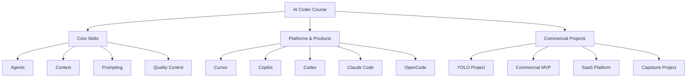
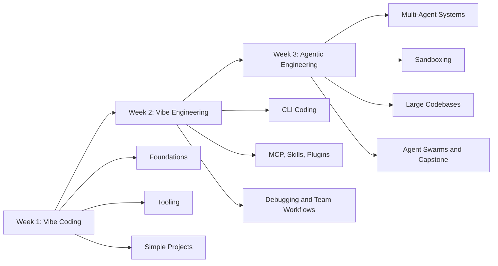
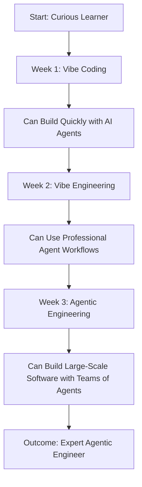

# 004 - Day 1 - Meet Your Instructor & the 3-Week AI Coder Course Roadmap

## Lesson Information

| Item           | Details                                                   |
| -------------- | --------------------------------------------------------- |
| Lesson         | 004                                                       |
| Duration       | 8 minutes                                                 |
| Week           | Week 1 - Vibe Coding Foundation                           |
| Module         | Week 1 Day 1 - Introduction to AI Coding Agents           |
| Main Topic     | Instructor introduction and course roadmap                |
| Learning Focus | Understanding the 3-week structure of the AI Coder course |

---

## Lesson Overview

This lesson introduces the instructor and explains the full three-week roadmap of the AI Coder course.

After the instant game-building demos and the explanation of the “Missing Manual,” the instructor gives students a clear picture of who is teaching the course, why he is qualified, and what students will build over the next three weeks.

The course is designed to combine both:

* **Breadth**: exposure to many popular AI coding tools
* **Depth**: deeper mastery of professional CLI-based agentic coding workflows

The main goal is to help students move from basic AI-assisted coding into advanced agentic engineering.

---

## Meet the Instructor

The instructor is **Ed Donner**.

He introduces himself as the co-founder and CTO of an AI startup called **Nebula.io**.

He has spent much of his career in technology and software engineering, including a long period at **J.P. Morgan**, where he worked in London, Tokyo, and New York City.

Near the end of his time at J.P. Morgan, he was a managing director leading a team of around 300 technologists working across software engineering, Python, and analytics.

Before Nebula.io, he also founded an AI startup called **Untappd**, which was acquired in 2021.

The instructor uses this background to show that he has experience in:

* Large-scale engineering teams
* AI startups
* Software engineering leadership
* Python and analytics
* Teaching technical topics
* Working deeply with LLMs and agents

---

## Instructor’s Teaching Style

The instructor presents himself as someone who enjoys explaining LLMs, AI agents, and software engineering concepts.

He also emphasizes that he personally responds to student messages and enjoys interacting with learners.

His teaching style combines:

* Practical demonstrations
* Humor
* Real-world engineering experience
* Clear explanations
* Project-based learning
* Excitement about AI tools without blind hype

The instructor wants students to feel that they are learning from someone who actively works with this technology and enjoys teaching it.

---

## Course Design Strategy

The curriculum is designed around two major goals:

```text id="d5uw7p"
Breadth + Depth
```

The instructor wants students to see a wide range of tools while also going deep into the most important professional workflows.

---

## Breadth: Exposure to Many AI Coding Tools

Students will encounter many AI coding platforms and products during the course.

The purpose is not necessarily to master every single tool, but to become familiar with the current landscape.

Students may see tools such as:

* Cursor
* GitHub Copilot
* Codex
* Claude Code
* OpenCode
* Antigravity
* Other AI coding platforms and agentic tools

The goal is to help students feel comfortable navigating different tools they may encounter in jobs, projects, or team environments.

---

## Depth: Going Deep on CLI Coding

Although the course introduces many tools, it goes especially deep on CLI-based coding workflows.

The instructor highlights **Claude Code** and similar tools such as **OpenCode** as the main area of depth.

CLI coding is important because it allows students to work more professionally with agents inside real software projects.

The course will explore:

* Commands
* Checkpoints
* Ralph Loops
* MCP
* Skills
* Plugins
* Hooks
* Debugging workflows
* Team workflows
* Large codebase workflows
* Multi-agent engineering

---

## Three Types of Sessions

The instructor explains that the course includes three main types of sessions.

| Session Type         | Purpose                                                               |
| -------------------- | --------------------------------------------------------------------- |
| Core Skills          | Teach the foundations, concepts, and mental models                    |
| Platforms & Products | Explore tools such as Cursor, Codex, Claude Code, Copilot, and others |
| Commercial Projects  | Build real business-oriented software projects with AI agents         |

Except for the first fun FPS game demo, the projects in the course are intended to have commercial or practical value.

---

## Markdown Diagram: Course Session Types



---

## The 3-Week Course Roadmap

The course is divided into three weeks.

Each week contains five days of material, with two days off.

The three-week structure is:

| Week   | Theme                          | Focus                                                                     |
| ------ | ------------------------------ | ------------------------------------------------------------------------- |
| Week 1 | Vibe Coding for Fun and Profit | Getting started with AI coding agents and fast project creation           |
| Week 2 | Vibe Engineering               | Professional CLI coding workflows and agent-assisted software development |
| Week 3 | Agentic Engineering            | Advanced multi-agent systems, large codebases, and orchestration          |

---

## Markdown Diagram: 3-Week Roadmap



---

# Week 1 - Vibe Coding for Fun and Profit

Week 1 focuses on the foundations of AI-assisted coding.

Students begin by understanding the agentic coding landscape, learning basic concepts, and experimenting with popular AI coding tools.

The week includes both foundational lessons and practical projects.

---

## Week 1 Topics

Week 1 includes:

* Agentic coding landscape
* Foundations of agents
* Context and prompting
* Cursor
* Copilot
* Codex
* Antigravity
* YOLO project
* Commercial MVP project

The goal of Week 1 is to help students become comfortable using AI coding agents to create working software quickly.

---

## Week 1 Learning Goal

By the end of Week 1, students should be able to:

* Understand what AI coding agents are
* Use AI tools to generate and modify code
* Work with simple project directories
* Give prompts and follow-up instructions
* Test and iterate on generated outputs
* Build early AI-assisted projects
* Begin separating good AI output from weak AI output

---

# Week 2 - Vibe Engineering

Week 2 moves beyond casual vibe coding into more professional workflows.

The instructor describes this as **vibe engineering**, which means using AI coding tools in a more structured, reliable, and production-oriented way.

This week goes deeper into CLI-based AI coding tools.

---

## Week 2 Topics

Week 2 includes:

* Claude Code
* OpenCode
* CLI coding workflows
* Commands
* Checkpoints
* Ralph Loops
* MCP
* Skills
* Plugins
* Building workflows
* Team collaboration
* Debugging existing software
* Debugging problems created by AI agents
* Building a SaaS platform

---

## Week 2 Project

The major project in Week 2 is a more substantial commercial project:

```text id="mrwb7b"
A SaaS platform built with AI agents
```

This project is intended to be much more serious than the initial FPS demo.

Students will work with AI agents to build something closer to a real software product.

---

## Week 2 Learning Goal

By the end of Week 2, students should be able to:

* Work with CLI-based AI coding tools
* Use agent workflows more professionally
* Apply checkpoints and structured iteration
* Understand MCP, skills, and plugins
* Debug AI-generated code
* Collaborate with agents on larger projects
* Build a meaningful SaaS-style application

---

# Week 3 - Agentic Engineering as an Expert

Week 3 raises the difficulty and moves into advanced agentic engineering.

This is where students explore the upper edge of what is possible with current AI coding systems.

The focus shifts from using one agent at a time to working with multi-agent systems, sub-agents, hooks, sandboxes, large codebases, swarms, and orchestrators.

---

## Week 3 Topics

Week 3 includes:

* Multi-agent systems
* Sub-agents
* Hooks
* Sandboxing
* Advanced agent safety
* Large codebase workflows
* Survival strategies for working with massive repositories
* Agent swarms
* Orchestrators
* Capstone project

---

## Week 3 Capstone

The course ends with a major capstone project.

This final project is designed to bring together everything students have learned across the three weeks.

Students will apply:

* AI coding agents
* CLI workflows
* Agentic debugging
* Skills
* Hooks
* Multi-agent patterns
* Large project techniques
* Quality control
* Professional software development judgment

---

## Week 3 Learning Goal

By the end of Week 3, students should be able to:

* Work with multiple AI agents
* Understand advanced agentic engineering patterns
* Use sandboxing concepts safely
* Navigate large codebases with AI assistance
* Coordinate agent workflows
* Build larger and higher-quality software systems
* Think like an expert agentic engineer

---

## Full Course Roadmap Table

| Week   | Theme                          | Main Focus                                     | Example Outcomes                                                   |
| ------ | ------------------------------ | ---------------------------------------------- | ------------------------------------------------------------------ |
| Week 1 | Vibe Coding for Fun and Profit | Learn the landscape and start building quickly | Simple AI-generated projects, YOLO project, commercial MVP         |
| Week 2 | Vibe Engineering               | Use AI coding tools professionally             | CLI workflows, Claude Code, OpenCode, Ralph Loops, SaaS platform   |
| Week 3 | Agentic Engineering            | Work with advanced multi-agent systems         | Multi-agents, hooks, sandboxing, large codebases, capstone project |

---

## Markdown Diagram: From Beginner to Agentic Engineer



---

## Key Concept: Vibe Coding

Vibe coding refers to a fast, creative, AI-assisted way of building software.

The developer describes what they want, and the AI agent helps generate the code.

In Week 1, students use vibe coding to build momentum and understand the basic interaction pattern.

However, vibe coding alone is not enough for professional software engineering.

---

## Key Concept: Vibe Engineering

Vibe engineering is a more professional version of AI-assisted coding.

It moves beyond simple prompting and focuses on:

* Better process
* Better context
* Better review
* Better debugging
* Better workflows
* Better project structure
* Better quality control

Week 2 focuses heavily on this transition from playful experimentation to professional use.

---

## Key Concept: Agentic Engineering

Agentic engineering is the advanced practice of building software with AI agents as structured collaborators.

It may involve:

* Multiple agents
* Sub-agents
* Tool use
* Permissions
* Memory
* Skills
* Hooks
* Sandboxing
* Orchestration
* Large-scale codebase navigation

By Week 3, students are expected to operate near the top of what modern AI coding tools can currently support.

---

## Why This Lesson Matters

This lesson matters because it gives students a map of the entire journey.

Without a roadmap, the course could feel like a collection of disconnected tools and demos. This lesson shows how everything fits together.

The progression is clear:

```text id="y29gkd"
Week 1: Learn the landscape and build quickly.
Week 2: Become professional with CLI coding workflows.
Week 3: Master advanced agentic engineering patterns.
```

Students can now understand where they are, where they are going, and why each topic matters.

---

## Relationship to Previous Lessons

The first three lessons introduced the energy and purpose of the course.

| Lesson     | Role                                                         |
| ---------- | ------------------------------------------------------------ |
| Lesson 001 | Start with instant gratification by building with Cursor     |
| Lesson 002 | Iterate on the FPS game with the Cursor AI Agent             |
| Lesson 003 | Explain the “Missing Manual” problem in agentic AI coding    |
| Lesson 004 | Introduce the instructor and explain the full course roadmap |

Lesson 004 turns the course from an exciting demo into a structured learning journey.

---

## Learning Objectives

By the end of this lesson, students should be able to:

* Identify the instructor and understand his background
* Explain the course strategy of breadth plus depth
* Understand the three main session types
* Describe the three-week roadmap
* Distinguish between vibe coding, vibe engineering, and agentic engineering
* Understand which projects will appear throughout the course
* See how the course progresses from beginner-friendly demos to advanced agent workflows

---

## Practice Reflection

Students should reflect on the following questions:

1. Which part of the course roadmap am I most excited about?
2. Am I more interested in learning many tools or going deep on one workflow?
3. Do I currently feel closer to a beginner, intermediate, or advanced AI coding user?
4. What kind of commercial project would I like to build with AI agents?
5. Which skill do I most want to gain: speed, debugging, architecture, workflow design, or multi-agent coordination?

---

## Key Takeaways

* The instructor is Ed Donner, co-founder and CTO of Nebula.io.
* He has experience in AI startups, large engineering organizations, Python, analytics, and technical teaching.
* The course is designed around both breadth and depth.
* Students will see many AI coding tools but go especially deep on CLI coding.
* The course contains core skills, platform/tool sessions, and commercial projects.
* Week 1 focuses on vibe coding.
* Week 2 focuses on vibe engineering and professional CLI workflows.
* Week 3 focuses on advanced agentic engineering.
* The course ends with a major capstone project.
* The goal is to help students build large-scale, high-quality software with AI agents.

---

## Lesson Summary

In this lesson, students meet the instructor, Ed Donner, and learn about his background in AI startups, large-scale software engineering, technical leadership, and teaching.

The instructor explains that the course has been designed to combine breadth and depth. Students will be exposed to many different AI coding tools, while also going deep on professional CLI coding workflows with tools such as Claude Code and OpenCode.

The course is divided into three weeks. Week 1 focuses on vibe coding and fast AI-assisted building. Week 2 focuses on vibe engineering, CLI coding, Ralph Loops, MCP, skills, plugins, debugging, and a SaaS platform project. Week 3 focuses on advanced agentic engineering, including multi-agents, hooks, sandboxing, large codebases, agent swarms, orchestrators, and a final capstone project.

By the end of the course, students should be able to use AI agents to build high-quality software at serious scale and understand how the many pieces of the agentic AI coding landscape fit together.
