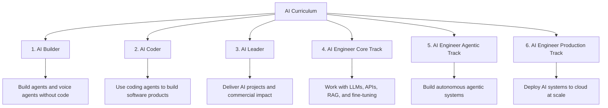
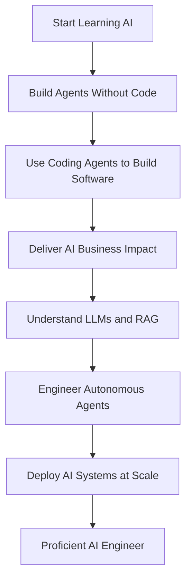

# 005 - Your Complete Path to Mastering AI Coding Agents

## Lesson Information

| Item           | Details                                                        |
| -------------- | -------------------------------------------------------------- |
| Lesson         | 005                                                            |
| Duration       | 4 minutes                                                      |
| Week           | Week 1 - Vibe Coding Foundation                                |
| Module         | Week 1 Day 1 - Introduction to AI Coding Agents                |
| Main Topic     | Complete AI learning path                                      |
| Learning Focus | Understanding how AI Coder fits into the broader AI curriculum |

---

## Lesson Overview

This lesson explains how the AI Coder course fits into the instructor’s broader AI curriculum.

The instructor answers one of the most common questions students ask:

```text
What order should I take your courses in?
```

He introduces a six-course learning path that takes students from building simple AI agents without code, to using coding agents professionally, to becoming a production-ready AI engineer capable of working with LLMs, autonomous agents, and cloud deployment at scale.

The main message is:

> The courses complement each other. Each one focuses on a different part of the modern AI skill set.

---

## The Six-Course AI Curriculum

The instructor explains that his full curriculum contains six major courses.

These courses are:

| # | Course                       | Main Focus                                                 |
| - | ---------------------------- | ---------------------------------------------------------- |
| 1 | AI Builder                   | Creating agents and voice agents without code              |
| 2 | AI Coder                     | Building software and products using coding agents         |
| 3 | AI Leader                    | Delivering AI projects and business transformation         |
| 4 | AI Engineer Core Track       | LLMs, APIs, open-source LLMs, RAG, and fine-tuning         |
| 5 | AI Engineer Agentic Track    | Agent loops, OpenAI Agents SDK, MCP, and autonomous agents |
| 6 | AI Engineer Production Track | Deploying LLMs and agents to cloud platforms at scale      |

Each course covers a different layer of AI capability.

---

## Markdown Diagram: The Complete AI Learning Path



---

# Course 1 - AI Builder

## Main Focus

AI Builder is about creating agents and voice agents without needing to write code.

The instructor mentions tools such as:

* n8n
* ElevenLabs

This course is designed for people who want to build practical AI automations and voice agent experiences without becoming traditional software developers first.

---

## What You Can Do After AI Builder

After completing AI Builder, students should be able to:

* Create AI agents
* Build voice agents
* Automate business workflows
* Use no-code or low-code tools
* Build useful AI systems without writing code manually

This course is especially suitable for non-technical learners, business operators, and builders who want practical results quickly.

---

# Course 2 - AI Coder

## Main Focus

AI Coder is the course students are currently taking.

It focuses on building software and products using coding agents such as:

* Claude Code
* Cursor
* OpenCode
* Other coding agents

The goal is to help students become highly effective at using AI agents to generate, debug, improve, and ship software.

---

## What You Can Do After AI Coder

After completing AI Coder, students should be able to:

* Use coding agents professionally
* Build software products faster
* Work with agentic coding workflows
* Use tools such as Claude Code and Cursor
* Debug and improve AI-generated code
* Deliver software with much greater speed

The instructor describes this as becoming an expert in using coding agents to deliver software with astonishing speed.

---

# Course 3 - AI Leader

## Main Focus

AI Leader is focused on commercial impact.

This course is about using AI to transform businesses, lead AI projects, and possibly start an AI business.

It is less about writing code and more about applying AI strategically.

---

## What You Can Do After AI Leader

After completing AI Leader, students should be able to:

* Deliver AI projects
* Identify business opportunities for AI
* Transform workflows with AI
* Lead AI adoption in an organization
* Think commercially about AI products and systems
* Start or support an AI business

This course is useful for people working in startups, enterprises, or leadership roles.

---

# Course 4 - AI Engineer Core Track

## Main Focus

The AI Engineer Core Track focuses on the foundations of modern AI engineering.

Topics include:

* LLMs
* APIs
* Open-source LLMs
* RAG
* Fine-tuning
* Applying and optimizing language models

This course is more technical than the first three courses.

---

## What You Can Do After the Core Track

After completing the AI Engineer Core Track, students should be able to:

* Select appropriate LLMs for real-world problems
* Use LLM APIs effectively
* Work with open-source models
* Build RAG systems
* Understand fine-tuning
* Optimize LLM-based solutions for commercial use cases

The focus is on solving real business problems with LLMs.

---

# Course 5 - AI Engineer Agentic Track

## Main Focus

The AI Engineer Agentic Track focuses on autonomous AI agents.

Topics include:

* Agent loops
* OpenAI Agents SDK
* MCP
* Autonomous agent workflows
* Agentic system design

This course builds on the core AI engineering foundation and moves into more advanced agent-based systems.

---

## What You Can Do After the Agentic Track

After completing the Agentic Track, students should be able to:

* Build autonomous AI agents
* Design agent loops
* Work with agent frameworks
* Understand MCP
* Build systems where agents use tools and make decisions
* Apply agentic workflows to real-world commercial problems

This track is for learners who want to go beyond using AI tools and start engineering agentic AI systems.

---

# Course 6 - AI Engineer Production Track

## Main Focus

The AI Engineer Production Track is about deploying AI systems at scale.

It focuses on taking LLMs and agents into real production environments using major cloud platforms.

Cloud platforms mentioned include:

* AWS
* Google Cloud Platform
* Microsoft Azure

The emphasis is on production readiness.

---

## What You Can Do After the Production Track

After completing the Production Track, students should be able to:

* Deploy LLM applications to the cloud
* Deploy agentic systems at scale
* Design resilient AI systems
* Add observability
* Improve security
* Build production-grade infrastructure
* Operate AI systems in real-world environments

This is the most technically advanced course in the curriculum.

---

## Audience Fit for Each Course

The instructor explains that the courses are designed for different levels of technical experience.

| Course Group | Best For                                                         |
| ------------ | ---------------------------------------------------------------- |
| Courses 1-3  | Technical and non-technical learners                             |
| Courses 4-5  | Technical or aspiring technical learners                         |
| Course 6     | Already technical learners or students who completed courses 1-5 |

The first three courses are suitable for a wider audience. They are useful whether students are technical, semi-technical, or business-focused.

The fourth and fifth courses are more technical and are best for people who want to become stronger AI engineers.

The sixth course is best for people who are already technical or who have completed the previous courses.

---

## Markdown Diagram: Audience Progression


---

## Recommended Course Order

The instructor says students can take the courses in any order.

However, the most natural progression is:

```text
1. AI Builder
2. AI Coder
3. AI Leader
4. AI Engineer Core Track
5. AI Engineer Agentic Track
6. AI Engineer Production Track
```

This order moves from practical AI building, to coding agents, to business impact, then into deeper technical AI engineering and production deployment.

---

## Flexible Learning Path

Although the recommended order is one through six, students do not have to follow that order exactly.

The instructor encourages students to choose the course that best matches their interests and goals.

For example:

* If you want to build software faster, start with AI Coder.
* If you want to build agents without code, start with AI Builder.
* If you want to lead AI projects, take AI Leader.
* If you want to become a technical AI engineer, focus on the AI Engineering tracks.
* If you already have technical experience, you may jump into the advanced tracks sooner.

The courses are designed to be companions, not strict prerequisites.

---

## Career Outcome

The instructor explains that completing the full six-course curriculum and the associated projects can prepare students for modern AI roles.

Possible roles include:

* AI Engineer
* Applied AI Engineer
* Forward Deployed Engineer
* Agentic AI Engineer
* AI Product Builder
* AI Solutions Engineer

The goal is to prepare students to solve real-world problems using LLMs and agents.

---

## What “Proficient AI Engineer” Means

After completing the full curriculum, students should be able to:

* Build AI agents
* Build voice agents
* Use coding agents to create software
* Deliver AI projects with business impact
* Work with LLM APIs
* Use open-source LLMs
* Build RAG systems
* Understand fine-tuning
* Build autonomous agent systems
* Deploy AI systems to cloud platforms
* Add resiliency, observability, and security
* Solve real commercial problems with LLMs and agents

This is the broader path from beginner to proficient AI engineer.

---

## Markdown Diagram: Skill Development Path



---

## Special Resource at the End of the Course

The instructor gives a practical tip.

At the very end of this course, the final lecture contains a document with:

* A summary of the courses
* Special links into the courses
* Resources for students
* Special offers available to existing students

Students are encouraged to open that final lecture and keep the document available as a useful reference.

---

## Why This Lesson Matters

This lesson matters because it helps students understand where AI Coder fits in the larger learning journey.

AI Coder is not an isolated course. It is one part of a broader roadmap for mastering modern AI tools, coding agents, AI engineering, and production deployment.

This gives students a clearer sense of direction.

They can now understand:

* What they are learning now
* What skills come before it
* What skills come after it
* How this course supports career growth
* How coding agents fit into the wider AI engineering landscape

---

## Relationship to Previous Lessons

The previous lessons introduced the course and the agentic AI coding landscape.

| Lesson     | Role                                                 |
| ---------- | ---------------------------------------------------- |
| Lesson 001 | Start building immediately with Cursor               |
| Lesson 002 | Iterate on a generated FPS game                      |
| Lesson 003 | Explain the “Missing Manual” for agentic AI coding   |
| Lesson 004 | Introduce the instructor and 3-week AI Coder roadmap |
| Lesson 005 | Place AI Coder inside the complete AI learning path  |

Lesson 005 expands the perspective from this course alone to the full AI curriculum.

---

## Learning Objectives

By the end of this lesson, students should be able to:

* Name the six courses in the instructor’s AI curriculum
* Understand what each course focuses on
* Explain how AI Coder fits into the wider learning path
* Identify which courses are best for different learner levels
* Understand the recommended course order
* See how the full curriculum supports AI engineering career goals
* Know where to find the final resource document in the course

---

## Practice Reflection

Students should reflect on the following questions:

1. Why did I choose AI Coder first?
2. Do I want to become more technical over time?
3. Which course in the wider curriculum sounds most useful for my goals?
4. Am I more interested in building products, leading AI projects, or engineering AI systems?
5. What kind of AI role do I want to prepare for?
6. Which practical project would best prove my AI skills?

---

## Key Takeaways

* The instructor has six courses in his AI curriculum.
* AI Coder is the second course in the recommended learning path.
* AI Builder focuses on no-code agents and voice agents.
* AI Coder focuses on software development with coding agents.
* AI Leader focuses on business transformation and commercial AI impact.
* The AI Engineer Core Track focuses on LLMs, APIs, RAG, open-source models, and fine-tuning.
* The AI Engineer Agentic Track focuses on autonomous agents, agent loops, MCP, and agent frameworks.
* The AI Engineer Production Track focuses on deploying LLMs and agents to the cloud at scale.
* Students can take the courses in any order, but the natural progression is one through six.
* Completing the full path can prepare students for AI Engineer, Applied AI Engineer, and Forward Deployed Engineer roles.

---

## Lesson Summary

In this lesson, the instructor explains how AI Coder fits into his complete six-course AI curriculum.

The six courses are AI Builder, AI Coder, AI Leader, AI Engineer Core Track, AI Engineer Agentic Track, and AI Engineer Production Track. Together, they cover no-code agents, coding agents, AI project leadership, LLM engineering, autonomous agents, and production cloud deployment.

The instructor explains that the first three courses are suitable for a broad audience, including both technical and non-technical learners. The fourth and fifth courses are better for technical or aspiring technical learners, while the sixth course is best for learners who are already technical or have completed the earlier courses.

Although students can take the courses in any order, the recommended path is one through six. This progression takes learners from building agents without code to becoming capable of deploying LLM and agent systems at cloud scale.

The main takeaway is that AI Coder is a key step in the larger journey toward mastering AI coding agents and becoming a proficient AI engineer.
