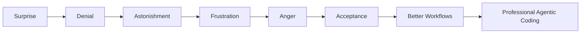
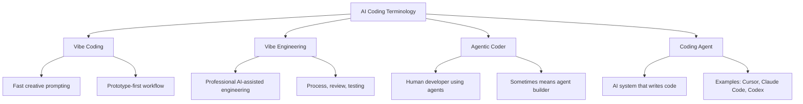
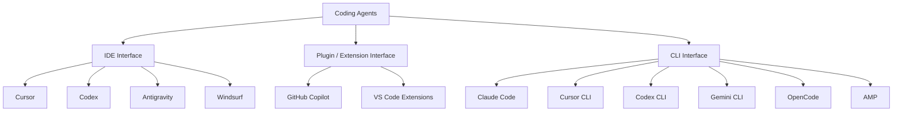
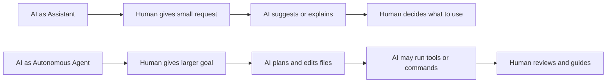

# 006 - Day 1 - Vibe Coding, Agentic Coders & Coding Agents Like Claude Code

## Lesson Information

| Item           | Details                                                                |
| -------------- | ---------------------------------------------------------------------- |
| Lesson         | 006                                                                    |
| Duration       | 9 minutes                                                              |
| Week           | Week 1 - Vibe Coding Foundation                                        |
| Module         | Week 1 Day 1 - Introduction to AI Coding Agents                        |
| Main Topic     | Vibe coding, agentic coders, and coding agents                         |
| Learning Focus | Understanding the terminology and tool landscape of AI-assisted coding |

---

## Lesson Overview

This lesson explains the key terminology and tool categories in the world of AI coding agents.

The instructor introduces concepts such as **vibe coding**, **vibe engineering**, **agentic coders**, and **coding agents**. He also explains the difference between AI tools used through an IDE, plugins, and command-line interfaces.

The main goal is to help students understand the language of this fast-moving field, while also recognizing that many terms are still evolving and may mean different things in different contexts.

The key message is:

> AI coding is moving fast, and the terminology is still messy. Focus on the concepts, workflows, and real value rather than getting distracted by hype.

---

## The Origin of Vibe Coding

The lesson begins with Andrej Karpathy’s idea of **vibe coding**.

Vibe coding refers to a style of programming where the developer gives a high-level instruction to an LLM or coding agent, lets it generate the code, and focuses more on the desired outcome than on manually writing every line.

The idea is that modern LLMs have become powerful enough that developers can sometimes “give in to the vibes” and let the model produce a working result.

In simple terms:

```text id="s9l2up"
Vibe coding means describing what you want and letting the AI generate much of the code.
```

This concept helped shape much of the AI coding movement that followed.

---

## The Emotional Journey of AI Coding

The instructor describes how many developers experienced AI coding as an emotional roller coaster.

At first, there was surprise and excitement. Developers saw AI tools create working software from simple prompts.

Then came doubt and denial. Some people pushed back against the idea that these tools could really change software development.

After trying the tools more seriously, many developers became astonished by what was possible.

But that excitement was often followed by frustration. AI agents made repeated mistakes, misunderstood requirements, generated broken code, or became difficult to guide.

Over time, many regular users reached a stage of acceptance. They began to understand where the tools were strong, where they were weak, and how to work with them more effectively.

---

## Markdown Diagram: Emotional Journey of AI Coding



---

## The 2025 Inflection Point

The instructor explains that the AI coding space improved significantly around late 2025.

He mentions newer generations of models and coding agents becoming much more capable, leading to fewer repeated mistakes and more reliable agent behavior.

This improvement created a new wave of progress in AI-assisted software development.

The important lesson is not to memorize one specific model name, but to understand the broader trend:

> Coding agents are improving quickly, and workflows that once felt unreliable are becoming more practical.

---

## Key Concept: Vibe Coding

Vibe coding can mean different things depending on who uses the phrase.

For some people, it means a casual or experimental approach:

```text id="g75wm1"
Prompt the AI, see what happens, and throw it away if it fails.
```

For others, it refers to the entire field of AI-assisted coding.

In this course, vibe coding is used mainly to describe the early, fast, creative stage of building with AI.

It is useful for:

* Rapid prototyping
* Experimentation
* Creative exploration
* Small apps
* First drafts
* Learning through building

However, vibe coding alone is not enough for serious production software.

---

## Key Concept: Vibe Engineering

The instructor introduces **vibe engineering** as a more professional version of vibe coding.

Vibe engineering means using AI agents to build software, but with more structure, discipline, and quality control.

It goes beyond simply asking an AI to generate code.

Vibe engineering includes:

* Better prompts
* Clearer requirements
* Stronger context
* Code review
* Testing
* Debugging
* Checkpoints
* Workflow design
* Professional engineering judgment

In simple terms:

```text id="sqexkv"
Vibe coding is fast and creative.
Vibe engineering is structured and professional.
```

---

## Key Concept: Agentic Coder

The term **agentic coder** can be confusing because it may be used in different ways.

In this course, an agentic coder means:

```text id="e55b6x"
A developer who uses AI agents to help build software.
```

This could involve working with one coding agent, such as Cursor or Claude Code, or coordinating multiple agents and sub-agents.

However, in other contexts, someone might use “agentic coder” to mean a developer who builds AI agents.

Because the terminology is still evolving, the instructor recommends asking for clarification when needed.

---

## Terminology Warning

Many terms in this field are still unsettled.

For example:

| Term           | Possible Meaning                                                |
| -------------- | --------------------------------------------------------------- |
| Vibe coder     | Someone casually coding with AI, or the general AI coding field |
| Vibe engineer  | Someone using AI coding agents in a more professional way       |
| Agentic coder  | Someone coding with agents, or someone building agents          |
| Coding agent   | An AI system that writes or edits code                          |
| Agentic coding | Coding with the help of AI agents                               |

The safest approach is to focus on the actual workflow being described.

If someone uses an unclear term, ask:

```text id="o4u7zq"
Do you mean a person coding with AI agents, or an AI agent that writes code?
```

---

## Markdown Diagram: AI Coding Terminology



---

## Coding Agents and Interaction Surfaces

The instructor explains that there are three main ways to interact with coding agents.

These are:

1. IDE-based coding agents
2. Plugin or extension-based coding agents
3. CLI-based coding agents

Each interface gives developers a different way to work with AI.

---

# 1. IDE-Based Coding Agents

An IDE, or Integrated Development Environment, is a full coding application with windows, menus, editors, file explorers, and built-in tools.

Cursor is the main example introduced earlier in the course.

IDE-based coding agents usually provide a visual workspace where students can:

* Open a project folder
* View files
* Chat with the agent
* Let the agent edit code
* Review changes
* Run or preview the project

Examples include:

* Cursor
* Codex
* Google Antigravity
* Windsurf

---

## IDE-Based Agent Workflow

A typical IDE-based workflow looks like this:

```text id="cced3y"
1. Open a project folder
2. Chat with the AI agent
3. Ask it to create or edit files
4. Review changes in the editor
5. Run the project
6. Continue iterating
```

IDE-based agents are beginner-friendly because students can see the project files and chat interface in one place.

---

# 2. Plugin or Extension-Based Coding Agents

The second interaction surface is a plugin or extension.

This usually means adding an AI coding assistant to an existing editor such as VS Code.

The most famous example is:

```text id="118bum"
GitHub Copilot
```

Plugins are useful because they allow developers to keep using a familiar development environment while adding AI assistance.

Plugin-based agents can help with:

* Autocomplete
* Code suggestions
* Inline edits
* Chat-based coding help
* Explaining code
* Generating functions
* Working inside an existing editor

---

## Plugin-Based Agent Workflow

A typical plugin-based workflow looks like this:

```text id="0403q0"
1. Open VS Code or another supported editor
2. Install the AI coding extension
3. Write or select code
4. Ask the extension for help
5. Accept, reject, or modify suggestions
6. Continue coding inside the editor
```

This interface is often comfortable for developers who already use VS Code daily.

---

# 3. CLI-Based Coding Agents

The third interaction surface is the command-line interface, or CLI.

A CLI usually runs in a terminal window. It may look old-fashioned, but it has become one of the most powerful ways to work with coding agents.

The instructor explains that Claude Code helped popularize this style.

A CLI coding agent lets developers work with AI directly from the terminal, often inside a real project directory.

Examples include:

* Claude Code
* Cursor CLI
* Codex CLI
* Gemini CLI
* OpenCode
* AMP

The instructor emphasizes that this retro-looking interface has become surprisingly productive.

---

## CLI-Based Agent Workflow

A typical CLI workflow looks like this:

```text id="q5jc6h"
1. Open a terminal
2. Navigate to a project directory
3. Start the coding agent
4. Give the agent a task
5. Let it inspect and edit files
6. Review changes
7. Run commands and tests
8. Iterate until the result works
```

CLI-based agents are especially powerful for professional workflows because they fit naturally into real development environments.

---

## Markdown Diagram: Three Coding Agent Interfaces



---

## Coding Agents vs Autocomplete

A major distinction in this lesson is that coding agents are not just autocomplete tools.

Traditional autocomplete suggests the next few words, lines, or code snippets.

A coding agent can do more.

A coding agent may:

* Understand a broader task
* Inspect project files
* Plan a solution
* Create new files
* Edit multiple files
* Run commands
* Debug errors
* Apply changes across a codebase
* Work through an iterative workflow

In simple terms:

| Autocomplete                    | Coding Agent                               |
| ------------------------------- | ------------------------------------------ |
| Suggests code as you type       | Works on larger tasks                      |
| Usually local and short-context | Can inspect project context                |
| Helps write individual lines    | Can create and modify files                |
| Passive assistant               | Active collaborator                        |
| Limited workflow control        | Can participate in debugging and iteration |

---

## AI as Assistant vs AI as Autonomous Agent

The instructor also introduces an important distinction between using AI as an assistant and using AI as an autonomous agent.

---

## AI as Assistant

AI acts as an assistant when the human remains highly involved in each step.

Examples:

* Asking for an explanation
* Getting autocomplete suggestions
* Asking for a function
* Asking for debugging advice
* Requesting a small refactor
* Asking for code comments

The human controls the process closely.

---

## AI as Autonomous Agent

AI acts more like an autonomous agent when it is given a larger goal and allowed to plan, edit, and execute multiple steps.

Examples:

* Build a feature across several files
* Create a small application
* Debug a failing project
* Refactor a module
* Add tests and run them
* Implement a UI change
* Build a prototype from a prompt

The human still supervises, but the AI has more room to act.

---

## Markdown Diagram: Assistant vs Autonomous Agent



---

## Why CLI Coding Became Popular

The instructor explains that CLI coding may look old-fashioned, but it became popular because it works extremely well with coding agents.

A terminal-based interface allows agents to:

* Work directly inside a project
* Run commands
* Inspect files
* Execute tests
* Use development tools
* Fit into existing engineering workflows
* Support professional development habits

This is why tools like Claude Code became so influential.

The interface may look simple, but the workflow can be very powerful.

---

## Fast-Moving Tool Landscape

The instructor warns that this space changes very quickly.

New tools appear constantly. Existing tools add new features. Some tools become important, while others fade away.

Because of this, students should develop the skill of separating signal from noise.

---

## Signal vs Noise

In the AI coding world, there is a constant stream of announcements, demos, tools, and hype.

Some tools are genuinely important. Others may be popular for a short time and then disappear.

Students should learn to ask:

* Does this tool solve a real problem?
* Does it improve my workflow?
* Is it reliable enough to use?
* Does it integrate with my projects?
* Is it just hype, or does it create real value?
* Is it worth learning deeply, or just worth being aware of?

The instructor recommends focusing on durable value rather than chasing every new trend.

---

## Example: Claude Code as Signal

The instructor presents Claude Code as an example of a tool that created real value.

It helped popularize CLI-based agentic coding and influenced many other tools.

After Claude Code became successful, many other platforms introduced CLI versions.

This shows how one useful tool can shape the direction of the whole AI coding landscape.

---

## Key Concept: Ambiguity in Tool Categories

Tool categories are useful, but they are not always perfectly clean.

For example, Claude Code is mainly a CLI tool, but it may also have extensions or integrations with editors like VS Code or Cursor.

So a tool can sometimes belong to more than one category.

The important point is to understand its primary mode of use.

For Claude Code, the main identity is:

```text id="a9tu49"
Claude Code is primarily a CLI coding agent.
```

---

## Practical Advice for Students

Students should not worry if the terminology feels confusing at first.

The instructor’s advice is:

```text id="egb2ss"
When in doubt, ask what someone means by the term they are using.
```

Students should focus on building a practical mental model:

* What does the tool do?
* Where does it run?
* How does it interact with code?
* How much autonomy does it have?
* What kind of workflow does it support?
* How do I review and control its output?

---

## Why This Lesson Matters

This lesson matters because students need a vocabulary for the rest of the course.

Before learning more advanced workflows, students must understand the basic landscape:

* What vibe coding means
* What vibe engineering means
* What an agentic coder is
* What coding agents are
* What IDE, plugin, and CLI interfaces are
* Why Claude Code is important
* Why the AI coding space can feel noisy and confusing

This vocabulary makes later lessons easier to understand.

---

## Relationship to Previous Lessons

The earlier lessons introduced the course through hands-on demos and high-level motivation.

| Lesson     | Role                                                   |
| ---------- | ------------------------------------------------------ |
| Lesson 001 | Build something immediately with Cursor                |
| Lesson 002 | Iterate on an FPS game with a Cursor agent             |
| Lesson 003 | Explain the “Missing Manual” for agentic AI coding     |
| Lesson 004 | Introduce the instructor and 3-week roadmap            |
| Lesson 005 | Place AI Coder in the broader AI curriculum            |
| Lesson 006 | Define the core terms and tool categories of AI coding |

Lesson 006 gives students the language needed to discuss the tools and workflows used throughout the course.

---

## Learning Objectives

By the end of this lesson, students should be able to:

* Explain what vibe coding means
* Understand how vibe engineering differs from casual vibe coding
* Define agentic coder in the context of this course
* Understand that terminology in this field can be ambiguous
* Identify the three main surfaces for coding agents: IDE, plugin, and CLI
* Give examples of tools in each category
* Explain why Claude Code is mainly a CLI coding agent
* Distinguish between autocomplete and coding agents
* Distinguish between AI as an assistant and AI as an autonomous agent
* Understand why signal vs noise matters in the AI coding landscape

---

## Practice Reflection

Students should reflect on the following questions:

1. Have I used AI more like autocomplete, an assistant, or an autonomous agent?
2. Which interface feels most comfortable to me: IDE, plugin, or CLI?
3. Do I prefer visual tools like Cursor or terminal-based tools like Claude Code?
4. Have I ever accepted AI-generated code without reviewing it?
5. What kind of AI coding workflow do I want to become good at?
6. How can I avoid being distracted by every new AI coding tool announcement?

---

## Suggested Practice

Students can try comparing different AI coding surfaces.

For example:

1. Use Cursor as an IDE-based agent.
2. Use GitHub Copilot inside VS Code as a plugin-based assistant.
3. Try a CLI coding agent such as Claude Code, Codex CLI, or Gemini CLI if available.
4. Give each tool a similar small task.
5. Compare how each tool feels.

Possible task:

```text id="hi4n7m"
Create a simple landing page with a title, subtitle, call-to-action button, and responsive layout.
```

After testing, students should ask:

* Which tool was easiest to start with?
* Which tool gave the most control?
* Which tool felt most professional?
* Which tool was best for editing across files?
* Which tool was best for quick suggestions?

---

## Key Takeaways

* Vibe coding started as a term for fast, high-level AI-assisted programming.
* Vibe coding can mean different things depending on context.
* Vibe engineering refers to a more professional and structured use of AI coding agents.
* An agentic coder, in this course, means a developer who codes with help from AI agents.
* Coding agents are AI systems that can write, edit, and sometimes run code.
* AI coding agents can be used through IDEs, plugins, or CLI tools.
* Cursor is an IDE-based coding agent.
* GitHub Copilot is a common plugin-based AI coding tool.
* Claude Code is primarily a CLI coding agent.
* Coding agents are more powerful than simple autocomplete.
* AI can be used as a small assistant or as a more autonomous agent.
* The AI coding landscape moves quickly, so students must learn to separate signal from noise.

---

## Lesson Summary

In this lesson, the instructor explains the core terminology of AI-assisted coding.

The lesson begins with the idea of vibe coding, a term popularized by Andrej Karpathy to describe a style of building software by giving high-level instructions to an LLM and letting it generate code. The instructor then explains that the AI coding world has gone through waves of excitement, frustration, acceptance, and renewed progress as coding agents have improved.

The lesson clarifies several important terms. Vibe coding is the fast and creative style of AI-assisted building. Vibe engineering is the more professional version that involves process, review, debugging, and quality control. An agentic coder, in this course, means a human developer who uses AI agents to help build software.

The instructor also explains the three main ways to interact with coding agents: IDE-based tools such as Cursor, plugin-based tools such as GitHub Copilot, and CLI-based tools such as Claude Code. He emphasizes that CLI coding has become surprisingly powerful and popular because it works well with real development workflows.

Finally, the lesson warns students that the AI coding space is full of noise, new tools, and changing terminology. Students should focus on real value, durable workflows, and practical understanding rather than chasing every new announcement.

This lesson gives students the vocabulary and mental model needed for the rest of the course.

---

# Bài luyện tập

## Mục tiêu


## Đề bài


## Yêu cầu hoàn thành

- [ ] 
- [ ] 
- [ ] 

## Kết quả / lời giải


## Ghi chú
