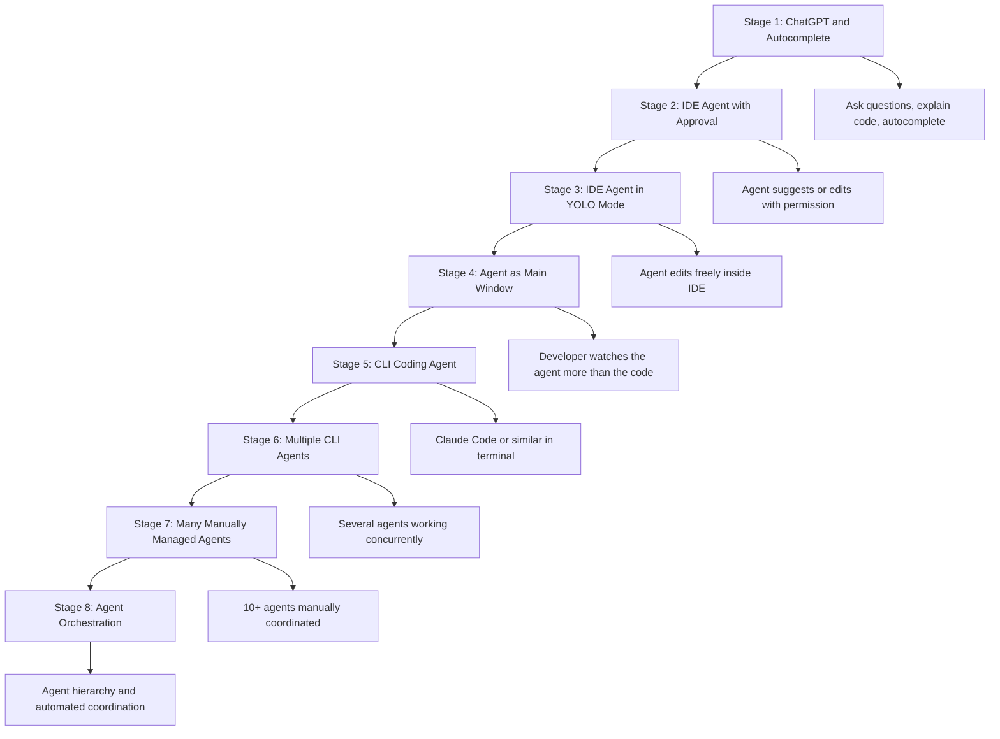
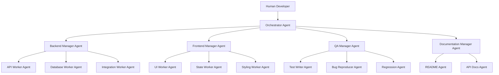
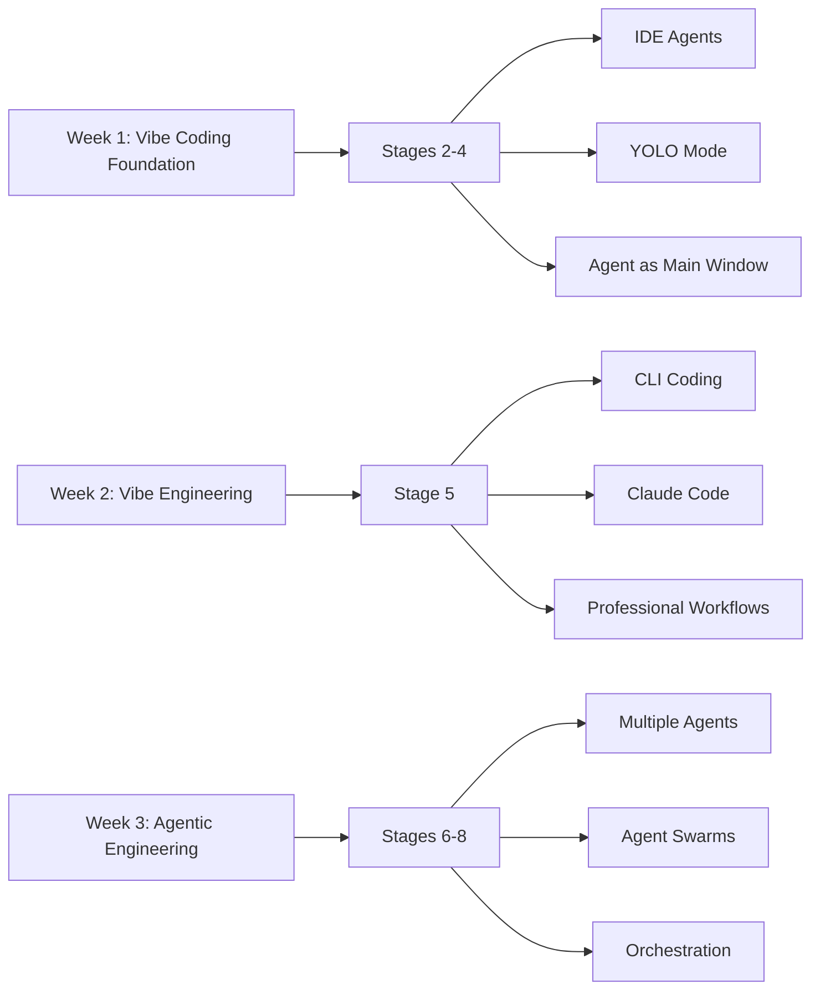
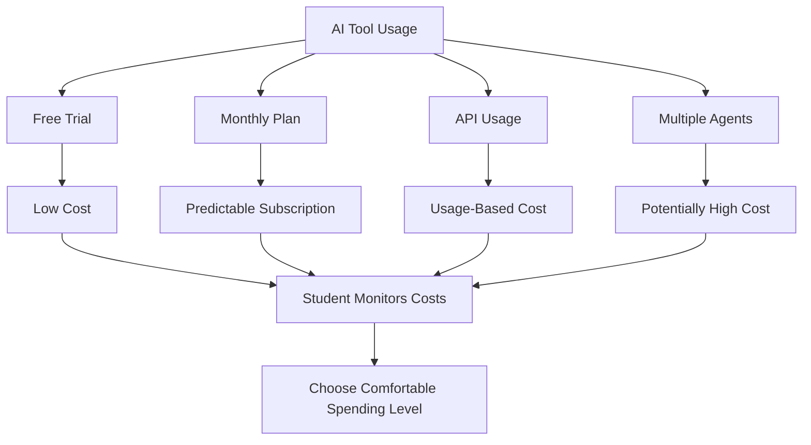

# 007 - Day 1 - The 8 Stages of AI Coding: From ChatGPT to Agent Orchestration

## Lesson Information

| Item           | Details                                                                          |
| -------------- | -------------------------------------------------------------------------------- |
| Lesson         | 007                                                                              |
| Duration       | 11 minutes                                                                       |
| Week           | Week 1 - Vibe Coding Foundation                                                  |
| Module         | Week 1 Day 1 - Introduction to AI Coding Agents                                  |
| Main Topic     | The 8 stages of AI coding maturity                                               |
| Learning Focus | Understanding the journey from simple AI assistance to multi-agent orchestration |

---

## Lesson Overview

This lesson introduces an 8-stage model for understanding how developers mature in their use of AI coding tools.

The instructor uses a framework inspired by Steve Yegge’s writing on the stages of becoming an AI coder. The stages begin with simple ChatGPT usage and autocomplete, then move through IDE-based coding agents, YOLO mode, CLI agents, multiple agents, and finally fully orchestrated agent systems.

The key message is:

> AI coding maturity is a progression. You move from asking AI for help, to collaborating with one agent, to coordinating many agents, and eventually to orchestrating agent teams.

---

## Why This Lesson Matters

This lesson gives students a map of the journey they are about to take.

Instead of seeing AI coding as one single skill, students learn that there are multiple levels of sophistication. Each stage gives the developer more leverage, but also introduces more responsibility, cost, and complexity.

The 8-stage model helps students understand:

* Where they are now
* What skills come next
* Why CLI coding matters
* Why multi-agent workflows are powerful
* Why orchestration is the advanced frontier
* Why the most advanced workflow is not always the best workflow for enterprise software

---

## The 8 Stages of AI Coding

The 8 stages describe the evolution from basic AI assistance to advanced agent orchestration.

| Stage   | Name                         | Main Idea                                                      |
| ------- | ---------------------------- | -------------------------------------------------------------- |
| Stage 1 | ChatGPT and Autocomplete     | Use AI as a helper for explanations, snippets, and suggestions |
| Stage 2 | IDE Agent with Approval      | Use an IDE sidebar agent that asks before making changes       |
| Stage 3 | IDE Agent in YOLO Mode       | Let the IDE agent make changes without approving every step    |
| Stage 4 | Agent as Main Window         | Focus mainly on the agent’s activity instead of the code       |
| Stage 5 | CLI Coding Agent             | Use tools like Claude Code from the terminal                   |
| Stage 6 | Multiple CLI Agents          | Run several agents concurrently on one project                 |
| Stage 7 | Many Manually Managed Agents | Coordinate 10 or more agents yourself                          |
| Stage 8 | Agent Orchestration          | Use agents to manage other agents in structured teams          |

---

## Markdown Diagram: The 8 Stages of AI Coding



---

# Stage 1 - ChatGPT and Autocomplete

Stage 1 is the starting point for most developers.

At this stage, AI is used as a basic assistant.

Common examples include:

* Asking ChatGPT to explain code
* Asking for code snippets
* Asking for debugging advice
* Using autocomplete while writing code
* Asking the AI to explain an error message
* Asking for a function or small utility

The AI does not control the project. It simply helps the developer think, write, and understand.

---

## Stage 1 Workflow

```text
1. Developer has a question or coding task
2. Developer asks ChatGPT or uses autocomplete
3. AI gives an explanation, suggestion, or snippet
4. Developer manually applies or edits the result
```

This stage is useful, but it does not yet represent full agentic coding.

---

# Stage 2 - IDE Agent with Approval

Stage 2 begins when the developer uses a coding agent inside an IDE, such as Cursor or VS Code.

The agent may appear in a sidebar and can suggest changes or edit files.

However, the important feature of this stage is that the agent still asks for permission before making code changes.

The developer remains highly involved.

---

## Stage 2 Characteristics

At this stage:

* The agent lives inside the IDE
* The agent can inspect project files
* The agent can suggest edits
* The agent asks for approval before changing code
* The developer checks each step
* The workflow feels safe and controlled

This is a good stage for beginners because it builds trust gradually.

---

# Stage 3 - IDE Agent in YOLO Mode

Stage 3 is similar to Stage 2, but with much more trust given to the agent.

The instructor calls this **YOLO mode**.

YOLO means:

```text
You Only Live Once
```

In this context, it means the developer allows the agent to make changes without approving every single step.

The developer essentially says:

```text
Go ahead. I trust you. Make the changes.
```

---

## Stage 3 Characteristics

At this stage:

* The agent still runs inside the IDE
* The agent edits files more freely
* The developer does not approve every change
* The agent has more autonomy
* The developer reviews after the fact

This increases speed, but it also increases risk.

The developer must still test and review the output carefully.

---

# Stage 4 - Agent as Main Window

Stage 4 is a conceptual shift.

The coding agent is no longer just a sidebar helper. Instead, it becomes the main focus of attention.

The developer watches what the agent is doing, reads its reasoning or progress messages, and occasionally checks code diffs.

The key difference is:

```text
In Stage 3, your attention is still partly on the code.
In Stage 4, your attention is mainly on the agent.
```

The developer may even walk away and let the agent work for a while, then return to review the result.

---

## Stage 4 Characteristics

At this stage:

* The agent becomes the main interface
* Code diffs may appear in the background
* The developer watches the agent’s process
* The developer checks output occasionally
* The workflow feels more autonomous

Stages 1 to 4 are mostly associated with IDE-based tools such as Cursor or VS Code.

---

# Stage 5 - CLI Coding Agent

Stage 5 is where the workflow moves from the IDE to the command line.

The developer now uses a CLI coding agent such as:

* Claude Code
* OpenCode
* Codex CLI
* Cursor CLI
* Gemini CLI

The agent runs in the terminal and works directly inside the project directory.

---

## Stage 5 Characteristics

At this stage:

* The agent works in the CLI
* The developer gives it tasks from the terminal
* It inspects files
* It edits files
* It may run commands
* It may run tests
* Diffs and progress scroll by in the terminal
* The developer may let it work with minimal interruption

This stage is a major turning point because CLI agents fit naturally into professional software development workflows.

---

## Why Stage 5 Matters

The instructor sees Stage 5 as one of the most important levels in the course.

CLI agents can be powerful because they can:

* Work directly in real repositories
* Use project commands
* Run tests
* Inspect errors
* Modify multiple files
* Support serious debugging
* Fit into existing developer workflows

Week 2 of the course focuses heavily on Stage 5.

---

# Stage 6 - Multiple CLI Agents

Stage 6 extends Stage 5 by running multiple agents concurrently.

Instead of working with one coding agent, the developer may spawn several agents and assign them different tasks.

For example:

| Agent   | Possible Task         |
| ------- | --------------------- |
| Agent 1 | Implement the feature |
| Agent 2 | Write tests           |
| Agent 3 | Review code quality   |
| Agent 4 | Investigate bugs      |
| Agent 5 | Improve documentation |

This creates a small AI-assisted development team.

---

## Stage 6 Characteristics

At this stage:

* Multiple agents run at the same time
* Each agent may work on a different part of the project
* The developer coordinates their work
* The workflow becomes more leveraged
* There is more need for review and integration

This stage can create enormous productivity, but it requires stronger coordination.

---

# Stage 7 - Many Manually Managed Agents

Stage 7 increases the scale.

The developer may now manage 10 or more agents manually.

This can feel like coordinating a large team of AI workers.

The developer starts agents, assigns tasks, watches progress, merges results, and resolves conflicts.

---

## Stage 7 Characteristics

At this stage:

* Many agents run concurrently
* The developer manually manages coordination
* There may be many moving parts
* The workflow can become powerful but chaotic
* The developer needs strong process and discipline

This is highly leveraged, but not always practical for every team or enterprise environment.

---

# Stage 8 - Agent Orchestration

Stage 8 is the most advanced stage.

At this level, agents manage other agents.

Instead of the human manually coordinating every agent, an orchestrator agent assigns tasks, tracks progress, and manages specialized worker agents.

There may even be a hierarchy:

```text
Lead Agent
├── Manager Agent: Backend Team
│   ├── Worker Agent: API
│   ├── Worker Agent: Database
│   └── Worker Agent: Tests
├── Manager Agent: Frontend Team
│   ├── Worker Agent: UI
│   ├── Worker Agent: State Management
│   └── Worker Agent: Styling
└── Manager Agent: QA Team
    ├── Worker Agent: Test Coverage
    ├── Worker Agent: Bug Reproduction
    └── Worker Agent: Regression Checks
```

This is full agent orchestration.

---

## Markdown Diagram: Agent Orchestration



---

## Mapping the 8 Stages to This Course

The instructor explains how the course maps to the 8-stage model.

| Course Section | Stages Covered     | Focus                                         |
| -------------- | ------------------ | --------------------------------------------- |
| Week 1         | Stages 2, 3, and 4 | IDE agents, Cursor, sidebar agents, YOLO mode |
| Week 2         | Stage 5            | CLI coding agents, especially Claude Code     |
| Week 3         | Stages 6, 7, and 8 | Multiple agents, agent swarms, orchestration  |

Stage 1 is not emphasized because most students are already familiar with basic ChatGPT usage.

---

## Markdown Diagram: Course Mapping



---

## The Enterprise Sweet Spot

Although Stage 8 is the most advanced stage, the instructor explains that the most advanced approach is not always the best approach for enterprise software.

For serious commercial development, he argues that the practical sweet spot is often somewhere between:

```text
Stage 5 and Stage 6
```

That means:

* One strong CLI coding agent
* Or a small group of well-managed agents
* With clear human review
* With tests and quality control
* With professional workflow discipline

This approach can deliver high-quality, reliable, scalable software without becoming too chaotic.

---

## Why Stage 5 and Stage 6 Are Powerful

Stages 5 and 6 are especially valuable because they balance speed and control.

They allow developers to:

* Use powerful coding agents
* Work in real repositories
* Run real tests
* Debug real issues
* Assign parallel tasks
* Keep human oversight
* Avoid excessive orchestration complexity

This makes them practical for enterprise and commercial software teams.

---

## Important Warning About Advanced Stages

Stages 7 and 8 are exciting, but they may not always be practical in today’s enterprise environment.

The instructor will still show them so students understand what is possible.

However, students should not assume that more agents always means better results.

More agents can also mean:

* More coordination overhead
* More conflicts
* More review burden
* More cost
* More complexity
* More ways for things to go wrong

The goal is not to use the most advanced stage for every task.

The goal is to choose the right workflow for the job.

---

# AI Cost Discussion

The lesson also includes an important discussion about AI costs.

The instructor explains that students can take the entire course without spending money on API costs.

However, students can also spend a lot if they choose to use paid plans, run many agents, or use powerful models extensively.

The key message is:

> You are responsible for monitoring and controlling your AI costs.

---

## Free vs Paid Path

Students have two broad options.

| Path      | Description                                                                            |
| --------- | -------------------------------------------------------------------------------------- |
| Free Path | Watch demos, use free trials, use free models where possible, skip paid-only parts     |
| Paid Path | Use paid tools such as Claude Code or other subscriptions for deeper hands-on practice |

The instructor recommends paid tools only when students are comfortable with the cost.

---

## Suggested Cost Approach

The instructor’s practical recommendation is:

```text
1. Use Cursor while you still have access to a free trial or free period.
2. Consider a $20/month Claude Code plan for Weeks 2 and 3.
3. Only spend more if you intentionally want a more intense hands-on experience.
```

This is a recommendation, not a requirement.

Students do not need to spend money to follow the course conceptually.

---

## Cost Responsibility

The instructor makes it clear that he can help explain tools, workflows, and where to check costs, but he cannot take responsibility for each student’s spending.

AI pricing can vary by:

* Platform
* Region
* Subscription plan
* Free trial availability
* Special offers
* Usage volume
* Model choice
* API usage

Because of this, students must make their own decisions about what they are comfortable spending.

---

## Why AI Tools Cost Money

The instructor explains that AI tools require significant compute.

Behind the scenes, advanced models perform enormous amounts of computation. That compute costs money in infrastructure and electricity.

Students may be used to paying once for a laptop, but AI tools often charge monthly or by usage.

This new cost model can feel frustrating, but it reflects the ongoing compute cost of using powerful AI systems.

---

## Golden Rule for AI Costs

The golden rule is:

```text
You are in charge of your AI costs.
```

Students should:

* Check pricing before subscribing
* Monitor usage
* Set limits where possible
* Use free plans when appropriate
* Avoid running unnecessary large agent workflows
* Understand what each platform charges for
* Stop or downgrade tools they no longer need

The instructor will provide transparency and guidance, but the final responsibility belongs to the student.

---

## Markdown Diagram: AI Cost Control



---

## Relationship to Previous Lessons

This lesson builds on the earlier terminology and roadmap lessons.

| Lesson     | Role                                            |
| ---------- | ----------------------------------------------- |
| Lesson 001 | First hands-on Cursor demo                      |
| Lesson 002 | Iterating with a Cursor AI Agent                |
| Lesson 003 | The Missing Manual for agentic AI coding        |
| Lesson 004 | Instructor and 3-week roadmap                   |
| Lesson 005 | Complete AI curriculum path                     |
| Lesson 006 | Vibe coding, coding agents, and tool interfaces |
| Lesson 007 | The 8 stages of AI coding maturity              |

Lesson 007 gives students a maturity model for understanding how their agentic coding skills will evolve throughout the course.

---

## Learning Objectives

By the end of this lesson, students should be able to:

* Explain the 8 stages of AI coding maturity
* Understand the difference between IDE-based and CLI-based AI coding workflows
* Define YOLO mode in the context of coding agents
* Explain why Stage 5 is important for professional workflows
* Understand the role of multiple agents in Stage 6
* Describe agent orchestration in Stage 8
* Map the 8 stages to the three weeks of the course
* Understand why Stage 5 and Stage 6 may be the enterprise sweet spot
* Recognize that more agents can create more complexity
* Understand the importance of monitoring AI costs

---

## Practice Reflection

Students should reflect on the following questions:

1. Which stage am I currently at?
2. Have I mostly used ChatGPT, autocomplete, an IDE agent, or a CLI agent?
3. Would I feel comfortable letting an agent edit files automatically?
4. What risks do I see in YOLO mode?
5. Why might CLI coding be more powerful than an IDE sidebar?
6. When would multiple agents be useful?
7. When might multiple agents become too chaotic?
8. What AI tool costs am I comfortable with?
9. How will I monitor my spending while experimenting?

---

## Suggested Practice

Students can try identifying their current AI coding workflow.

Use this simple self-assessment:

| Question                                               | Answer  |
| ------------------------------------------------------ | ------- |
| Do I ask ChatGPT coding questions?                     | Stage 1 |
| Do I use autocomplete or Copilot suggestions?          | Stage 1 |
| Do I use Cursor or an IDE sidebar agent with approval? | Stage 2 |
| Do I let the IDE agent edit freely?                    | Stage 3 |
| Do I mainly watch the agent instead of the code?       | Stage 4 |
| Do I use Claude Code or another CLI agent?             | Stage 5 |
| Do I run multiple agents at the same time?             | Stage 6 |
| Do I manually coordinate many agents?                  | Stage 7 |
| Do I use agents to orchestrate other agents?           | Stage 8 |

Students should use this to understand their current position and what they want to learn next.

---

## Key Takeaways

* AI coding maturity can be understood as an 8-stage progression.
* Stage 1 is basic ChatGPT and autocomplete usage.
* Stages 2 to 4 involve IDE-based coding agents.
* Stage 3 introduces YOLO mode, where the agent can make changes more freely.
* Stage 4 shifts attention from the code to the agent’s process.
* Stage 5 moves into CLI coding agents such as Claude Code.
* Stage 6 involves multiple agents working concurrently.
* Stage 7 involves manually coordinating many agents.
* Stage 8 involves agent orchestration, where agents manage other agents.
* Week 1 focuses mainly on Stages 2 to 4.
* Week 2 focuses heavily on Stage 5.
* Week 3 introduces Stages 6 to 8.
* For enterprise software, Stage 5 to Stage 6 may be the practical sweet spot.
* Students are responsible for monitoring their own AI tool costs.

---

## Lesson Summary

In this lesson, the instructor introduces an 8-stage model for understanding the journey of becoming an advanced AI coder.

The stages begin with simple ChatGPT usage and autocomplete, then move into IDE-based coding agents, YOLO mode, and agent-first workflows. The journey then continues into CLI coding agents such as Claude Code, multiple concurrent agents, manually managed agent teams, and finally fully orchestrated agent systems where agents manage other agents.

The instructor explains how these stages map to the course. Week 1 focuses on IDE-based agent workflows, Week 2 goes deep into CLI coding, and Week 3 explores multi-agent and orchestration patterns.

The lesson also makes an important practical point: the most advanced stage is not always the most useful stage. For commercial and enterprise software, the sweet spot may often be Stage 5 or Stage 6, where developers get strong AI leverage while still maintaining control and quality.

Finally, the instructor discusses AI costs. Students can complete the course without spending money, but paid tools may offer a richer hands-on experience. The golden rule is that students must monitor and control their own AI costs.

This lesson gives students both a maturity model for AI coding and a realistic view of the costs and responsibilities involved in using modern coding agents.

---

# Bài luyện tập

## Mục tiêu


## Đề bài


## Yêu cầu hoàn thành

- [ ] 
- [ ] 
- [ ] 

## Kết quả / lời giải


## Ghi chú
