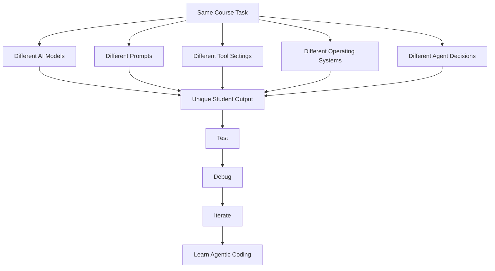
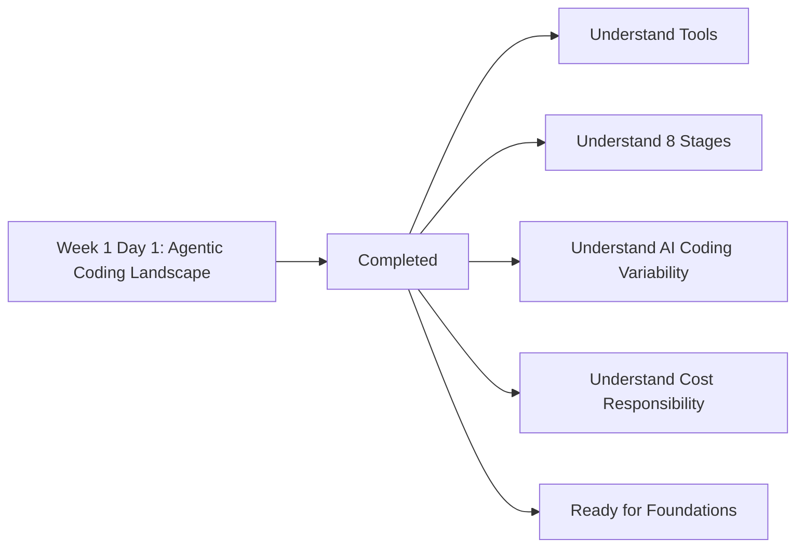

# 008 - Day 1 - Wrapping Up: Your Unique Agentic Coding Journey Ahead

## Lesson Information

| Item           | Details                                                            |
| -------------- | ------------------------------------------------------------------ |
| Lesson         | 008                                                                |
| Duration       | 4 minutes                                                          |
| Week           | Week 1 - Vibe Coding Foundation                                    |
| Module         | Week 1 Day 1 - Introduction to AI Coding Agents                    |
| Main Topic     | Day 1 wrap-up and next steps                                       |
| Learning Focus | Understanding that each learner’s AI coding journey will be unique |

---

## Lesson Overview

This lesson wraps up Day 1 of the AI Coder course.

The instructor reminds students that agentic AI coding is a fast-moving and sometimes confusing field. Tools, models, and workflows change quickly, so students should focus on durable principles rather than getting distracted by every new announcement.

The key message is:

> AI coding agents are powerful tools, but every learner will have a slightly different experience. Your job is to experiment, review, ask questions, and keep improving.

---

## The Current AI Coding Landscape Is Confusing

The instructor begins by acknowledging that this is a confusing time in software development.

AI coding tools are evolving quickly. New models, products, features, and announcements appear constantly.

Because of this, students should:

* Keep an eye on documentation
* Check course resources
* Use the Q&A section
* Ask questions when confused
* Avoid being distracted by hype
* Focus on real value instead of temporary noise

The instructor will try to keep resources updated, but students should expect change as a normal part of the learning experience.

---

## Do Not Get Distracted by Noise

The instructor warns that the AI coding space contains a lot of noise.

There is constant excitement around new announcements, but not every announcement becomes important.

Some tools or trends may look exciting for a few days, then disappear or become irrelevant.

Students should learn to ask:

```text
Is this actually useful for building better software, or is it just hype?
```

This mindset helps students stay focused on practical skills rather than chasing every new tool.

---

## Models Will Keep Improving

The instructor explains that students may use stronger models than the ones shown in the course.

Because AI models improve rapidly, students may get:

* Different results
* Inconsistent results
* Better results
* Unexpected outputs
* More capable code generation

This is not a problem. It is part of the course experience.

Students are encouraged to enjoy the uniqueness of their results and share what they discover.

---

## Every Project Will Be Different

This course is different from many traditional programming courses.

In a normal coding course, every student may run the same code and get the same output.

In this course, that will not always happen.

Because AI agents generate different outputs, each project may become a unique version of the same idea.

The instructor describes this as a kind of:

```text
Choose-your-own-adventure experience
```

This makes the course more exciting, but it also creates challenges.

---

## Why Different Outputs Matter

Different outputs mean students may see:

* Different code structures
* Different UI designs
* Different bugs
* Different feature choices
* Different file layouts
* Different implementation quality
* Different levels of success

This is normal when working with AI coding agents.

The important skill is not to copy the instructor exactly. The important skill is to learn how to guide, test, debug, and improve the agent’s output.

---

## Markdown Diagram: Why AI Coding Results Differ



---

## The Challenge of Unique Results

The instructor points out that unique results can make support more difficult.

If a student’s project fails, the instructor may not be able to reproduce the exact same issue because the AI may have generated different code.

However, this is also part of real agentic coding.

Students must learn how to:

* Describe problems clearly
* Share relevant details
* Ask the agent to debug
* Ask for help in the Q&A
* Compare their output with the lesson goal
* Iterate instead of giving up

This prepares students for real-world AI-assisted development.

---

## Instructor Support

The instructor emphasizes that students are not alone.

He explains that support is part of the course experience and encourages students to contact him through:

* Udemy Q&A
* Email
* LinkedIn

He says he enjoys helping students and encourages them to ask questions whenever they get stuck.

The message is:

```text
Do not struggle silently. Ask for help.
```

---

## Sharing Progress Publicly

The instructor also encourages students to share their learning progress on LinkedIn.

Posting about projects, experiments, and course progress can help students:

* Build visibility
* Show their growing expertise
* Demonstrate practical AI coding skills
* Connect with others in the field
* Get feedback and encouragement

If students tag the instructor, he may comment and help amplify their progress.

---

## Day 1 Completed

The instructor returns to the three-week course roadmap and marks the first box as complete.

Students have now completed:

```text
Week 1 Day 1 - The Agentic Coding Landscape
```

This means students now have an initial understanding of:

* The agentic coding landscape
* The 8 stages of AI coding
* IDE-based coding agents
* CLI-based coding agents
* Coding tools such as Cursor and Claude Code
* The difference between casual and professional AI coding
* The importance of cost awareness
* The fact that outputs will vary

---

## Markdown Diagram: Day 1 Completion



---

## What Comes Next

The next lesson moves into the foundations of agentic coding.

Tomorrow’s topics include:

* Agents
* The `agents.md` file
* Context
* How agents use project information
* How to think about agent behavior
* How to prepare better instructions for coding agents

This next stage will help students understand the technical and conceptual foundation behind the tools they have already seen.

---

## Course Progress

The instructor celebrates that students are now:

```text
7% complete with the course
```

This gives students a sense of progress and momentum.

There is still 93% of the course left, but Day 1 has established the landscape and prepared students for deeper foundations.

---

## Relationship to Previous Lessons

Day 1 introduced the overall landscape of AI coding agents.

| Lesson     | Role                                                  |
| ---------- | ----------------------------------------------------- |
| Lesson 001 | Welcome and first Cursor AI demo                      |
| Lesson 002 | Build and iterate on an FPS game                      |
| Lesson 003 | Explain the “Missing Manual” for agentic AI coding    |
| Lesson 004 | Meet the instructor and review the 3-week roadmap     |
| Lesson 005 | Understand the full AI curriculum path                |
| Lesson 006 | Define vibe coding, agentic coders, and coding agents |
| Lesson 007 | Learn the 8 stages of AI coding maturity              |
| Lesson 008 | Wrap up Day 1 and prepare for foundations             |

Lesson 008 closes the first day and prepares students to move from landscape awareness into deeper technical understanding.

---

## Learning Objectives

By the end of this lesson, students should be able to:

* Understand why AI coding results will vary between students
* Recognize that tool and model changes are normal in this field
* Avoid getting distracted by hype and temporary noise
* Use documentation, resources, and Q&A for support
* Understand that AI coding projects are not always reproducible in a traditional way
* See each project as a chance to practice debugging and iteration
* Know what topics will be covered next
* Feel a sense of progress after completing Day 1

---

## Key Concept: Unique Agentic Coding Journey

A major idea in this lesson is that every learner will have a unique journey.

Because AI agents are stochastic and tools evolve quickly, students should not expect identical results.

Instead, they should focus on developing the skills that matter:

* Giving clear instructions
* Reviewing AI output
* Debugging failures
* Iterating with the agent
* Asking better follow-up questions
* Knowing when to restart
* Keeping control of quality

The uniqueness of each result is part of the learning experience.

---

## Key Concept: AI as Leverage, Not Replacement

Day 1 ends with an important mindset.

AI coding agents can dramatically increase a developer’s leverage, but they do not remove the developer’s responsibility.

The human developer still owns:

* The goal
* The judgment
* The review process
* The quality standard
* The cost decisions
* The final outcome

AI can help produce code faster, but the developer must still guide the process.

---

## Practice Reflection

Students should reflect on the following questions:

1. What was the most surprising thing I learned on Day 1?
2. Which AI coding stage do I currently identify with?
3. Am I more comfortable with IDE agents or CLI agents?
4. How will I handle it when my AI-generated result differs from the instructor’s?
5. What questions should I ask in the Q&A before moving forward?
6. What kind of project would I like to share publicly as proof of progress?

---

## Suggested Student Action

Before moving to the next day, students should:

1. Review the notes from Day 1
2. Reopen the Cursor project if they followed the demo
3. Test their generated project again
4. Try one small follow-up prompt
5. Note what worked and what failed
6. Prepare questions for the Q&A if needed
7. Get ready to study agents, context, and `agents.md`

---

## Key Takeaways

* AI coding is changing quickly, so students should expect tools and models to evolve.
* Students should focus on durable skills, not every new announcement.
* AI-generated projects will vary from person to person.
* Different results are normal and can be useful learning opportunities.
* Debugging and iteration are core parts of agentic coding.
* The instructor encourages students to ask questions and share discoveries.
* Students can share progress publicly on LinkedIn to build visibility.
* Day 1 is now complete.
* The course is 7% complete.
* The next stage will cover foundations such as agents, `agents.md`, and context.
* AI coding agents increase leverage, but the developer remains responsible for quality and decisions.

---

## Lesson Summary

In this final lesson of Day 1, the instructor wraps up the introduction to the agentic coding landscape.

He reminds students that AI coding is a fast-changing and sometimes confusing field. New tools and models appear constantly, so students should avoid being distracted by noise and instead focus on real value, practical workflows, and durable skills.

The instructor also emphasizes that this course will be different from traditional programming courses. Because AI agents generate different outputs, students will not always get the same code or the same results as the instructor. This makes the experience more flexible and exciting, but it also means students must learn how to debug, iterate, and ask for help.

Students are encouraged to use the Q&A, contact the instructor, connect on LinkedIn, and share their progress publicly. The instructor wants students to treat their unique outputs as part of the journey rather than as a problem.

Day 1 is now complete. Students have learned the landscape, the tool categories, the 8 stages of AI coding, and the mindset needed for working with agents. The next step is to study the foundations: agents, the `agents.md` file, and context.

The course is now 7% complete, and students are ready to move from orientation into deeper agentic coding foundations.
