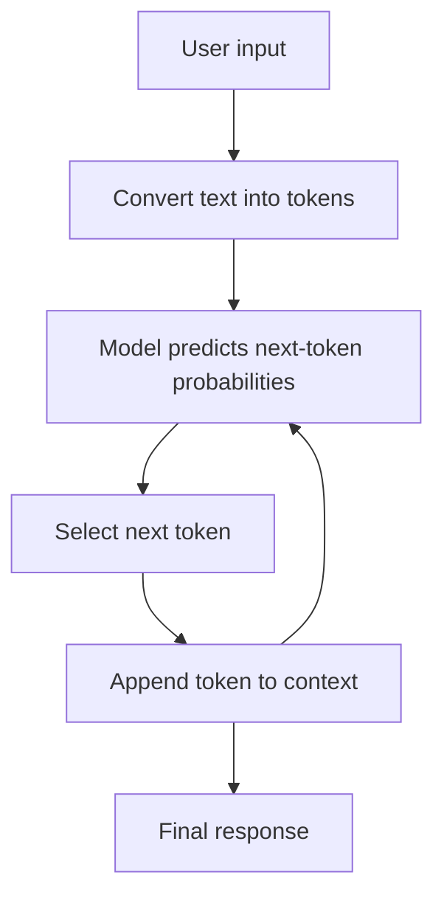
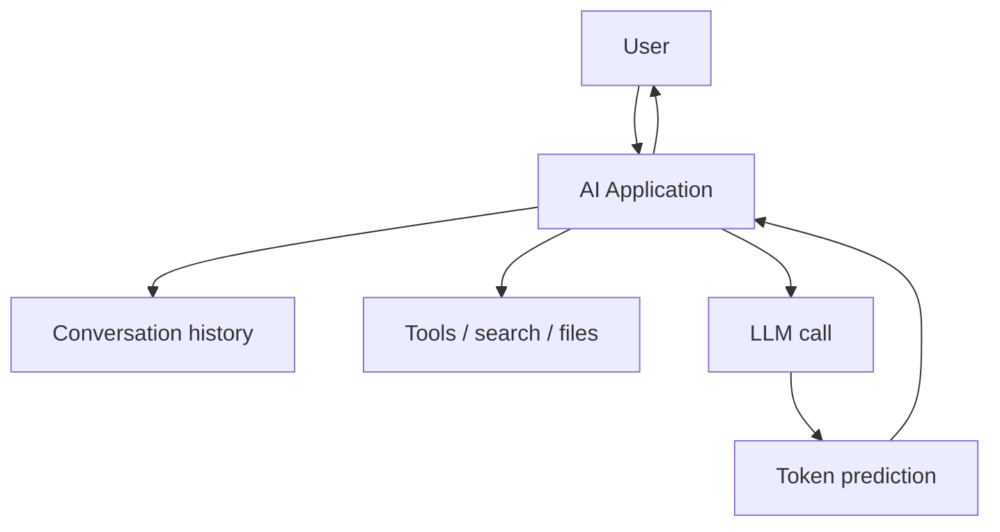
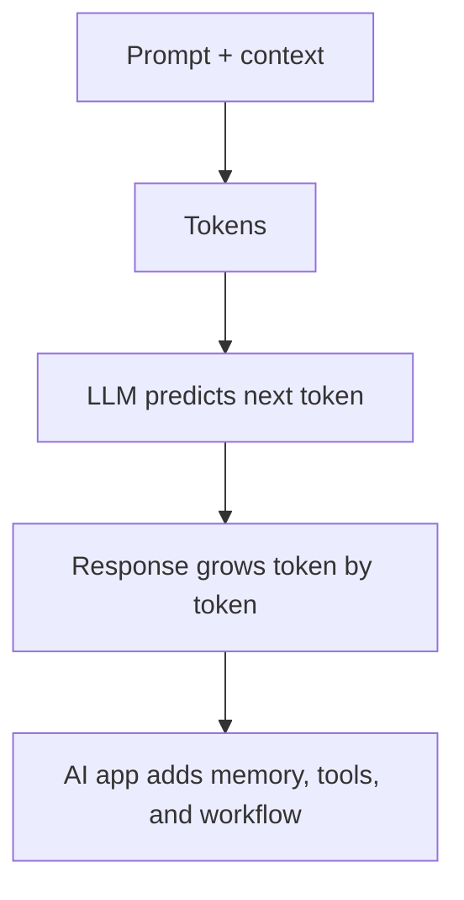

# 009 - Day 2 - How LLMs Work: Tokens, Memory, and Reasoning Explained

## Lesson Information

| Item     | Details                                          |
| -------- | ------------------------------------------------ |
| Lesson   | 009                                              |
| Duration | 11 min                                           |
| Week     | Week 1 - Vibe Coding Foundation                  |
| Module   | Week 1 Day 2 - LLMs, Agents, Context Engineering |

## Core Idea

Large Language Models are easier to understand when you separate the **model itself** from the **AI product built around it**.

An LLM does not “remember” like a human. It receives tokens, predicts the next token, and repeats that process. What feels like memory, reasoning, and intelligence often comes from software patterns built around the model.

## Learning Objectives

By the end of this lesson, learners should be able to:

* Explain what tokens are and why LLMs process text as tokens.
* Understand how LLMs generate responses one token at a time.
* Distinguish between an LLM and an AI application.
* Explain why ChatGPT appears to remember earlier messages.
* Understand reasoning as a structured token-generation strategy.
* Apply these ideas when working with AI coding agents.

## Key Concepts

### 1. What Is an LLM?

A Large Language Model, such as GPT, is a model designed to predict what text should come next after an input.

More precisely, it receives a sequence of **tokens** and produces a probability distribution over possible next tokens.

For example:

```text
Input: 2 + 2 is
Likely next token: 4
Unlikely next token: bananas
```

The model does not “know” in a human sense. It has learned statistical patterns from huge amounts of training data and uses those patterns to predict likely continuations.

## Tokens

A token is a small unit of text. It may be:

* A whole word
* Part of a word
* A punctuation mark
* A space or formatting fragment

Example:

```text
"unbelievable"
```

This may be split into tokens like:

```text
un | believable
```

LLMs do not process text exactly as humans read sentences. They process sequences of tokens.

## How Inference Works

Inference is the process of running the model to generate output.

The model generates one token at a time. After each token is generated, the new token is added back into the input, and the model predicts the next token.



Example:

```text
Input: What is the capital of France?
Output step 1: The
Output step 2: capital
Output step 3: of
Output step 4: France
Output step 5: is
Output step 6: Paris
```

The response feels like a complete sentence, but it is built token by token.

## LLM vs AI Application

An LLM is not the same thing as an AI product.

| Concept        | Meaning                                             | Example                       |
| -------------- | --------------------------------------------------- | ----------------------------- |
| LLM            | The model that predicts tokens                      | GPT                           |
| AI Application | Software built around an LLM to achieve a user goal | ChatGPT, Cursor, Duolingo Max |

ChatGPT is not just GPT. ChatGPT is an application that uses GPT and adds features such as:

* Conversation history
* Memory-like behavior
* Web search
* Tool use
* File handling
* UI and product logic



## The Illusion of Memory

An LLM call is stateless by default.

That means each call to the model does not automatically know what happened in previous calls.

Example:

```text
Call 1:
User: I am Ed.
Model: Hi, Ed.

Call 2:
User: Who am I?
Model: I do not know.
```

This happens because the second call does not include the first conversation.

AI applications solve this by sending the conversation history back into the model every time.

```text
Full input sent to model:

User: I am Ed.
Assistant: Hi, Ed.
User: Who am I?
```

Now the model can answer:

```text
You are Ed.
```

So the model does not truly remember. The application creates the illusion of memory by passing previous messages into the context.

## Context Window

The context window is the maximum amount of information the model can consider at once.

It includes:

* The user’s current message
* Previous messages
* System instructions
* Tool results
* Uploaded file content
* Any extra context inserted by the application

If important information is outside the context window, the model cannot directly use it.

This matters for coding agents because they need the right files, requirements, errors, and previous decisions inside context to act well.

## Reasoning or Thinking

Reasoning is another software and training pattern built around token generation.

Earlier prompting techniques discovered that asking a model to “think step by step” often improved answers. Over time, reasoning models were trained to produce better answers by internally or externally working through structured intermediate steps.

The important idea:

> Generating structured thinking tokens can help the model reach better answers.

Example:

```text
Question:
You toss two coins. One of them is heads. What is the chance the other one is tails?

Naive answer:
50%

Careful reasoning answer:
2/3
```

The better answer comes from treating it as a conditional probability problem instead of answering instinctively.

## Why Reasoning Helps

Reasoning helps because the model is not only jumping to the most obvious continuation. It is encouraged to build a structured path toward the answer.

For coding agents, this matters because many tasks require:

* Reading the problem carefully
* Understanding constraints
* Checking files
* Planning edits
* Testing results
* Revising when something fails

A coding agent works better when it has enough context and follows a structured process.

## Practical Implications for Coding Agents

When using AI coding agents, remember:

1. The model only knows what is in context.
2. Give the agent relevant files, logs, errors, and goals.
3. Do not assume it remembers unstated details.
4. Long conversations can lose important context if they exceed the context window.
5. Reasoning improves difficult tasks, especially debugging and architecture decisions.
6. AI products are more than models: tools, memory, search, and workflows matter.

## Simple Mental Model



## Key Takeaways

* An LLM predicts the next token based on the tokens it receives.
* Output is generated one token at a time through inference.
* GPT is a model; ChatGPT is an application built around a model.
* LLMs are stateless by default.
* Memory-like behavior comes from passing previous conversation history into context.
* Reasoning improves answers by encouraging structured prediction.
* Context engineering is essential when working with AI coding agents.

## Summary

This lesson explains the foundations of how LLMs work: tokens, inference, context, memory, and reasoning. The main idea is that an LLM is a stateless next-token prediction system, while AI applications create richer behavior by wrapping the model with conversation history, tools, memory systems, and structured workflows.

Understanding this distinction helps learners use coding agents more effectively, especially when providing context, debugging problems, and guiding the agent through complex tasks.

---

# Bài luyện tập

## Mục tiêu


## Đề bài


## Yêu cầu hoàn thành

- [ ] 
- [ ] 
- [ ] 

## Kết quả / lời giải


## Ghi chú
