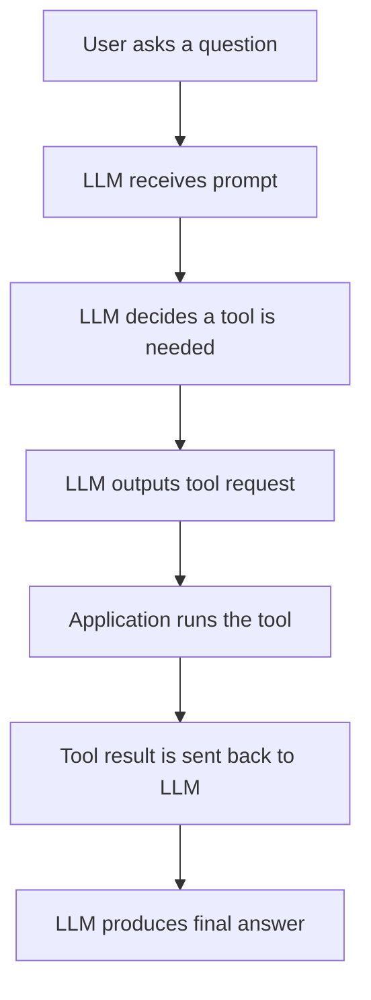
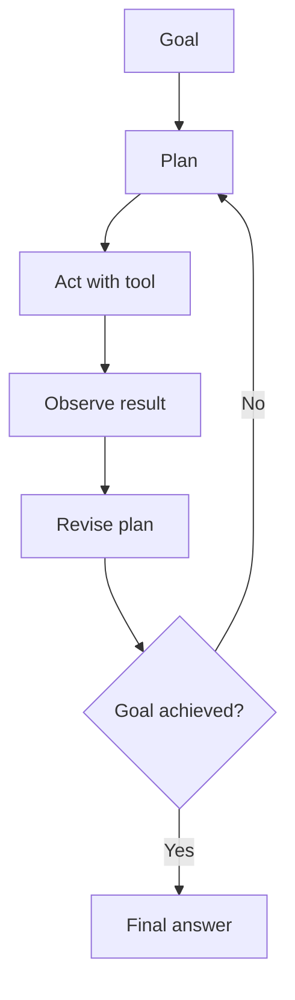
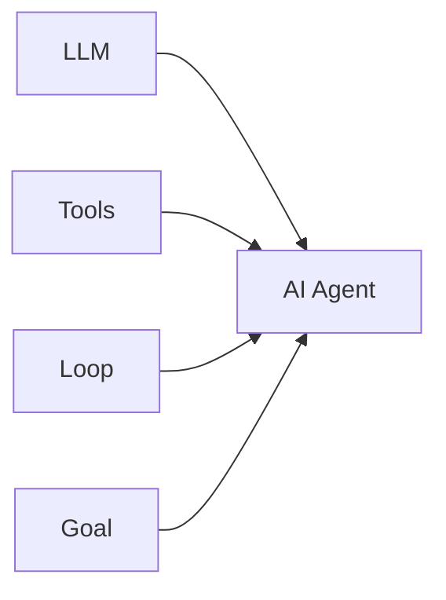

# 010 - Day 2 - Tools, Loops, and the Definition of AI Agents

## Lesson Information

| Item     | Details                                          |
| -------- | ------------------------------------------------ |
| Lesson   | 010                                              |
| Duration | 8 min                                            |
| Week     | Week 1 - Vibe Coding Foundation                  |
| Module   | Week 1 Day 2 - LLMs, Agents, Context Engineering |

## Core Idea

An AI agent is not just a chatbot. A modern agent combines:

```text
Agent = Model + Tool Access + Loop + Goal
```

The model decides what to do next, tools allow it to act, the loop lets it keep working, and the goal gives the process direction.

## Learning Objectives

By the end of this lesson, learners should be able to:

* Explain what tool calling means in an AI system.
* Understand that the LLM itself does not directly run tools.
* Describe how tools allow an LLM-powered system to act.
* Explain why loops make agents more powerful than single LLM calls.
* Define an AI agent as an LLM using tools in a loop to achieve a goal.
* Connect this definition to coding agents such as Cursor Agent or Claude Code.

## Key Concepts

### 1. Tool Calling

Tool calling is the process where an LLM generates special output that tells the surrounding software to perform an action.

The LLM does not actually search the web, run Python, read files, or edit code by itself. It only generates tokens. The application interprets those tokens and performs the action.

For example, the system may tell the model:

```text
If you need to calculate something, reply with:
Python: <python expression>
```

Then the model might answer:

```python
Python: import math; math.sqrt(math.pi)
```

The software around the model sees this output, runs the Python code, and sends the result back to the model.

## How Tool Calling Works



The important point:

> The LLM chooses the action, but the surrounding software executes it.

## Examples of Tools

A coding agent may have access to tools such as:

| Tool           | What It Allows the Agent to Do |
| -------------- | ------------------------------ |
| File reader    | Inspect project files          |
| File editor    | Modify source code             |
| Terminal       | Run commands                   |
| Test runner    | Execute automated tests        |
| Browser/search | Retrieve external information  |
| Python/runtime | Calculate or process data      |

These tools turn the model from a text generator into part of a larger working system.

## 2. The Loop

A single LLM call is limited:

```text
Input → LLM → Output
```

An agent becomes more powerful when the model is called repeatedly in a loop.

The system can ask:

```text
Are we finished yet?
If not, what should we do next?
```

Then the agent keeps going.



This loop allows the agent to solve bigger tasks than a single prompt-response interaction.

## 3. Why Tools and Loops Matter

Tools allow an agent to act.

Loops allow an agent to keep working.

Together, they create systems that can:

* Read a codebase
* Create or edit files
* Run commands
* Observe errors
* Fix mistakes
* Run tests again
* Continue until the goal is reached

This is why coding agents feel very different from normal chatbots.

## Definition of an AI Agent

There have been several definitions of AI agents over time.

| Definition                  | Main Idea                                          |
| --------------------------- | -------------------------------------------------- |
| Early definition            | AI systems that can do work independently          |
| Workflow definition         | AI systems where the LLM controls the workflow     |
| Modern practical definition | An LLM that runs tools in a loop to achieve a goal |

The current practical definition is:

> An AI agent is a system where an LLM uses tools in a loop to achieve a goal.

## Agent Formula



An agent needs all four parts:

| Part  | Role                            |
| ----- | ------------------------------- |
| LLM   | Decides what to do next         |
| Tools | Allow the system to take action |
| Loop  | Repeats until progress is made  |
| Goal  | Defines what success looks like |

## Example: Coding Agent

When you ask a coding agent:

```text
Build a first-person shooter in a web page.
```

The agent may:

1. Understand the goal.
2. Plan the implementation.
3. Create files.
4. Write code.
5. Run the project.
6. Observe errors.
7. Fix the code.
8. Repeat until the project works.

That is an agentic workflow.

It is not just answering a question. It is using tools in a loop to achieve a concrete result.

## AI Application vs AI Agent

| Type           | Behavior                                |
| -------------- | --------------------------------------- |
| Basic chatbot  | Responds with text                      |
| AI application | Wraps an LLM with product features      |
| AI agent       | Uses tools in a loop to complete a goal |

A chatbot may explain how to fix code.

A coding agent can inspect the code, edit it, run tests, and revise the solution.

## Practical Implications for Coding Agents

When working with coding agents, you should provide:

* A clear goal
* Access to the relevant codebase
* Permission to read and edit files
* A way to run the project
* A way to test results
* Feedback when the output is not correct

The more clearly the environment supports the loop, the more useful the agent becomes.

## Key Takeaways

* Tool calling lets an LLM-powered system perform actions.
* The LLM does not directly run tools; software around it does.
* A loop allows the agent to keep working through multiple steps.
* Modern AI agents are best understood as LLMs using tools in a loop to achieve a goal.
* Coding agents need access to files, commands, tests, and runtime environments.
* Agentic workflows are especially powerful for software development because they can observe, revise, and continue.

## Summary

This lesson explains how tools and loops turn LLMs into agents. Tool calling allows the system to act, while loops allow it to keep working until a goal is complete.

A useful modern definition is:

```text
AI Agent = LLM + Tools + Loop + Goal
```

This definition explains why coding agents such as Cursor Agent or Claude Code can do more than answer questions. They can inspect a project, modify files, run commands, observe failures, and revise their work until the task is finished.

---

# Bài luyện tập

## Mục tiêu


## Đề bài


## Yêu cầu hoàn thành

- [ ] 
- [ ] 
- [ ] 

## Kết quả / lời giải


## Ghi chú
