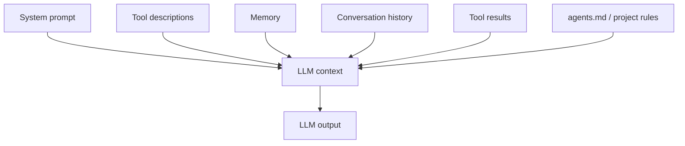
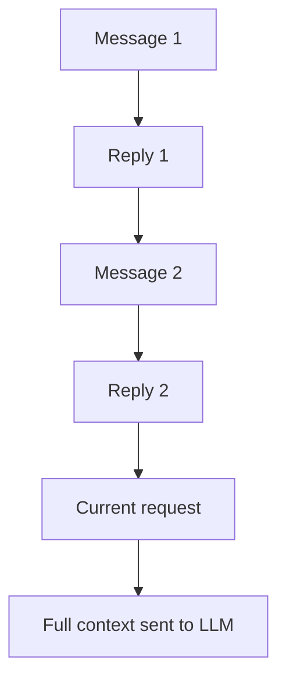
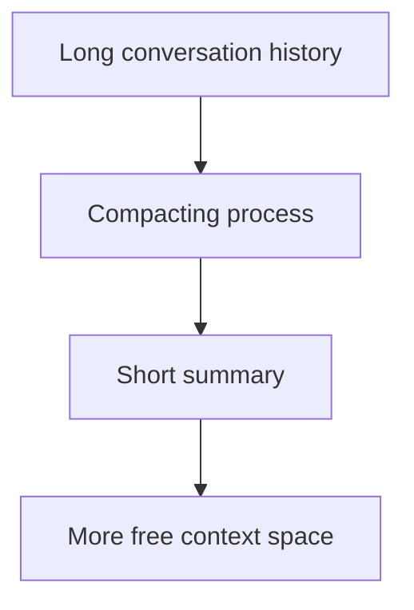

# 011 - Day 2 - Context Engineering: System Prompts, Context Windows & `agents.md`

## Lesson Information

| Item     | Details                                          |
| -------- | ------------------------------------------------ |
| Lesson   | 011                                              |
| Duration | 13 min                                           |
| Week     | Week 1 - Vibe Coding Foundation                  |
| Module   | Week 1 Day 2 - LLMs, Agents, Context Engineering |

## Core Idea

Context engineering is the practice of giving an LLM the right information, in the right format, at the right time.

Because an LLM is stateless, its output depends entirely on the input context it receives. For coding agents, good context can dramatically improve accuracy, reduce hallucination, and help the agent work more effectively inside a real codebase.

```text
Better context → Better agent behavior
Poor context → Confusion, hallucination, repeated mistakes
```

## Learning Objectives

By the end of this lesson, learners should be able to:

* Explain what context engineering means.
* Understand the role of the system prompt.
* Describe what goes into an LLM context.
* Explain how context windows limit what the model can see.
* Understand why too much context can reduce output quality.
* Explain the purpose of `agents.md`, `claude.md`, or similar project instruction files.
* Use context intentionally when working with coding agents.

## Key Concepts

### 1. Context Engineering

The input sent to an LLM is often called the **context**.

This context may include:

* System prompt
* Tool descriptions
* Memory
* Conversation history
* User request
* Previous assistant replies
* Tool calls and tool results
* Generated code
* Project-specific instruction files such as `agents.md`

Context engineering is the discipline of designing this full input so the model has the best chance of producing the desired output.

This is broader than prompt engineering. Prompt engineering focuses mainly on the wording of a prompt. Context engineering includes the entire environment around the model.

## Prompt Engineering vs Context Engineering

| Concept             | Focus                                                                  |
| ------------------- | ---------------------------------------------------------------------- |
| Prompt engineering  | How to phrase the instruction                                          |
| Context engineering | What information, tools, memory, files, and history the model receives |

Prompt engineering asks:

```text
How should I ask the model?
```

Context engineering asks:

```text
What does the model need to know and access to succeed?
```

## 2. What Goes Into Context?

A coding agent’s context is not just the latest user message. It is a package of information assembled before the model is called.



The model uses this full context to predict the next tokens.

## 3. System Prompt

The system prompt is the high-level instruction that frames the model’s role and behavior.

It may define:

* What role the model is playing
* What tone it should use
* What task it is responsible for
* What rules it must follow
* How it should interact with tools
* What kind of output is expected

Example:

```text
You are a coding agent. Read the codebase carefully, make minimal safe changes, run tests, and explain your work clearly.
```

The system prompt is usually placed near the beginning of the context and has strong influence over the model’s behavior.

## 4. Tool Descriptions

Tool descriptions tell the model what actions it can request.

For example, a coding agent may be told it can:

* Read files
* Edit files
* Run terminal commands
* Search the codebase
* Execute tests
* Inspect logs

The LLM itself does not perform these actions directly. It generates tool requests, and the surrounding software executes them.

Tool descriptions also consume space in the context window. More tools can mean more capability, but also more context usage.

## 5. Memory

Memory refers to information that should persist across interactions.

This can include:

* User preferences
* Project conventions
* Long-term goals
* Previously established decisions
* Reusable instructions

Memory is not the same as human memory. It is information inserted into the context so the model can use it.

## 6. Conversation History

Because LLMs are stateless, the application often sends the conversation history back into the model.

This may include:

* Earlier user messages
* Assistant replies
* Reasoning traces or summaries
* Generated code
* Tool calls
* Tool outputs

This is what creates the feeling that the agent remembers the conversation.



## 7. `agents.md`

In coding-agent workflows, projects often include a special instruction file such as:

| Tool / Product       | Common Instruction File |
| -------------------- | ----------------------- |
| General convention   | `agents.md`             |
| Claude Code          | `claude.md`             |
| Gemini / Antigravity | `gemini.md`             |

These files store project-specific guidance that the agent should consider while working.

They may include:

* Architecture overview
* Coding standards
* Testing commands
* File organization rules
* Deployment notes
* Project-specific warnings
* Common mistakes to avoid
* Preferred libraries or patterns

Example:

```md
# agents.md

## Project Rules

- Use TypeScript for all new frontend code.
- Run `npm test` before finalizing changes.
- Do not modify generated files.
- Keep API routes inside `src/api`.
- Prefer existing helper functions over creating new utilities.
```

For coding agents, `agents.md` acts like persistent project context.

## 8. Context Window

The context window is the maximum number of tokens the model can consider at once.

It limits how much information can fit into a single model call.

If the context is too large, the request may fail. But even before reaching the hard limit, output quality can degrade.

Important idea:

> More context is not always better.

A model often performs best when the context is focused, relevant, and not overloaded.

## Context Window Tradeoff

| Context Size         | Possible Result                        |
| -------------------- | -------------------------------------- |
| Too little context   | The agent lacks key information        |
| Focused context      | Best chance of accurate output         |
| Too much context     | The agent may lose coherence           |
| Beyond context limit | The request fails or must be compacted |

## 9. Context Degradation

Even if the context window is not full, too much information can hurt quality.

The model may:

* Miss important details
* Focus on irrelevant information
* Repeat previous mistakes
* Lose track of the goal
* Produce less coherent output

This is why context engineering is not just about maximizing token count. It is about selecting the right context.

## 10. Compacting

Compacting is the process of summarizing old conversation history to free up context space.

Instead of keeping the entire conversation, the system replaces earlier messages with a shorter summary.



This helps the agent continue working without exceeding the context window.

However, compacting has a risk: the summary may omit something important. If that happens, the agent may appear to forget a requirement or repeat a mistake.

## Should You Trust Compacting?

Modern compacting has improved significantly. In many cases, it works well and preserves the important parts of the conversation.

However, for important coding work, it can still be helpful to maintain key project rules in `agents.md` or another persistent instruction file.

A good habit:

```text
Put stable project knowledge in files.
Use conversation for temporary task details.
```

## 11. Context Window Examples

The lesson mentions example context window sizes for major models:

| Model Family             | Example Context Window |
| ------------------------ | ---------------------- |
| GPT 5.2                  | 400,000 tokens         |
| Claude Sonnet / Opus 4.5 | 200,000 tokens         |
| Gemini                   | 1,000,000 tokens       |

The maximum size matters, but practical performance also depends on how clean, relevant, and well-structured the context is.

## Practical Implications for Coding Agents

When working with coding agents:

1. Give the agent a clear goal.
2. Provide the relevant files, errors, and constraints.
3. Keep project rules in `agents.md`.
4. Avoid flooding the agent with irrelevant context.
5. Restart or compact when the conversation gets too large.
6. Summarize important decisions before long tasks continue.
7. Keep stable architecture knowledge in the repo, not only in chat.

## Example: Good Context for a Coding Agent

```text
Goal:
Fix the failing login test.

Relevant context:
- Auth code is in src/auth.
- Tests are in tests/auth.
- Run tests with npm test.
- Do not change the database schema.
- Existing project rules are in agents.md.

Expected result:
- Login test passes.
- Minimal code changes.
- Explain what changed.
```

This is much better than saying:

```text
Fix the bug.
```

## Key Takeaways

* Context engineering is broader than prompt engineering.
* The LLM output depends entirely on the input context.
* System prompts define the model’s role and behavior.
* Tool descriptions tell the model what actions are available.
* Conversation history creates the illusion of memory.
* `agents.md` stores persistent project-specific guidance.
* The context window limits how much the model can see.
* Too much context can reduce output quality.
* Compacting helps free space but may lose details.
* Good context reduces hallucination and improves coding-agent performance.

## Summary

This lesson explains why context engineering is central to effective AI coding workflows. Since an LLM is stateless, every useful piece of information must be included in the context somehow: system prompt, tools, memory, conversation history, tool results, and project instruction files.

For coding agents, strong context engineering means giving the agent the right project rules, architecture notes, tools, and task details without overwhelming it. A well-written `agents.md` file, focused prompts, and careful context management help the agent produce better code, make fewer mistakes, and work more reliably inside a real codebase.

---

# Bài luyện tập

## Mục tiêu


## Đề bài


## Yêu cầu hoàn thành

- [ ] 
- [ ] 
- [ ] 

## Kết quả / lời giải


## Ghi chú
