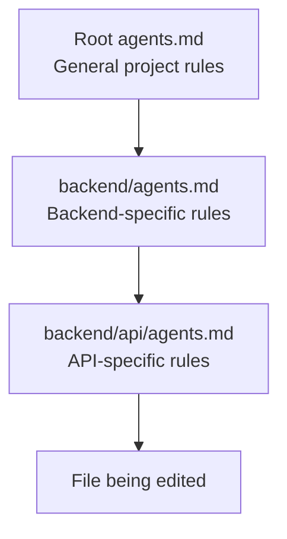

# 012 - Day 2 - Mastering `agents.md`: Context Window Strategy for Coding Agents

## Lesson Information

| Item     | Details                                          |
| -------- | ------------------------------------------------ |
| Lesson   | 012                                              |
| Duration | 12 min                                           |
| Week     | Week 1 - Vibe Coding Foundation                  |
| Module   | Week 1 Day 2 - LLMs, Agents, Context Engineering |

## Core Idea

`agents.md` is a project instruction file used to prepare coding agents with important context.

It tells the agent how the project works, what standards to follow, what commands to run, and what mistakes to avoid. Since this file is inserted into the model’s context, it should be concise, specific, and highly useful.

```text
Good agents.md = Better context + Better coding agent behavior
```

## Learning Objectives

By the end of this lesson, learners should be able to:

* Explain what `agents.md` is and why coding agents use it.
* Understand how `agents.md` files work across project directories.
* Write concise project rules for coding agents.
* Include useful standards, commands, and success criteria.
* Avoid wasting context window space with vague or verbose instructions.
* Compare the stricter 2025 context-management mindset with the more autonomous 2026 agent mindset.

## Key Concepts

### 1. What Is `agents.md`?

`agents.md` is a Markdown file used to give coding agents persistent project instructions.

It may include:

* Project goals
* Architecture overview
* Coding standards
* Testing commands
* Build commands
* Branch and commit rules
* Success criteria
* Common mistakes to avoid
* Links to deeper project documents

The file is written in Markdown because Markdown is simple, readable, and easy for LLMs to process.

## 2. Why Markdown?

Markdown is a lightweight text format.

Common Markdown syntax:

| Syntax           | Meaning            |
| ---------------- | ------------------ |
| `# Heading`      | Main heading       |
| `## Heading`     | Section heading    |
| `### Heading`    | Subsection heading |
| `- item`         | Bullet list        |
| `1. item`        | Numbered list      |
| `` `code` ``     | Inline code        |
| Triple backticks | Code block         |

Example:

```md
# Project Summary

## Coding Standards

- Keep changes small and focused.
- Prefer existing project patterns.
- Run `npm test` before finalizing work.
```

LLMs are very comfortable reading and writing Markdown, so it is a natural format for agent instructions.

## 3. Where `agents.md` Lives

Usually, an `agents.md` file is placed in the project root directory.

Example:

```text
my-project/
├── agents.md
├── src/
├── tests/
└── package.json
```

The root `agents.md` contains general instructions for the whole project.

You can also place additional `agents.md` files inside subdirectories for more specific rules.

```text
my-project/
├── agents.md
├── backend/
│   └── agents.md
├── frontend/
│   └── agents.md
└── tests/
    └── agents.md
```

## 4. How Nested `agents.md` Files Work

When an agent works on a file, it may load the nearest relevant `agents.md` files.

Rules closer to the file are usually more specific and can override broader rules from parent directories.



Example:

| File Being Edited       | Loaded Instructions                                              |
| ----------------------- | ---------------------------------------------------------------- |
| `src/app.ts`            | Root `agents.md`                                                 |
| `backend/service.py`    | Root `agents.md` + `backend/agents.md`                           |
| `backend/api/routes.py` | Root `agents.md` + `backend/agents.md` + `backend/api/agents.md` |

This allows the project to have broad rules at the top and precise rules deeper in the codebase.

## 5. File Names Across Tools

Different coding tools may use different names for the same basic idea.

| Tool                 | Instruction File |
| -------------------- | ---------------- |
| Cursor               | `agents.md`      |
| Codex                | `agents.md`      |
| GitHub Copilot       | `agents.md`      |
| Claude Code          | `claude.md`      |
| Gemini / Antigravity | `gemini.md`      |

The concept is the same: a Markdown instruction file that gives the coding agent project-specific context.

## 6. What to Put in `agents.md`

A strong `agents.md` usually includes:

| Section           | Purpose                                |
| ----------------- | -------------------------------------- |
| Project summary   | Explains what the project is           |
| Success criteria  | Defines what “done” means              |
| Project structure | Shows where important files live       |
| Coding standards  | Tells the agent how to write code      |
| Test commands     | Tells the agent how to verify changes  |
| Build commands    | Tells the agent how to run the project |
| Do / avoid rules  | Prevents common agent mistakes         |
| Reference docs    | Points to optional deeper context      |

## Example `agents.md`

```md
# Project Instructions

## Project Goal

This is a TypeScript web app. Keep changes focused, tested, and consistent with existing patterns.

## Project Structure

- `src/components`: reusable UI components
- `src/pages`: route-level pages
- `src/api`: API client logic
- `tests`: automated tests

## Coding Standards

- Prefer existing utilities before adding new ones.
- Keep functions small and readable.
- Add comments only when the logic is not obvious.
- Keep README updates short and practical.

## Commands

- Install dependencies: `npm install`
- Run dev server: `npm run dev`
- Run tests: `npm test`
- Run lint: `npm run lint`

## Important

- Use existing design tokens.
- Keep changes minimal.
- Do not modify generated files.
- Do not add large new dependencies without approval.
```

## 7. Keep It Concise

`agents.md` uses context window space.

That means every line has a cost. A good file should be clear, short, and high-signal.

Bad:

```md
Please try your best to write code that is good and clean and helpful, and make sure that whenever possible you think carefully about all the things that may or may not happen.
```

Better:

```md
Write simple, focused code. Prefer existing patterns. Run tests before finalizing.
```

## 8. Prefer Positive Instructions

LLMs often follow positive instructions more reliably than long lists of negatives.

Less effective:

```md
Do not overcomplicate the code.
Do not add too many comments.
Do not write long READMEs.
Do not use unnecessary try/catch blocks.
```

Better:

```md
Write simple code.
Use comments only when they clarify non-obvious logic.
Keep README updates short.
Handle exceptions only where recovery is meaningful.
```

Negative rules are still useful sometimes, especially for hard constraints, but they should not dominate the file.

## 9. Correct for Past Agent Mistakes

A good `agents.md` should evolve based on real problems you observe.

If the agent repeatedly makes the same mistake, add a short rule.

Examples:

```md
## Common Pitfalls

- Use `uv run` for Python commands in this repo.
- Keep generated files unchanged.
- Prefer existing service classes over creating new parallel abstractions.
- Do not wrap every function in broad exception handling.
```

This turns previous failures into reusable context.

## 10. Context Window Strategy

There are two broad approaches to managing `agents.md`.

| Mindset      | Description                                                                                   |
| ------------ | --------------------------------------------------------------------------------------------- |
| 2025 mindset | Carefully maintain `agents.md`, prune context, restart agents with clean instructions         |
| 2026 mindset | Give the agent the end goal, trust loops, tools, skills, sub-agents, and self-correction more |

The lesson suggests that both approaches matter.

For small toy projects, you can often let the agent run more freely.

For larger real projects, careful context management is still valuable.

## 11. Practical Strategy

Use this rule of thumb:

| Project Type              | Recommended Strategy                                               |
| ------------------------- | ------------------------------------------------------------------ |
| Small experiment          | Give the goal and let the agent work                               |
| Medium feature            | Use root `agents.md` with clear commands and standards             |
| Large production codebase | Maintain focused `agents.md` files by directory                    |
| High-risk refactor        | Use strict success criteria, test commands, and architecture rules |

## 12. Good `agents.md` Checklist

A useful `agents.md` should answer:

* What is this project?
* Where are the important files?
* What coding style should the agent follow?
* What commands should the agent run?
* What does success look like?
* What should the agent avoid changing?
* Where can the agent find more context if needed?

## Key Takeaways

* `agents.md` is a Markdown instruction file for coding agents.
* It gives persistent project context to the agent.
* Root-level files contain general rules.
* Nested files contain directory-specific rules.
* More specific rules can override broader rules.
* Keep instructions concise because context window space is valuable.
* Prefer positive, action-oriented instructions.
* Include commands, standards, structure, and success criteria.
* Update the file when you notice repeated agent mistakes.
* For serious projects, context engineering still matters a lot.

## Summary

This lesson explains how to use `agents.md` as a practical context-engineering tool for coding agents. A well-written `agents.md` helps the agent understand the project, follow local conventions, run the right commands, and avoid damaging the architecture.

The best `agents.md` files are not long essays. They are compact, precise, and shaped by real project needs. For small projects, agents can often work with more freedom. For larger codebases, careful instruction files remain one of the strongest ways to improve agent reliability.
