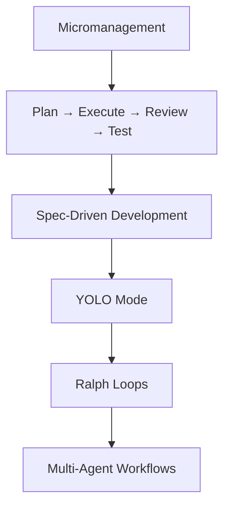
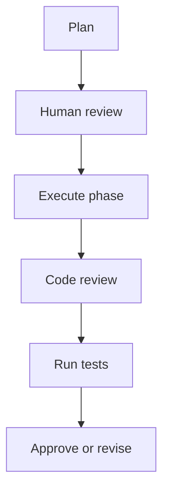
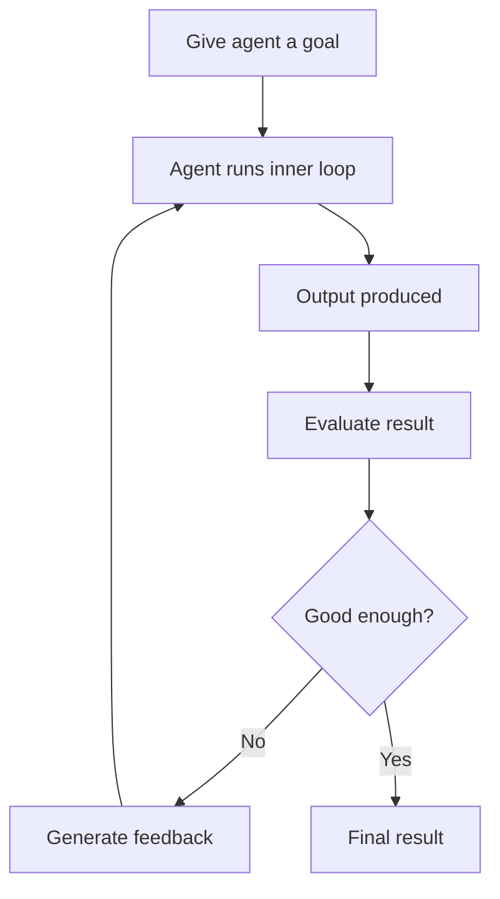
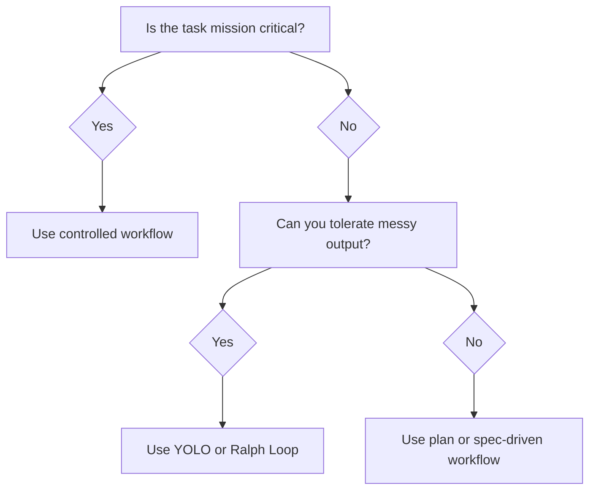

# 013 - Day 2 - The Evolution of AI Coding Workflows: From YOLO to Ralph Loops

## Lesson Information

| Item     | Details                                          |
| -------- | ------------------------------------------------ |
| Lesson   | 013                                              |
| Duration | 13 min                                           |
| Week     | Week 1 - Vibe Coding Foundation                  |
| Module   | Week 1 Day 2 - LLMs, Agents, Context Engineering |

## Core Idea

AI coding workflows have evolved from tightly controlled human supervision to increasingly autonomous agentic systems.

The right workflow depends on the task, the codebase, the risk level, and how much trust you can place in the agent.

```text
Workflow choice = Task risk + Codebase size + Required quality + Trust level
```

## Learning Objectives

By the end of this lesson, learners should be able to:

* Explain the evolution of AI coding workflows.
* Compare micromanagement, planning mode, spec-driven development, YOLO mode, Ralph Loops, and multi-agent workflows.
* Understand when to use controlled workflows versus autonomous workflows.
* Recognize the importance of checkpoints, testing, and review.
* Take responsibility for AI-assisted code quality.

## Workflow Evolution Overview



These workflows represent increasing levels of trust in the coding agent.

## 1. Micromanagement

Micromanagement is the lowest-trust workflow.

In this mode, the developer closely controls the agent by:

* Writing very specific instructions
* Maintaining a strict `agents.md`
* Approving most changes manually
* Frequently stopping the agent
* Reviewing and resetting context often
* Rewriting instructions as the task evolves

This approach gives the developer maximum control, but it can be slow.

It is useful when the codebase is sensitive, complex, or mission critical.

## 2. Plan → Execute → Review → Test

This workflow gives the agent more freedom, but still keeps human checkpoints.

The agent first creates a plan. The developer reviews the plan. Then the agent executes in phases.



This is a balanced workflow.

It works well when you want the agent to move faster, but you still want to prevent it from overbuilding or making risky architectural changes.

## 3. Spec-Driven Development

Spec-driven development means writing a clear specification first, then letting the agent implement it.

The mindset is:

```text
Trust, but verify.
```

Instead of reviewing every small step, the developer gives the agent a detailed spec and checks the result afterward.

A good spec may include:

* Feature requirements
* Inputs and outputs
* Acceptance criteria
* Edge cases
* Test expectations
* Files or modules to modify
* Files or modules to avoid

This works best when the task can be described clearly before implementation begins.

## 4. YOLO Mode

YOLO mode is a high-trust workflow.

The agent is allowed to act without repeatedly asking for permission.

It may:

* Edit files
* Run commands
* Generate code
* Refactor
* Test
* Continue working without human approval at every step

This can be very fast, especially for prototypes, MVPs, demos, and boilerplate-heavy work.

However, YOLO mode is risky for production systems because the agent may make large changes before you inspect them.

## 5. Ralph Loops

Ralph Loops are a more advanced autonomous workflow.

A normal agent already runs an inner loop:

```text
Plan → Act → Observe → Revise
```

A Ralph Loop wraps that entire agent process inside a larger loop.



The agent produces a result, evaluates it, generates feedback, and tries again. This can repeat many times.

YOLO mode might run while you have dinner.

Ralph Loops might run overnight.

## 6. Multi-Agent Workflows

Multi-agent workflows use several agents with different roles.

Examples:

| Agent Role     | Responsibility               |
| -------------- | ---------------------------- |
| Planner agent  | Breaks the task into steps   |
| Builder agent  | Writes implementation code   |
| Test agent     | Creates or runs tests        |
| Reviewer agent | Finds bugs and design issues |
| Manager agent  | Coordinates the other agents |

This is the most advanced workflow category. It is useful for large tasks where different kinds of reasoning and validation are needed.

## Comparing the Workflows

| Workflow                       | Trust Level | Best For                                  | Main Risk                          |
| ------------------------------ | ----------: | ----------------------------------------- | ---------------------------------- |
| Micromanagement                |         Low | Mission-critical systems, unfamiliar code | Slow progress                      |
| Plan → Execute → Review → Test |      Medium | Real features, medium complexity          | Missed issues between checkpoints  |
| Spec-driven development        | Medium-high | Clear requirements, bounded tasks         | Bad spec leads to bad output       |
| YOLO mode                      |        High | MVPs, prototypes, demos                   | Unreviewed changes                 |
| Ralph Loops                    |   Very high | Long-running improvement cycles           | Agent may optimize the wrong thing |
| Multi-agent workflows          |   Very high | Complex systems, large tasks              | Coordination complexity            |

## Choosing the Right Workflow

Use more controlled workflows when working on:

* Enterprise software
* Commercial SaaS platforms
* Large codebases
* Security-sensitive systems
* Highly innovative or unfamiliar technology
* Architecture-heavy changes
* Production-critical features

Use more autonomous workflows when working on:

* MVPs
* Prototypes
* Toy projects
* Internal demos
* Empty-directory projects
* CRUD backends
* Boilerplate-heavy frontend apps
* Low-risk experiments

## Practical Rule of Thumb



## Why Checkpoints Matter

Checkpoints help prevent the agent from drifting too far from the goal.

Useful checkpoints include:

* Plan review
* Git commit after a working phase
* Test run
* Manual code review
* Manual app check
* Architecture review
* Final acceptance checklist

A checkpoint is not just bureaucracy. It is how you keep agentic work grounded.

## Accountability

The most important lesson is that the developer remains responsible for the final code.

You can use LLMs and agents to move faster, but you cannot blame the model if the code is broken.

Your job is to deliver code that is proven to work.

That means:

* Read the generated code.
* Run the tests.
* Check the behavior.
* Validate the architecture.
* Review risky changes.
* Choose the workflow that matches the task.

## Key Takeaways

* AI coding workflows have evolved from strict supervision to high-autonomy agent loops.
* Micromanagement gives control but slows progress.
* Planning mode balances agent speed with human review.
* Spec-driven development works well when requirements are clear.
* YOLO mode is fast but risky.
* Ralph Loops allow long-running autonomous improvement.
* Multi-agent systems coordinate specialized agents.
* The right workflow depends on risk, project size, and task complexity.
* AI-assisted code is still your responsibility.

## Summary

This lesson explains how AI coding workflows have changed as agents have become more capable. Early workflows focused on tight control, careful `agents.md` files, frequent reviews, and manual resets. Newer workflows allow agents to act with more autonomy through YOLO mode, Ralph Loops, and multi-agent orchestration.

The practical lesson is not that one workflow is always best. For serious production work, controlled workflows with checkpoints and tests are still essential. For prototypes and low-risk projects, autonomous workflows can produce a lot of useful code quickly. The developer’s responsibility is to choose the right level of trust and verify that the final code actually works.

---

# Bài luyện tập

## Mục tiêu


## Đề bài


## Yêu cầu hoàn thành

- [ ] 
- [ ] 
- [ ] 

## Kết quả / lời giải


## Ghi chú
