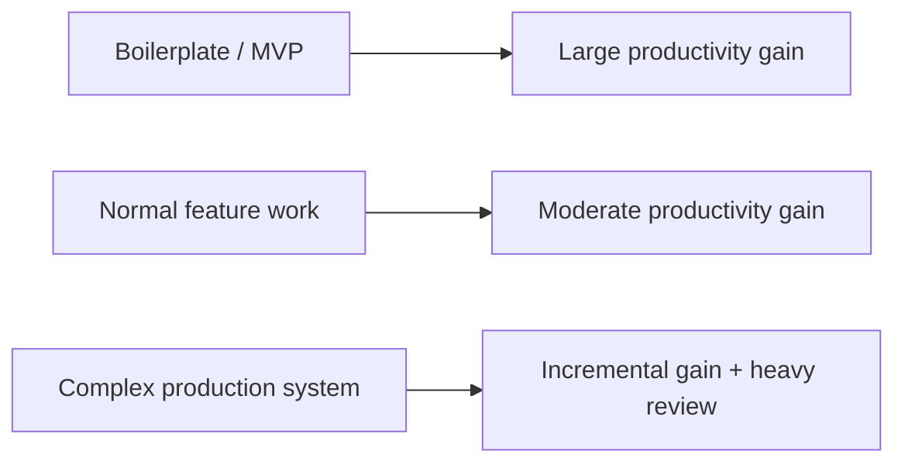

# 014 - Day 2 - Beyond the Hype: Comparing LLMs on Artificial Analysis

## Lesson Information

| Item     | Details                                          |
| -------- | ------------------------------------------------ |
| Lesson   | 014                                              |
| Duration | 7 min                                            |
| Week     | Week 1 - Vibe Coding Foundation                  |
| Module   | Week 1 Day 2 - LLMs, Agents, Context Engineering |

## Core Idea

AI coding agents are powerful, but they are not magic. Some tasks become dramatically faster with LLMs, while others only improve slightly or may even become slower if the model makes subtle mistakes.

The practical skill is not believing the hype. It is learning when LLMs help, when they struggle, and how to compare models using real benchmarks instead of marketing claims.

```text
Good AI workflow = Model capability + Task fit + Human verification
```

## Learning Objectives

By the end of this lesson, learners should be able to:

* Evaluate LLMs using benchmarks and practical performance.
* Understand why model choice matters for coding agents.
* Compare models by reasoning, coding, tool use, speed, and cost.
* Recognize when LLMs provide major productivity gains.
* Recognize when LLMs still need careful human review.
* Use resources such as [Artificial Analysis](https://artificialanalysis.ai) to compare models.

## Key Concepts

### 1. Avoiding AI Hype

LLMs can create huge productivity gains, especially for tasks with lots of familiar patterns.

Examples where LLMs can be extremely helpful:

* Boilerplate React frontends
* CRUD apps
* Simple prototypes
* MVPs
* Repetitive component work
* Starting from an empty project

In these cases, work that might take hours or days can sometimes be produced in minutes.

However, not every task gets a 10x improvement.

LLMs may be less helpful for:

* Large existing codebases
* Mission-critical systems
* Highly innovative technical work
* Subtle architecture decisions
* New frameworks or APIs with little training data
* Security-sensitive code

In these cases, the improvement may be incremental rather than dramatic.

## 2. The Productivity Spectrum



The value of an LLM depends heavily on the kind of work being done.

## 3. Why Human Verification Still Matters

Even when LLMs move fast, the developer is still responsible for the final result.

You need to check:

* Does the code work?
* Are the tests passing?
* Is the architecture still clean?
* Did the agent introduce subtle bugs?
* Did it overcomplicate the solution?
* Did it follow the project’s conventions?

A model can write code quickly, but speed does not replace verification.

## 4. Comparing Models with Artificial Analysis

[Artificial Analysis](https://artificialanalysis.ai) is a useful website for comparing LLMs across different dimensions.

It helps you compare models by:

| Dimension    | Why It Matters                                   |
| ------------ | ------------------------------------------------ |
| Intelligence | General problem-solving ability                  |
| Coding       | Ability to write and modify code                 |
| Reasoning    | Ability to solve complex multi-step problems     |
| Tool use     | Ability to work with tools and agentic workflows |
| Speed        | How quickly the model responds                   |
| Cost         | How expensive the model is to use                |
| Provider     | Which company or platform serves the model       |

Model rankings change quickly, so the website should be treated as a live reference rather than a fixed answer.

## 5. Do Not Choose Models by Marketing Alone

A model may be heavily promoted, but that does not mean it is the best choice for your workflow.

Instead, compare models using:

* Benchmark performance
* Real coding tests
* Latency
* Cost per task
* Tool-use reliability
* Context window size
* Integration quality with your coding environment

For example, a model with slightly lower benchmark scores may still be better inside a specific coding tool if the product integration is excellent.

## 6. Model Choice Depends on the Task

| Task Type        | Useful Model Traits                             |
| ---------------- | ----------------------------------------------- |
| Fast prototyping | Speed, low cost, good frontend generation       |
| Debugging        | Strong reasoning, code understanding            |
| Refactoring      | Large context, careful instruction following    |
| Agentic coding   | Tool use, planning, reliability                 |
| Architecture     | Deep reasoning, strong long-context performance |
| Bulk generation  | Low cost, high throughput                       |

There is no single best model for every task.

## 7. Cross-Model Collaboration

Sometimes the best workflow is not using only one model.

You can use different models for different roles:

| Role        | Possible Model Strength   |
| ----------- | ------------------------- |
| Planner     | Strong reasoning          |
| Implementer | Strong coding ability     |
| Reviewer    | Careful bug detection     |
| Tester      | Good edge-case generation |
| Summarizer  | Fast and cheap output     |

This is one reason multi-agent and cross-model workflows can outperform a single-model workflow.

## 8. Practical Model Evaluation Checklist

When choosing a model for coding work, ask:

* Is this model good at coding benchmarks?
* Is it good at tool use?
* Is it fast enough for my workflow?
* Is the cost reasonable?
* Does it handle long context well?
* Does it work well inside my coding agent?
* Does it make fewer subtle mistakes than alternatives?
* Does it improve my actual delivery speed?

The best model is the one that performs well in your real workflow, not just on a leaderboard.

## Key Takeaways

* LLMs are a major productivity multiplier, but not always a 10x multiplier.
* The benefit depends on the project type and risk level.
* Boilerplate and greenfield projects benefit the most.
* Large, complex, mission-critical systems still require careful review.
* Model choice should be based on benchmarks and real usage, not hype.
* Artificial Analysis is a useful resource for comparing model intelligence, coding, speed, and cost.
* Cross-model workflows can improve results by assigning different models different roles.
* Developers remain accountable for the final code.

## Summary

This lesson gives a grounded view of AI coding agents. LLMs can dramatically speed up some kinds of software work, especially prototypes and boilerplate-heavy projects. But they still make mistakes, especially in complex or mission-critical systems.

The practical approach is to compare models carefully, use benchmarks like Artificial Analysis, test models in real coding workflows, and stay accountable for the final result. AI is a powerful multiplier, but good engineering judgment is still the thing that turns generated code into reliable software.
