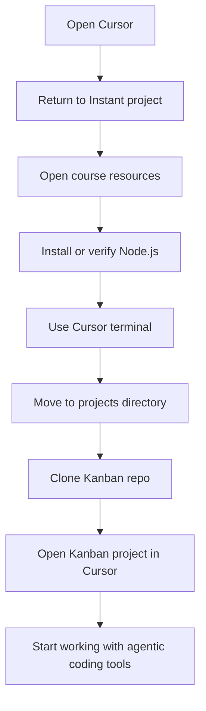
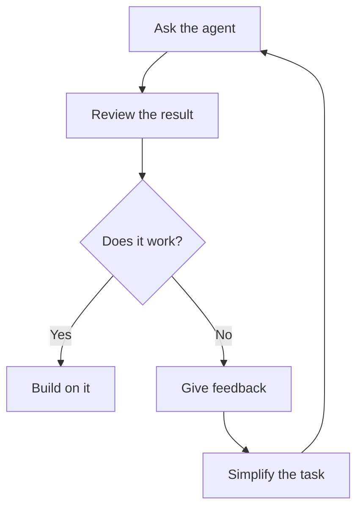

# 015 - Day 3 - Hands-On with Cursor, Copilot, Codex & Agentic Vibe Coding

## Lesson Information

| Item          | Details                                                          |
| ------------- | ---------------------------------------------------------------- |
| Lesson        | 015                                                              |
| Duration      | 8 min                                                            |
| Week          | Week 1 - Vibe Coding Foundation                                  |
| Module        | Week 1 Day 3 - Hands-On with Cursor, Copilot, Codex, Antigravity |
| Main Tools    | Cursor, GitHub Copilot, Codex, Antigravity                       |
| Main Activity | Set up Node.js, clone a GitHub project, and open it in Cursor    |

## Core Summary

This lesson begins the first practical “yellow day” of the course: less theory, more hands-on work with real AI coding tools.

The instructor introduces several agentic coding products, including Cursor, GitHub Copilot, Codex, and Antigravity. The key point is not that students must use every tool, but that they should understand the differences between them and choose the workflow that suits them best.

The practical lab starts in Cursor. Students install or verify Node.js, use the terminal, navigate directories, clone a GitHub Kanban project, and open that project in Cursor.

## Learning Objectives

By the end of this lesson, students should be able to:

* Understand the purpose of trying multiple AI coding tools.
* Know that using every tool is optional.
* Accept that different models and plans may produce different results.
* Use basic terminal commands inside Cursor.
* Install or verify Node.js.
* Clone a GitHub repository locally.
* Open a cloned project inside Cursor.
* Apply the “simplify, simplify, simplify” principle when AI agents fail.

## Key Principles

### 1. Tools Are Optional

The course introduces several AI coding products, but students do not need to use all of them.

Possible tools include:

* Cursor
* GitHub Copilot
* Codex
* Antigravity
* Claude Code, explored more deeply later

The goal is to get a feel for how different agentic coding tools behave, not to force one universal workflow.

### 2. Your Results Will Vary

Different students may get different outputs because they may be using:

* Different models
* Free models
* Cheaper models
* Newer or older versions
* Different operating systems
* Different local setups

This variation is part of the learning experience.

### 3. Do Not Get Frustrated

AI coding agents can sometimes produce poor or confusing results, especially when using weaker or downgraded models.

When that happens:

1. Stay patient.
2. Give the agent feedback.
3. Reduce the scope.
4. Get a smaller version working first.
5. Build from there.
6. If necessary, delete and restart.
7. If one product is not working well, try another one.

The main strategy is:

> Simplify first, then expand.

## Practical Workflow



## Step-by-Step Lab

### Step 1: Open Cursor

Open Cursor and return to the previous project called `Instant`.

If Cursor does not show the start screen:

```text
File → New Window
```

Then open the existing `Instant` project.

### Step 2: Open Course Resources

Find the course resources linked in Udemy or in the welcome email.

The resources contain the Node.js link and the GitHub repository used in this lesson.

### Step 3: Install Node.js

Go to:

```text
nodejs.org
```

Click **Download**.

Recommended version:

```text
Node.js 22 or later
```

Installation options depend on the operating system:

| System                  | Option                                                  |
| ----------------------- | ------------------------------------------------------- |
| macOS                   | Use the provided terminal commands from Node.js website |
| Windows                 | Use the Windows installer                               |
| Windows with Chocolatey | Install through Chocolatey commands                     |

### Step 4: Open Terminal in Cursor

Inside Cursor:

```text
View → Terminal
```

This opens an integrated terminal inside the editor.

### Step 5: Check Node Version

After installing Node.js, open a new terminal and run:

```bash
node --version
```

If Node is installed correctly, it should return a version number, for example:

```bash
v22.x.x
```

Anything from version 22 onward is suitable for this lesson.

## Basic Terminal Commands

### Print Current Directory

```bash
pwd
```

`pwd` means **print working directory**. It shows where you are in the file system.

Example on macOS:

```bash
/Users/ed/projects/instant
```

Example on Windows:

```bash
C:\Users\ed\projects\instant
```

### Move Up One Directory

```bash
cd ..
```

`cd` means **change directory**.

The `..` means “go to the parent folder.”

If you are inside:

```bash
projects/instant
```

Running `cd ..` moves you to:

```bash
projects
```

## Clone the Kanban Repository

From the parent projects directory, run:

```bash
git clone https://github.com/ed-donner/kanban.git
```

This downloads the Kanban project from GitHub to your local machine.

Then enter the project folder:

```bash
cd kanban
```

Check your location:

```bash
pwd
```

You should now be inside the Kanban project directory.

## Open Kanban in Cursor

In Cursor:

```text
File → New Window → Open Project
```

Then navigate to your projects folder and select:

```text
kanban
```

Once opened, Cursor should show the project name `KANBAN` in the top-left area.

That confirms the project has been opened successfully.

## Important Mindset for Agentic Coding

Agentic coding is experimental and interactive. You are not just writing code manually, and you are not simply asking a chatbot for answers. You are working with an AI coding assistant that can inspect, modify, and reason about a project.

A useful loop is:



## Common Problems and Fixes

| Problem                         | What To Do                                       |
| ------------------------------- | ------------------------------------------------ |
| Node command does not work      | Reinstall Node.js or restart the terminal        |
| Wrong project is open           | Use `File → New Window → Open Project`           |
| Terminal is in the wrong folder | Use `pwd` and `cd ..` to navigate                |
| Git clone fails                 | Check the repository URL and internet connection |
| AI agent gives nonsense         | Reduce the task scope and give clearer feedback  |
| One product performs badly      | Try another agentic coding tool                  |

## Key Takeaways

* This is the first hands-on product day.
* The tools are optional; students can choose the one they prefer.
* Different models produce different results.
* Patience matters when working with AI agents.
* Simplification is one of the most important debugging strategies.
* Cursor’s terminal can be used to install tools, navigate folders, and clone repositories.
* The lesson prepares students to begin practical work on the Kanban project.

## Practical Exercise

Recreate the setup from the lesson:

1. Open Cursor.
2. Open the previous `Instant` project.
3. Install or verify Node.js.
4. Run:

```bash
node --version
```

5. Move to your projects directory.
6. Clone the Kanban repo:

```bash
git clone https://github.com/ed-donner/kanban.git
```

7. Open the `kanban` folder in Cursor.
8. Confirm that Cursor shows the Kanban project successfully.

---

# Bài luyện tập

## Mục tiêu


## Đề bài


## Yêu cầu hoàn thành

- [ ] 
- [ ] 
- [ ] 

## Kết quả / lời giải


## Ghi chú
