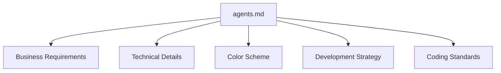
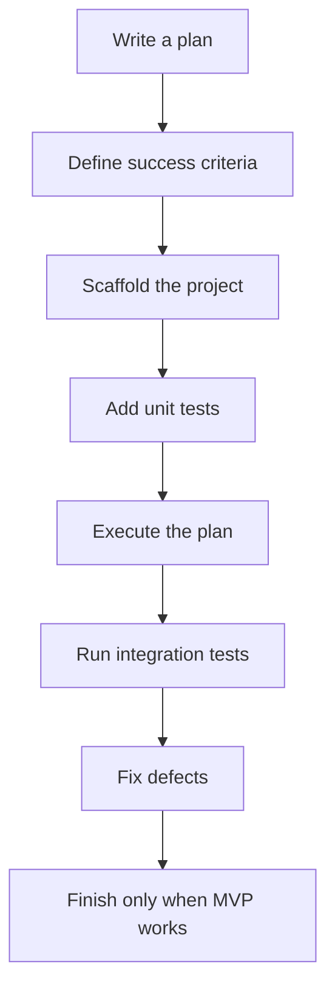
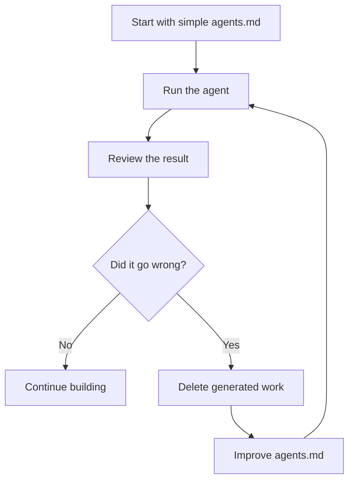

# 016 - Day 3 - Exploring the `agents.md` File and Cursor Settings for Vibe Coding

## Lesson Information

| Item       | Details                                                          |
| ---------- | ---------------------------------------------------------------- |
| Lesson     | 016                                                              |
| Duration   | 10 min                                                           |
| Week       | Week 1 - Vibe Coding Foundation                                  |
| Module     | Week 1 Day 3 - Hands-On with Cursor, Copilot, Codex, Antigravity |
| Main Tool  | Cursor                                                           |
| Main Focus | Using `agents.md` to guide an AI coding agent                    |

## Core Summary

This lesson introduces the `agents.md` file and shows how it can guide an AI coding agent inside Cursor.

The instructor explains that `agents.md` acts like a project instruction file. It gives the agent important context before it starts building. In this project, the file describes the business requirements, technical direction, color scheme, development strategy, and coding standards for a simple Kanban-style project management app.

The lesson also covers useful Cursor shortcuts and shows how to configure Cursor’s agent auto-run settings, including safer sandboxed modes and the higher-risk “YOLO mode.”

## Learning Objectives

By the end of this lesson, students should be able to:

* Understand the role of an `agents.md` file.
* Read and structure project instructions in Markdown.
* Explain how clear requirements improve AI agent output.
* Configure basic Cursor settings for agentic coding.
* Choose between safer and more autonomous agent execution modes.
* Prepare Cursor to build the Kanban project.
* Apply the principle of simplicity when writing instructions for AI agents.

## Cursor Shortcuts

| Action                              | macOS                  | Windows / PC           |
| ----------------------------------- | ---------------------- | ---------------------- |
| Toggle left sidebar / file explorer | `Command + B`          | `Control + B`          |
| Toggle right agent chat panel       | `Command + Option + B` | `Control + Option + B` |
| Open Cursor settings                | `Command + Shift + J`  | `Control + Shift + J`  |

These shortcuts help control the workspace layout while working with files and the agent chat.

## What Is `agents.md`?

`agents.md` is a Markdown file that gives instructions to the coding agent.

In this lesson, the repository contains only one file:

```text
agents.md
```

This file is important because it is loaded into the agent’s context. The agent uses it to understand what should be built, how it should be built, and what constraints it should follow.

You can open it normally in Cursor or right-click and choose:

```text
Open Preview
```

The preview view shows the Markdown structure more clearly, with headings, lists, and sections formatted in a readable way.

## Why Markdown Matters

Markdown is useful because it gives structure to the instructions.

Common Markdown elements include:

| Markdown Element     | Purpose                                     |
| -------------------- | ------------------------------------------- |
| `# Main Heading`     | Defines the main topic                      |
| `## Section Heading` | Separates major instruction areas           |
| Bullet lists         | Lists requirements clearly                  |
| Numbered lists       | Shows ordered steps or priorities           |
| Short paragraphs     | Explains context without becoming too noisy |

A well-structured Markdown file helps the agent understand priorities and constraints more reliably.

## Project Goal

The project goal is to build a simple Kanban-style project management web app.

A Kanban board is similar to tools like:

* Trello
* Jira
* Notion boards
* Linear boards

The app should behave like a board with columns and cards that can move between columns.

## `agents.md` Structure



## Section 1: Business Requirements

The business requirements describe what the product should do.

For this Kanban MVP, the requirements are:

* Build a minimum viable product.
* Create a Kanban-style project management web app.
* Use only one board.
* Include five fixed columns.
* Allow columns to be renamed.
* Each card should have only a title and details.
* Support drag-and-drop movement between columns.
* Allow users to add cards.
* Allow users to delete cards.
* Open with dummy data.
* Prioritize a slick, professional, beautiful UI.

The project intentionally avoids extra features such as:

* Archive
* Search
* Filters
* User login
* Persistence
* Complex project management features

The goal is to start simple and build something polished.

## Section 2: Technical Details

The technical details tell the agent how the app should be built.

In this lesson, the requested technical direction is:

| Requirement    | Detail                       |
| -------------- | ---------------------------- |
| Framework      | Next.js                      |
| App location   | `frontend` subdirectory      |
| Persistence    | None                         |
| Authentication | None                         |
| Libraries      | Popular and simple libraries |
| UI priority    | Elegant and professional     |

The instructor notes that some repetition is acceptable. If something is important, repeating it in different sections can help reinforce the instruction.

## Section 3: Color Scheme

The `agents.md` file includes a preferred color scheme.

This section is optional. Students can:

* Keep the instructor’s colors.
* Replace them with their own colors.
* Remove the section and let the agent choose.

Color schemes are useful when you want stronger visual control over the generated app.

## Section 4: Development Strategy

The strategy section tells the agent how to work.

The recommended workflow is:



The agent should:

* Write a plan first.
* Include success criteria for each phase.
* Scaffold the project.
* Add rigorous unit testing.
* Execute the plan.
* Run integration testing with Playwright or a similar tool.
* Fix defects.
* Stop only when the app is finished, tested, running, and ready for the user.

This gives the AI agent a disciplined workflow instead of letting it jump straight into random code generation.

## Section 5: Coding Standards

The coding standards section tells the agent what style and behavior to follow.

Important standards include:

| Standard                             | Meaning                             |
| ------------------------------------ | ----------------------------------- |
| Use latest libraries                 | Prefer modern, current approaches   |
| Keep it simple                       | Avoid unnecessary complexity        |
| Do not over-engineer                 | Build only what is needed           |
| No unnecessary defensive programming | Avoid bloated code                  |
| No extra features                    | Stay inside the requested MVP       |
| Be concise                           | Keep files and explanations focused |
| Minimal README                       | Avoid excessive documentation       |
| No emojis                            | Keep output clean and compatible    |

The “no emojis” rule is included because AI tools often add them unnecessarily, and they can sometimes cause issues on Windows systems.

## How to Write a Good `agents.md`

A strong `agents.md` should be:

* Clear
* Specific
* Simple
* Direct
* Well-structured
* Focused on the desired outcome
* Honest about what should not be built

Good instruction style:

```markdown
Build a simple Kanban board with five columns.
Cards should have a title and details.
Users can add, delete, and drag cards between columns.
Do not add login, persistence, search, filters, or archive.
Prioritize a polished, professional UI.
```

Weak instruction style:

```markdown
Build a cool project management app with lots of nice features.
```

The weak version is too vague and gives the agent too much room to invent unnecessary complexity.

## Iterative Prompting Strategy

The instructor recommends an experimental approach:



This is a practical way to improve agent instructions. You can let the agent try once, observe where it fails, then rewrite `agents.md` more precisely.

## Cursor Agent Settings

The lesson then moves into Cursor settings.

Open settings with:

| System       | Shortcut              |
| ------------ | --------------------- |
| macOS        | `Command + Shift + J` |
| Windows / PC | `Control + Shift + J` |

Then go to:

```text
Agents → Auto Run
```

## Auto-Run Modes

Cursor gives different levels of control over what the agent can do.

| Mode                    | Description                                     | Best For                          |
| ----------------------- | ----------------------------------------------- | --------------------------------- |
| Ask every time          | Cursor asks before each action                  | Beginners or cautious users       |
| Auto-run in sandbox     | Agent can run actions in a safer environment    | Users who want balance            |
| YOLO mode / unsandboxed | Agent runs everything without repeated approval | Experienced users who accept risk |

## Safety Note

YOLO mode is convenient because the agent can work without constantly asking for permission. However, it also carries more risk because the agent may run commands, create files, modify code, or install packages with less friction.

A safer path is:

1. Start with “ask every time.”
2. Move to sandboxed auto-run once comfortable.
3. Use unsandboxed YOLO mode only when you understand the risks.

## Main Concept: Context Controls Output

The most important lesson is that agentic coding depends heavily on context.

The agent performs better when it knows:

* What product is being built.
* What features are required.
* What features are excluded.
* What technology to use.
* What design style to follow.
* How it should plan, test, and finish.
* What coding standards matter to the user.

## Key Takeaways

* `agents.md` is a project-level instruction file for the AI coding agent.
* Markdown structure helps the agent understand the project clearly.
* Clear, simple requirements are better than vague ambition.
* Repetition is acceptable for important constraints.
* The Kanban project should stay small, polished, and focused.
* Cursor settings control how much autonomy the agent has.
* Safer modes are better while learning.
* YOLO mode is faster but riskier.
* The best agent workflow is iterative: run, inspect, simplify, improve, and rerun.

## Practical Exercise

Create or inspect an `agents.md` file for the Kanban project.

Make sure it includes:

1. Business requirements.
2. Technical details.
3. Optional color scheme.
4. Development strategy.
5. Coding standards.

Then open Cursor settings:

```text
Agents → Auto Run
```

Choose the auto-run mode that matches your comfort level, then prepare to start building the Kanban MVP.
