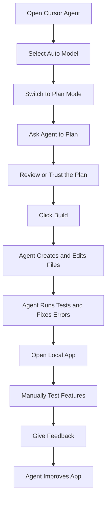
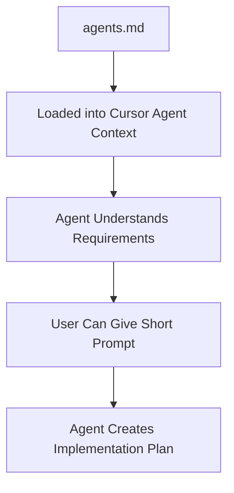
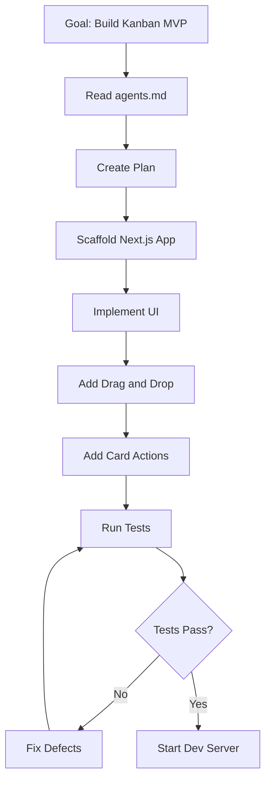
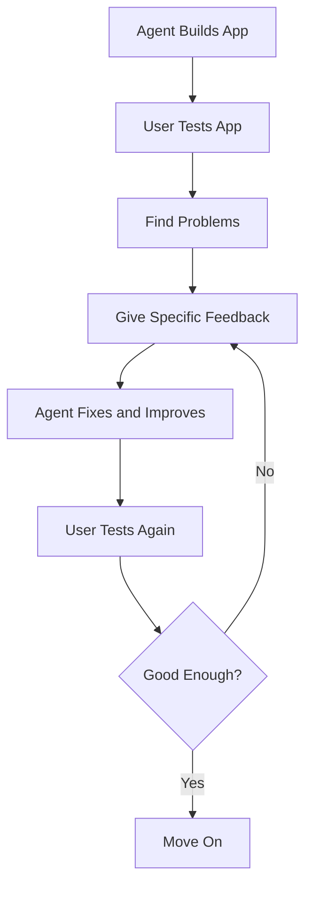

# 017 - Day 3 - Building a Kanban App with the Cursor AI Agent in YOLO Mode

## Lesson Information

| Item          | Details                                                          |
| ------------- | ---------------------------------------------------------------- |
| Lesson        | 017                                                              |
| Duration      | 10 min                                                           |
| Week          | Week 1 - Vibe Coding Foundation                                  |
| Module        | Week 1 Day 3 - Hands-On with Cursor, Copilot, Codex, Antigravity |
| Main Tool     | Cursor AI Agent                                                  |
| Main Mode     | YOLO mode / unsandboxed auto-run                                 |
| Main Activity | Build and iterate on a Kanban web app                            |

## Core Summary

This lesson shows what it feels like to build a real app with the Cursor AI Agent.

The instructor uses the `agents.md` file from the previous lesson as the project context, puts Cursor into planning mode, asks it to create a plan, then lets the agent build the Kanban app in YOLO mode. The agent creates files, scaffolds a frontend project, runs tests, fixes failures, starts the development server, and produces a working Kanban board.

After the first build, the instructor tests the app manually, gives the agent feedback, and lets it improve the UI and drag-and-drop behavior.

## Learning Objectives

By the end of this lesson, students should be able to:

* Use Cursor Agent in planning mode.
* Understand how `agents.md` becomes project context for the agent.
* Observe how an AI coding agent plans, edits files, runs commands, and fixes errors.
* Track context window usage while the agent works.
* Let the agent build a project in YOLO mode.
* Run or open a generated Next.js app.
* Manually test generated functionality.
* Give feedback to improve the generated app.
* Understand the iterative nature of agentic coding.

## Main Workflow



## Step 1: Prepare the Agent Panel

The lesson begins on the right-hand side of Cursor, where the agent chat is located.

The instructor recommends widening the agent panel so it is easier to watch what the agent is doing.

This is useful because the agent will show:

* Files it reads.
* Files it creates.
* Commands it runs.
* Errors it encounters.
* Tests it executes.
* Reasoning and progress updates.
* Context usage.

## Step 2: Choose the Model Setting

Cursor allows users to choose models manually or use **Auto Mode**.

In this lesson, the instructor keeps Cursor in:

```text
Auto Mode
```

This lets Cursor decide which model to use.

Different students may see different behavior depending on:

* Cursor plan.
* Model availability.
* Free or paid access.
* Model routing.
* Local setup.

## Step 3: Switch to Planning Mode

In the agent dropdown, the instructor selects:

```text
Plan
```

Planning mode tells the agent to create a plan before making changes.

The prompt used is very simple:

```text
go ahead and plan
```

The instructor does not need to restate the whole project because Cursor automatically loads `agents.md` into context.

## Why the Prompt Can Be Short

The agent already has access to the project instructions.



Because `agents.md` contains the business requirements, technical details, strategy, and coding standards, the user can simply ask the agent to plan.

## Step 4: Watch Context Usage

Cursor shows how much of the context window has been used.

This matters because the agent’s context window is the space it uses to hold:

* Project instructions.
* File contents.
* Plan details.
* Tool outputs.
* Error messages.
* Test results.
* Its own reasoning history.

As the agent works, context usage increases.

Example from the lesson:

| Moment                       | Approximate Context Usage |
| ---------------------------- | ------------------------- |
| Early planning               | 6.4%                      |
| After build begins           | 10.7%                     |
| During active implementation | 28.8%                     |

Context usage is important because long sessions can eventually fill the context window, making the agent less reliable.

## Step 5: Review the Generated Plan

The agent creates a document called something like:

```text
Kanban MVP Implementation Plan
```

The plan includes:

* Implementation phases.
* Drag-and-drop work.
* Add-card functionality.
* Architecture overview.
* Suggested layout.
* Out-of-scope items.
* Execution order.
* Testing strategy.

The ideal workflow would be to read the plan carefully and give feedback before building.

However, in the demo, the instructor chooses to trust the plan and immediately presses:

```text
Build
```

## Step 6: Build in YOLO Mode

Because Cursor is in YOLO mode, the agent can work autonomously.

It starts creating and modifying files, including things like:

* `.gitignore`
* `frontend/` directory
* Next.js project files
* UI components
* Test files
* Configuration files

In safer modes, the user may need to approve actions one by one.

## What the Agent Is Doing



This demonstrates the core idea of an agent:

> An agent is an LLM running in a loop with tools to achieve a goal.

## Step 7: Observe Failures and Fixes

During the build, the agent may encounter failing tests or implementation errors.

In the lesson, the instructor notices that a test fails. The agent sees the failure, reasons about it, and attempts to fix it.

This is important because agentic coding is not just one-shot code generation. The agent can:

* Run commands.
* Read errors.
* Modify code.
* Run tests again.
* Continue until the project works.

## Step 8: Run the App

Sometimes Cursor may start the development server automatically.

If not, the user may need to open the terminal and run:

```bash
cd frontend
npm run dev
```

The app runs locally, usually at:

```text
http://localhost:3000
```

## Step 9: Test the Kanban App

The generated app includes the expected Kanban columns:

* Backlog
* To Do
* In Progress
* Review
* Done

The instructor manually tests the core requirements.

| Feature                   | Result                |
| ------------------------- | --------------------- |
| App opens successfully    | Works                 |
| Dummy data appears        | Works                 |
| Drag card between columns | Works                 |
| Add a new card            | Works                 |
| Delete a card             | Works                 |
| Rename a column           | Works                 |
| Reorder inside a column   | Initially not working |
| UI polish                 | Good, but improvable  |
| Next.js error indicator   | Still present         |

The app meets most requirements, but it is not perfect.

## Step 10: Give Feedback to the Agent

The instructor gives the agent feedback such as:

```text
It's mostly working nicely, but Next.js is showing one error red symbol at the bottom of the screen.
Also the drag and drop is a bit janky, and it's not possible to reorder within a column.
Can this be made more slick?
Also it would be nice to have more yellow and purple on the screen.
```

This feedback is specific and actionable.

It tells the agent:

* What is working.
* What is broken.
* What interaction feels bad.
* What visual direction to improve.

## Step 11: Review the Improved Version

After the agent works again, the app improves.

The instructor notices:

| Area          | Improvement                  |
| ------------- | ---------------------------- |
| Color scheme  | More yellow and purple added |
| Drag-and-drop | Smoother behavior            |
| Reordering    | Now possible within a column |
| UI            | Looks more polished          |
| Next.js issue | Still not fully fixed        |

The result is not perfect, but it is good enough for the lesson.

## The Iteration Loop



## Important Concept: Good Enough Matters

The instructor does not keep fixing every small issue forever.

This is an important product-building habit. Sometimes the app is good enough for the learning objective, even if it still has imperfections.

The goal of this lesson is not to produce a perfect production-ready Kanban app. The goal is to understand the workflow of building with an AI coding agent.

## Key Takeaways

* Cursor Agent can use `agents.md` as default project context.
* Planning mode helps the agent create an implementation plan before coding.
* YOLO mode lets the agent run commands and edit files with minimal interruption.
* The context window usage indicator helps track how much memory the session is consuming.
* Agentic coding is interactive, not passive.
* The agent may fail, test, fix, and retry by itself.
* Manual review is still necessary.
* Specific feedback produces better improvements.
* A working MVP can be built quickly, but it may still need human judgment.
* The best workflow is build, test, feedback, iterate.

## Practical Exercise

Recreate the lesson workflow:

1. Open the Kanban project in Cursor.
2. Open the agent panel.
3. Select Auto Mode for the model.
4. Switch the agent to Plan Mode.
5. Prompt:

```text
go ahead and plan
```

6. Review the generated plan.
7. Press Build.
8. Let the agent create the app.
9. Run the app if needed:

```bash
cd frontend
npm run dev
```

10. Open:

```text
http://localhost:3000
```

11. Test adding, deleting, renaming, dragging, and reordering cards.
12. Give the agent feedback and let it improve the app.

---

# Bài luyện tập

## Mục tiêu


## Đề bài


## Yêu cầu hoàn thành

- [ ] 
- [ ] 
- [ ] 

## Kết quả / lời giải


## Ghi chú
