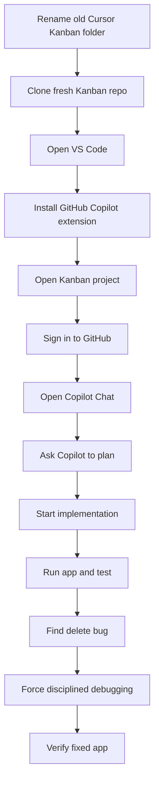
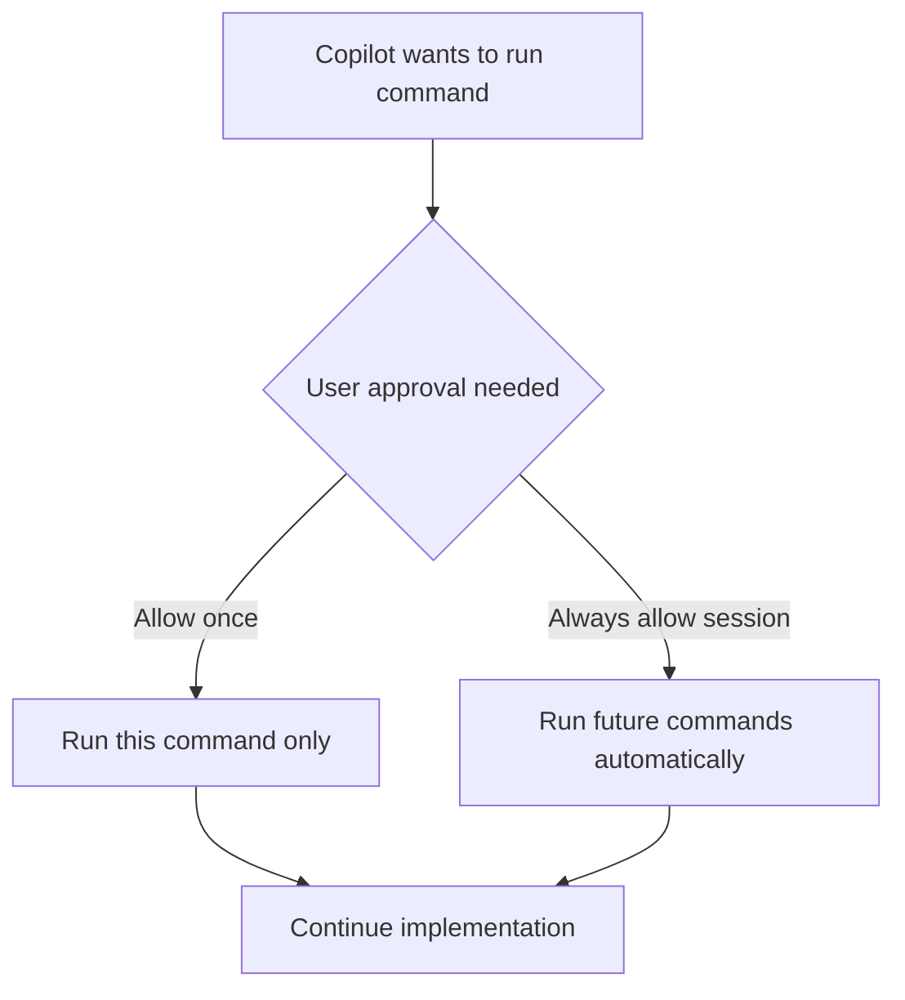
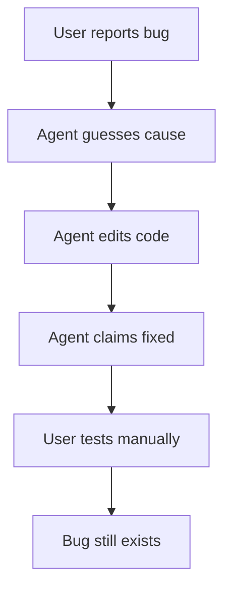
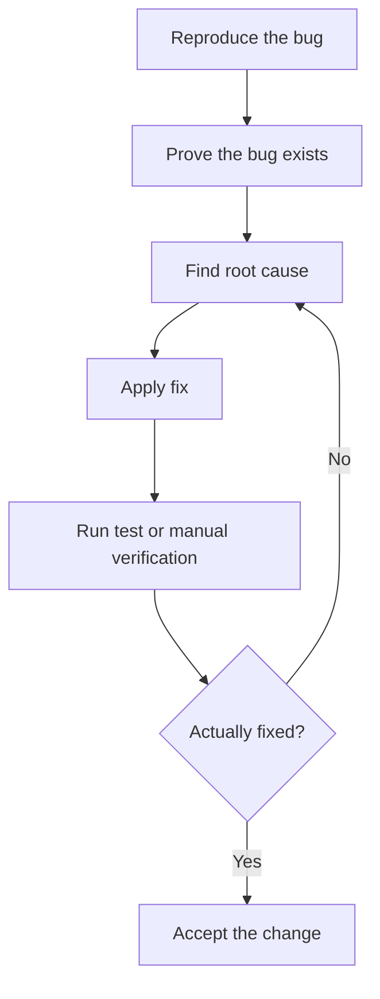

# 018 - Day 3 - Building a Kanban Board with GitHub Copilot in VS Code

## Lesson Information

| Item          | Details                                                          |
| ------------- | ---------------------------------------------------------------- |
| Lesson        | 018                                                              |
| Duration      | 15 min                                                           |
| Week          | Week 1 - Vibe Coding Foundation                                  |
| Module        | Week 1 Day 3 - Hands-On with Cursor, Copilot, Codex, Antigravity |
| Main Tool     | GitHub Copilot in VS Code                                        |
| Main Activity | Build the same Kanban app using Copilot Agent                    |
| Key Skill     | Debugging AI-generated code through disciplined feedback         |

## Core Summary

This lesson rebuilds the Kanban app, but this time using **GitHub Copilot inside VS Code** instead of Cursor.

The instructor first resets the project by renaming the previous Cursor-generated Kanban folder and cloning a fresh copy of the repository. Then VS Code is installed or opened, GitHub Copilot is added as an extension, and the Kanban project is opened inside VS Code.

Copilot is then used in agent mode to plan and implement the project based on `agents.md`. The agent successfully builds most of the app, but gets stuck near the end and produces a bug in the delete-card feature. The key learning moment is how to push back on the agent and force it to debug properly: reproduce the problem, prove the root cause, fix it, and prove the fix.

## Learning Objectives

By the end of this lesson, students should be able to:

* Open a fresh project in VS Code.
* Install and use the GitHub Copilot extension.
* Sign in to GitHub inside VS Code.
* Use Copilot Chat / Agent mode.
* Ask Copilot to plan based on `agents.md`.
* Let Copilot implement a full Kanban board.
* Understand how Copilot differs from Cursor in workflow.
* Recognize when an agent claims success without proof.
* Give disciplined debugging instructions to an AI coding agent.
* Test generated functionality manually before trusting it.

## Overall Workflow



## Step 1: Reset the Kanban Project

The instructor starts from the previous `Instant` project in Cursor, then moves back to the parent projects directory.

Check current directory:

```bash
pwd
```

Move up one directory:

```bash
cd ..
```

Rename the old Kanban project generated by Cursor:

```bash
mv Kanban Cursor_Kanban
```

Now the old project is preserved as:

```text
Cursor_Kanban
```

Then clone a fresh version of the Kanban repo:

```bash
git clone https://github.com/ed-donner/kanban.git
```

Now there are two folders:

| Folder          | Purpose                            |
| --------------- | ---------------------------------- |
| `Cursor_Kanban` | Previous app generated with Cursor |
| `Kanban`        | Fresh repo with only `agents.md`   |

This lets the instructor compare the Cursor workflow with the GitHub Copilot workflow fairly.

## Step 2: Install or Open VS Code

GitHub Copilot is most commonly used inside **Visual Studio Code**.

Cursor and VS Code feel similar because Cursor is based on VS Code, but Copilot’s workflow and integration are different.

If VS Code is not installed, download it from the official VS Code website. If it is already installed, check for updates.

## Step 3: Install GitHub Copilot Extension

Open the Extensions panel:

| System       | Shortcut              |
| ------------ | --------------------- |
| macOS        | `Command + Shift + X` |
| Windows / PC | `Control + Shift + X` |

Search for:

```text
GitHub Copilot
```

Install the verified extension from:

```text
github.com
```

The instructor already has it installed, so there is no install button visible in the demo.

## Step 4: Open the Kanban Project in VS Code

In VS Code:

```text
File → New Window → Open
```

Then navigate to the fresh `Kanban` folder and open it.

You should see:

```text
KANBAN
```

in the VS Code project explorer or title area.

That confirms the correct project is open.

## Step 5: Sign In to GitHub

To use GitHub Copilot, you need to be signed in to GitHub.

In VS Code, click the account/avatar icon in the bottom-left corner.

If not signed in, follow the sign-in flow.

Copilot requires a GitHub account and access to a Copilot plan or free-tier allowance.

## Step 6: Open GitHub Copilot Chat

Open Copilot Chat:

| System       | Shortcut              |
| ------------ | --------------------- |
| macOS        | `Command + Shift + I` |
| Windows / PC | `Control + Shift + I` |

You can also open it through:

```text
View → Chat
```

A Copilot panel appears on the right side of VS Code.

## Copilot Interface Overview

The Copilot panel includes:

| Area             | Purpose                                       |
| ---------------- | --------------------------------------------- |
| Chat input       | Where you give instructions                   |
| Mode dropdown    | Lets you choose plan / agent style behavior   |
| Model selector   | Lets you choose Auto or a specific model      |
| Usage indicator  | Shows usage against your Copilot allowance    |
| Approval prompts | Lets you approve commands and file operations |

The interface feels similar to Cursor, but the permissions and execution flow may feel more step-by-step.

## Step 7: Ask Copilot to Plan

Switch Copilot to planning mode and prompt:

```text
Please plan the task at hand.
```

Copilot reads the project context, including `agents.md`, and creates a plan for the Kanban app.

As in Cursor, the instructor does not spend time reviewing the plan deeply. Instead, they continue directly into implementation.

## Step 8: Start Implementation

After the plan is ready, press:

```text
Start Implementation
```

Copilot begins creating files, scaffolding the app, installing dependencies, and writing code.

At first, it asks for permission before running commands.

The instructor eventually allows all commands for the session, creating a workflow similar to YOLO mode.

## Permission Flow



The instructor chooses to allow more autonomy, while reminding students to choose the risk level they are comfortable with.

## Step 9: Watch the Agent Struggle

Copilot makes progress, but near the end it gets stuck.

The agent:

* Writes a lot of code.
* Fixes some bugs.
* Tries to start the server.
* Starts it in the wrong directory first.
* Corrects itself and starts it again.
* Then appears to hang because it does not realize the server is already running.

The instructor stops the agent manually.

This is an important reality of agentic coding: even when the app is mostly complete, the agent can still fail awkwardly at workflow or terminal handling.

## Step 10: Run the App Manually

The instructor manually starts the app from the `frontend` directory:

```bash
cd frontend
npm run dev
```

Then opens the local app in the browser.

The app is mostly successful and visually good. In some ways, the instructor prefers this version over the Cursor version.

## Manual Feature Test

| Feature                       | Result                    |
| ----------------------------- | ------------------------- |
| App opens                     | Works                     |
| Kanban layout appears         | Works                     |
| Drag-and-drop between columns | Works well                |
| UI design                     | Good                      |
| No visible Next.js error      | Better than Cursor result |
| Rename columns                | Works                     |
| Delete card                   | Broken                    |

The major bug is that deleting a card does not work.

## Step 11: Give Feedback to Copilot

The instructor returns to Copilot and says:

```text
Everything seems to be working well except the delete card feature isn't working.
```

Copilot claims it fixed the issue.

However, this creates the main learning point of the lesson: the agent guessed the problem, changed something, and claimed success without proving it.

## Key Warning: Do Not Trust Agent Claims Blindly

A common AI coding agent failure pattern is:



This is dangerous because the agent may sound confident even when it has not actually verified anything.

## The Better Debugging Recipe

The instructor gives a stricter instruction:

```text
That didn't fix it.
Please first reproduce the problem.
Prove you've reproduced it.
Find the root cause.
Fix it.
And prove you fixed it.
```

This is the correct debugging process for agentic coding.

## Disciplined Debugging Loop



## Why This Matters

The agent should not simply guess. It should:

1. Reproduce the issue.
2. Show evidence that the issue exists.
3. Identify the root cause.
4. Apply a targeted fix.
5. Test the fix.
6. Demonstrate that the behavior now works.

This is especially important when using smaller or cheaper models, which may be more likely to guess and declare victory too early.

## Step 12: Verify the Fix

After receiving the stricter debugging instruction, Copilot works again.

This time it claims to have:

* Reproduced the problem.
* Found the cause.
* Fixed it.
* Tested the fix.

The instructor reruns the app:

```bash
npm run dev
```

Then tests the delete feature again.

This time, deleting a card works.

## Cursor vs GitHub Copilot Comparison

| Area               | Cursor                           | GitHub Copilot in VS Code                                    |
| ------------------ | -------------------------------- | ------------------------------------------------------------ |
| Editor             | Cursor IDE                       | VS Code                                                      |
| Agent panel        | Built into Cursor                | Copilot Chat extension                                       |
| Project context    | Uses `agents.md`                 | Also reads `agents.md`                                       |
| Planning mode      | Available                        | Available                                                    |
| Model control      | Auto or selected models          | Auto or selected models                                      |
| Autonomy           | YOLO mode available              | Requires permissions, can allow session commands             |
| First result       | Worked, but had UI/runtime issue | Worked, but delete feature bug                               |
| Debugging behavior | Improved after feedback          | Initially guessed fix, then fixed after stricter instruction |
| Main lesson        | Agent can build quickly          | Human must enforce disciplined debugging                     |

## Core Concept: You Are the Boss of the Agent

The agent can write code quickly, but the human must direct the process.

Your job is to:

* Check whether the app actually works.
* Push back when the agent guesses.
* Ask for evidence.
* Require tests or reproduction.
* Keep the project scope simple.
* Decide when the result is good enough.

## Key Takeaways

* GitHub Copilot can be used as an agent inside VS Code.
* VS Code and Cursor feel similar because they share the same editor foundation.
* Copilot can read `agents.md` and use it as project context.
* Agentic coding still requires manual testing.
* Agents may hang, get stuck, or misunderstand terminal state.
* A confident agent response does not mean the bug is fixed.
* Good debugging requires proof, not guesses.
* The best instruction is: reproduce, prove, find root cause, fix, prove fixed.
* Smaller models can still produce strong results, but may need stricter supervision.

## Practical Exercise

Recreate the workflow:

1. Rename the old Cursor project:

```bash
mv Kanban Cursor_Kanban
```

2. Clone a fresh copy:

```bash
git clone https://github.com/ed-donner/kanban.git
```

3. Open the fresh `Kanban` folder in VS Code.
4. Install GitHub Copilot if needed.
5. Sign in to GitHub.
6. Open Copilot Chat.
7. Switch to planning mode.
8. Prompt:

```text
Please plan the task at hand.
```

9. Start implementation.
10. Approve commands at your chosen safety level.
11. Run the app:

```bash
cd frontend
npm run dev
```

12. Test the app manually.
13. If something fails, use the disciplined debugging prompt:

```text
Please reproduce the problem first.
Prove you reproduced it.
Find the root cause.
Fix it.
Then prove that the fix works.
```
