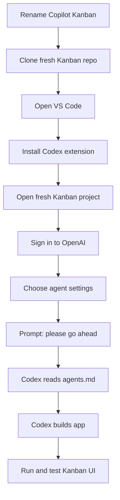
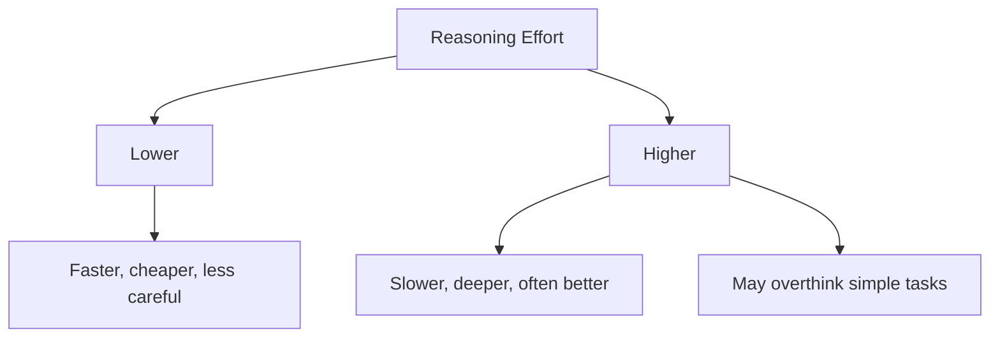
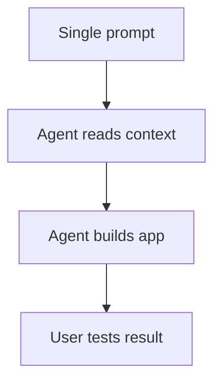

# 019 - Day 3 - OpenAI Codex VS Code Extension: Zero-Shot Kanban App Build

## Lesson Information

| Item          | Details                                                                 |
| ------------- | ----------------------------------------------------------------------- |
| Lesson        | 019                                                                     |
| Duration      | 10 min                                                                  |
| Week          | Week 1 - Vibe Coding Foundation                                         |
| Module        | Week 1 Day 3 - Hands-On with Cursor, Copilot, Codex, Antigravity        |
| Main Tool     | OpenAI Codex VS Code Extension                                          |
| Main Activity | Build the Kanban app zero-shot                                          |
| Core Skill    | Evaluate and guide an AI coding agent without writing all code manually |

## Core Summary

This lesson demonstrates building the same Kanban app again, but this time with the **OpenAI Codex VS Code extension**.

The instructor resets the project by renaming the GitHub Copilot version, cloning a fresh Kanban repo, installing the Codex extension in VS Code, signing in, selecting agent settings, and giving Codex a very short prompt:

```text
please go ahead
```

Codex reads `agents.md`, plans internally, builds the app, runs the dev server, and produces the best-looking Kanban implementation so far. This is presented as a strong example of **zero-shot generation**: one prompt, no back-and-forth, and a complete working result.

> Current note: OpenAI’s help center says Codex can be used through the Codex app, CLI, IDE extension, and web, and the IDE extension works with VS Code and most VS Code forks. Access and limits vary by ChatGPT plan. [OpenAI Help Center](https://help.openai.com/en/articles/11369540-using-codex-with-chatgpt)

## Learning Objectives

By the end of this lesson, students should be able to:

* Reset the Kanban project for another tool comparison.
* Install and open the OpenAI Codex extension in VS Code.
* Sign in with an OpenAI / ChatGPT account.
* Understand Codex agent access modes.
* Use model and reasoning-effort settings.
* Let Codex build from `agents.md`.
* Evaluate a zero-shot generated app.
* Understand that non-experts can still guide frontend work effectively.

## Workflow Overview



## Step 1: Reset the Project

The instructor starts by preserving the Copilot-generated version:

```bash
mv Kanban Copilot_Kanban
```

Then clones a fresh copy again:

```bash
git clone https://github.com/ed-donner/kanban.git
```

Now the fresh `Kanban` folder contains only:

```text
agents.md
```

This keeps the comparison fair across Cursor, Copilot, and Codex.

## Step 2: Install the Codex Extension

In VS Code, open Extensions:

| System       | Shortcut              |
| ------------ | --------------------- |
| macOS        | `Command + Shift + X` |
| Windows / PC | `Control + Shift + X` |

Search for:

```text
Codex
```

Install the official OpenAI Codex extension.

After installation, the Codex icon appears in the VS Code sidebar.

## Step 3: Open the Fresh Kanban Project

In VS Code:

```text
File → New Window → Open
```

Select the fresh `Kanban` folder.

Close the GitHub Copilot sidebar if it is still open, then open the Codex panel from the Codex icon.

## Step 4: Configure Codex

The Codex panel includes several important controls:

| Setting          | Meaning                                                     |
| ---------------- | ----------------------------------------------------------- |
| Account settings | Sign in with an OpenAI / ChatGPT account                    |
| Agent mode       | Lets Codex inspect, edit, and run the project               |
| Full access      | Similar to YOLO mode: more autonomy and fewer interruptions |
| Model selector   | Choose the available coding model                           |
| Reasoning effort | Controls how deeply Codex thinks before acting              |

The instructor chooses a powerful Codex model and sets reasoning effort to **high**.

## Reasoning Effort

Higher reasoning effort can improve quality, but it may also take longer.



The lesson’s practical advice: more thinking is useful, but not automatically better for every task.

## Step 5: Prompt Codex

Unlike Cursor and Copilot, the instructor does not explicitly switch into plan mode. Instead, `agents.md` already tells the agent to plan first.

The prompt is simply:

```text
please go ahead
```

Codex then:

* Identifies project documentation.
* Reads `agents.md`.
* Understands the Kanban requirements.
* Builds the app.
* Runs the server.
* Reports changed files.

## Step 6: Observe the Build

Codex works for around 15 minutes and modifies many files.

The instructor notes the context usage display, for example:

| Metric        | Example           |
| ------------- | ----------------- |
| Context used  | 16%               |
| Tokens used   | ~42,000 / 258,000 |
| Files changed | 74 files          |

This shows that Codex is doing a larger, more extensive implementation than the previous tools.

## Step 7: Test the App

The app runs locally at:

```text
http://localhost:3000
```

The generated app is called:

```text
Kanban Studio
```

It includes the line:

```text
Focus one board, five columns, zero clutter.
```

The instructor tests the main features.

| Feature                   | Result             |
| ------------------------- | ------------------ |
| App opens                 | Works              |
| Visual design             | Excellent          |
| Drag card between columns | Works              |
| Reorder cards             | Works              |
| Delete cards              | Works              |
| Rename columns            | Works              |
| Add new card              | Works              |
| Overall quality           | Best result so far |

## What Is Zero-Shot Generation?

Zero-shot generation means giving the agent the task once and letting it produce the result without additional correction.



In this lesson, Codex performs very well zero-shot because the project context in `agents.md` is already clear, specific, and scoped.

## Key Lesson: You Can Manage Work You Cannot Fully Code Yourself

The instructor makes an important point: you do not need to be an expert React or frontend developer to guide a tool like Codex.

You still need to:

* Know what you want.
* Review the UI.
* Test the behavior.
* Give feedback.
* Ask the agent how to run or fix things.
* Manage scope and quality.

This is closer to acting as a product-minded technical manager than manually writing every line of code.

## Key Takeaways

* Codex can be used as a VS Code extension, not only as a CLI tool.
* `agents.md` remains the central project instruction file.
* A short prompt can work if the context file is strong.
* Full-access agent mode gives Codex more autonomy.
* Reasoning effort affects speed, depth, and quality.
* Codex produced the strongest zero-shot Kanban result in this demo.
* AI agents are especially powerful for frontend prototyping.
* Human judgment is still required to evaluate whether the result is actually good.
* Toy projects can work impressively fast, but larger systems still require careful engineering discipline.

## Practical Exercise

Repeat the Codex workflow:

1. Preserve the previous project:

```bash
mv Kanban Copilot_Kanban
```

2. Clone a fresh repo:

```bash
git clone https://github.com/ed-donner/kanban.git
```

3. Open `Kanban` in VS Code.
4. Install the official Codex extension.
5. Sign in.
6. Choose your agent access mode and model.
7. Set reasoning effort.
8. Prompt:

```text
please go ahead
```

9. Open the generated app.
10. Test drag-and-drop, reordering, deleting, renaming columns, and adding cards.
