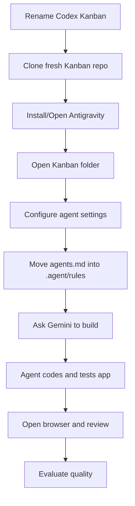
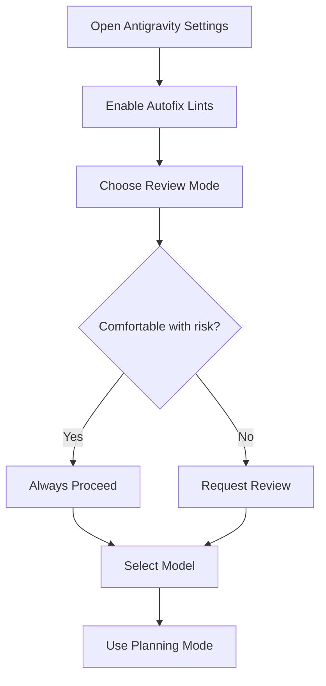
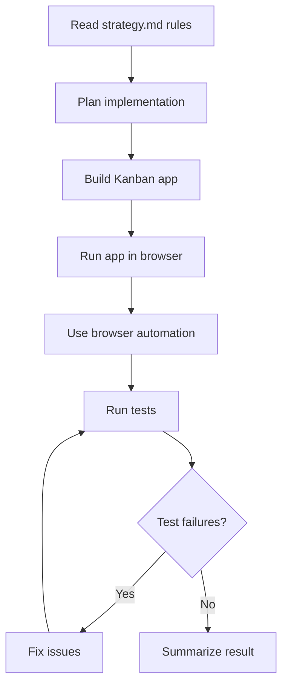

# 020 - Day 3 - Building a Kanban App with Antigravity IDE and Gemini 3 Pro

## Lesson Information

| Item          | Details                                                          |
| ------------- | ---------------------------------------------------------------- |
| Lesson        | 020                                                              |
| Duration      | 11 min                                                           |
| Week          | Week 1 - Vibe Coding Foundation                                  |
| Module        | Week 1 Day 3 - Hands-On with Cursor, Copilot, Codex, Antigravity |
| Main Tool     | Antigravity IDE                                                  |
| Main Model    | Gemini 3 Pro                                                     |
| Main Activity | Build the Kanban app again and compare tool/model quality        |

## Core Summary

This lesson tests the fourth agentic coding environment: **Antigravity IDE**, using **Gemini 3 Pro**.

The instructor resets the Kanban project again, installs and opens Antigravity, configures agent settings, converts the existing `agents.md` instructions into Antigravity’s preferred `.agent/rules/strategy.md` format, and then asks the agent to build the app.

Antigravity successfully builds and tests the app, including using browser automation and Playwright-style checks. The result looks clean and functional, though the “add card” flow feels simpler and less polished than the Codex version.

## Learning Objectives

By the end of this lesson, students should be able to:

* Install and open Antigravity IDE.
* Understand why Antigravity feels similar to VS Code and Cursor.
* Open a project folder inside Antigravity.
* Configure Antigravity agent settings.
* Convert `agents.md` into Antigravity’s `.agent/rules` structure.
* Use Gemini 3 Pro to build the Kanban app.
* Observe browser-based testing and automated UI validation.
* Compare Antigravity’s output with Cursor, Copilot, and Codex.
* Decide when a tool/model is “good enough” and when to switch tools.

## Overall Workflow



## Step 1: Reset the Project Again

The instructor preserves the Codex-generated version:

```bash
mv Kanban Codex_Kanban
```

Then clones a fresh copy of the original repo:

```bash
git clone https://github.com/ed-donner/kanban.git
```

This creates a new clean `Kanban` folder containing only:

```text
agents.md
```

## Step 2: Open Antigravity IDE

Antigravity is downloaded from:

```text
antigravity.google
```

After installation, it looks familiar because it is another VS Code-style editor, similar to Cursor.

The instructor opens the fresh Kanban project:

```text
Open Folder → Projects → Kanban
```

## Step 3: Sign In with Google

Antigravity uses Google authentication.

If not already signed in, the login area appears in the top-right corner. Students should sign in with a Google account before using the agent.

## Step 4: Configure Antigravity Agent Settings

The instructor opens Antigravity settings and adjusts the agent behavior.

| Setting             | Meaning                                     | Instructor Choice |
| ------------------- | ------------------------------------------- | ----------------- |
| Agent Autofix Lints | Automatically fix lint errors               | Enabled           |
| Review mode         | Ask before actions or proceed automatically | Always proceed    |
| Planning mode       | Agent plans before acting                   | Enabled           |
| Model               | Select Gemini / Anthropic / other models    | Gemini 3 Pro High |

The instructor chooses a more autonomous setup, similar to YOLO mode.

Students who are less comfortable should keep review mode enabled.

## Antigravity Settings Flow



## Step 5: Convert `agents.md` into Antigravity Rules

Unlike Cursor, Copilot, and Codex, Antigravity does not rely directly on `agents.md`.

Instead, it expects rule files inside a special project folder:

```text
.agent/rules/
```

The instructor copies the entire content of `agents.md`, then creates:

```text
.agent/rules/strategy.md
```

Inside `strategy.md`, the activation mode is set to:

```text
always on
```

Then the original `agents.md` content is pasted into that file.

Finally, the original `agents.md` file is deleted to avoid confusion.

## Final Rule Structure

```text
Kanban/
  .agent/
    rules/
      strategy.md
```

## Why This Matters

Different agentic tools use different instruction conventions.

| Tool           | Instruction File / Context Style |
| -------------- | -------------------------------- |
| Cursor         | `agents.md`                      |
| GitHub Copilot | Can read `agents.md`             |
| Codex          | Can read `agents.md`             |
| Antigravity    | `.agent/rules/*.md`              |
| Claude Code    | Often uses `CLAUDE.md`           |

The deeper lesson is that the same project requirements can travel across tools, but you may need to adapt the format.

## Step 6: Start the Build

The instructor prompts Gemini with:

```text
please go ahead
```

Because the rule file is always active, Gemini should already have the full project instructions in context.

The selected model is:

```text
Gemini 3 Pro High
```

This is a strong model, so the instructor expects a serious result.

## Step 7: Agent Builds and Tests the App

Antigravity completes the implementation and provides:

* A summary of changes.
* A Kanban MVP walkthrough.
* Instructions for running the app.
* A generated screen recording / visual preview.
* Evidence that it used browser testing.
* Playwright-style automated checks.

The instructor observes that Antigravity actually opened browsers and tested the app during implementation.

## Agent Build Loop



## Step 8: Review the Result

The generated app looks clean and modern.

The instructor tests the core features:

| Feature                    | Result                                  |
| -------------------------- | --------------------------------------- |
| App opens                  | Works                                   |
| UI design                  | Fresh and clean                         |
| Move cards between columns | Works                                   |
| Rename columns             | Works                                   |
| Add card                   | Works, but feels simplistic             |
| Add card description       | Not supported or not obvious            |
| Browser testing            | Used by the agent                       |
| Overall quality            | Good, but not clearly better than Codex |

## Main Issue Found

The add-card experience is weaker than expected.

The instructor adds a card, but the flow appears basic and does not clearly support adding a description. This makes the feature feel less polished than the rest of the app.

## Tool Comparison So Far

| Tool           | Model / Setup                      | Strength                  | Weakness                        |
| -------------- | ---------------------------------- | ------------------------- | ------------------------------- |
| Cursor         | Auto / likely lower-cost model     | Fast agentic workflow     | Had UI/runtime issues           |
| GitHub Copilot | Likely smaller model               | Good VS Code integration  | Initially guessed bug fix       |
| Codex          | Strong Codex model, high reasoning | Best zero-shot result     | Took longer, changed many files |
| Antigravity    | Gemini 3 Pro High                  | Clean UI, browser testing | Add-card UX felt simplistic     |

## Key Concept: Model Strength Matters

The instructor emphasizes that tool quality and model quality are not the same thing.

Codex performed extremely well partly because it used a very strong frontier model with high reasoning. Cursor and Copilot may have used smaller or cheaper models in the earlier demos.

A better model often produces better results, but:

* It may take longer.
* It may use more resources.
* It may still make product or UX mistakes.
* It still needs human review.

## Key Takeaways

* Antigravity is another VS Code-style agentic IDE.
* It uses Google login and supports models such as Gemini.
* Antigravity stores persistent project instructions in `.agent/rules`.
* `agents.md` can be adapted into Antigravity’s rule format.
* “Always proceed” mode is similar to YOLO mode and should be used carefully.
* Agent Autofix Lints helps the agent clean up basic code quality issues.
* Antigravity can run browser-based tests and generate visual walkthroughs.
* Gemini 3 Pro produced a clean and functional Kanban app.
* The result was good, but still required human UX judgment.
* Switching tools or models is a valid strategy when quality, speed, or workflow feels wrong.

## Practical Exercise

Recreate the Antigravity workflow:

1. Preserve the previous Codex project:

```bash
mv Kanban Codex_Kanban
```

2. Clone a fresh repo:

```bash
git clone https://github.com/ed-donner/kanban.git
```

3. Open Antigravity.
4. Open the fresh `Kanban` folder.
5. Create this folder structure:

```text
.agent/rules/
```

6. Create:

```text
.agent/rules/strategy.md
```

7. Paste the contents of `agents.md` into `strategy.md`.
8. Set activation mode to:

```text
always on
```

9. Delete `agents.md` if you want to avoid duplicated instructions.
10. Enable planning mode.
11. Choose Gemini 3 Pro or another available model.
12. Prompt:

```text
please go ahead
```

13. Run and test the generated Kanban app.
14. Compare the result with Cursor, Copilot, and Codex.
