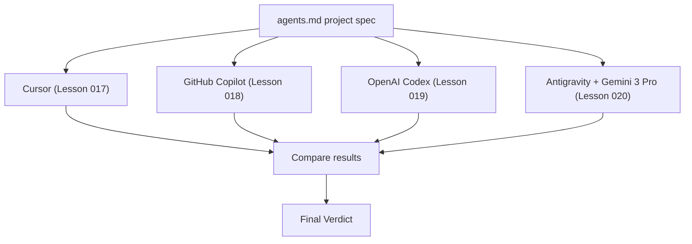
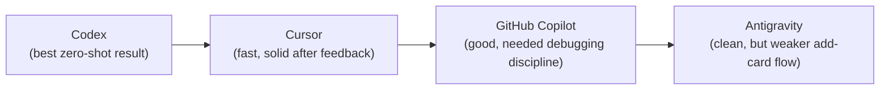
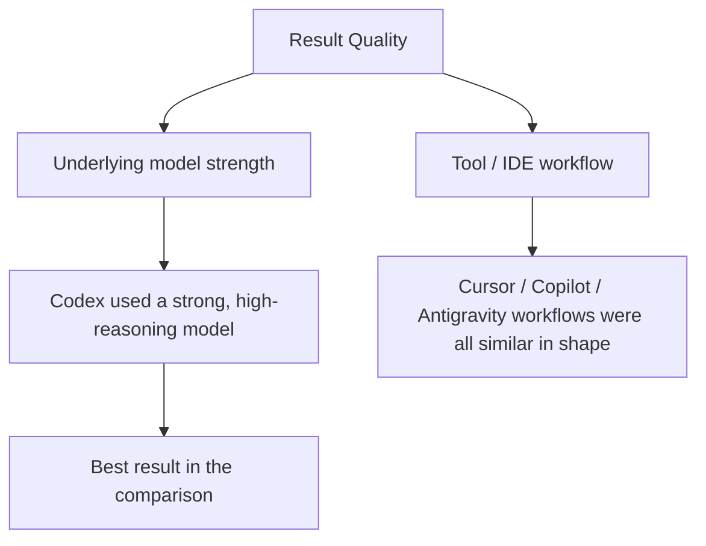
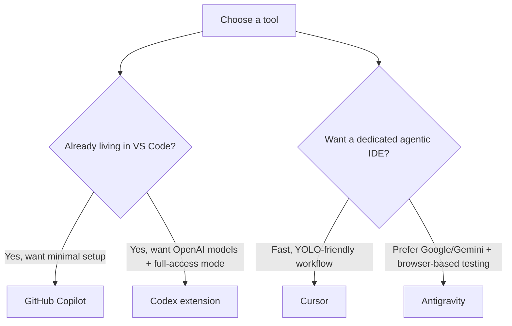

# 021 - Day 3 - Cursor vs Copilot vs Codex vs Antigravity: Final Verdict

## Lesson Information

| Item          | Details                                                          |
| ------------- | ----------------------------------------------------------------- |
| Lesson        | 021                                                              |
| Duration      | 4 min                                                             |
| Week          | Week 1 - Vibe Coding Foundation                                  |
| Module        | Week 1 Day 3 - Hands-On with Cursor, Copilot, Codex, Antigravity |
| Main Activity | Compare and rank the four agentic coding tools used in this module |

## Core Summary

This closing lesson steps back from hands-on building and reviews the four tools used across Lessons 017–020 to build the same Kanban app: **Cursor**, **GitHub Copilot**, **OpenAI Codex**, and **Antigravity**.

The comparison looks at context understanding, editing speed, code quality, ability to self-test/run the app, level of control offered to the user, and fit for beginners versus professional developers. The instructor's overall verdict: model strength mattered more than the tool itself, Codex produced the strongest zero-shot result, and all four tools are viable — the right choice depends on workflow preference and risk tolerance, not on one tool being universally "best."

## Learning Objectives

By the end of this lesson, students should be able to:

* Summarize the strengths and weaknesses of Cursor, Copilot, Codex, and Antigravity.
* Compare tools across context understanding, edit speed, code quality, self-testing ability, and control.
* Explain why model quality can matter more than tool choice.
* Match a tool to a use case (fast prototyping vs. controlled, reviewed changes).
* Decide which tool(s) to adopt going forward based on personal workflow and risk comfort.

## Comparison Recap Across Lessons

## Final Comparison Table

| Criterion                 | Cursor                          | GitHub Copilot                             | Codex                                  | Antigravity                        |
| -------------------------- | -------------------------------- | -------------------------------------------- | ---------------------------------------- | ------------------------------------ |
| Context understanding     | Good — reads `agents.md` automatically | Good — also reads `agents.md`         | Best — used context precisely, minimal guesswork | Good — needed `agents.md` converted to `.agent/rules` |
| Editing speed              | Fast                              | Fast, but stalled once near the end          | Took longer (~15 min, 74 files changed)  | Fast                                 |
| Code / UI quality          | Good, needed UI feedback pass    | Good, arguably nicer visuals than Cursor     | Best — most polished, "Kanban Studio" branding | Clean UI, but "add card" felt simplistic |
| Self-run / self-test       | Ran dev server, ran tests, fixed failures | Attempted to run server, got stuck on terminal state | Ran server, reported file/context stats  | Used browser automation, Playwright-style checks |
| Control / autonomy         | YOLO mode = full autonomy        | Step-by-step approval by default, can allow session-wide | Full-access mode, adjustable reasoning effort | "Always proceed" mode = full autonomy |
| Beginner friendliness      | High — simple prompts work well  | High — familiar VS Code environment          | Medium — more configuration (model, reasoning effort) | Medium — new rules format to learn   |
| Notable weakness           | Lingering Next.js error indicator | Guessed a bug fix without proof, delete-card bug | Longest run time                         | Weak add-card UX                     |

## Ranking by Overall Result Quality

> Ranking reflects this specific demo and model choices, not a permanent hierarchy — swapping models per tool could reorder the results.

## Key Insight: Tool Quality ≠ Model Quality

The strongest recurring theme across the module is that **the underlying model matters as much as the tool wrapped around it**.

Codex performed best partly *because* it used a strong frontier model with high reasoning effort — not solely because the Codex extension itself is superior. The same tool with a weaker model, or a competing tool with a stronger model, could flip the ranking.

## Decision Guide: Which Tool to Use

## Key Takeaways

* All four tools — Cursor, GitHub Copilot, Codex, and Antigravity — could build a working Kanban app from the same `agents.md` spec.
* Codex produced the most polished, zero-shot result in this comparison, aided by a strong model and high reasoning effort.
* Cursor was the fastest to get to a working build and iterated well on feedback.
* GitHub Copilot required the most disciplined debugging (reproduce, prove, fix, prove) to resolve its delete-card bug.
* Antigravity stood out for browser-based automated testing but had the weakest "add card" experience.
* Model strength is a bigger lever than tool choice — a good tool with a weak model can still underperform a simpler tool with a strong model.
* Every tool still required human review, manual testing, and specific feedback; none produced a flawless app unsupervised.
* There is no single "best" tool for everyone — the right pick depends on your editor preference, desired autonomy level, and comfort giving up control.
* Switching tools (or models) is a legitimate strategy whenever speed, quality, or workflow feels wrong.

## Practical Exercise

1. Re-read your notes (or the generated apps) from Lessons 017–020.
2. Fill in your own version of the comparison table based on what you personally observed.
3. Pick the tool you would default to for:
   * A fast throwaway prototype.
   * A change you want reviewed step-by-step before it's applied.
4. Try rebuilding the Kanban app one more time with your chosen tool, but switch the underlying model to the strongest one available, and note whether the result improves.
