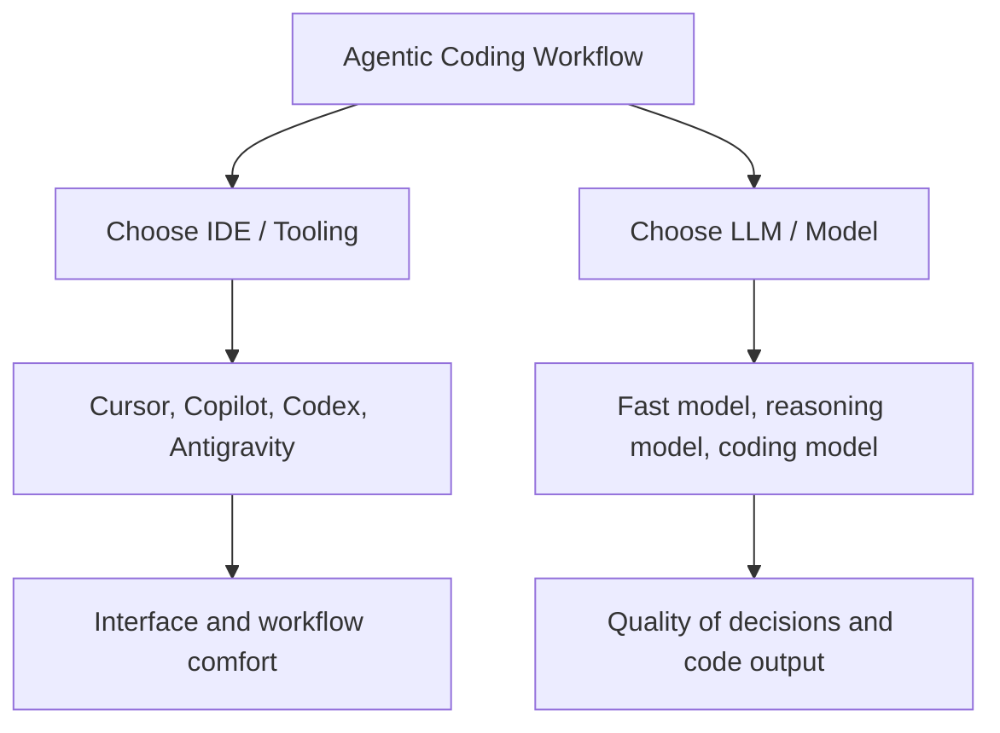
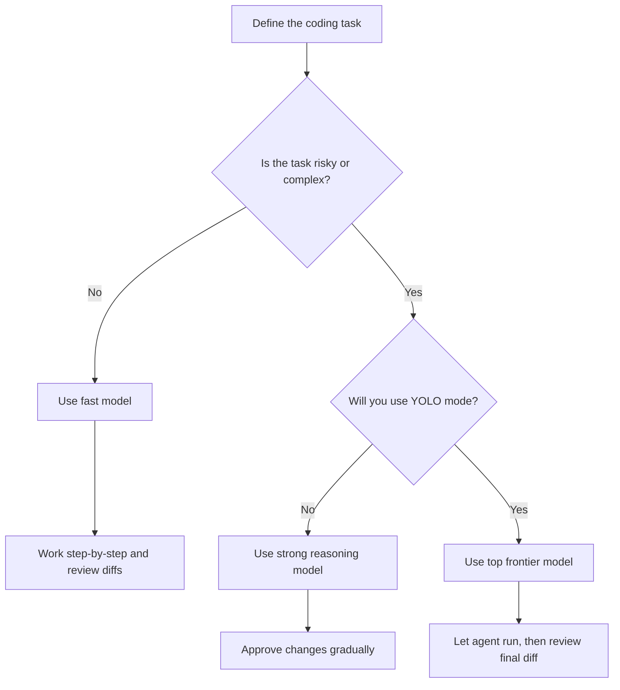

# 022 - Day 4 - YOLO Mode: Choosing the Right LLM for Agentic Coding in IDEs

## Lesson Information

| Item     | Details                                                             |
| -------- | ------------------------------------------------------------------- |
| Lesson   | 022                                                                 |
| Duration | 9 min                                                               |
| Week     | Week 1 - Vibe Coding Foundation                                     |
| Module   | Week 1 Day 4 - YOLO Mode, Model Choice, OpenRouter                  |
| Topic    | Choosing the right LLM for YOLO mode and agentic coding inside IDEs |

---

## Learning Objectives

By the end of this lesson, learners should be able to:

* Understand the difference between an **IDE/tooling choice** and an **LLM/model choice**.
* Choose a suitable model for **YOLO mode**, prototyping, debugging, refactoring, and architecture work.
* Know when to use fast models, smart reasoning models, or top frontier coding models.
* Apply practical rules of thumb when working with AI coding agents.

---

## 1. Quick Recap: IDEs and Coding Agents

In the previous lesson, we explored several IDEs and AI coding tools:

| Tool           | Type                    | Notes                                                                |
| -------------- | ----------------------- | -------------------------------------------------------------------- |
| Cursor         | VS Code fork            | Built by AnySphere, includes its own agentic coding experience       |
| GitHub Copilot | VS Code extension       | Runs inside standard VS Code as an AI coding assistant               |
| Codex          | VS Code extension / CLI | Can be used inside VS Code, but is commonly used through the CLI     |
| Antigravity    | VS Code-style IDE       | Google’s agentic coding IDE, also based on a VS Code-like experience |

The key point is that these tools are not just “AI apps.” They are **agentic platforms** that repeatedly call an LLM, use tools, inspect code, make edits, and continue working toward a goal.

---

## 2. IDE Choice vs Model Choice

There are two separate decisions when doing agentic coding:

The IDE affects your workflow, comfort, and interface.

The model affects the actual intelligence behind the agent: planning, coding, debugging, refactoring, and architecture decisions.

---

## 3. Models Mentioned in the Lesson

| Model             | Provider / Context | Strength                                                 | Context Window |
| ----------------- | ------------------ | -------------------------------------------------------- | -------------- |
| Composer          | AnySphere / Cursor | Fast coding model, likely used in Cursor auto mode       | Around 200k    |
| Claude Haiku 4.5  | Anthropic          | Fast frontier model, useful for quick tasks              | Around 200k    |
| Claude Sonnet 4.5 | Anthropic          | Stronger than Haiku, better for more complex work        | Around 200k    |
| GPT-5.2 Codex     | OpenAI / Codex     | Strong coding-focused model                              | Around 272k    |
| Gemini 3 Pro      | Google             | Very strong model with huge context window               | Around 1M      |
| Gemini 3 Flash    | Google             | Faster Gemini model                                      | Around 1M      |
| Claude Opus 4.5   | Anthropic          | Top reasoning model, suitable for difficult coding tasks | Large context  |

---

## 4. What YOLO Mode Means

**YOLO mode** means giving the coding agent a task and letting it run with minimal interruption.

Instead of approving every tiny step, you allow the agent to:

* Plan the work
* Edit files
* Run commands
* Fix errors
* Continue iterating
* Produce a larger result with less supervision

This is powerful, but only works well when the model is strong enough.

---

## 5. Choosing the Right Model

### Use Fast Models For

Fast models are good when you want speed and low cost.

Good use cases:

* Quick prototypes
* Small UI changes
* Simple bug fixes
* Drafting boilerplate
* Low-risk experiments

But they need more supervision.

### Use Strong Reasoning Models For

Reasoning-heavy models are better when the task requires deeper thinking.

Good use cases:

* Debugging complex issues
* Refactoring large code
* Architecture decisions
* Multi-file changes
* Understanding unfamiliar codebases

### Use Top Frontier Models For YOLO Mode

For YOLO mode, the lesson recommends using the strongest model you can afford.

Good YOLO candidates:

* GPT-5.2 Codex
* Gemini 3 Pro
* Claude Opus 4.5

These models are more likely to plan well, avoid nonsense changes, and recover from errors during long agentic runs.

---

## 6. Practical Rule of Thumb

| Situation              | Recommended Model Type        | Workflow                                 |
| ---------------------- | ----------------------------- | ---------------------------------------- |
| Small prototype        | Fast model                    | Step-by-step                             |
| Simple code generation | Fast or mid-tier model        | Review diffs often                       |
| Debugging              | Strong reasoning model        | Let it inspect and reason                |
| Refactoring            | Strong coding/reasoning model | Give clear constraints                   |
| Architecture work      | Top reasoning model           | Ask for plan first                       |
| YOLO mode              | Top frontier model            | Let it run, then review output carefully |

---

## 7. Important Advice From the Lesson

When choosing a model, prioritize intelligence over speed.

A fast model may feel cheaper at first, but if it creates broken code, you may spend more time fixing the result. A stronger model can often be more efficient because it needs fewer retries.

If you use smaller or cheaper models, write more detailed prompts and supervise the work more closely.

If you use YOLO mode, avoid weak models. Otherwise, you may come back later and find a messy, unusable result.

---

## 8. Suggested Workflow

---

## 9. Practice Task

Try the same coding task with two different models:

1. A fast model
2. A stronger reasoning or coding model

Compare:

* How well each model understands the task
* How many corrections are needed
* Whether the code runs successfully
* How much supervision each model requires
* Which one feels more productive overall

---

## Key Takeaway

The IDE matters, but the model matters more.

For small tasks, fast models are fine. For serious agentic coding, refactoring, debugging, architecture, and especially YOLO mode, choose the strongest model your budget supports. Better reasoning usually saves time, reduces broken output, and makes the agentic coding experience much smoother.
