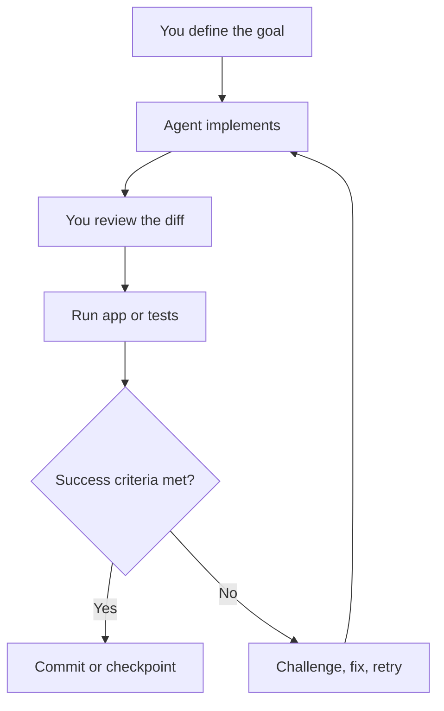

# 023 - Day 4 - Five Principles for Successful Vibe Coding: Be the Boss

## Lesson Information

| Item       | Details                                                                                                  |
| ---------- | -------------------------------------------------------------------------------------------------------- |
| Lesson     | 023                                                                                                      |
| Duration   | 11 min                                                                                                   |
| Week       | Week 1 - Vibe Coding Foundation                                                                          |
| Module     | Week 1 Day 4 - YOLO Mode, Model Choice, OpenRouter                                                       |
| Main Topic | Five principles for successful vibe coding and how to stay in control when working with AI coding agents |

---

## Learning Objectives

After this lesson, learners will be able to:

* Understand the five core principles for using AI coding agents effectively.
* Write better `agents.md` instructions with clear goals, style, and success criteria.
* Work incrementally instead of asking the agent to build everything at once.
* Review AI-generated changes critically instead of trusting them blindly.
* Use testing, Git, and checkpoints to stay in control of the development process.
* Understand why productivity gains from coding agents vary depending on the task.

---

## Core Message: Be the Boss

The central idea of this lesson is simple:

> AI coding agents are powerful assistants, but you are still the decision-maker.

A coding agent can write code, research solutions, refactor files, and even build full features quickly. But it can also make wrong assumptions, apply quick fixes, misunderstand the root cause of a bug, or confidently explain something incorrect.

Successful vibe coding requires a “trust but verify” mindset.



---

## The Five Principles for Successful Vibe Coding

## 1. Spend Time on `agents.md`

A good `agents.md` file gives the AI agent clear operating instructions for the project.

It should be concise, but it must cover three important areas:

| Area             | What It Means                                               |
| ---------------- | ----------------------------------------------------------- |
| Specification    | What needs to be built or changed                           |
| Style            | How the solution should be written, structured, or designed |
| Success Criteria | How to know the task is actually complete                   |

A weak instruction might say:

```text
Build a dashboard.
```

A stronger instruction would say:

```text
Build a simple dashboard MVP with a sidebar, task list, and status summary.
Use the existing design style.
The feature is successful when the page loads without errors, tasks can be viewed, and the layout works on desktop and mobile.
```

The agent performs better when the goal is clear and success is measurable.

---

## 2. Start Simple

Do not begin by asking the agent to build a huge, complex application all at once.

Start with a basic MVP.

The first version of your project should be simple, straightforward, and easy to validate. Once that works, you can gradually add complexity.


Trying to “boil the ocean” with a massive `agents.md` can cause the agent to go off track. If the first version is too large, debugging becomes harder because you may not know where things went wrong.

---

## 3. Work Incrementally

Successful vibe coding is not one giant prompt followed by blind trust.

It is an iterative process:

1. Define a small task.
2. Let the agent implement it.
3. Review the change.
4. Run the app or tests.
5. Confirm the success criteria.
6. Save a checkpoint.
7. Move to the next task.

This disciplined workflow helps you catch mistakes early.

If something breaks, you can return to the last working state instead of untangling a large pile of changes.

---

## 4. Do Not Get Lazy

Early success with AI agents can be dangerous.

The agent might build something impressive very quickly, such as:

* A Kanban board
* A dashboard
* A game prototype
* A frontend page
* A working CRUD app

This can create the feeling that everything “just works.” But if you stop checking carefully, the agent may make a bad assumption several steps earlier, and you may only discover it much later.

When the agent says:

```text
I found the problem and fixed it.
```

Do not accept that blindly.

Ask:

* What was the root cause?
* What evidence proves this was the issue?
* What files changed?
* What tests were run?
* Can the app demonstrate the fix?
* Is this a real solution or just a workaround?

The lesson’s key warning is:

> Never let early success lower your standards.

---

## 5. Use Git and Checkpoints Frequently

Git is your safety net.

Because AI agents can make large changes quickly, you need regular checkpoints. This allows you to return to a stable state if the agent makes a bad decision.

Good habits include:

```bash
git status
git diff
git add .
git commit -m "Build initial MVP"
```

Useful checkpoint moments:

| Moment                     | Why It Matters                        |
| -------------------------- | ------------------------------------- |
| After the MVP works        | Creates a stable base                 |
| Before a risky refactor    | Lets you undo easily                  |
| After tests pass           | Saves a verified state                |
| Before using YOLO mode     | Protects against uncontrolled changes |
| After completing a feature | Keeps progress organized              |

Git helps you experiment without fear.

---

## Trust But Verify

YOLO mode can be useful in some situations, but it should not mean “leave the agent alone and hope.”

Even if you allow the agent to work autonomously, you still need to come back and check everything carefully.

A good mindset is:

```text
Trust the agent enough to let it work.
Verify carefully before accepting the result.
```

This is especially important when the agent is:

* Debugging a difficult issue
* Refactoring shared code
* Touching backend logic
* Changing authentication or permissions
* Working inside a legacy codebase
* Using newer tools or APIs that may not be in its training data

---

## Advice for Junior Developers

If you are new to programming, vibe coding is a powerful learning opportunity.

Do not use the agent only as a code generator. Use it as a tutor.

Ask questions such as:

* Why did you choose this approach?
* Explain this function line by line.
* What are the trade-offs?
* What could go wrong here?
* How would a senior engineer review this?
* What test should prove this works?

The goal is not only to finish the project. The goal is also to build your own engineering judgment.

If you let the model do everything without learning, you may become dependent on it and feel lost when something breaks.

---

## Advice for Senior Engineers

AI coding agents are especially powerful for senior engineers because senior engineers can better detect when the model is wrong.

The tool can help you build more, faster.

It may remove some of the joy of manually writing every line of code, but it gives something else in return: the ability to build systems that would otherwise take much longer or require skills outside your comfort zone.

Examples:

| Task          | How AI Can Help                            |
| ------------- | ------------------------------------------ |
| Frontend UI   | Quickly generate layouts and components    |
| DevOps        | Draft Terraform, CI/CD, deployment scripts |
| Prototypes    | Build MVPs in minutes or hours             |
| Refactors     | Apply broad structural changes             |
| Documentation | Produce explanations, guides, and specs    |

The key is to use the agent as leverage, not as a replacement for judgment.

---

## Productivity Gains Are a Mixed Bag

Coding agents can create huge productivity gains, but not always.

| Situation                           | Expected Productivity Gain |
| ----------------------------------- | -------------------------- |
| Small greenfield MVP                | Very high                  |
| Simple frontend feature             | Very high                  |
| CRUD app or dashboard               | High                       |
| Familiar framework task             | Medium to high             |
| Large legacy project                | Moderate                   |
| Complex backend change              | Moderate or low            |
| New or poorly documented technology | Sometimes negative         |
| Ambiguous requirements              | Risky                      |

Sometimes the agent can be a genuine “10x” improvement.

For example, building a Kanban view in a Next.js app might take a developer days, but an agent may produce a working version in minutes.

However, in complex or unfamiliar areas, the agent can slow you down by repeatedly making incorrect assumptions.

The realistic conclusion is:

> AI coding agents usually add value, but the size of the productivity boost depends heavily on the task, project, model, and developer skill.

---

## Practical Workflow Checklist

Use this checklist during vibe coding sessions:

* [ ] Define a small task.
* [ ] Write clear instructions.
* [ ] Include success criteria.
* [ ] Let the agent implement.
* [ ] Review the diff.
* [ ] Run the app.
* [ ] Run relevant tests.
* [ ] Challenge unsupported claims.
* [ ] Confirm the root cause for bug fixes.
* [ ] Commit or checkpoint working progress.
* [ ] Move to the next small task.

---

## Key Takeaways

* You are the boss, not the AI agent.
* A strong `agents.md` should explain the task, style, and success criteria.
* Start with a simple MVP before adding complexity.
* Work incrementally and validate each milestone.
* Never stop reviewing diffs, tests, and evidence.
* Use Git checkpoints often.
* YOLO mode can be useful, but it still requires careful verification.
* Junior developers should use AI as a learning partner.
* Senior engineers can use AI as leverage to build more.
* AI coding productivity is real, but it varies by task and context.

---

## Summary

This lesson introduces five core principles for successful vibe coding under the theme **“Be the Boss.”** AI coding agents can dramatically increase productivity, especially for small MVPs and greenfield projects, but they require disciplined oversight. The best workflow is incremental: write clear instructions, start simple, review every change, test frequently, and save progress with Git checkpoints.

The most important mindset is **trust but verify**. Let the AI help you move faster, but do not surrender your engineering judgment.
