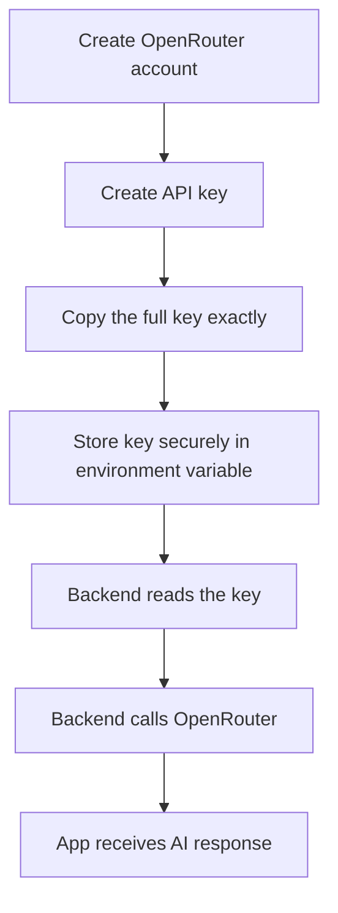
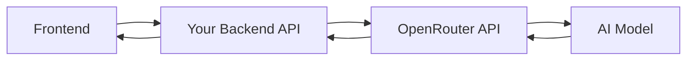

# 024 - Day 4 - Responsible YOLO Coding: Setting Up OpenRouter for AI Projects

## Lesson Information

| Item       | Details                                                                                    |
| ---------- | ------------------------------------------------------------------------------------------ |
| Lesson     | 024                                                                                        |
| Duration   | 14 min                                                                                     |
| Week       | Week 1 - Vibe Coding Foundation                                                            |
| Module     | Week 1 Day 4 - YOLO Mode, Model Choice, OpenRouter                                         |
| Main Topic | Setting up OpenRouter so an AI project can call different AI models safely and responsibly |

---

## Lesson Summary

This lesson prepares students for **YOLO coding mode**, where an AI coding agent is allowed to build larger parts of a project with less step-by-step supervision.

However, before using YOLO mode, the lesson emphasizes an important principle:

> **You can let AI help you write code, but you still own the code.**

The lesson uses two real-world examples to show why responsible AI coding matters:

1. **Anthropic’s research on AI assistance and learning**

   * Junior developers who used AI assistance completed tasks, but understood the underlying technology less deeply.
   * The AI-assisted group scored lower on a follow-up quiz than the non-AI group.
   * Main lesson: AI can help productivity, but it can weaken learning if used passively.

2. **Jellyfin’s AI contribution policy**

   * Jellyfin warns against submitting large, unfocused AI-generated code changes.
   * Contributors must understand, review, test, and explain the code they submit.
   * Main lesson: AI-generated code is acceptable only when the developer takes responsibility for quality.

After that, the lesson introduces **OpenRouter**, a gateway that allows one API key to access many AI models from different providers.

---

## Core Idea

YOLO coding is powerful, but it should not mean blindly trusting AI.

```text
Bad YOLO Coding:
Vague prompt → Agent changes many files → User commits without review

Responsible YOLO Coding:
Clear task → Agent builds → User reviews diff → User tests → User explains changes
```

---

## Why This Lesson Matters

This lesson is important because the upcoming project will use:

* An **AI coding agent** to build the application.
* An **AI API** inside the application itself.
* OpenRouter as the gateway for calling different AI models.

That means the project has two layers of AI:

```text
AI Agent builds the app
          ↓
The app calls an AI model
          ↓
User interacts with the AI-powered feature
```

Without responsible habits, this can quickly become messy, expensive, or insecure.

---

## Key Concepts

### 1. Responsible YOLO Coding

YOLO mode means giving an AI agent more freedom to build.

But responsible YOLO coding means:

* Give the agent a clear, focused task.
* Keep changes small and understandable.
* Review every diff.
* Run the app and tests.
* Make sure you can explain the code.
* Do not commit code you do not understand.

---

### 2. You Own the Code

Even if AI writes the first version, the final responsibility belongs to you.

A good rule:

> If you cannot explain what changed and why, the code is not ready.

This applies especially when working with:

* Open-source projects
* Team repositories
* Client projects
* Production applications
* Apps using API keys or paid AI models

---

### 3. OpenRouter as an AI Gateway

OpenRouter allows developers to call many AI models through one platform.

Instead of creating separate accounts and API keys for every model provider, you can use OpenRouter as a single gateway.

| Without OpenRouter          | With OpenRouter |
| --------------------------- | --------------- |
| Separate OpenAI account     |                 |
| Separate Anthropic account  |                 |
| Separate Google account     |                 |
| Separate API keys           |                 |
| Separate billing setup      |                 |
| One OpenRouter account      |                 |
| One OpenRouter API key      |                 |
| Access to many models       |                 |
| Free and paid model options |                 |
| Easier model switching      |                 |

---

## OpenRouter Setup Flow



---

## Practical Setup Steps

### Step 1: Create an OpenRouter Account

Go to the OpenRouter website and sign up.

You can usually sign up using:

* Google account
* Email login
* Other available authentication methods

---

### Step 2: Create an API Key

Inside the OpenRouter dashboard:

1. Open the account/avatar menu.
2. Go to **Keys**.
3. Click **Create API Key**.
4. Give the key a recognizable name.
5. Optionally set:

   * Monthly spending limit
   * Expiration date
6. Copy the API key.

Important:

```text
The API key must be copied exactly.
Even one missing character will break the connection.
```

A typical OpenRouter key starts with something like:

```text
sk-or-v1-...
```

Never share your real key publicly.

---

### Step 3: Store the API Key Safely

Do **not** hardcode the API key in frontend code.

Bad example:

```js
const apiKey = "sk-or-v1-your-real-key-here";
```

Better approach:

```env
OPENROUTER_API_KEY=sk-or-v1-your-real-key-here
```

Then your backend reads it from the environment.

---

## Safe App Architecture



The frontend should call your own backend.

Your backend should call OpenRouter.

This protects the API key from being exposed in the browser.

---

## Free Models vs Paid Models

OpenRouter may provide access to both free and paid models.

| Model Type  | Benefit                        | Trade-off                             |
| ----------- | ------------------------------ | ------------------------------------- |
| Free models | No or low cost                 | May have privacy or usage limitations |
| Paid models | Better quality and reliability | Requires credits and cost control     |

In the lesson, the instructor mentions that free endpoints may require accepting privacy trade-offs, such as allowing prompts to be used for training or published. Students should read the current OpenRouter settings carefully before enabling free endpoints.

---

## Cost Management

When using paid models, students should avoid surprise costs.

Recommended habits:

* Add only a small amount of credit first.
* Set monthly spending limits when available.
* Use cheaper models for testing.
* Use stronger models only when needed.
* Monitor usage regularly.
* Never expose API keys in public repositories.

---

## Responsible YOLO Coding Checklist

Before accepting AI-generated code, check:

* [ ] Is the task focused?
* [ ] Are the changed files relevant?
* [ ] Can I explain what changed?
* [ ] Did I review the diff?
* [ ] Did I run the app?
* [ ] Did I test the main feature?
* [ ] Is the API key stored securely?
* [ ] Are costs controlled?
* [ ] Is the code simple enough to maintain?

---

## Common Mistakes

| Mistake                             | Why It Is Dangerous                        |
| ----------------------------------- | ------------------------------------------ |
| Using vague prompts                 | The agent may change too much              |
| Committing AI output without review | Bugs and poor design can slip in           |
| Hardcoding API keys                 | Keys can be stolen from frontend or GitHub |
| Using paid models without limits    | Costs can grow unexpectedly                |
| Not understanding the code          | You cannot debug or maintain it later      |
| Submitting noisy AI-written PRs     | Creates extra work for reviewers           |

---

## Main Takeaway

YOLO mode is exciting because it allows you to build faster with AI agents.

But the correct mindset is not:

```text
AI writes code, so I do not need to understand it.
```

The correct mindset is:

```text
AI helps me move faster, but I still review, test, and own the result.
```

OpenRouter is introduced as the AI gateway for the upcoming portfolio and digital twin project, but the bigger lesson is responsibility: use powerful tools, keep control, and never let the agent become the final decision-maker.
