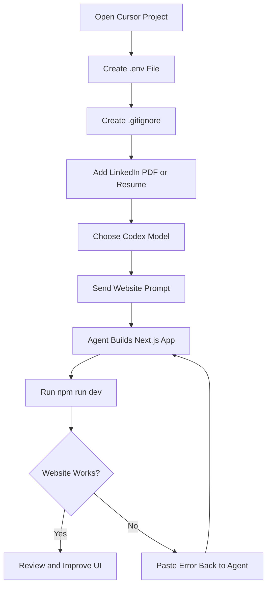

# 025 - Day 4 - YOLO Mode: Building a Next.js Website with GPT Codex in Cursor

## Lesson Information

| Item     | Details                                             |
| -------- | --------------------------------------------------- |
| Lesson   | 025                                                 |
| Duration | 11 minutes                                          |
| Week     | Week 1 - Vibe Coding Foundation                     |
| Module   | Week 1 Day 4 - YOLO Mode, Model Choice, OpenRouter  |
| Topic    | Building a Next.js website with GPT Codex in Cursor |

## Main Idea

In this lesson, you use **YOLO Mode** inside Cursor to let an AI coding agent build a professional **Next.js website** from a simple instruction. The workflow includes creating a project folder, setting up environment variables, adding a resume or LinkedIn PDF, selecting a strong coding model, running the project locally, and asking the agent to fix errors when they appear.

## Learning Objectives

By the end of this lesson, learners will be able to:

* Create a new Cursor project for a Next.js website.
* Set up an `.env` file for API keys safely.
* Add `.env` to `.gitignore` to avoid leaking secrets.
* Give a high-level instruction to an AI coding agent.
* Use YOLO Mode to let the agent create files and run commands automatically.
* Start a Next.js project locally with `npm run dev`.
* Copy runtime/build errors back into the agent for fast iteration.

## Core Workflow



## Step 1: Create a New Project in Cursor

Open Cursor and create a new project folder, for example:

```text
Site
```

This folder will become the workspace where the AI agent creates the website.

## Step 2: Create the `.env` File

Inside the project folder, create a file named exactly:

```text
.env
```

Add your API key in the correct format:

```env
OPENROUTER_API_KEY=your_api_key_here
```

If you are using OpenAI directly, use:

```env
OPENAI_API_KEY=your_api_key_here
```

The name must be exact. If the variable is misspelled, the app may not work.

## Step 3: Create `.gitignore`

Create another file named:

```text
.gitignore
```

Add:

```gitignore
.env
```

This prevents your API key from being accidentally committed to Git.

## Step 4: Add Your Profile or Resume

The instructor uses a LinkedIn profile exported as a PDF:

```text
LinkedIn.pdf
```

If LinkedIn does not allow you to export your profile, you can use:

* A resume PDF
* A CV PDF
* A plain text file containing your profile information
* Manually copied LinkedIn text

The goal is to give the AI enough personal information to build a customized website.

## Step 5: Configure Cursor Agent Settings

In Cursor settings, go to the agent section and check:

| Setting              | Suggested Option                             |
| -------------------- | -------------------------------------------- |
| Usage Summary        | Always                                       |
| Auto Run / YOLO Mode | Run Everything Unsandboxed, if comfortable   |
| Model                | A strong coding model such as GPT Codex High |

If you are not comfortable with full YOLO Mode, choose a safer mode where Cursor asks for approval before running actions.

## Step 6: Send the Website-Building Prompt

Example prompt:

```text
Please build me a professional website running locally.

My LinkedIn profile is in LinkedIn.pdf.

Make the website stunning. Enterprise meets edgy.

It should include:
- About me
- My career journey
- Links to a future portfolio

Iterate to make it as slick and professional as possible.

Let me know when complete.

Use Next.js.
```

This is intentionally high-level. In YOLO Mode, the agent is trusted to create the project structure, install dependencies, build pages, and make design decisions.

## Step 7: Run the Website Locally

After the agent finishes, it may tell you to run:

```bash
cd web
npm run dev
```

Then open:

```text
http://localhost:3000
```

If the page loads correctly, review the design and functionality.

## Step 8: Fix Errors by Pasting Them Back

If the website fails to load or shows an error, copy the full error message from the browser or terminal and paste it directly into the Cursor agent.

In YOLO workflow, you can simply send the error and let the agent fix it.

## Key Concepts

### 1. YOLO Mode

YOLO Mode means allowing the AI agent to act with minimal interruption. It can create files, edit code, run commands, install packages, and attempt fixes automatically.

This is fast, but it also requires caution because the agent may make mistakes or run commands you did not manually approve.

### 2. Environment Variables

API keys should be stored in `.env` files, not hardcoded into frontend code.

Good practice:

```env
OPENROUTER_API_KEY=your_key_here
```

Bad practice:

```js
const apiKey = "your_key_here";
```

Secrets should stay outside public code.

### 3. Iterative AI Coding

The first generated version may not work perfectly. The real workflow is:

```text
Prompt → Generate → Run → Check → Paste Error → Fix → Run Again
```

This loop is one of the most important habits in AI-assisted coding.

## Practical Notes

| Situation                       | What To Do                                          |
| ------------------------------- | --------------------------------------------------- |
| Website does not load           | Paste the full error into the agent                 |
| Missing API key error           | Check `.env` spelling and variable name             |
| Wrong project folder            | Use `cd` into the folder the agent created          |
| Design looks basic              | Ask the agent to improve UI and polish interactions |
| Agent claims it fixed something | Run the app yourself to verify                      |

## Why This Lesson Matters

This lesson shows the power and risk of agentic coding. With one strong prompt, Cursor and GPT Codex can generate a complete local Next.js website using your profile content.

However, the lesson also demonstrates an important limitation: the agent may say something is fixed before proving it. That is why human review, local testing, and error-checking remain essential.

## Summary

In this lesson, you build a local **Next.js personal website** using **GPT Codex inside Cursor**. You prepare the project, add API keys safely, provide your LinkedIn or resume PDF, enable YOLO Mode, and let the agent generate the site. Then you run the app locally, inspect the result, and use errors as feedback for the next iteration.

The key takeaway: **AI agents can move fast, but you are still responsible for checking the output.**

---

# Bài luyện tập

## Mục tiêu


## Đề bài


## Yêu cầu hoàn thành

- [ ] 
- [ ] 
- [ ] 

## Kết quả / lời giải


## Ghi chú
