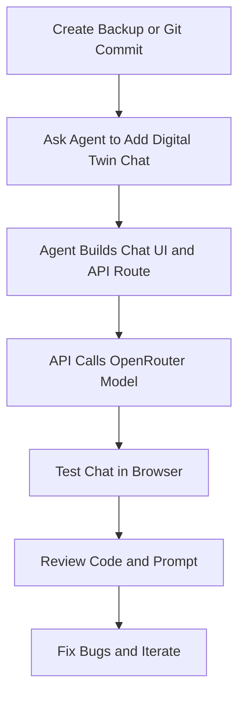
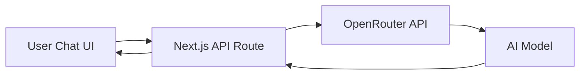

# 026 - Day 4 - Adding an AI Digital Twin Chat with OpenRouter & Vibe Coding

## Lesson Information

| Item       | Details                                                      |
| ---------- | ------------------------------------------------------------ |
| Lesson     | 026                                                          |
| Duration   | 8 min                                                        |
| Week       | Week 1 - Vibe Coding Foundation                              |
| Module     | Week 1 Day 4 - YOLO Mode, Model Choice, OpenRouter           |
| Main Topic | Adding an AI Digital Twin chat to a website using OpenRouter |

## Main Idea

In this lesson, you add an **AI Digital Twin chat** to an existing website. The chatbot acts like a digital version of a person and can answer questions about their career, achievements, background, and professional journey.

The lesson also shows the real experience of **YOLO vibe coding**: it can produce working features quickly, but it may also create rough edges that need review, testing, and iteration.

## Learning Objectives

By the end of this lesson, learners can:

* Add an AI chat feature to a website.
* Connect a frontend chat UI to a backend API route.
* Use OpenRouter to call an AI model.
* Store API keys securely in a `.env` file.
* Write a basic system prompt for an AI Digital Twin.
* Test, review, and improve AI-generated code.

## Why This Lesson Matters

This lesson connects several important ideas from Day 4:

* Using an AI coding agent in YOLO mode.
* Choosing a model through OpenRouter.
* Building real app functionality quickly.
* Understanding why backups, Git commits, and testing are essential.
* Reviewing generated code after the AI agent finishes.

YOLO mode is useful for experimentation, but once the feature works, you should slow down, inspect the code, test behavior, and improve the implementation.

## Recommended Workflow



## Key Concepts

### 1. Digital Twin Chat

An **AI Digital Twin** is a chatbot designed to answer as if it represents a specific person.

In this lesson, the digital twin answers questions about a person’s career, achievements, and professional story.

Example user questions:

```text
Hi there.
What are you most proud of?
Tell me about your career journey.
What projects have you worked on?
```

### 2. OpenRouter Integration

OpenRouter is used as a gateway for calling different AI models through one API.

The agent is instructed to:

```text
Please now add the ability to have an AI chat with a digital twin,
which can answer questions about my career.

Please use OpenRouter.

My OpenRouter API key is in the .env file in the project root.

Please use the model named [MODEL_NAME].

Make the changes. Make sure it works. Let me know when ready.
```

Important correction:

```text
Use .env, not .emv
Use OpenRouter, not OpenRooter
```

### 3. Backend API Route

The API key should not be exposed in frontend code.

A safer structure is:



In a Next.js project, this is commonly handled in a file like:

```text
src/app/api/chat/route.ts
```

This backend route receives the user message, adds the digital twin prompt, calls OpenRouter, and returns the AI response.

## Example Architecture

| Layer              | Responsibility                                            |
| ------------------ | --------------------------------------------------------- |
| Chat UI            | Shows messages, input box, buttons, and responses         |
| Conversation State | Stores user and assistant messages                        |
| API Route          | Sends requests securely to OpenRouter                     |
| `.env` File        | Stores the OpenRouter API key                             |
| System Prompt      | Defines the personality and knowledge of the digital twin |
| OpenRouter Model   | Generates the response                                    |

## Security Reminder

Never put API keys directly in frontend code.

Bad practice:

```text
NEXT_PUBLIC_OPENROUTER_API_KEY=...
```

Better practice:

```text
OPENROUTER_API_KEY=...
```

Then call it only from the backend API route.

## What Worked

The AI agent successfully added a digital twin chat section to the website. The chat could answer questions and appeared to call OpenRouter correctly.

Example result:

```text
User: What are you most proud of?

Digital Twin: I'm most proud of turning a vision into tangible impact...
```

## Rough Edges Found

The feature worked, but it was not perfect.

Issues noticed:

* The page scrolled unexpectedly to the digital twin section.
* Some UI buttons did not appear to work.
* The chat design was unusual, though still visually interesting.
* The prompt was basic and could be improved.
* The code needed to be reviewed after generation.

## Main Takeaway

YOLO vibe coding can quickly produce a working MVP, but it should not be the final step.

After the agent finishes, you should:

1. Test the app in the browser.
2. Check if all buttons and navigation work.
3. Review the generated API route.
4. Inspect the system prompt.
5. Improve the digital twin’s knowledge base.
6. Commit or back up working versions with Git.

## Summary

In this lesson, learners add an **AI Digital Twin chat** to a website using **OpenRouter**. The feature includes a chat UI, a backend API route, a secure `.env` API key setup, and a prompt that defines the digital twin’s identity.

The lesson also demonstrates the reality of vibe coding: AI agents can build impressive features quickly, but developers still need to review, test, debug, and iterate before considering the feature production-ready.
