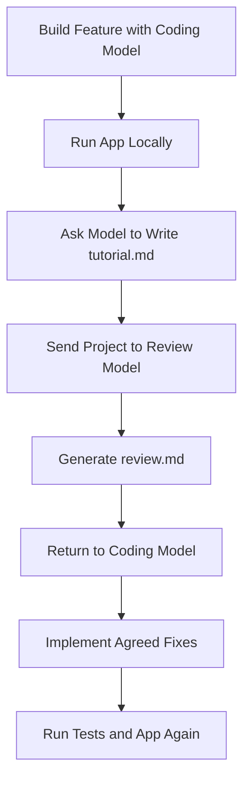

# 027 - Day 4 - Tutorials, Code Reviews with Opus, and Cross-Model Collaboration

## Lesson Information

| Item     | Details                                                          |
| -------- | ---------------------------------------------------------------- |
| Lesson   | 027                                                              |
| Duration | 8 min                                                            |
| Week     | Week 1 - Vibe Coding Foundation                                  |
| Module   | Week 1 Day 4 - YOLO Mode, Model Choice, OpenRouter               |
| Topic    | Tutorials, Code Reviews with Opus, and Cross-Model Collaboration |

---

## Main Idea

This lesson shows how to improve the quality of AI-generated code by using multiple models together.

Instead of relying on one model to build, explain, review, and fix everything, you can create a stronger workflow:

1. Use one model to build the feature.
2. Ask the model to generate a beginner-friendly tutorial.
3. Use another model, such as Claude Opus, to review the code.
4. Return to the original coding model to fix issues from the review.
5. Test the project again.

This creates a more reliable **build-review-fix-test** loop.

---

## Learning Objectives

By the end of this lesson, students will be able to:

* Understand how cross-model collaboration improves AI coding workflows.
* Use an AI model to generate a tutorial explaining its own code.
* Ask a stronger reasoning model, such as Claude Opus, to perform a deep code review.
* Apply review feedback without blindly accepting every suggestion.
* Use the build-review-fix-test workflow to improve YOLO coding results.

---

## Key Concepts

### 1. When a Model Gets Stuck, Change the Approach

Sometimes an AI coding agent repeatedly fails to fix the same issue. In the lesson, the model struggled with the chat UI and kept producing incorrect styling changes.

Instead of continuing the same loop, the better move was:

> Stop trying to patch the broken solution. Ask the model to rebuild the feature using a different approach.

This is useful because AI models can sometimes get stuck in a local pattern. A fresh implementation may be faster than debugging the same mistake repeatedly.

---

### 2. Use AI to Write a Tutorial for Its Own Code

After the website and digital twin chat were working, the next step was to ask the agent to generate a Markdown tutorial.

Example prompt:

```text
Please now write me a comprehensive tutorial in Markdown
that's suitable for a complete beginner in front-end coding
to walk me through what you've done here.

Include:
- a summary of the technology
- a high-level walkthrough
- a detailed code review with code samples
- five suggestions for how the code could be improved based on a self-review
```

This is valuable because it turns AI coding into a learning process, not just a code-generation process.

The tutorial helps you understand:

* What technologies were used
* How the project is structured
* How the frontend works
* How the backend/API works
* How to run the project locally
* What could be improved next

---

### 3. Use Another Model for Code Review

A powerful technique is to use a different model to review the code.

For example:

* Codex builds the app.
* Claude Opus reviews the app.
* Codex fixes the issues based on the review.

This works because different models have different strengths, training patterns, and blind spots.

Example review prompt:

```text
Please do a comprehensive code review of this project
and write the results to review.md.

Include any remedial actions needed.

Do not actually change any code.
```

The important part is that the review model should not directly change the code yet. It should first produce a clear review document.

---

## Cross-Model Collaboration Workflow



---

## Practical Workflow

### Step 1: Build the Feature

Use your main coding model to build the website or feature.

Example tasks:

* Improve the chat UI
* Fix scrolling behavior
* Improve prompts
* Add streaming responses
* Connect to the AI API

---

### Step 2: Run the App

Run the project locally:

```bash
npm run dev
```

Then open:

```text
http://localhost:3000
```

Check whether the app actually works in the browser.

---

### Step 3: Ask for a Tutorial

Once the feature works, ask the model to explain what it built.

The output should be saved as:

```text
tutorial.md
```

This helps beginners understand the codebase and turns the project into a learning resource.

---

### Step 4: Ask Another Model for a Review

Switch to a different model, ideally one strong at reasoning and code review, such as Claude Opus.

Ask it to write a review file:

```text
review.md
```

The review should include:

* Bugs
* Security issues
* Code quality concerns
* Dependency analysis
* Maintainability issues
* Suggested improvements
* Remedial actions

---

### Step 5: Decide What to Fix

Do not automatically accept every review comment.

Some comments may be critical, such as:

* Exposed `.env` files
* API keys committed to the project
* Missing validation
* Poor error handling

Other comments may be optional improvements.

You remain the decision-maker.

---

### Step 6: Return to the Coding Model

After reading the review, ask the coding model:

```text
Please read review.md and implement the important remedial actions.

If you disagree with any recommendation, explain why before changing code.
```

This keeps the workflow controlled and thoughtful.

---

## Why This Lesson Matters

YOLO coding can produce impressive results quickly, but speed also creates risk.

Without review, you may miss:

* Security mistakes
* Poor architecture
* Broken edge cases
* Confusing code
* Weak error handling
* Hidden bugs

Cross-model collaboration helps reduce these risks.

It gives you a stronger workflow:

```text
Fast building + independent review + targeted fixes = better AI-generated software
```

---

## Best Practices

| Practice                          | Why It Matters                                              |
| --------------------------------- | ----------------------------------------------------------- |
| Rebuild when stuck                | Sometimes a fresh approach is faster than repeated patching |
| Generate a tutorial               | Helps you actually understand the code                      |
| Use a second model for review     | Reduces blind spots                                         |
| Save review output to `review.md` | Creates a clear checklist                                   |
| Do not auto-fix everything        | Some suggestions may be unnecessary                         |
| Test after every major change     | Confirms the app still works                                |

---

## Common Mistakes

| Mistake                                | Better Approach                          |
| -------------------------------------- | ---------------------------------------- |
| Arguing with the model for too long    | Ask it to try a different implementation |
| Trusting generated code blindly        | Ask for a tutorial and code review       |
| Letting the review model edit directly | First ask it to write a review document  |
| Accepting all review comments          | Prioritize critical and practical fixes  |
| Skipping local testing                 | Always run the app after changes         |

---

## Summary

In this lesson, you learned how to improve YOLO coding by combining multiple AI models in one workflow.

A coding model can quickly build the feature. Then it can explain the project by writing a tutorial. After that, a different model such as Claude Opus can review the project from a fresh perspective. Finally, the coding model can apply the most important fixes.

This workflow helps you move from fast AI-generated code to higher-quality software:

```text
Build → Explain → Review → Fix → Test
```

The key lesson is simple:

> AI coding is more powerful when models collaborate, but you remain the boss.

---

# Bài luyện tập

## Mục tiêu


## Đề bài


## Yêu cầu hoàn thành

- [ ] 
- [ ] 
- [ ] 

## Kết quả / lời giải


## Ghi chú
