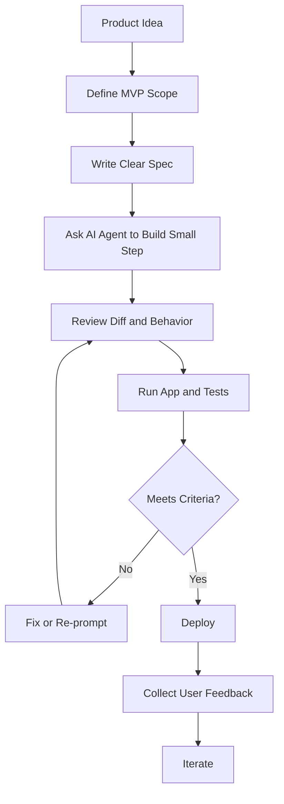

# 028 - Day 5 - Karpathy on Vibe Coding & Rules for Building a Commercial MVP

## Lesson Information

| Item     | Details                                                    |
| -------- | ---------------------------------------------------------- |
| Lesson   | 028                                                        |
| Duration | 11 min                                                     |
| Week     | Week 1 - Vibe Coding Foundation                            |
| Module   | Week 1 Day 5 - Commercial MVP & Full-Stack Kanban          |
| Topic    | Vibe Coding, Agentic Coding, Commercial MVP, Product Scope |

---

## Main Idea

This lesson shifts vibe coding from **fun experimentation** to **commercial product building**.

The key message is:

> Vibe coding does not mean building randomly or blindly.
> To build a commercial MVP, you need clear scope, disciplined review, fast deployment, and real user feedback.

The lesson uses Andrej Karpathy’s thoughts on vibe coding and agentic programming to explain both the opportunity and the risks of using AI coding agents.

---

## Learning Objectives

By the end of this lesson, learners can:

* Understand vibe coding from a practical product-building perspective.
* Explain why AI agents increase leverage but still require human supervision.
* Apply rules for building a commercial MVP without overbuilding.
* Use AI coding agents with clear specs, checkpoints, tests, and feedback loops.
* Balance speed, quality, and business value when building an MVP.

---

## 1. Karpathy’s View on Vibe Coding

Andrej Karpathy popularized the term **vibe coding** to describe a new style of programming where developers rely heavily on LLMs and coding agents.

However, the deeper message is not “let AI do everything blindly.”

It is:

* AI coding agents are becoming very powerful.
* Developers are shifting from manual coding to agent-supervised building.
* The human role becomes more about direction, judgment, review, and product thinking.
* AI can dramatically increase output, but it can also produce low-quality “slop” if unmanaged.

---

## 2. The Shift: From Coding to Building

Karpathy describes a major workflow shift:

| Old Workflow                                           | New Agentic Workflow                                     |
| ------------------------------------------------------ | -------------------------------------------------------- |
| Mostly manual coding                                   | Mostly agent-assisted building                           |
| Developer writes most code directly                    | AI agent writes large portions                           |
| Human focuses on implementation details                | Human focuses on direction, review, and integration      |
| Progress depends on typing speed and debugging stamina | Progress depends on clear prompts, context, and judgment |

This does not remove the developer.

It changes the developer’s job.

The developer becomes more like a **technical product lead**: setting goals, checking output, demanding evidence, and deciding what is good enough to ship.

---

## 3. Vibe Coding Is Not “YOLO Coding”

A common misunderstanding is that vibe coding means:

```text
Give AI a vague prompt → Accept whatever it builds → Ship it
```

That is dangerous, especially for commercial products.

A better workflow is:



The important idea:

> You can move fast, but you still need control.

---

## 4. Core Concept 1: Be the Boss

The most important rule is:

> You are the boss, not the AI agent.

AI agents are enthusiastic and capable, but they can:

* Misunderstand requirements.
* Overbuild features.
* Introduce bugs.
* Make architectural assumptions.
* Produce unnecessary code.
* Hide complexity behind confident explanations.

Your job is to stay in control.

You should ask:

* What exactly did the agent change?
* Why was this approach chosen?
* Does this match the spec?
* Can we prove it works?
* Is this necessary for the MVP?
* Is there a simpler solution?

---

## 5. Core Concept 2: Watch the Agent Closely

Karpathy warns that if you care about the code, you should watch AI agents carefully.

This means:

* Review the code diff.
* Run the application.
* Test the feature manually.
* Check edge cases.
* Avoid blindly accepting large changes.
* Ask the agent to explain trade-offs.
* Demand evidence, not just confidence.

For commercial MVPs, speed is useful only if the result is usable.

---

## 6. Core Concept 3: Start Simple and Build Incrementally

A commercial MVP should not try to become a complete product immediately.

A good MVP has:

| Principle          | Meaning                                       |
| ------------------ | --------------------------------------------- |
| Clear user problem | Solve one real pain point                     |
| Small feature set  | Build only what is needed to test value       |
| Fast deployment    | Put it in front of users quickly              |
| Feedback loop      | Learn from real usage                         |
| Avoid overbuilding | Do not add complex features before validation |

Bad MVP thinking:

```text
Let’s build auth, dashboard, payments, AI, analytics, admin panel, mobile app, and marketplace.
```

Good MVP thinking:

```text
What is the smallest version that proves users want this?
```

---

## 7. Commercial MVP Rules

### Rule 1: Define the user value first

Before coding, answer:

* Who is this for?
* What problem does it solve?
* Why would someone use it?
* What result should the user get?

### Rule 2: Keep the first version small

The MVP should test the core value, not showcase every possible feature.

### Rule 3: Avoid overbuilding

Do not build advanced systems before you know users need them.

Examples of overbuilding:

* Complex role permissions too early.
* Advanced settings nobody asked for.
* Multiple dashboards before one workflow works.
* Premature microservices.
* Perfect UI before validating the core feature.

### Rule 4: Deploy early

A product becomes real when users can access it.

Local demos are useful, but commercial MVPs need deployment.

### Rule 5: Collect feedback quickly

Feedback tells you what to build next.

Without feedback, you are guessing.

---

## 8. Junior vs Senior Developers in Vibe Coding

### For Junior Developers

Vibe coding is a learning opportunity, but you must stay skeptical.

You may not know every technical detail, but you can still ask strong questions:

* “Can you explain this simply?”
* “Why is this file needed?”
* “Is there a smaller version?”
* “How do we know this works?”
* “What could break?”

A junior developer should treat the AI like a smart assistant that still needs management.

### For Senior Developers

Senior developers can use AI agents for leverage.

The challenge is different:

* Avoid becoming passive.
* Keep architectural judgment active.
* Use experience to challenge assumptions.
* Prevent quality degradation.
* Focus more on building complete capabilities.

For seniors, the craft shifts from writing every line to orchestrating the build.

---

## 9. Risks of Agentic Coding

| Risk              | Description                                | Prevention                      |
| ----------------- | ------------------------------------------ | ------------------------------- |
| AI slop           | Bloated, careless, low-quality output      | Review and simplify             |
| Skill atrophy     | Losing coding sharpness from over-reliance | Read code and make manual edits |
| Overbuilding      | Building too much too early                | Define MVP scope                |
| False confidence  | Agent sounds correct but is wrong          | Ask for evidence                |
| Debug loops       | Agent repeats failed fixes                 | Step back and change approach   |
| Hidden complexity | Simple feature becomes large system        | Keep changes small              |

---

## 10. Practical Workflow for Building a Commercial MVP

Use this repeatable workflow:

1. Define the target user.
2. Write the problem statement.
3. Choose the smallest valuable feature.
4. Write a short product spec.
5. Ask the AI agent to implement one small part.
6. Review the code diff.
7. Run and test the app.
8. Fix issues.
9. Deploy.
10. Collect feedback.
11. Iterate based on real user signals.

---

## 11. Example MVP Thinking

### Weak Prompt

```text
Build me a full SaaS kanban app with users, payments, analytics, AI automation, and admin tools.
```

### Better MVP Prompt

```text
Build a simple kanban board MVP for freelancers.

Core features:
- Create tasks
- Move tasks between To Do, Doing, and Done
- Edit task title and description
- Save data locally for now

Do not add authentication, payments, analytics, or team features yet.
Focus on a clean, usable first version that can be deployed and tested.
```

The second prompt gives the agent clearer boundaries.

That leads to a better MVP.

---

## 12. Key Takeaways

* Vibe coding is powerful, but it requires discipline.
* AI agents can increase output, but they still make mistakes.
* The human must remain the decision-maker.
* A commercial MVP needs scope, deployment, and feedback.
* Do not overbuild before validating user value.
* Review code, test behavior, and demand evidence.
* The best workflow is incremental: build, review, test, deploy, learn, improve.

---

## Summary

Lesson **028 - Day 5 - Karpathy on Vibe Coding & Rules for Building a Commercial MVP** explains how to use vibe coding responsibly when building a product that could become commercial.

The lesson connects Andrej Karpathy’s thoughts on agentic coding with practical MVP discipline. AI agents can make builders faster and more ambitious, but they must be supervised carefully. A successful commercial MVP is not about building everything at once. It is about solving a clear user problem, shipping a focused first version, and learning from feedback.
