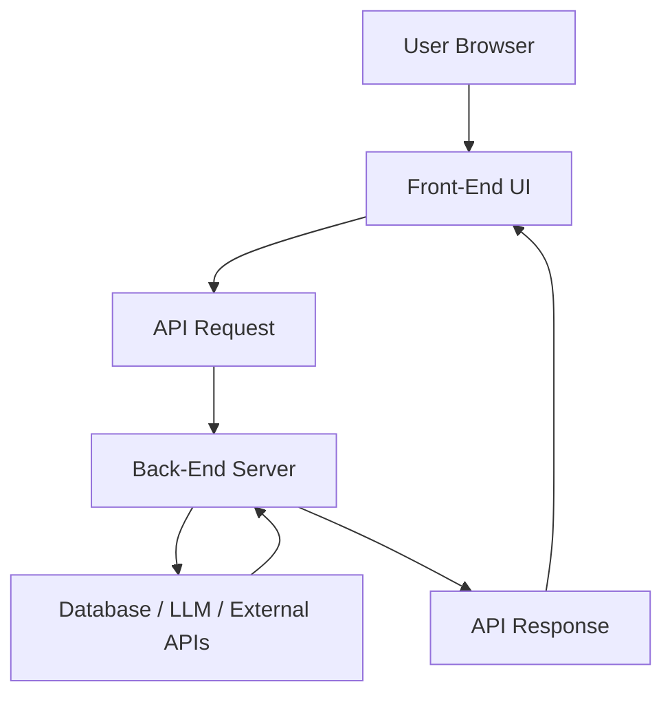
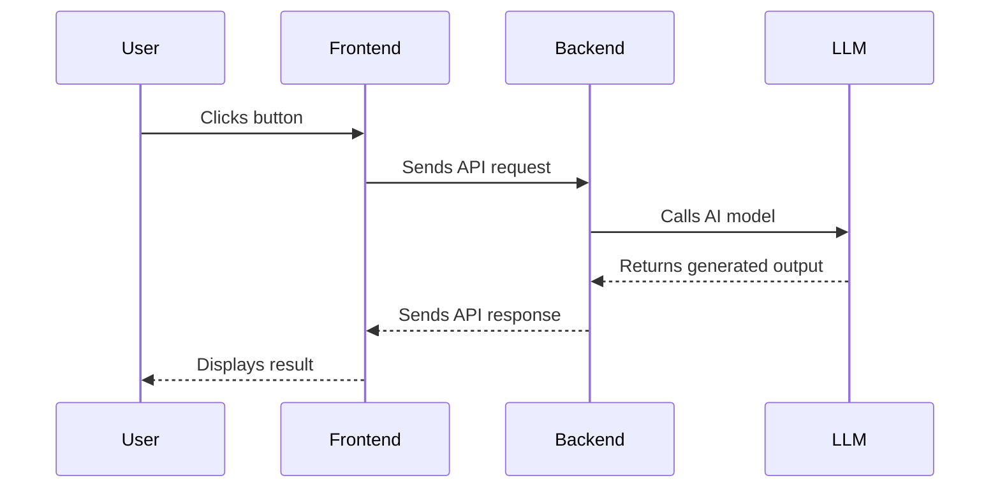
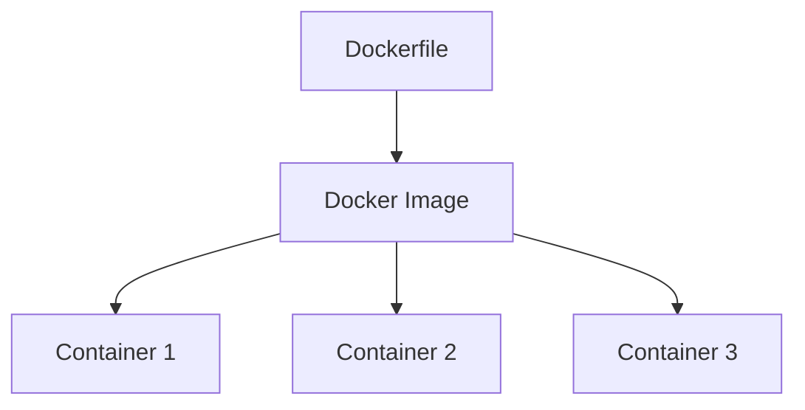
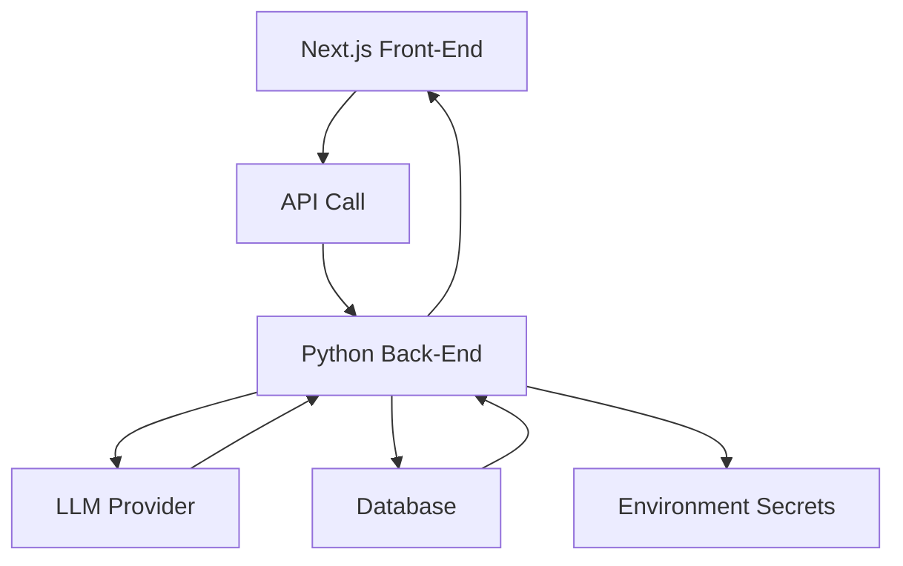

# 029 - Day 5 - Web Apps 101: Front-End, Back-End, APIs & Docker Setup

## Lesson Information

| Item     | Details                                           |
| -------- | ------------------------------------------------- |
| Lesson   | 029                                               |
| Duration | 11 minutes                                        |
| Week     | Week 1 - Vibe Coding Foundation                   |
| Module   | Week 1 Day 5 - Commercial MVP & Full-Stack Kanban |
| Topic    | Web app foundations, APIs, and Docker setup       |

## Main Idea

This lesson gives a practical foundation for building full-stack web applications. A web app usually has a **front-end** that runs in the browser, a **back-end** that runs on a server, and **APIs** that allow both sides to communicate. Docker is introduced as a tool for packaging and running projects in isolated, portable environments.

## Learning Objectives

By the end of this lesson, learners should be able to:

* Explain the difference between front-end and back-end development.
* Understand how APIs connect the browser to the server.
* Recognize common front-end technologies such as HTML, CSS, JavaScript, React, and Next.js.
* Understand why Python is commonly used for LLM-powered back-end systems.
* Explain the basic Docker concepts: Dockerfile, image, and container.
* Install Docker Desktop and prepare for full-stack project development.

## Big Picture: How Web Apps Work

A web application is software that users access through a browser such as Chrome, Safari, Edge, or Firefox.

Most modern web apps have two major parts:

| Part      | Where It Runs  | Main Responsibility                                                                |
| --------- | -------------- | ---------------------------------------------------------------------------------- |
| Front-End | User’s browser | Displays the interface and handles user interaction                                |
| Back-End  | Server         | Handles business logic, database access, API calls, secrets, and external services |



## Key Concept 1: Front-End

The **front-end** is the part of the application that users see and interact with.

It usually includes:

| Technology | Role                                                         |
| ---------- | ------------------------------------------------------------ |
| HTML       | Defines the structure of the page                            |
| CSS        | Controls the visual appearance                               |
| JavaScript | Adds interactivity and browser-side logic                    |
| TypeScript | A typed version of JavaScript, often used in larger projects |

Examples of front-end functionality:

* Displaying buttons, forms, cards, and dashboards
* Updating the UI when a user clicks something
* Sending API requests to the back-end
* Rendering data returned from the server

### Common Front-End Frameworks

Modern web apps are often built using component-based frameworks.

| Framework | Notes                                                                 |
| --------- | --------------------------------------------------------------------- |
| React     | One of the most popular UI libraries                                  |
| Vue       | Simpler and beginner-friendly                                         |
| Angular   | Full-featured enterprise framework                                    |
| Svelte    | Compiles UI components into efficient JavaScript                      |
| Next.js   | A higher-level React framework for routing, rendering, and deployment |

In this course, **Next.js** is used frequently because it works well for building and deploying modern web apps.

## Key Concept 2: Back-End

The **back-end** is the part of the application that runs on a server.

It handles things that should not live directly in the browser, such as:

* Business logic
* Database access
* Calling LLMs
* Calling external APIs
* Authentication
* Secret keys and environment variables
* File processing
* Payment logic
* Background jobs

For LLM-based applications, Python is commonly used on the back-end because it has a strong ecosystem for AI, data processing, and agentic workflows.

In today’s project direction:

| Layer          | Technology                      |
| -------------- | ------------------------------- |
| Front-End      | JavaScript / Next.js            |
| Back-End       | Python                          |
| AI Integration | LLM API calls from the back-end |

## Key Concept 3: APIs

An **API** is the communication bridge between the front-end and the back-end.

The front-end sends a request, and the back-end returns a response.

Example:

```text
User clicks Submit
→ Front-end sends API request
→ Back-end processes request
→ Back-end may call database or LLM
→ Back-end returns result
→ Front-end displays result
```



## From Front-End Only to Full-Stack

Earlier projects in the course were mostly front-end focused.

| Course Project           | Architecture                              |
| ------------------------ | ----------------------------------------- |
| Day 1 teaser project     | Front-end only                            |
| Day 3 Kanban board       | Front-end only                            |
| Day 4 OpenRouter project | Front-end plus JavaScript back-end        |
| Day 5 project            | JavaScript front-end plus Python back-end |

This lesson prepares learners to move from simple browser-based projects into more realistic full-stack MVPs.

## Important UX Note

LLMs are strong at generating front-end code, especially with React and Next.js. However, AI-generated interfaces can often look generic.

Common AI-generated UI patterns include:

* Similar layouts across many apps
* Repeated card structures
* Generic icons
* Overused purple gradients
* “Template-like” visual design

A human still adds value by improving:

* Information hierarchy
* User flow
* Visual clarity
* Product personality
* Real usefulness for the target user

## Docker Introduction

Docker is a tool that lets you run software in an isolated environment.

A simple way to think about Docker:

```text
Docker gives you a computer inside your computer.
```

It creates a controlled, portable environment where your app can run without depending too much on your local machine setup.

## Why Docker Matters

Docker is useful because it helps with:

| Benefit     | Explanation                                                   |
| ----------- | ------------------------------------------------------------- |
| Isolation   | Keeps project dependencies separate from your main computer   |
| Portability | Makes it easier to run the same project on different machines |
| Consistency | Reduces “it works on my machine” problems                     |
| Safety      | Useful when working with coding agents and generated code     |
| Deployment  | Helps package apps for production environments                |

## Three Core Docker Concepts

| Concept          | Meaning                                              |
| ---------------- | ---------------------------------------------------- |
| Dockerfile       | A recipe that describes how to build the environment |
| Docker Image     | A blueprint or snapshot created from the Dockerfile  |
| Docker Container | A live running environment created from an image     |



### Dockerfile

A **Dockerfile** is a set of instructions.

It may define:

* Which operating system base to use
* Which language runtime to install
* Which dependencies to install
* Which files to copy
* Which command to run when the app starts

### Docker Image

A **Docker image** is built from the Dockerfile.

It is like a ready-made blueprint of the environment.

### Docker Container

A **Docker container** is the running version of an image.

One image can be used to create many containers.

## Docker Desktop Setup

To install Docker:

1. Go to the Docker website.
2. Download **Docker Desktop**.
3. Choose the correct version for your operating system.
4. Install with the default settings.
5. On Windows, accept the WSL-based setup if prompted.
6. Restart your computer if required.
7. Open Docker Desktop.
8. Confirm that you can see the Docker interface.

Inside Docker Desktop, the most important sections for beginners are:

| Section    | Meaning                              |
| ---------- | ------------------------------------ |
| Containers | Running environments                 |
| Images     | Blueprints used to create containers |
| Volumes    | Storage areas used by containers     |

## Practical Mental Model

A full-stack AI web app usually works like this:



The browser should not directly expose secrets such as API keys. Instead, the front-end calls the back-end, and the back-end safely communicates with services like LLM providers.

## Common Beginner Mistakes

| Mistake                               | Better Practice                                   |
| ------------------------------------- | ------------------------------------------------- |
| Putting API keys in front-end code    | Keep secrets on the back-end                      |
| Building everything as front-end only | Use a back-end when logic or secrets are involved |
| Ignoring project structure            | Separate front-end, back-end, and config clearly  |
| Skipping Docker setup                 | Use Docker to create consistent environments      |
| Trusting AI-generated UI immediately  | Review and improve UX manually                    |

## Key Takeaways

* A web app is accessed through a browser.
* The front-end runs in the browser and handles the user interface.
* The back-end runs on a server and handles logic, data, secrets, and external services.
* APIs connect the front-end and back-end.
* Next.js is a popular framework for building modern front-end apps.
* Python is common for LLM-powered back-end systems.
* Docker helps package applications into isolated, portable environments.
* Dockerfile, image, and container are the three basic Docker concepts.
* Full-stack MVPs need clear structure, secure API handling, and reliable setup.

## Lesson Summary

In this lesson, learners review the foundation of modern web applications before building a full-stack project. The lesson explains how front-end and back-end systems work together through APIs, why Next.js is useful for building user interfaces, and why Python is commonly used for AI back-ends. It also introduces Docker as a practical tool for creating isolated and portable development environments.

This foundation is important for moving from simple front-end demos to commercial MVPs that include real back-end logic, API calls, environment secrets, and deployable project structure.

---

# Bài luyện tập

## Mục tiêu


## Đề bài


## Yêu cầu hoàn thành

- [ ] 
- [ ] 
- [ ] 

## Kết quả / lời giải


## Ghi chú
