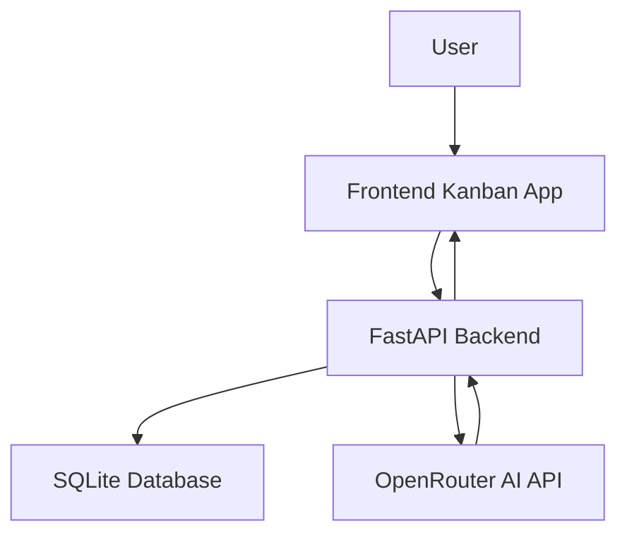
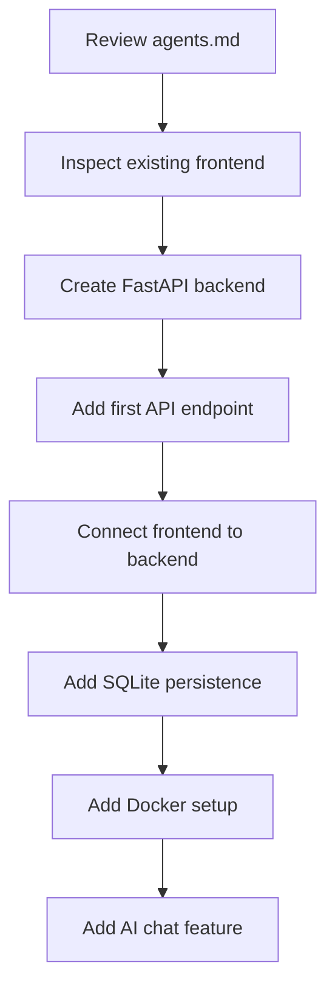

# 030 - Day 5 - Setting Up a Full-Stack Project with GitHub Copilot & FastAPI

## Lesson Information

| Item       | Details                                                                                               |
| ---------- | ----------------------------------------------------------------------------------------------------- |
| Lesson     | 030                                                                                                   |
| Duration   | 12 minutes                                                                                            |
| Week       | Week 1 - Vibe Coding Foundation                                                                       |
| Module     | Week 1 Day 5 - Commercial MVP & Full-Stack Kanban                                                     |
| Main Topic | Setting up a full-stack project with GitHub Copilot, FastAPI, Docker, and an existing Kanban frontend |

---

## Lesson Overview

In this lesson, we begin turning a frontend-only Kanban MVP into a real full-stack project management application.

Instead of building everything from scratch, we start from an existing repository that already contains the frontend. This is intentional: working with inherited code is often harder than starting from zero, and it is a realistic skill for commercial MVP development.

The goal is to use GitHub Copilot as an AI coding agent to help scaffold the backend, connect the frontend, prepare Docker setup, and create the first API endpoint.

---

## Learning Objectives

By the end of this lesson, learners should be able to:

* Set up a project repository locally from GitHub.
* Open and inspect an existing full-stack project structure in VS Code.
* Understand how GitHub Copilot usage, model selection, and quotas work.
* Use an `agents.md` file to guide an AI coding agent.
* Understand the planned architecture of a full-stack Kanban MVP.
* Prepare for building a FastAPI backend connected to a frontend and database.

---

## Key Context

Yesterday, the project was built using Cursor.

Today, the same style of agentic development is continued using **GitHub Copilot** inside VS Code.

The tool is different, but the workflow is similar:

```text
Describe the goal → Give the agent context → Let it scaffold → Review → Run → Fix → Repeat
```

Learners can continue using Cursor if they prefer. The key lesson is not the specific tool, but the workflow of guiding an AI coding agent through a real project.

---

## Project Goal

We are building a **project management MVP web app**.

The app should eventually include:

* User sign-in
* A Kanban board
* Fixed columns that can be renamed
* Cards that can be moved between columns
* Persistent storage using a database
* A backend API
* An AI chat sidebar
* AI actions such as creating, editing, or moving cards

The starting point is an existing frontend Kanban MVP.

---

## System Architecture



The frontend handles the user interface.
The FastAPI backend handles application logic, database access, and AI requests.
SQLite stores user, board, column, and card data.
OpenRouter provides access to the AI model used by the chat feature.

---

## Why Start From an Existing Repo?

Starting from scratch is often easier for AI agents because they can create the whole structure themselves.

However, real-world projects often begin with existing code.

This lesson introduces a more realistic scenario:

```text
Existing frontend MVP
        ↓
Add backend
        ↓
Add database
        ↓
Add API
        ↓
Add AI feature
        ↓
Run locally with Docker
```

This helps learners practice working with inherited code instead of only generating brand-new projects.

---

## GitHub Copilot Setup

Before coding, the instructor checks GitHub Copilot settings.

Important areas include:

| Setting          | Why It Matters                                |
| ---------------- | --------------------------------------------- |
| Plan             | Determines available request quota            |
| Premium requests | Shows how much usage remains                  |
| IDE access       | Confirms Copilot can be used in VS Code       |
| CLI access       | Allows Copilot features in terminal workflows |
| Model settings   | Lets users enable or disable different models |
| Budget settings  | Helps avoid unexpected paid usage             |

Learners should regularly check their Copilot usage, especially when using premium models.

---

## Cloning the Repository

The project repository is cloned from GitHub.

Typical workflow:

```bash
cd projects
git clone <repo-url>
cd pm
```

Then open the project in VS Code.

If VS Code asks whether you trust the author, choose trust only if the repository source is expected and safe.

---

## Project Folder Structure

The starting project contains a basic structure:

```text
pm/
├── frontend/
├── backend/
├── scripts/
├── docs/
├── .env
├── .gitignore
└── agents.md
```

### `frontend/`

Contains the existing Kanban MVP.

At this stage, it is a frontend-only demo. It is not yet connected to a backend, database, or Docker workflow.

### `backend/`

Initially mostly empty.

This is where the FastAPI backend will be created.

### `scripts/`

Reserved for helper scripts.

Examples may include database setup, local development scripts, or automation tasks later.

### `.env`

Stores environment variables such as:

```env
OPENROUTER_API_KEY=your_api_key_here
```

This file must never be committed to Git.

### `.gitignore`

Prevents sensitive or unnecessary files from being committed.

It should include files such as:

```text
.env
node_modules/
__pycache__/
.venv/
```

### `agents.md`

This is the instruction file for the coding agent.

It explains the product goal, technical decisions, constraints, and coding standards.

---

## Why `agents.md` Matters

The `agents.md` file acts like a project briefing for the AI coding agent.

Instead of asking the agent vague questions, we give it durable project context.

A good `agents.md` can include:

* Product goal
* MVP scope
* Technical stack
* Current project state
* Coding standards
* Documentation rules
* Known constraints
* Future direction

This helps the agent make better decisions across multiple tasks.

---

## MVP Requirements

The project MVP has a deliberately small scope.

| Requirement    | MVP Decision                                |
| -------------- | ------------------------------------------- |
| Authentication | Single hard-coded user and password         |
| Users          | Database should support many users later    |
| Boards         | One board per signed-in user                |
| Kanban columns | Fixed columns, but names can be changed     |
| Cards          | Cards can be created, edited, and moved     |
| AI chat        | Sidebar chat can interact with project data |
| Deployment     | Local Docker setup only                     |
| Database       | SQLite                                      |

The MVP is intentionally simple, but the structure should allow future expansion.

---

## Technical Decisions

| Area              | Decision                              |
| ----------------- | ------------------------------------- |
| Frontend          | Next.js                               |
| Backend           | Python FastAPI                        |
| Package manager   | `uv`                                  |
| Database          | SQLite                                |
| AI provider       | OpenRouter                            |
| Local environment | Docker                                |
| AI model          | Configurable through project settings |

These decisions are opinionated but practical for a local MVP.

Learners can choose alternatives, such as Supabase instead of SQLite, but this lesson keeps the stack simple.

---

## Planned Development Flow



The first goal is not to build everything at once.

The first goal is to create a stable full-stack foundation.

---

## First Backend Milestone

The first backend milestone is usually a simple health check endpoint.

Example:

```http
GET /health
```

Expected response:

```json
{
  "status": "ok"
}
```

This confirms that the backend is running before connecting more complex features.

---

## Role of GitHub Copilot

GitHub Copilot is used as the coding agent to help with:

* Reading the project structure
* Understanding `agents.md`
* Scaffolding FastAPI
* Creating backend routes
* Suggesting Docker configuration
* Connecting frontend and backend
* Debugging issues
* Iterating based on errors

However, the human remains responsible for direction and review.

The agent writes code, but the developer still decides what should be built.

---

## Important Coding Standard

A key rule in the lesson is:

> When hitting issues, always identify the root cause. Do not guess. Prove with evidence, then fix the root cause.

This is important because AI agents can sometimes make fast but incorrect guesses.

A better workflow is:

```text
Error appears
    ↓
Read the error carefully
    ↓
Find the source
    ↓
Confirm the cause
    ↓
Apply the smallest correct fix
    ↓
Run again
```

---

## Commercial MVP Mindset

This lesson continues the commercial MVP mindset from Day 5.

The objective is not to overbuild.

The objective is to create a working product foundation that can grow.

A good MVP should be:

* Small enough to finish
* Useful enough to test
* Structured enough to extend
* Simple enough to debug
* Real enough to support user feedback

---

## Common Mistakes To Avoid

| Mistake                       | Better Approach                 |
| ----------------------------- | ------------------------------- |
| Building everything at once   | Start with one working endpoint |
| Ignoring existing code        | Inspect the frontend first      |
| Hardcoding secrets            | Use `.env`                      |
| Trusting AI output blindly    | Review every meaningful change  |
| Skipping Docker until the end | Plan the environment early      |
| Overbuilding auth             | Use simple auth for the MVP     |
| Guessing when errors happen   | Find the root cause             |

---

## Practical Exercise

After watching the lesson, learners should try to:

1. Clone the project repository.
2. Open it in VS Code.
3. Inspect the folder structure.
4. Read `agents.md`.
5. Check `.env` and confirm the API key variable name.
6. Ask Copilot to inspect the project.
7. Ask Copilot to scaffold a FastAPI backend.
8. Create a simple `/health` endpoint.
9. Run the backend locally.
10. Confirm the endpoint returns a valid response.

---

## Suggested Copilot Prompt

```text
Please inspect this repository and read agents.md first.

Then scaffold the initial FastAPI backend inside the backend directory.

Start with a minimal app that exposes GET /health and returns {"status": "ok"}.

Use uv for Python dependency management if appropriate.

Do not modify the frontend yet. After scaffolding, tell me exactly how to run and test the backend locally.
```

---

## Summary

In this lesson, we set up the foundation for a full-stack project management MVP using GitHub Copilot, FastAPI, Docker, SQLite, and an existing Kanban frontend.

The key idea is that agentic coding is not only about generating new apps from scratch. It is also about working with existing code, giving the AI clear project context, and guiding it step by step.

The project begins as a frontend-only Kanban board, but the long-term goal is to turn it into a persistent full-stack application with backend APIs, a database, authentication, and an AI-powered project assistant.
