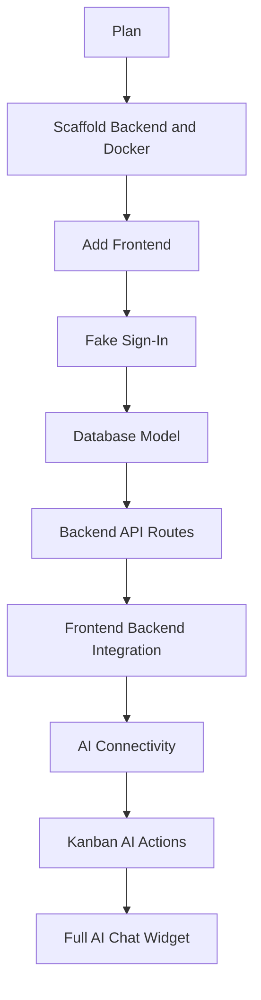
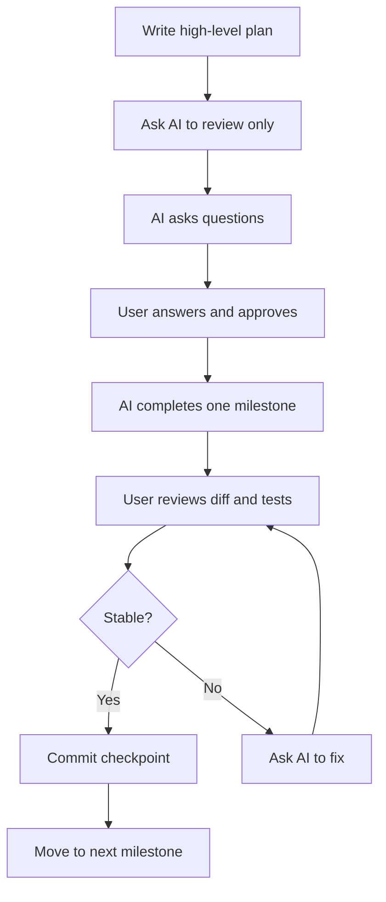

# 031 - Day 5 - Building Step-by-Step with AI Copilot: Planning & Scaffolding

## Lesson Information

| Item     | Details                                           |
| -------- | ------------------------------------------------- |
| Lesson   | 031                                               |
| Duration | 12 minutes                                        |
| Week     | Week 1 - Vibe Coding Foundation                   |
| Module   | Week 1 Day 5 - Commercial MVP & Full-Stack Kanban |

## Main Idea

This lesson shows how to use an AI Copilot in a controlled, step-by-step way instead of asking it to build an entire full-stack project at once.

The core workflow is:

1. Start with a high-level project plan.
2. Ask the AI to enrich the plan with detailed checklists, tests, and success criteria.
3. Scaffold the backend and frontend gradually.
4. Approve each milestone before moving forward.
5. Commit stable progress often so you can roll back safely.

## Learning Objectives

By the end of this lesson, learners should be able to:

* Use AI Copilot to refine a project plan before coding.
* Break a full-stack app into manageable milestones.
* Scaffold backend, frontend, Docker, and scripts step by step.
* Ask the AI to stop and ask questions before making changes.
* Review AI-generated work before approving the next step.
* Use tests, success criteria, and Git commits as safety checkpoints.

## Why This Lesson Matters

When building a commercial MVP, the biggest risk is giving the AI too much freedom too early.

A vague instruction like:

```text
Build the whole app.
```

may produce a large amount of code, but it can also create bugs, poor architecture, missing tests, and hard-to-debug problems.

A better approach is:

```text
Review the plan first.
Ask questions.
Do not start coding yet.
Proceed one milestone at a time.
```

This makes the AI Copilot easier to supervise and turns the development process into a controlled collaboration.

## Core Concept 1: Plan Before Building

The instructor begins with a `docs/plan.md` file containing 10 high-level project parts.

Instead of immediately asking the AI to build everything, the first task is to enrich the plan.

The AI is asked to add:

* Detailed sub-steps
* Checklists
* Tests
* Success criteria
* A frontend `AGENTS.md` file
* A requirement that the user reviews and approves the plan

This creates guardrails for the project.

## Core Concept 2: Build in Milestones

The project is divided into 10 parts:

| Part | Focus                                                      |
| ---- | ---------------------------------------------------------- |
| 1    | Enrich the project plan                                    |
| 2    | Scaffold Docker, backend, scripts, and static demo         |
| 3    | Add the frontend Kanban board                              |
| 4    | Add fake user sign-in                                      |
| 5    | Design the database model                                  |
| 6    | Add backend API routes                                     |
| 7    | Connect frontend and backend                               |
| 8    | Add AI connectivity through OpenRouter                     |
| 9    | Send Kanban context to AI and receive answers              |
| 10   | Add a full AI chat widget that can modify the Kanban board |

## Project Roadmap Diagram



## Core Concept 3: Ask the AI to Pause First

A strong first prompt is not:

```text
Build the project.
```

A better prompt is:

```text
Please review AGENTS.md and the plan.
Let me know if you have any questions.
Do not do any work yet.
```

This gives the AI a chance to clarify requirements before touching the code.

In the lesson, the AI asks questions such as:

| AI Question                                                                      | User Answer                                           |
| -------------------------------------------------------------------------------- | ----------------------------------------------------- |
| Should I enrich `plan.md` with detailed checklists, tests, and success criteria? | Yes                                                   |
| Should I create frontend `AGENTS.md` right away?                                 | Yes                                                   |
| Do you have a minimum test coverage target?                                      | 80% unit test coverage and robust integration testing |

After answering, the user gives permission:

```text
Go ahead with part one.
```

## Core Concept 4: Review Before Approving

After the AI completes Part 1, the instructor reviews the updated plan carefully.

They check whether the plan includes:

* Docker setup
* FastAPI backend
* Minimal README notes
* `uv` usage inside the container
* Start and stop scripts
* Health endpoint
* Tests
* Success criteria
* Frontend architecture notes
* Database modeling
* AI integration steps

Only after reviewing does the instructor approve moving to Part 2.

## Core Concept 5: Do Not Trust “Done” Without Testing

A key moment in the lesson happens when the AI says Part 2 is complete.

The instructor asks:

```text
Did you test part two yourself?
```

The AI admits it has not run the tests yet.

The instructor then gives a stronger instruction:

```text
Please run tests thoroughly.
Bring up the server.
Make sure it works.
Check the routes.
Bring it down.
Let me know when you are confident.
```

This is an important habit: never accept “done” from an AI agent unless it has actually tested the result.

## Step-by-Step AI Copilot Workflow



## Recommended Working Style

When working with AI Copilot, use this pattern:

1. Give the AI context.
2. Ask it to review first.
3. Require questions before action.
4. Approve only one milestone at a time.
5. Review the output.
6. Ask whether it tested the work.
7. Run or verify tests.
8. Commit stable progress.
9. Continue to the next part.

## Example Prompt

```text
Please review AGENTS.md and docs/plan.md.

Do not make any changes yet.

First, tell me:
1. Whether the plan is clear.
2. What questions you have.
3. Whether any risks or missing details should be addressed before implementation.

After I answer, proceed only with Part 1.
```

## Example Approval Prompt

```text
Yes, enrich plan.md.

Also create AGENTS.md for the frontend right away.

Use 80% unit test coverage as the minimum target and include robust integration testing.

Go ahead with Part 1 only.
```

## Example Testing Prompt

```text
Before moving on, test Part 2 thoroughly.

Start the server.
Check the health endpoint.
Check the static HTML page.
Confirm the frontend can call the backend.
Run the test suite.
Stop the server.

Only report completion when you are confident everything works.
```

## Practical Checklist

Before approving an AI-generated milestone, check:

* Does the code match the plan?
* Did the AI change only the intended files?
* Are tests included?
* Did the AI actually run the tests?
* Does the app start successfully?
* Are routes or pages working locally?
* Is the implementation simple enough to debug?
* Should this be committed before continuing?

## Key Lesson

The goal is not to slow down AI development for no reason.

The goal is to make each step small enough that you can understand it, test it, and fix it if something goes wrong.

For serious MVP development, the best workflow is not pure YOLO mode. It is controlled, milestone-based collaboration.

## Summary

In this lesson, learners see how to use AI Copilot to plan and scaffold a full-stack Kanban MVP step by step. The instructor begins with a high-level `plan.md`, asks the AI to enrich it, creates clear success criteria, reviews the generated plan, and only then approves the next milestone.

The most important habit is to treat the AI like a powerful junior teammate: give it structure, ask it to clarify, approve one step at a time, require testing, and commit stable progress frequently.

---

# Bài luyện tập

## Mục tiêu


## Đề bài


## Yêu cầu hoàn thành

- [ ] 
- [ ] 
- [ ] 

## Kết quả / lời giải


## Ghi chú
