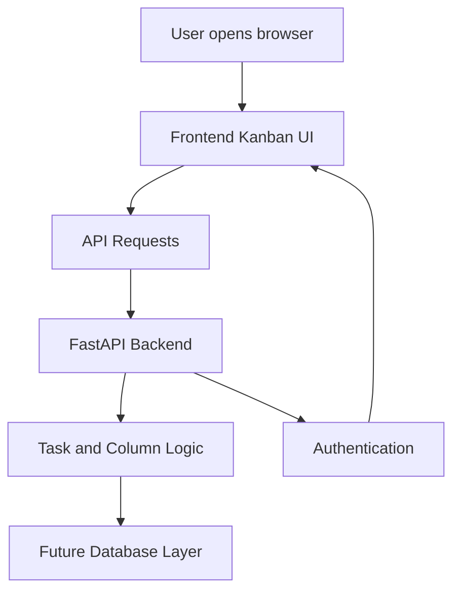
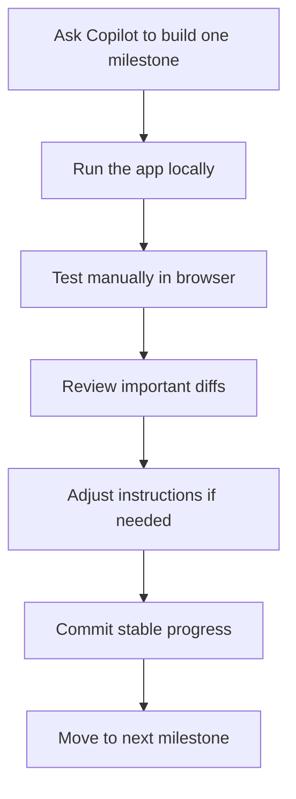

# 032 - Day 5 - Building a Kanban App with GitHub Copilot, Docker & FastAPI

## Lesson Information

| Item       | Details                                                                                |
| ---------- | -------------------------------------------------------------------------------------- |
| Lesson     | 032                                                                                    |
| Duration   | 12 min                                                                                 |
| Week       | Week 1 - Vibe Coding Foundation                                                        |
| Module     | Week 1 Day 5 - Commercial MVP & Full-Stack Kanban                                      |
| Main Topic | Build a full-stack Kanban app using GitHub Copilot, Docker, FastAPI, and a frontend UI |

---

## Lesson Overview

In this lesson, you continue building a full-stack Kanban application step by step with GitHub Copilot.

The app includes:

* A **FastAPI backend** for managing routes, tasks, columns, and authentication
* A **frontend Kanban board** served from the backend
* **Docker** for running the project in a consistent environment
* **Scripts** for starting and stopping the app
* **Git checkpoints** after stable milestones
* A practical workflow of using Copilot, testing manually, reviewing diffs, and adjusting instructions

---

## Learning Objectives

After this lesson, students should be able to:

* Understand how a FastAPI backend can serve API routes and a frontend
* Run and test a Dockerized full-stack project locally
* Use GitHub Copilot to scaffold features in milestones
* Verify each development step manually before moving forward
* Review AI-generated diffs and decide what to accept
* Recognize when test coverage goals become counterproductive
* Use Git commits as safe checkpoints during AI-assisted development

---

## Core Concepts

### 1. Full-Stack Kanban Architecture

A Kanban app usually has two main parts:

| Layer    | Responsibility                                                          |
| -------- | ----------------------------------------------------------------------- |
| Frontend | Displays the board, columns, cards, login screen, and user interactions |
| Backend  | Handles API routes, authentication, data storage, and business logic    |
| Docker   | Creates a repeatable environment for running the app                    |
| Scripts  | Simplify starting and stopping the project                              |
| Git      | Saves stable checkpoints during development                             |

---

## System Flow



---

## Part 2: Backend Verification

At this stage, the backend has already been created. The project includes a `Dockerfile`, a `requirements.txt`, and scripts for running the app.

A key discussion appears around this question:

> Why is there a `requirements.txt` if we are using `uv`?

The answer is that `uv` still needs an input source for dependencies. In this project, Copilot used `requirements.txt` as the dependency list. This is not the most modern `uv` project setup, but it works well enough for the lesson.

### Important takeaway

There are often multiple valid ways to set up a project.

For example:

| Approach                                | Notes                              |
| --------------------------------------- | ---------------------------------- |
| `requirements.txt` + `uv pip install`   | Simple and works for this demo     |
| `pyproject.toml` + `uv` project         | Cleaner for modern Python projects |
| Plain `pip install -r requirements.txt` | Traditional approach               |

For this lesson, the goal is not perfect tooling. The goal is to get a working full-stack MVP.

---

## Testing the Backend

To verify the backend, the instructor runs the start script:

```bash
scripts/start-Mac.sh
```

If there is a permission issue, such as:

```bash
permission denied
```

the solution is to ask Copilot to fix it, usually by making the script executable.

After the server starts, the backend is tested in the browser:

```text
http://localhost:8000/health
```

Expected response:

```json
{
  "status": "ok"
}
```

Another route is tested:

```text
http://localhost:8000/api/hello
```

Expected response:

```text
Hello from FastAPI
```

This confirms that the backend is running correctly.

---

## Part 3: Static Frontend

The next milestone adds a frontend Kanban board.

The frontend is served through the same local FastAPI server:

```text
http://localhost:8000
```

After starting the app again, the browser displays a Kanban interface.

The board includes:

* Columns
* Cards
* Drag-and-drop movement
* A polished visual interface
* Static frontend assets served by the backend

This confirms that the project is now moving from backend-only to a real full-stack app.

---

## Reviewing AI-Generated Diffs

During this stage, GitHub Copilot changes multiple files.

The editor shows:

* Green lines: new code added
* Red lines: code removed or replaced
* Diff controls: accept or undo changes

The instructor explains that some people review every diff line by line. That is a valid approach, especially for sensitive code.

However, for low-risk scaffolding work, it can be reasonable to accept larger groups of changes, then verify behavior through manual testing.

### Practical rule

Review carefully when the change affects:

* Authentication
* Database logic
* Payment logic
* Security
* User data
* Deployment configuration

For basic UI scaffolding, route setup, or demo code, faster review may be acceptable.

---

## Important Lesson: Test Coverage Can Become a Trap

The instructor originally asked Copilot to achieve 80% test coverage.

Copilot followed that instruction too literally. It spent a lot of time creating tests mainly to satisfy the coverage number, not necessarily to test the most valuable behavior.

This is a common AI coding trap.

### Bad instruction

```text
Achieve 80% test coverage no matter what.
```

This can lead to:

* Unnecessary tests
* Low-value tests
* Tests written only to touch lines of code
* Slower development
* False confidence

### Better instruction

```text
Aim for 80% test coverage only where it is sensible. Focus on valuable tests. It is okay not to hit 80% if doing so would require unnecessary tests.
```

This teaches the AI to optimize for real engineering value, not just metrics.

---

## Part 4: Authentication

The next milestone adds a login flow.

The app now shows a sign-in screen:

```text
Welcome back
Sign in to continue your Kanban board
```

The user can log in using demo credentials.

After signing in, the Kanban board appears again. There is also a logout button.

Important behavior verified:

* Login works
* Logout works
* The board is shown only after authentication
* The board state is maintained after logging out and logging back in

This means the app is becoming more realistic as a commercial MVP.

---

## Development Workflow

The lesson demonstrates a useful AI-assisted coding workflow:



---

## Git Checkpoints

After completing the first few parts, the instructor realizes that Git commits should have been made earlier.

Before moving into database work, the instructor creates a local Git checkpoint:

```bash
git status
git add .
git commit -m "part four complete"
```

This commit saves the current working version of the project.

### Why this matters

When using AI coding agents, Git checkpoints are essential because they let you return to a stable state if the AI breaks something later.

A good practice is to commit after every stable milestone.

Examples:

```bash
git commit -m "part two backend health routes complete"
git commit -m "part three static frontend complete"
git commit -m "part four authentication complete"
```

---

## Key Takeaways

* `requirements.txt` can still be used with `uv`, even if it is not the most modern setup.
* Docker helps run the backend and frontend consistently.
* Always manually verify each milestone before moving forward.
* Do not blindly trust AI-generated code.
* Test coverage is useful, but valuable tests matter more than arbitrary percentages.
* Review sensitive diffs carefully.
* Use Git commits as checkpoints after stable progress.
* Building a commercial MVP with AI should be done step by step, not all at once.

---

## Summary

In this lesson, students build and verify multiple parts of a full-stack Kanban app. The backend runs with FastAPI, Docker, and simple test routes. The frontend is then added and served through the same app. Authentication is introduced, and the user can log in, use the Kanban board, and log out.

The most important engineering lesson is not just how to build the app, but how to work safely with GitHub Copilot: test each milestone, review important diffs, avoid meaningless test coverage goals, and commit stable progress before moving to more complex features like databases.

---

# Bài luyện tập

## Mục tiêu


## Đề bài


## Yêu cầu hoàn thành

- [ ] 
- [ ] 
- [ ] 

## Kết quả / lời giải


## Ghi chú
