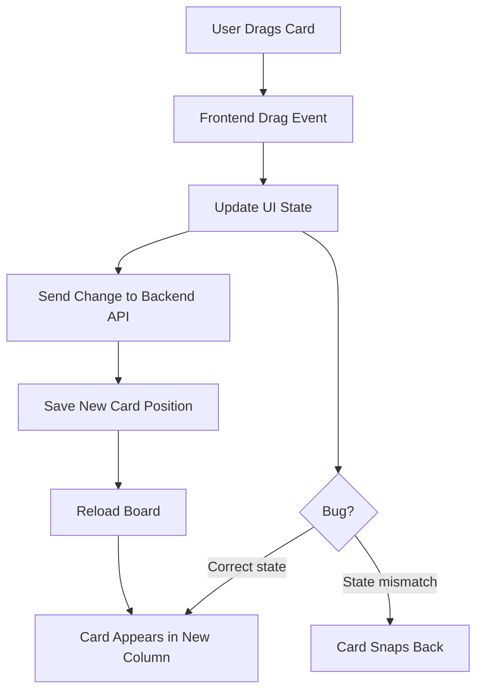
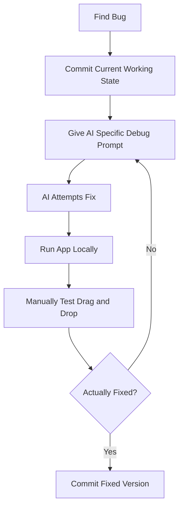

# 033 - Day 5 - Building a Kanban App with GitHub Copilot: Debugging Drag and Drop

## Lesson Information

| Item       | Details                                                     |
| ---------- | ----------------------------------------------------------- |
| Lesson     | 033                                                         |
| Duration   | 10 minutes                                                  |
| Week       | Week 1 - Vibe Coding Foundation                             |
| Module     | Week 1 Day 5 - Commercial MVP & Full-Stack Kanban           |
| Main Focus | Debugging drag-and-drop behavior in a full-stack Kanban app |

## Main Topic

This lesson focuses on debugging a drag-and-drop feature in a Kanban application built with GitHub Copilot, FastAPI, Docker, and a frontend UI.

The key idea is simple but important: **AI can help debug, but the human must still reproduce, test, verify, and decide whether the fix is actually correct.**

## Learning Objectives

By the end of this lesson, learners will be able to:

* Understand why drag-and-drop features often create state and UI bugs.
* Use GitHub Copilot or an AI coding agent to debug a specific interaction bug.
* Write a clear debugging prompt that asks the agent to reproduce, fix, and verify the problem.
* Manually test UI behavior instead of blindly trusting automated test output.
* Use Git checkpoints before and after large agent-generated changes.
* Keep project documentation updated before resetting or starting a new AI chat.

## Context of the Lesson

At this stage, the Kanban app already has:

* A backend API.
* A database design with users, boards, columns, and cards.
* A frontend Kanban board.
* Basic persistence between frontend and backend.
* Drag-and-drop functionality that mostly works, but behaves inconsistently.

The main bug is:

> The card appears to move while dragging, and the target column highlights, but when released, the card often returns to its original position.

## System Flow



## Key Concepts

### 1. Drag-and-Drop Bugs Are Often State Bugs

Drag-and-drop can look like a visual problem, but the real issue is often hidden in state management.

Common causes include:

| Problem                     | Explanation                                                                  |
| --------------------------- | ---------------------------------------------------------------------------- |
| Local state not updated     | The card moves visually but the app state does not change correctly.         |
| Backend update fails        | The frontend shows movement, but the database never saves it.                |
| Event handler mismatch      | The drag event fires, but the drop event does not complete properly.         |
| Incorrect optimistic update | The UI updates first, then rolls back after a failed or mismatched response. |
| Test simulation issue       | Automated tests may fail even when the real browser interaction works.       |

## Debugging Prompt Used

A good debugging prompt should be specific and prescriptive.

Example:

```text
The persistence is working, but the drag and drop seems to only work occasionally.

Most of the time, I drag a card and the next column highlights, but when I release,
the card goes back to its original position.

Please reproduce the problem, fix it, test thoroughly, and confirm it is fixed.
```

## Why This Prompt Works

This prompt is effective because it includes:

| Element                  | Why It Matters                                                         |
| ------------------------ | ---------------------------------------------------------------------- |
| Current working behavior | Persistence already works, so the agent should not rebuild everything. |
| Specific bug description | The card highlights the target column but snaps back after release.    |
| Expected behavior        | The card should stay in the new column.                                |
| Required process         | Reproduce, fix, test, and confirm.                                     |

## Debugging Workflow



## Important Lesson: AI Can Get Stuck

During debugging, the agent kept trying different fixes and repeatedly concluded that the issue was still broken because its automated drag-and-drop tests were failing.

However, manual testing showed that the actual UI had already been fixed.

This is a major lesson:

> Automated tests are useful, but for complex UI interactions like drag-and-drop, human verification is still essential.

## Manual Testing Checklist

Before accepting the fix, test the following:

* Start the app locally.
* Log in with the test user.
* Drag a card from one column to another.
* Confirm the card stays in the new column.
* Move multiple cards between columns.
* Leave one column empty and confirm the UI still behaves correctly.
* Refresh the page.
* Log in again.
* Confirm the new card positions are persisted.

## Git Checkpoint Strategy

The lesson also reinforces the importance of Git checkpoints.

Recommended commits:

```bash
git status
git add .
git commit -m "part 7 built with drag and drop bugs"
```

After fixing and verifying:

```bash
git status
git add .
git commit -m "part 7 working"
```

This keeps the project safe while working with large AI-generated changes.

## Context Window Management

After completing Part 7, the instructor points out that the chat context is getting long.

A good practice is to:

1. Update `plan.md`.
2. Make sure it contains the latest decisions and progress.
3. Commit the updated plan.
4. Start a new chat.
5. Ask the agent to read `plan.md` before continuing.

Example prompt:

```text
Please confirm that plan.md is up to date with all the latest progress,
including any design decisions that you made. Let me know when ready.
```

## Key Takeaways

* Drag-and-drop bugs often involve state, events, and persistence.
* Do not ask AI to “fix everything”; describe the exact failing behavior.
* Always manually test real UI interactions.
* AI may fix the issue but fail its own test simulation.
* Use Git checkpoints before and after major changes.
* Keep `plan.md` updated before resetting the chat context.
* Human judgment is still required when working with AI coding agents.

## Summary

In this lesson, learners debug a drag-and-drop bug in a full-stack Kanban app. The backend persistence works, but the frontend drag-and-drop behavior is inconsistent. GitHub Copilot is used to investigate and fix the issue, but manual testing is required to confirm the real behavior.

The lesson also introduces an important AI coding workflow habit: once the context window becomes long, update the project plan, commit the current state, and start a fresh chat with clear project documentation.
