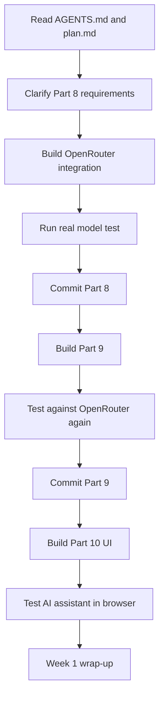
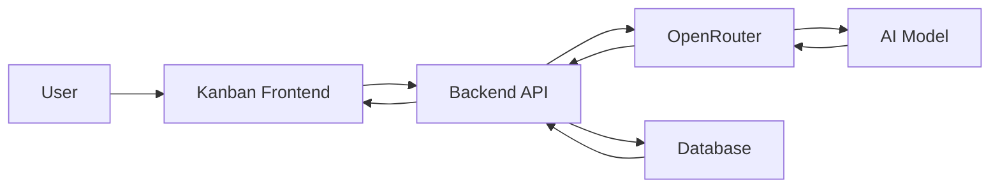

# 034 - Day 5 - AI Assistant Kanban App Complete: Copilot, OpenRouter & Week 1 Wrap

## Lesson Information

| Item     | Details                                           |
| -------- | ------------------------------------------------- |
| Lesson   | 034                                               |
| Duration | 12 min                                            |
| Week     | Week 1 - Vibe Coding Foundation                   |
| Module   | Week 1 Day 5 - Commercial MVP & Full-Stack Kanban |

---

## Main Topic

In this lesson, we complete the Kanban app by adding an AI assistant powered through OpenRouter. The assistant can understand the current board, answer questions about the project, and even move cards between columns through natural language commands.

This lesson also wraps up Week 1 by reviewing the full vibe coding workflow: planning, scaffolding, debugging, testing, checkpointing with Git, and using AI agents responsibly.

---

## Learning Objectives

By the end of this lesson, students will be able to:

* Connect a Kanban app to an AI model through OpenRouter.
* Add an AI assistant chat interface to a full-stack application.
* Test whether the AI assistant works against a real model, not only mocked responses.
* Use Git checkpoints after completing each development phase.
* Understand why restarting a fresh AI chat can improve focus but may lose important setup context.
* Identify when generated code needs refactoring before scaling further.
* Reflect on Week 1’s transition from playful vibe coding to commercial MVP building.

---

## Key Concepts

### 1. Fresh Context for AI Agents

Starting a new chat can make the AI agent feel faster and more focused because the context window is no longer crowded with old debugging history.

However, fresh context also has a downside: the agent may forget important project-specific setup details, such as how to start the server or run tests.

The lesson shows the importance of documenting project knowledge in files like `AGENTS.md` and `plan.md`.

---

### 2. Real Integration Testing

The AI assistant should not only be tested with mocked responses. For this app, the instructor explicitly asks the agent to test all the way through OpenRouter.

This matters because a mocked test only proves that the app can handle a fake response. A real integration test proves that the frontend, backend, OpenRouter API call, and model response work together.

---

### 3. AI Assistant Inside a Kanban App

The completed app includes a chat assistant on the right side of the Kanban board.

The assistant can:

* Answer questions about the board.
* Summarize the project.
* Understand the current state of columns and cards.
* Move a card from one column to another through a chat command.
* Persist changes to the database.

Example command:

```text
Please move the "Gather customer signals" card from Backlog to Done.
```

The app then updates the board automatically.

---

## Development Flow



---

## AI Assistant Architecture



The user interacts with the chat UI. The frontend sends the message to the backend. The backend calls OpenRouter, receives the model response, updates the board if needed, and persists the result.

---

## Important Development Decisions

| Decision               | Choice                              |
| ---------------------- | ----------------------------------- |
| Integration test style | Real OpenRouter call, no mocking    |
| API route              | `/api/chat`                         |
| Configuration          | Hard-coded for now                  |
| Testing goal           | Confirm the model actually responds |
| Checkpoint strategy    | Commit after each completed part    |

---

## Demo Result

The final app includes:

* Login screen.
* Kanban board.
* Persistent cards and columns.
* AI assistant chat panel.
* Backend API.
* Database persistence.
* Dockerized full-stack environment.
* OpenRouter-powered AI responses.

The instructor tests the app by asking the assistant to summarize the project. Then they ask it to move a card from `Backlog` to `Done`. The card moves successfully, and after logging in from a new tab, the change is still there, proving that persistence works.

---

## Lessons Learned

### Fresh Chat Helps, But Documentation Matters

Restarting the conversation can improve the agent’s focus, but it may also lose operational knowledge. That is why setup instructions should be written into project files.

Good project memory should live in files, not only in the chat.

---

### Always Verify the Real Thing

Mocked tests are useful, but they are not enough when the feature depends on a real external AI provider.

For AI features, a proper test should confirm:

* The API key works.
* The request reaches the provider.
* The model returns a usable response.
* The backend handles the response correctly.
* The UI displays or applies the result.

---

### Checkpoint Frequently

After each stable milestone, the instructor runs:

```bash
git status
git add .
git commit -m "part eight complete"
```

Frequent commits make it easier to recover if the AI agent makes a mistake later.

---

### Generated Code Often Needs Refactoring

The instructor notes that the backend code has become too large and messy, especially if everything is packed into a single `main.py`.

This is normal in fast vibe coding. The first goal is to make the app work. The next goal is to refactor it into a maintainable structure.

Possible improvements:

* Split routes into separate files.
* Separate database logic from API logic.
* Move AI assistant logic into its own service.
* Add clearer tests.
* Improve frontend layout and responsiveness.

---

## Suggested Next Steps

Students are encouraged to take the finished app further by adding features such as:

| Improvement         | Description                                                          |
| ------------------- | -------------------------------------------------------------------- |
| Better UI layout    | Resize columns and improve the assistant panel                       |
| Thinking state      | Show when the AI assistant is processing                             |
| Streaming responses | Stream the assistant’s answer token by token                         |
| Multiple users      | Support different users and permissions                              |
| Multiple boards     | Allow users to create separate Kanban boards                         |
| Remote database     | Move from local persistence to Supabase or another hosted database   |
| Deployment          | Deploy to Vercel, AWS App Runner, GCP Cloud Run, or another platform |
| Refactoring         | Clean up the backend structure before adding more features           |

---

## Week 1 Wrap-Up

By the end of Week 1, students have built three major projects:

1. A fun vibe-coded first-person shooter.
2. A personal website with an AI digital twin.
3. A commercial-style Kanban MVP with drag-and-drop, persistence, Docker, backend API, and an AI assistant.

The lesson emphasizes that this Kanban app is not the end. It is a starting canvas. Students now have a working full-stack product that can be extended into something more serious and potentially monetizable.

---

## Final Takeaway

Week 1 is about learning how to move from idea to working software with AI assistance.

The key lesson is not that AI writes everything perfectly. The key lesson is that a human can now guide AI agents through planning, building, testing, debugging, reviewing, and improving real applications much faster than before.

This is the foundation of becoming an agentic engineer.

---

# Bài luyện tập

## Mục tiêu


## Đề bài


## Yêu cầu hoàn thành

- [ ] 
- [ ] 
- [ ] 

## Kết quả / lời giải


## Ghi chú
