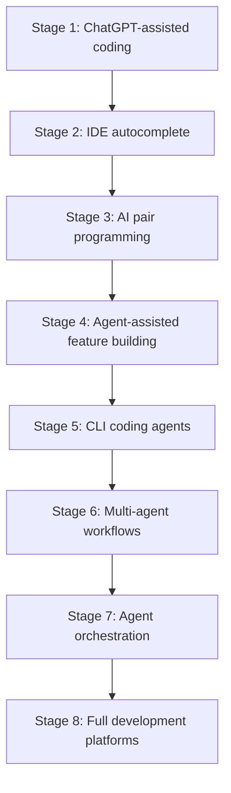
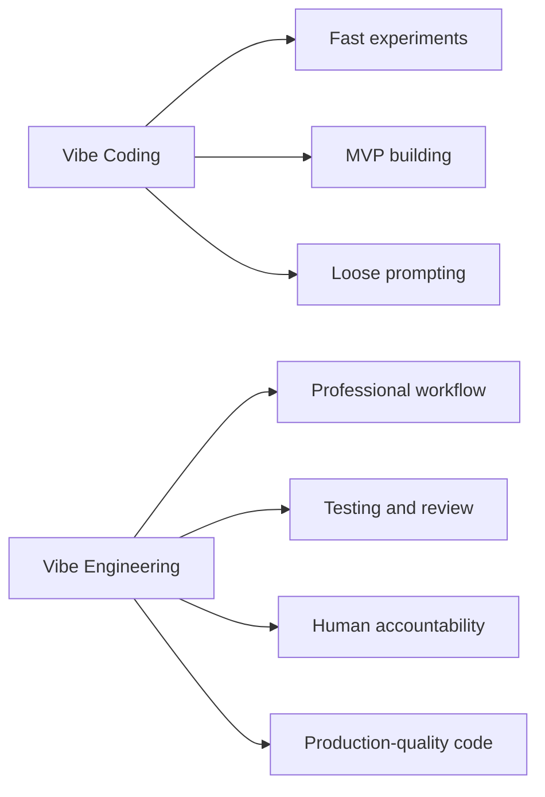
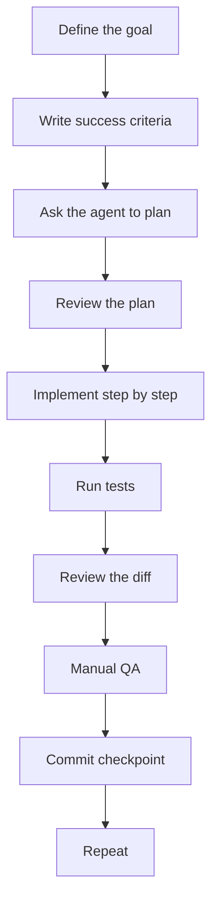
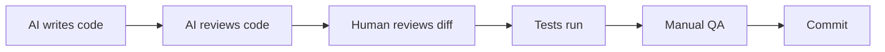

# 035 - Day 1 - Welcome to Pro Week: From Vibe Coding to Vibe Engineering

## Lesson Information

| Item     | Details                                 |
| -------- | --------------------------------------- |
| Lesson   | 035                                     |
| Duration | 9 min                                   |
| Week     | Week 2 - Claude Code & Vibe Engineering |
| Module   | Week 2 Day 1 - Claude Code Fundamentals |

---

## Main Topic

This lesson introduces **Pro Week**, shifting the course focus from casual **vibe coding** toward professional **vibe engineering**.

While Week 1 focused on building quickly, experimenting, and using AI to accelerate MVP development, Week 2 focuses on using AI coding agents more seriously: with better planning, stronger quality control, better testing, code review, and professional accountability.

The central tool for this week is **Claude Code**, which will become the main coding agent used throughout the next two weeks. Other CLI-based agent tools such as OpenCode, Codex CLI, and Gemini CLI may also be explored.

---

## Learning Objectives

By the end of this lesson, students should be able to:

* Understand the difference between **vibe coding** and **vibe engineering**.
* Explain why professional AI-assisted development still requires human accountability.
* Recognize why tools like **Claude Code** are more powerful than simple chat-based coding.
* Understand the importance of planning, testing, code review, documentation, and version control.
* Develop a realistic mindset about what AI coding agents can and cannot reliably do.

---

## 1. From Week 1 to Week 2

Week 1 focused on the foundations of AI-assisted coding:

* Using ChatGPT or Claude to generate code.
* Planning features before implementation.
* Executing step by step.
* Reviewing and testing generated code.
* Building MVPs quickly.
* Practicing YOLO-style development when the risk is acceptable.

Week 2 moves into a more professional workflow.

Instead of simply asking AI to generate code quickly, the focus becomes:

* Building reliable software.
* Managing larger codebases.
* Using coding agents through the CLI.
* Creating repeatable engineering workflows.
* Holding yourself accountable for the final code.

---

## 2. The Evolution of AI Coding

Earlier in the course, the instructor introduced the idea that AI coding has evolved through several stages.

A simplified version looks like this:



Week 1 mainly covered the earlier stages: using AI to help plan, write, review, and debug code.

Week 2 focuses heavily on **Stage 5: CLI coding agents**, especially **Claude Code**.

Week 3 will move closer to the more advanced stages: multi-agent systems, orchestration, and more complex automated workflows.

---

## 3. Vibe Coding vs Vibe Engineering

The lesson introduces an important distinction inspired by Simon Willison’s idea of **vibe engineering**.

### Vibe Coding

Vibe coding is fast, loose, and highly prompt-driven.

It is useful when:

* You are building an MVP.
* You are exploring an idea.
* You are generating boilerplate code.
* You can tolerate risk.
* You are working on a small or new project.
* Speed matters more than perfection.

However, vibe coding can become dangerous when the developer does not understand or verify the generated code.

### Vibe Engineering

Vibe engineering is the professional version of AI-assisted development.

It means using AI to accelerate your work while still staying accountable for the software you ship.

Vibe engineering includes:

* Clear planning.
* Success criteria.
* Testing.
* Code review.
* Documentation.
* Version control.
* Manual QA.
* Automation.
* Human responsibility.



---

## 4. Human Accountability Still Matters

A key message of the lesson is:

> AI can help you write code, but you are still responsible for the code you deliver.

This is especially important when working with LLMs and coding agents.

AI can:

* Write code quickly.
* Generate boilerplate.
* Suggest architecture.
* Debug issues.
* Review code.
* Run tests.
* Refactor modules.

But AI can also:

* Make false assumptions.
* Introduce hidden bugs.
* Overcomplicate simple logic.
* Generate messy code.
* Ignore edge cases.
* Pretend something works when it does not.

Therefore, the developer must remain responsible for:

* Understanding the code.
* Testing the code.
* Reviewing the code.
* Proving that the software works.
* Deciding what is safe to ship.

---

## 5. Why Claude Code Matters

Claude Code is introduced as the main tool for Pro Week.

Unlike simply chatting with an LLM, Claude Code works more like a coding agent inside your development environment.

It can help with:

* Reading files.
* Editing code.
* Running commands.
* Iterating on implementation.
* Testing changes.
* Refactoring.
* Working across a larger codebase.

This makes it much more powerful than basic prompt-based coding.

However, more power also means more responsibility. Claude Code can make many changes quickly, so the developer must be even more disciplined with review, checkpoints, and testing.

---

## 6. The New Professional AI Coding Workflow

The lesson emphasizes that professional AI-assisted coding requires strong process.

A good workflow looks like this:



This is different from simply asking:

```text
Build the whole app for me.
```

Instead, the professional approach is:

```text
Here is the goal.
Here are the constraints.
Here is the success criteria.
Propose a plan first.
Implement one step at a time.
Run tests.
Show me the diff.
Review your own work.
```

---

## 7. Practices That AI Coding Agents Reward

The lesson highlights that modern coding agents work best when the project already has good engineering habits.

Important practices include:

| Practice          | Why It Matters                                   |
| ----------------- | ------------------------------------------------ |
| Automated testing | Allows the agent to verify changes repeatedly    |
| Clear planning    | Reduces confusion and bad implementation paths   |
| Documentation     | Gives the agent context about the system         |
| Version control   | Makes it safe to experiment and rollback         |
| Code review       | Catches bugs, poor abstractions, and messy logic |
| Manual QA         | Confirms the product actually works for users    |
| Success criteria  | Defines what “done” means                        |
| Automation        | Helps agents perform repeatable tasks reliably   |

---

## 8. Code Review Culture

One of the most important pro habits is asking the AI to review its own work.

For example:

```text
Review the changes you just made.
Look for bugs, edge cases, unnecessary complexity, and places where the implementation does not match the original requirements.
```

This is powerful because the same agent that writes code can often catch mistakes when asked to switch into review mode.

However, AI self-review is not enough. The human developer must still review the result.

A strong workflow is:



---

## 9. Knowing What to Delegate to AI

A major professional skill is knowing which tasks AI can handle well and which tasks require closer human involvement.

AI is often strong at:

* Frontend boilerplate.
* UI components.
* Simple CRUD logic.
* Test scaffolding.
* Documentation drafts.
* Refactoring repetitive code.
* Generating examples.

AI is often weaker at:

* Complex backend architecture.
* Security-sensitive logic.
* LLM orchestration.
* Deep business rules.
* Performance-critical code.
* Subtle data modeling decisions.
* Production incident debugging.

The developer needs to build an instinct for what can be safely outsourced and what must be closely supervised.

---

## 10. The Estimation Problem

AI coding agents can create a misleading sense of speed.

Sometimes Claude Code or another coding agent can generate a huge amount of working code in minutes.

But then you may hit a blocker that takes hours to solve.

This changes how software estimation works.

AI can make some parts much faster:

* Scaffolding.
* Boilerplate.
* UI generation.
* Simple integrations.

But some parts may still be slow:

* Debugging strange failures.
* Fixing hidden architectural problems.
* Understanding messy generated code.
* Resolving dependency or environment issues.
* Making the product production-ready.

The lesson warns students not to blindly believe the “10x developer” hype. AI creates major productivity gains, but it does not remove the need for engineering judgment.

---

## 11. The “Digital Intern” Mental Model

Simon Willison describes AI agents almost like a growing army of strange digital interns.

This is a useful metaphor.

AI agents can be very productive, but they need:

* Clear instructions.
* Defined success criteria.
* Supervision.
* Review.
* Feedback.
* Boundaries.
* Verification.

Without supervision, they may “cheat” by producing code that looks correct but does not actually solve the problem properly.

That is why vibe engineering requires management skills as well as coding skills.

---

## 12. Key Concepts

### 1. Vibe Engineering

Vibe engineering means using AI to accelerate software development while maintaining professional responsibility for quality, correctness, and maintainability.

It is not about blindly trusting AI-generated code. It is about combining AI speed with human engineering discipline.

---

### 2. Claude Code as a Professional Coding Agent

Claude Code is introduced as a major tool for Week 2.

It allows developers to work with AI directly inside a codebase, making it possible to plan, edit, test, and iterate more effectively than with simple chat-based coding.

---

### 3. Trust but Verify

The developer must always verify AI output.

This includes:

* Reading the code.
* Running the app.
* Running tests.
* Reviewing diffs.
* Checking edge cases.
* Confirming the result matches the requirement.

AI can expand your capabilities, but it does not remove your accountability.

---

### 4. Agentic Development Requires Better Process

The better your process, the better AI agents perform.

Coding agents reward:

* Good tests.
* Clear documentation.
* Version control.
* Strong requirements.
* Small steps.
* Review loops.
* Automation.

Poor process leads to chaotic output.

---

### 5. Delegation Judgment

A professional AI engineer must know what to delegate to AI and what to handle manually.

This judgment improves with experience and is one of the most important skills in vibe engineering.

---

## 13. Practical Workflow for Students

When using Claude Code or another coding agent, follow this workflow:

1. Define the feature clearly.
2. Write success criteria.
3. Ask the agent to inspect the codebase.
4. Ask for a plan before implementation.
5. Approve or adjust the plan.
6. Implement one small step at a time.
7. Run tests after each meaningful change.
8. Ask the agent to review its own work.
9. Review the diff yourself.
10. Manually test the feature.
11. Commit a checkpoint.
12. Repeat.

---

## 14. Why This Lesson Matters

This lesson is important because it sets the mindset for the rest of Week 2.

The course is no longer only about building fast demos. It is now about using AI coding agents to build software in a more professional, reliable, and accountable way.

Students who understand this lesson will be better prepared to:

* Use Claude Code effectively.
* Manage AI-generated changes safely.
* Build larger and more serious projects.
* Avoid blindly trusting AI output.
* Develop real engineering discipline around AI tools.

---

## Summary

Lesson **035 - Day 1 - Welcome to Pro Week: From Vibe Coding to Vibe Engineering** introduces the transition from fast AI-assisted experimentation to professional AI-assisted software development.

Week 1 focused on vibe coding: building quickly, experimenting, and using AI to accelerate MVP creation.

Week 2 introduces vibe engineering: using tools like Claude Code to build more serious software while maintaining human accountability, testing discipline, code review, documentation, version control, and quality control.

The central message is clear:

> AI can help you move faster, but you are still responsible for the code you ship.

Claude Code and other coding agents can dramatically expand what a developer can do, but only when used with strong engineering habits and a professional mindset.
