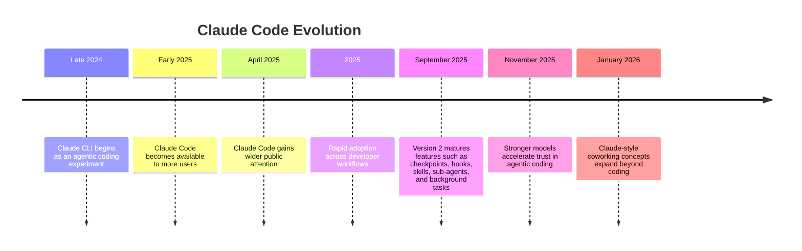
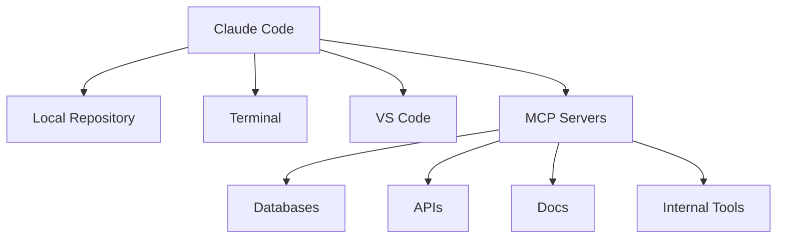
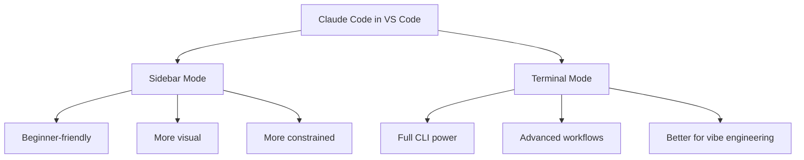
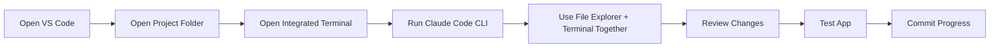

# 036 - Day 1 - The Rise of Claude Code: History, Setup & Installation in VS Code

## Lesson Information

| Item     | Details                                                            |
| -------- | ------------------------------------------------------------------ |
| Lesson   | 036                                                                |
| Duration | 12 minutes                                                         |
| Week     | Week 2 - Claude Code & Vibe Engineering                            |
| Module   | Week 2 Day 1 - Claude Code Fundamentals                            |
| Topic    | Claude Code history, setup, installation, and usage inside VS Code |

---

## Main Focus

This lesson introduces **Claude Code** as a modern coding agent that runs directly inside a developer environment.

You will learn:

* How Claude Code emerged as one of the most important CLI-based AI coding tools.
* Why Claude Code became central to agentic coding workflows.
* How to install Claude Code.
* How to use Claude Code inside VS Code.
* The difference between using Claude Code through the VS Code sidebar and through the terminal.

---

## Learning Objectives

By the end of this lesson, students should be able to:

* Understand the background and rise of Claude Code.
* Explain why CLI-based coding agents are different from normal AI chat tools.
* Install Claude Code on their local machine.
* Install the Claude Code VS Code extension.
* Open and use Claude Code from the VS Code terminal.
* Understand why the course will focus on the terminal-based Claude Code workflow instead of the sidebar workflow.

---

## 1. What Is Claude Code?

**Claude Code** is an AI coding agent built around Claude models. Instead of only answering questions in a chat window, it can operate inside a developer workflow.

It can help with:

* Reading and modifying code
* Understanding repositories
* Running agentic coding loops
* Assisting with debugging
* Working through tasks step by step
* Supporting larger engineering workflows

Claude Code is not just a chatbot. It is designed to work closer to the way developers actually build software.

```text
Normal AI Chat:
User asks question → AI answers

Claude Code:
User gives coding task → Agent reads repo → edits files → reasons about next step → continues workflow
```

---

## 2. The Rise of Claude Code

Claude Code began as an internal or side-project style experiment originally known as **Claude CLI**. It was associated with Boris Cherny, an engineer at Anthropic, and was designed to let Claude drive coding through an agent loop.

Over time, it evolved from a CLI experiment into a serious developer tool.

### Timeline Overview



---

## 3. Why Claude Code Matters

Claude Code became important because it showed that AI coding agents could move beyond simple code suggestions.

Earlier AI coding tools often helped with small tasks:

* Autocomplete
* Small code snippets
* Basic debugging help
* Simple explanations

Claude Code pushed the workflow further:

* It could operate inside a project.
* It could reason across multiple files.
* It could run more complex coding loops.
* It introduced deeper agentic workflows.
* It helped normalize terminal-based AI engineering.


---

## 4. Claude Code Ecosystem

Over time, Claude Code developed a broader ecosystem of features.

Important features include:

| Feature          | Purpose                                                |
| ---------------- | ------------------------------------------------------ |
| Checkpointing    | Save progress and recover from mistakes                |
| Sub-agents       | Delegate smaller tasks to specialized agents           |
| Hooks            | Trigger custom behavior during workflows               |
| Skills           | Extend Claude Code with reusable capabilities          |
| Background tasks | Let longer-running tasks continue while you work       |
| Claude Code SDK  | Build tools that work within the Claude Code ecosystem |
| MCP integration  | Connect Claude Code to external tools and data sources |

---

## 5. Claude Code vs Agent Frameworks

Claude Code should not be confused with a general agent framework.

| Tool Type                              | Purpose                                                           |
| -------------------------------------- | ----------------------------------------------------------------- |
| Claude Code                            | A coding agent ecosystem for working inside developer workflows   |
| Claude Code SDK                        | Allows developers to build tools around the Claude Code ecosystem |
| Agent frameworks                       | Used to build custom AI agents from scratch                       |
| OpenAI Agents SDK / similar frameworks | More general-purpose agent-building tools                         |

Claude Code is mainly about helping you code and engineer software more effectively inside a practical development environment.

---

## 6. Models and Agentic Coding

The lesson emphasizes that Claude Code became more powerful as the underlying models improved.

Stronger models made coding agents more reliable because they became better at:

* Understanding large codebases
* Planning changes
* Following instructions
* Reducing obvious mistakes
* Handling multi-step coding tasks
* Working more autonomously

The key idea is:

```text
Better models → Better coding agents → More reliable engineering workflows
```

However, the lesson also warns students not to get too caught up in weekly hype. New models and tools appear constantly, but the goal is to focus on workflows that remain useful over time.

---

## 7. Claude Code and MCP

The lesson also connects Claude Code with **MCP**, or the **Model Context Protocol**.

MCP matters because it allows AI tools to connect with external systems in a more structured way.

Examples include:

* Files
* Databases
* APIs
* Developer tools
* Internal systems
* Documentation sources

Claude Code and MCP are closely aligned because both support the idea of AI agents working inside real environments rather than isolated chat windows.



---

## 8. Pricing and Access

Claude Code is connected to the Claude platform.

There are generally two ways to think about Claude access:

| Access Type           | Use Case                                                               |
| --------------------- | ---------------------------------------------------------------------- |
| Consumer subscription | For individual users working with Claude directly                      |
| API usage             | For developers building products or making repeated programmatic calls |

For this course, the focus is on using Claude Code as a user inside a developer workflow.

A paid subscription can provide a better experience, but the lesson also notes that students can still explore free or cheaper alternatives later.

The recommended approach is:

```text
Start free → Understand the workflow → Upgrade only if it makes sense for you
```

---

## 9. Installing Claude Code

To install Claude Code, go to:

```text
code.claude.com
```

The website will show the correct installation command for your operating system.

Typical steps:

1. Open the Claude Code website.
2. Copy the installation command for your system.
3. Open VS Code.
4. Open the integrated terminal.
5. Paste and run the command.
6. Wait for Claude Code to install.
7. Confirm the installation version.

---

## 10. Opening the Terminal in VS Code

Inside VS Code, you can open the terminal using:

| System          | Shortcut                              |
| --------------- | ------------------------------------- |
| Windows / Linux | `Ctrl + J` or `Ctrl + backtick`       |
| macOS           | `Command + J` or `Control + backtick` |

You can also open it manually:

```text
View → Terminal
```

The lesson recommends installing and running Claude Code from the VS Code terminal because this keeps your coding environment in one place.

---

## 11. Windows Permission Notes

On Windows, some students may encounter script permission errors.

This is usually related to PowerShell or script execution permissions.

The general solution is to enable permission to run scripts using standard Windows instructions.

The lesson does not go deeply into this issue, but the key point is:

```text
If Windows blocks the install script, fix script execution permissions and run the install command again.
```

---

## 12. Installing the Claude Code VS Code Extension

After installing Claude Code itself, the lesson also recommends installing the **Claude Code extension for VS Code**.

Steps:

1. Open VS Code.
2. Go to the Extensions panel.
3. Search for:

```text
Claude Code
```

4. Choose the extension published by Anthropic.
5. Confirm that it is verified.
6. Click **Install**.

Shortcut for opening Extensions:

| System          | Shortcut              |
| --------------- | --------------------- |
| Windows / Linux | `Ctrl + Shift + X`    |
| macOS           | `Command + Shift + X` |

---

## 13. Two Ways to Use Claude Code in VS Code

Once Claude Code is installed, there are two main ways to use it in VS Code.

### Option 1: Use the Claude Code Sidebar

This is the more visual and beginner-friendly experience.

It works like an agent chat panel inside VS Code.

Advantages:

* Easy to access
* Familiar sidebar interface
* Integrated into VS Code
* Similar to other AI coding assistants

Limitations:

* More packaged and constrained
* May not expose all advanced Claude Code features
* Better suited for newer users

---

### Option 2: Use Claude Code in the VS Code Terminal

This is the approach used in the course.

Advantages:

* Full Claude Code experience
* Better for advanced workflows
* Closer to real developer tooling
* More powerful and flexible
* Better fit for vibe engineering

The course focuses on this approach because Week 2 is about moving beyond basic sidebar AI usage.



---

## 14. Why Use the Terminal Instead of the Sidebar?

The lesson explains that the sidebar is useful, but the terminal is more powerful.

In Week 1, students worked with more beginner-friendly agent chats and sidebars. In Week 2, the course moves toward a more professional workflow.

The terminal workflow gives you:

* More control
* More visibility
* More access to advanced features
* A workflow closer to how serious developers use CLI tools
* A better foundation for Claude Code, MCP, hooks, skills, and advanced agentic coding

The mindset shift is:

```text
Week 1: AI coding assistant
Week 2: AI coding agent
End goal: Vibe engineering workflow
```

---

## 15. Recommended Workflow for This Course

The recommended setup is:



This gives you the best balance of:

* Claude Code power
* VS Code convenience
* File visibility
* Terminal control
* Developer discipline

---

## 16. Key Concepts

### 16.1 Claude Code as a Coding Agent

Claude Code is not just a chat assistant. It is an agentic coding tool that can work inside your development environment.

The important idea is that Claude Code can participate in a coding loop:

```text
Understand task → Inspect project → Modify files → Check result → Continue
```

---

### 16.2 CLI-Based AI Engineering

Using Claude Code from the terminal is different from using a visual sidebar.

A CLI workflow is more technical, but also more powerful.

Students should become comfortable with:

* Opening a terminal
* Running commands
* Navigating project folders
* Reading terminal output
* Letting agents work inside a repo
* Reviewing generated changes

---

### 16.3 VS Code as the Working Environment

VS Code remains useful because it gives you:

* File explorer
* Terminal
* Extensions
* Git integration
* Code search
* Debugging tools
* Visual editing

Claude Code does not replace VS Code. Instead, it works inside or alongside it.

---

### 16.4 Paid vs Free Experience

A paid Claude subscription may improve the Claude Code experience, especially when using stronger models.

However, students should understand the workflow first before deciding whether to pay.

The lesson’s practical advice:

```text
Do not pay because of hype.
Pay only if the tool becomes useful enough in your real workflow.
```

---

## 17. Practical Installation Checklist

Use this checklist to confirm your setup.

```text
[ ] Create or sign in to a Claude account
[ ] Decide whether to use free or paid access
[ ] Go to code.claude.com
[ ] Copy the install command for your operating system
[ ] Open VS Code
[ ] Open the integrated terminal
[ ] Paste and run the install command
[ ] Confirm Claude Code installed successfully
[ ] Open VS Code Extensions
[ ] Search for Claude Code
[ ] Install the verified Anthropic extension
[ ] Choose terminal workflow for this course
```

---

## 18. Common Issues

| Issue                                  | Possible Cause                   | What to Do                         |
| -------------------------------------- | -------------------------------- | ---------------------------------- |
| Install command fails                  | Permission or shell issue        | Check terminal permissions         |
| Windows blocks script                  | PowerShell execution policy      | Enable script execution safely     |
| Claude Code not found                  | PATH issue or failed install     | Restart terminal or reinstall      |
| Extension not visible                  | VS Code extension not installed  | Search and install from Extensions |
| Confusion between sidebar and terminal | Two Claude Code interfaces exist | Use terminal mode for this course  |

---

## 19. Why This Lesson Is Important

This lesson is the foundation for **Week 2 Day 1 - Claude Code Fundamentals**.

Before using Claude Code for serious agentic coding, students need to understand:

* Where Claude Code came from
* Why it matters
* How it fits into the AI coding ecosystem
* How to install it
* How to run it inside VS Code
* Why terminal-based workflows are more powerful

Without this setup, students will not be ready for the more advanced Claude Code workflows later in the week.

---

## 20. Summary

In this lesson, students are introduced to the rise of Claude Code and its role in modern AI-assisted software development.

Claude Code began as a CLI-based coding experiment and evolved into one of the most important tools in the agentic coding ecosystem. It works especially well when used inside a developer environment such as VS Code.

Students learn how to install Claude Code, install the VS Code extension, and understand the difference between using Claude Code through a sidebar and using it through the terminal.

The course chooses the terminal workflow because it gives students access to the full power of Claude Code and prepares them for more advanced vibe engineering practices.

The main message of the lesson is:

```text
Claude Code is not just another AI chat tool.
It is a professional coding agent workflow.
To use it well, you need to become comfortable working in the terminal.
```

---

## 21. Practice Task

After watching the lesson, students should:

1. Open VS Code.
2. Open a new terminal.
3. Visit `code.claude.com`.
4. Install Claude Code using the command for their operating system.
5. Install the Claude Code VS Code extension.
6. Open a project folder.
7. Run Claude Code from the terminal.
8. Confirm that Claude Code can see and work inside the project.

---

## 22. Reflection Questions

Use these questions to review the lesson:

1. What makes Claude Code different from a normal chatbot?
2. Why is Claude Code useful for agentic coding?
3. What is the difference between Claude Code sidebar mode and terminal mode?
4. Why does the course prefer terminal mode?
5. What role does VS Code play in the Claude Code workflow?
6. Why should students avoid getting distracted by AI tool hype?
7. How does Claude Code prepare students for vibe engineering?

---

## 23. Key Takeaways

* Claude Code is a major tool in the rise of agentic coding.
* It started as a CLI-based coding agent and grew into a broader ecosystem.
* Claude Code works well inside VS Code.
* The VS Code sidebar is easier, but the terminal gives more power.
* This course focuses on terminal-based Claude Code workflows.
* Students should install both Claude Code and the VS Code extension.
* The goal is to move from basic AI-assisted coding to professional vibe engineering.

---

# Bài luyện tập

## Mục tiêu


## Đề bài


## Yêu cầu hoàn thành

- [ ] 
- [ ] 
- [ ] 

## Kết quả / lời giải


## Ghi chú
