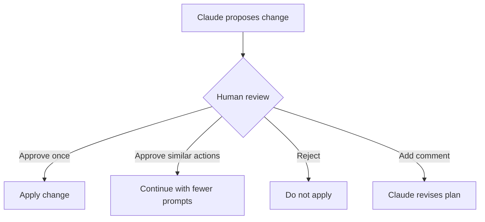
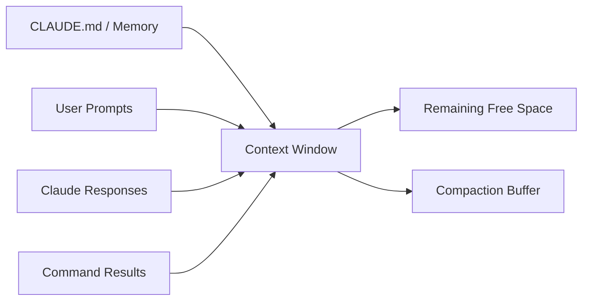

# 037 - Day 1 - Getting Started with Claude Code CLI: Init, Context & Testing

## Lesson Information

| Item      | Details                                                 |
| --------- | ------------------------------------------------------- |
| Lesson    | 037                                                     |
| Duration  | 11 minutes                                              |
| Week      | Week 2 - Claude Code & Vibe Engineering                 |
| Module    | Week 2 Day 1 - Claude Code Fundamentals                 |
| Main Tool | Claude Code CLI                                         |
| Focus     | Init, project context, slash commands, testing workflow |

---

## Main Idea

This lesson introduces the **Claude Code CLI** as a terminal-based coding agent workflow.

Instead of using a sidebar chat interface like GitHub Copilot Chat, Claude Code runs directly inside the terminal. It can inspect the project, read documentation, create or update files, run commands, execute tests, and report back with results.

The main goal of this lesson is to help learners understand how to start Claude Code inside an existing project, initialize project context, inspect context usage, and ask Claude to run the test suite.

---

## Learning Objectives

By the end of this lesson, learners should be able to:

* Launch Claude Code from the terminal.
* Log in to Claude Code using slash commands.
* Initialize Claude Code inside an existing project.
* Understand the purpose of `CLAUDE.md`.
* Ask Claude to read project documentation and build context.
* Use `/context` to monitor context window usage.
* Let Claude run project tests and inspect the results.
* Understand when to approve, reject, or modify Claude’s proposed actions.

---

## 1. Starting from an Existing Project

The instructor begins by opening the project created in the previous week.

In this case, the project is called `PM`.

Before launching Claude Code, the instructor checks the Git state and commits the current progress.

```bash
git status
git add .
git commit -m "step 10 complete"
```

This is an important habit when working with coding agents.

Before allowing an AI agent to inspect or modify your codebase, always create a clean checkpoint.

```text
Before Claude Code
      |
      v
Check git status
      |
      v
Commit current work
      |
      v
Launch Claude Code safely
```

---

## 2. Launching Claude Code CLI

After opening a fresh terminal, Claude Code is launched with:

```bash
claude
```

This opens the Claude Code CLI interface.

The interface is intentionally terminal-first and text-based. It may feel old-school, but this is part of the design. The idea is to create a direct, low-friction interaction between the developer, the project, and the coding agent.

---

## 3. Claude Code Slash Commands

Claude Code supports two types of interaction:

| Interaction Type        | Example                        | Purpose                            |
| ----------------------- | ------------------------------ | ---------------------------------- |
| Natural language prompt | `Please read the docs folder.` | Ask Claude to perform a task       |
| Slash command           | `/login`                       | Run a built-in Claude Code command |

Slash commands are special commands built into Claude Code.

Important commands introduced in this lesson:

| Command    | Purpose                                        |
| ---------- | ---------------------------------------------- |
| `/login`   | Sign in to your Anthropic account              |
| `/init`    | Initialize Claude Code for the current project |
| `/context` | Show current context window usage              |

---

## 4. Logging In

For first-time use, the instructor runs:

```text
/login
```

This opens a browser-based login flow.

After logging in through the web interface, Claude Code returns to the terminal and is ready to use.

---

## 5. Initializing Claude Code with `/init`

Next, the instructor runs:

```text
/init
```

This asks Claude to inspect the project and prepare itself to work inside the codebase.

Claude starts reading files, analyzing the folder structure, and understanding what the project does.

During this process, Claude creates a project memory file called:

```text
CLAUDE.md
```

---

## 6. What Is `CLAUDE.md`?

`CLAUDE.md` is the Claude Code equivalent of an agent instruction file.

It tells Claude important information about the project, such as:

* Project overview
* Development commands
* Testing commands
* Architecture notes
* Coding guidelines
* Important conventions

In the lesson, Claude generates this file automatically after reading the project.

Example structure:

```markdown
# Project Overview

## Commands

## Architecture

## Development Guidelines
```

However, the instructor makes an important point:

> You should not blindly rely on Claude to write its own `CLAUDE.md`.

The better workflow is:

1. Let Claude create a first draft.
2. Review it carefully.
3. Improve it manually.
4. Treat it as one of the most important human-controlled files in the project.

---

## 7. Human Approval Workflow

When Claude proposes an edit, Claude Code asks for approval.

Typical options include:

| Option | Meaning                                          |
| ------ | ------------------------------------------------ |
| `1`    | Yes, approve this edit                           |
| `2`    | Yes, and allow similar edits during this session |
| `3`    | No, reject this edit                             |
| `Tab`  | Add extra comments or instructions               |

This approval step is critical.

Claude Code is powerful because it can modify files and run commands. But the human developer remains the supervisor.



---

## 8. Reading Project Context

After initialization, the instructor explicitly asks Claude to read the project plan:

```text
Please read plan.md in the docs folder to understand everything that's been built for and any supporting docs.
```

This is a good habit.

Even if Claude has already scanned some files, giving it a direct instruction helps ensure that the most important project documentation is loaded into context.

Recommended prompt:

```text
Please read the main project documentation, including plan.md and any supporting docs, so you understand the current state of the project before making changes.
```

---

## 9. Monitoring Context with `/context`

Claude Code has a limited context window.

In this lesson, the instructor runs:

```text
/context
```

This shows how much of Claude’s context window is being used.

The context view includes areas such as:

| Context Area | Meaning                                      |
| ------------ | -------------------------------------------- |
| Memory       | Project memory such as `CLAUDE.md`           |
| Messages     | Current conversation history                 |
| Free space   | Remaining available context                  |
| Buffer       | Reserved space for compression or compaction |

Claude Code currently uses a large but still limited context window. The instructor explains that developers should actively monitor it.



The key lesson:

> Context is a resource. Manage it carefully.

---

## 10. Asking Claude to Run Tests

Once Claude understands the project, the instructor asks it to run the full test suite:

```text
Please run all tests to confirm that everything is working, bringing up the server as needed and bringing down the server at the end.
```

This is a strong instruction because it includes:

* The goal: confirm everything is working.
* The action: run all tests.
* The environment requirement: bring up the server if needed.
* The cleanup requirement: bring down the server at the end.

A good testing prompt should be specific.

Better prompt pattern:

```text
Please run the full backend and frontend test suite.
If a server or Docker container is required, start it.
After testing, shut down any temporary services you started.
Report the results clearly, including any warnings or failures.
```

---

## 11. Claude Running Terminal Commands

Claude may ask permission before running commands such as:

```bash
docker build
```

or launching required tools.

In the lesson, Docker was not running. Claude detected this and offered to open Docker Desktop automatically.

This demonstrates that Claude Code can interact with the developer environment, not just the source code.

However, the instructor chooses approvals carefully:

* Allow repeated Docker build commands.
* Do not permanently allow application launching.
* Approve higher-risk actions one at a time.

This is an important safety habit.

---

## 12. Test Results

Claude successfully runs:

* Backend tests
* Frontend tests

It reports that all tests passed.

It also mentions two deprecation warnings, but they are not blocking issues.

A good Claude test report should include:

| Result Area    | Example              |
| -------------- | -------------------- |
| Backend tests  | Passed               |
| Frontend tests | Passed               |
| Warnings       | Deprecation warnings |
| Errors         | None                 |
| Final status   | Project is working   |

---

## 13. Full Claude Code Starter Workflow

```mermaid
flowchart TD
    A[Open existing project] --> B[Check git status]
    B --> C[Commit current work]
    C --> D[Open fresh terminal]
    D --> E[Run claude]
    E --> F[/login]
    F --> G[/init]
    G --> H[Review CLAUDE.md]
    H --> I[Ask Claude to read docs]
    I --> J[/context]
    J --> K[Ask Claude to run tests]
    K --> L[Approve commands carefully]
    L --> M[Review test results]
    M --> N[Check context again]
```

---

## 14. Key Concepts

### 14.1 Claude Code CLI

Claude Code CLI is a terminal-based coding agent interface.

It allows the developer to interact with Claude directly inside the project environment.

Instead of only chatting about code, Claude can:

* Read files
* Edit files
* Run terminal commands
* Analyze errors
* Execute tests
* Summarize results

---

### 14.2 `CLAUDE.md`

`CLAUDE.md` is the project instruction file for Claude Code.

It acts as long-term project guidance.

It should explain:

* What the project is
* How to run it
* How to test it
* What conventions to follow
* What mistakes to avoid

This file is important because it shapes how Claude behaves inside the project.

---

### 14.3 Context Management

The context window is the amount of information Claude can keep active during a session.

As the session grows, context gets filled by:

* Project files
* Documentation
* Prompts
* Responses
* Command outputs
* Test logs

Developers should use:

```text
/context
```

to monitor context usage.

---

### 14.4 Human Supervision

Claude Code is powerful, but it should not be treated as fully autonomous.

The developer should:

* Review proposed edits.
* Approve commands carefully.
* Avoid giving broad permission too early.
* Keep Git checkpoints.
* Read generated files before trusting them.

---

## 15. Practical Commands from This Lesson

```bash
# Check current project state
git status

# Stage all changes
git add .

# Commit current progress
git commit -m "step 10 complete"

# Launch Claude Code
claude
```

Claude Code slash commands:

```text
/login
/init
/context
```

Example project-reading prompt:

```text
Please read plan.md in the docs folder to understand everything that's been built for and any supporting docs.
```

Example testing prompt:

```text
Please run all tests to confirm that everything is working, bringing up the server as needed and bringing down the server at the end.
```

---

## 16. Recommended Best Practices

| Practice                          | Why It Matters                                         |
| --------------------------------- | ------------------------------------------------------ |
| Commit before using Claude Code   | Gives you a safe rollback point                        |
| Use `/init` carefully             | It can generate useful context, but should be reviewed |
| Manually improve `CLAUDE.md`      | Human-written guidance is usually better               |
| Use `/context` often              | Prevents context overload                              |
| Ask Claude to read docs first     | Reduces wrong assumptions                              |
| Approve risky commands one by one | Keeps the developer in control                         |
| Run tests after changes           | Confirms the project still works                       |

---

## 17. Why This Lesson Matters

This lesson is important because it introduces the real working loop of Claude Code.

The learner moves from simply installing Claude Code to actually using it inside a real project.

The core workflow is:

```text
Give Claude project context
        ↓
Let Claude inspect the codebase
        ↓
Ask it to run tests
        ↓
Review results
        ↓
Use it as a supervised coding agent
```

This is the foundation for more advanced Claude Code workflows later in Week 2.

---

## 18. Lesson Summary

In this lesson, learners get started with the Claude Code CLI inside an existing project.

They learn how to launch Claude Code, log in, run `/init`, review the generated `CLAUDE.md`, inspect context usage with `/context`, and ask Claude to run the full test suite.

The most important takeaway is that Claude Code is not just a chat tool. It is a terminal-native coding agent that can understand project context, execute commands, and help manage real development workflows.

However, the human developer remains responsible for supervision, approvals, context management, and project direction.

---

## 19. Practice Task

Apply this workflow to your own project:

1. Open an existing project in VS Code.
2. Commit your current work.
3. Open a fresh terminal.
4. Run:

```bash
claude
```

5. Run:

```text
/login
/init
/context
```

6. Ask Claude to read your main project documentation.
7. Ask Claude to run your test suite.
8. Review all proposed actions before approving them.
9. Check `/context` again after testing.
10. Update `CLAUDE.md` manually if needed.

---

## 20. Key Takeaway

Claude Code works best when you treat it like a powerful junior developer with terminal access.

Give it context, define the task clearly, review its actions, run tests, and keep control of the workflow.
