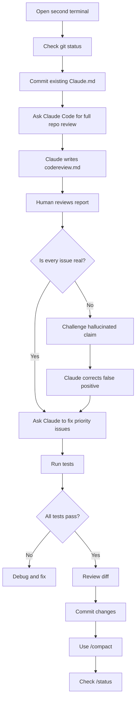
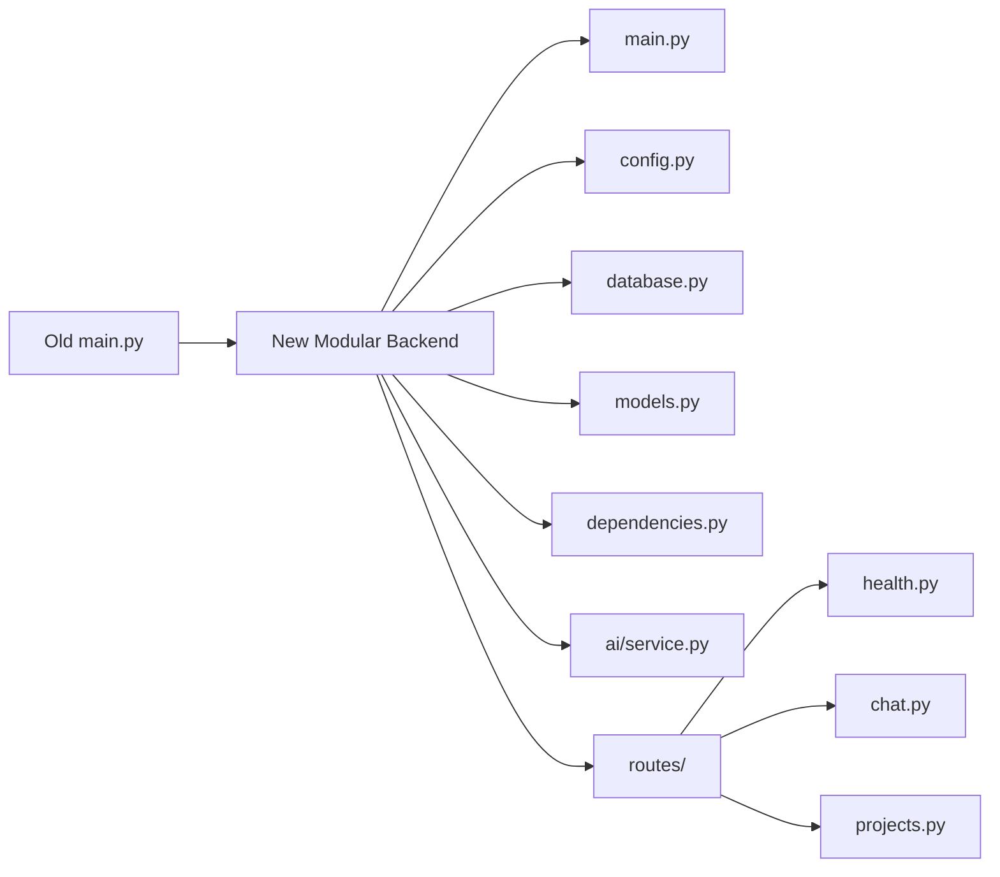
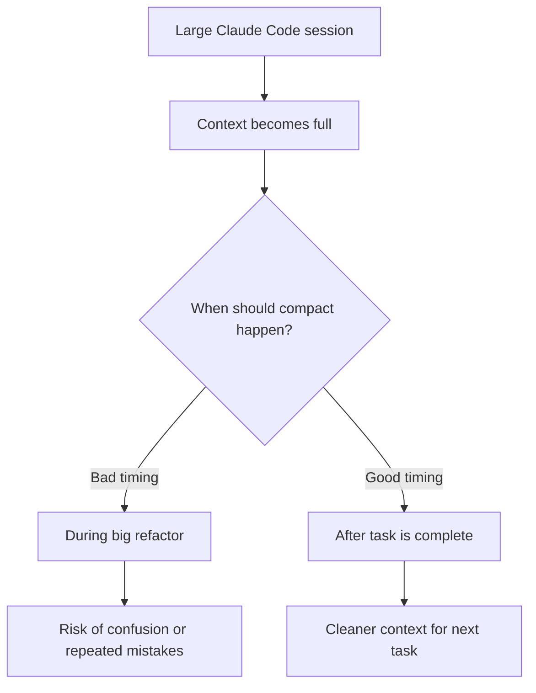
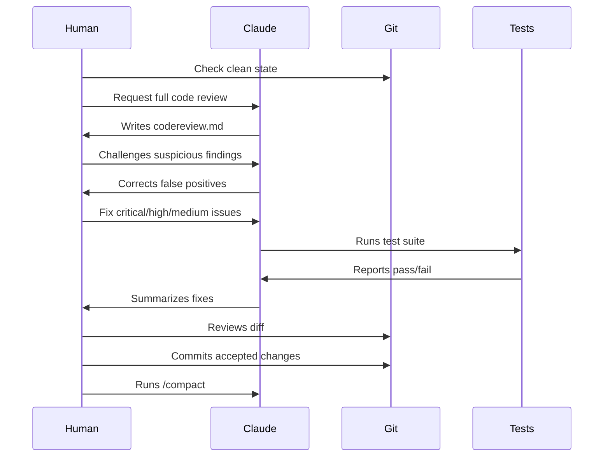

# 038 - Day 1 - Claude Code Review: Fixing Hallucinations & Refactoring Code

## Lesson Information

| Item     | Details                                 |
| -------- | --------------------------------------- |
| Lesson   | 038                                     |
| Duration | 15 minutes                              |
| Week     | Week 2 - Claude Code & Vibe Engineering |
| Module   | Week 2 Day 1 - Claude Code Fundamentals |

---

## Main Topic

This lesson demonstrates how to use **Claude Code** for a full repository code review, how to detect and correct AI hallucinations, and how to safely refactor messy or monolithic code.

Claude Code can produce useful insights, but it can also make confident mistakes. Therefore, every recommendation must be verified through:

* Git status
* `.gitignore`
* Test results
* Runtime checks
* Code review reports
* Diff review before committing

---

## Learning Objectives

By the end of this lesson, students will be able to:

* Use Claude Code to perform a comprehensive code review.
* Ask Claude Code to write a structured review report.
* Identify false positives and hallucinations in AI-generated reviews.
* Verify whether an issue is real before acting on it.
* Ask Claude Code to fix critical, high, and medium-priority issues.
* Refactor a monolithic backend file into a cleaner modular structure.
* Run tests after automated code changes.
* Review diffs before committing AI-generated changes.
* Use `/context`, `/compact`, and `/status` effectively in Claude Code.

---

## Lesson Flow



---

## 1. Starting with Git Status

Before asking Claude Code to modify anything, the instructor opens a second terminal and checks the repository state:

```bash
git status
```

Only `claude.md` has changed, so it is added and committed first.

```bash
git add claude.md
git commit -m "Add Claude project context"
```

This is important because Claude Code may make many changes later. Starting from a clean Git state makes it easier to inspect exactly what changed.

---

## 2. Asking Claude Code for a Full Code Review

Instead of assuming a specific bug, the instructor asks Claude Code to perform a broad review of the entire repository.

Example prompt:

```text
Please carry out a comprehensive code review of the entire repo and write a report with actions to codereview.md in the docs folder.
```

Claude Code then launches multiple agents in parallel, such as:

* Backend code quality agent
* Frontend review agent
* Infrastructure and configuration agent

This allows Claude Code to inspect different parts of the project at the same time.

---

## 3. Code Review Output

Claude writes a review report to:

```text
docs/codereview.md
```

The report includes findings grouped by priority:

| Priority | Example Issues                                       |
| -------- | ---------------------------------------------------- |
| Critical | Security or dependency risks                         |
| High     | Test failures, unsafe patterns, broken configuration |
| Medium   | Maintainability, refactoring, missing validation     |
| Low      | Documentation, style, minor cleanup                  |

---

## 4. The Hallucination Problem

One of Claude Code’s first critical findings is that an API key is exposed in Git.

Claude claims that the `.env` file is tracked and contains a secret.

However, this is false.

The instructor verifies that:

* `.env` is included in `.gitignore`
* `.env` is not tracked by Git
* `.env` is not present in GitHub

This is a classic LLM hallucination: the model gives a confident, serious-sounding warning, but the claim is not true.

---

## 5. How to Challenge a Claude Code Hallucination

The instructor asks Claude directly:

```text
How is .env in Git? It's clearly included in .gitignore and it's not in GitHub.
```

Claude then verifies the claim and admits the mistake.

It explains that the file exists locally, but is not tracked by Git.

Correct conclusion:

```text
.env exists locally, but it is properly ignored and not committed.
```

---

## 6. Key Lesson: Never Trust AI Review Blindly

AI-generated code reviews can be helpful, but they are not automatically correct.

A serious-looking warning may still be wrong.

Always verify using direct evidence:

```bash
git status
git ls-files .env
cat .gitignore
```

Useful verification commands:

```bash
git status
```

```bash
git ls-files | grep .env
```

```bash
git check-ignore -v .env
```

If `.env` is ignored correctly, Git should not track it.

---

## 7. Reviewing the Corrected Code Review Report

After Claude corrects the false positive, the instructor reviews the remaining findings.

Some issues are valid and useful:

| Finding                            | Meaning                                        |
| ---------------------------------- | ---------------------------------------------- |
| Backend dependencies are unpinned  | No lock file or fixed package versions         |
| Backend integration tests may fail | Some tests may not have been fully run         |
| Deprecation warning                | Code uses something outdated                   |
| Playwright path hard-coded for Mac | Test setup may only work on one machine        |
| SQL injection risk                 | Query construction may be unsafe               |
| Missing input validation           | API may accept bad or unsafe input             |
| Monolithic `main.py`               | Backend code is too large and hard to maintain |
| Accessibility gaps                 | Frontend may not be friendly to all users      |
| Missing Docker health check        | Container health is not monitored              |
| Docker runs as root                | Container security can be improved             |

---

## 8. Asking Claude Code to Fix Priority Issues

Once the review is corrected, the instructor asks Claude Code to fix the most important issues.

Example prompt:

```text
Okay, thank you. Please go ahead and address all the critical, high, and medium priority issues, retest everything, and let me know when everything is remediated and tests okay.
```

Claude Code quickly fixes many issues and runs tests.

However, Claude decides to defer one major task: refactoring the monolithic Python module.

This is interesting because Claude does not blindly follow the instruction. It judges that the change may be too large.

But the instructor still wants that refactor completed.

---

## 9. Forcing the Monolithic Refactor

The instructor gives Claude Code a more direct instruction:

```text
This is good, but actually I really want to remediate the monolithic Python module. Please do fix that now and then retest. Refactor main.py and organize into modules and packages as appropriate. Check and test everything.
```

Claude then restructures the backend.

Before:

```text
main.py
```

One large file containing too much logic.

After:

```text
backend/
├── main.py
├── config.py
├── database.py
├── models.py
├── dependencies.py
├── ai/
│   └── service.py
└── routes/
    ├── health.py
    ├── chat.py
    └── projects.py
```

---

## 10. Refactoring Architecture



The new structure is easier to:

* Understand
* Test
* Debug
* Extend
* Maintain

---

## 11. Testing After Refactor

Claude Code runs backend tests and frontend tests.

Example result:

```text
All 23 backend tests passed.
```

Frontend tests also pass.

The instructor also manually runs the project in a separate terminal to confirm that the app works at runtime.

This is critical because passing tests does not always guarantee the app works correctly in real usage.

---

## 12. Reviewing the Final Changes

After Claude finishes, the instructor checks the changed files:

```bash
git status
```

There are many changed files, including:

* Backend modules
* Route files
* Dockerfile
* Documentation
* Test-related files

Before committing, the instructor reviews the diff to understand what Claude changed.

```bash
git diff
```

Then the changes are staged and committed:

```bash
git add .
git commit -m "Claude Code code review fixes"
```

---

## 13. Context Management with `/context`

After a large task, the instructor checks Claude Code’s context usage:

```text
/context
```

The context is nearly full because Claude reviewed, refactored, tested, and documented many files.

A full context window can make Claude slower or less reliable.

---

## 14. Manual Compaction with `/compact`

Instead of waiting for Claude Code to automatically compact in the middle of a task, the instructor manually runs:

```text
/compact
```

This clears the conversation history but keeps a summary in context.

Best practice:

```text
Do big task → Finish task → Commit changes → Run /compact
```

Avoid starting a large refactor when the context is almost full.

---

## 15. Why Manual Compaction Matters



Compaction can improve speed and focus, but some details may be lost.

For important long-term project facts, update `Claude.md` so Claude can reload them later.

Example:

```text
.env is ignored and not tracked by Git.
Do not report local ignored .env files as exposed secrets unless Git tracking confirms it.
```

---

## 16. Checking Claude Code Status

The instructor uses:

```text
/status
```

This opens a status panel with pages such as:

| Page   | What It Shows                                               |
| ------ | ----------------------------------------------------------- |
| Status | Claude Code version, session ID, login method, active model |
| Config | Current settings                                            |
| Usage  | Daily and weekly usage allowance                            |

This helps users understand:

* Which model is active
* How much usage remains
* Whether they are using a paid Claude plan
* What configuration Claude Code is running with

---

## Key Concepts

### 1. AI Code Review Is Useful but Not Infallible

Claude Code can find real problems, but it can also hallucinate issues.

A confident AI statement is not proof.

Always verify.

---

### 2. False Positives Can Be Dangerous

A false security warning can waste time or cause unnecessary panic.

Example:

```text
Claude says .env is exposed in Git.
```

But the actual evidence shows:

```text
.env is ignored and not tracked.
```

The correct response is to ask Claude to verify, not blindly accept the claim.

---

### 3. Human Review Remains Essential

The developer must remain in charge.

Claude Code can:

* Review
* Refactor
* Test
* Summarize
* Suggest improvements

But the human must:

* Verify claims
* Review diffs
* Decide what to accept
* Run the app
* Commit only after inspection

---

### 4. Refactoring Should Be Tested Immediately

Refactoring is not just moving code around.

After refactoring, you must check:

* Unit tests
* Integration tests
* Frontend tests
* Runtime behavior
* API behavior
* Docker behavior, if relevant

---

### 5. Context Management Is Part of Agentic Coding

Long Claude Code sessions consume context.

Use:

```text
/context
```

to check usage.

Use:

```text
/compact
```

after large completed tasks.

Use:

```text
/status
```

to inspect model, configuration, and usage.

---

## Practical Claude Code Prompts

### Full Repository Review

```text
Please carry out a comprehensive code review of the entire repo and write a report with actions to codereview.md in the docs folder.
```

### Challenge a Suspicious Finding

```text
How is .env in Git? It is included in .gitignore and does not appear to be tracked. Please verify this before reporting it as a critical issue.
```

### Fix Priority Issues

```text
Please address all critical, high, and medium priority issues from docs/codereview.md. Retest everything and summarize what was fixed.
```

### Refactor a Monolithic File

```text
Please refactor main.py and organize the code into modules and packages as appropriate. Keep behavior unchanged, update imports, run all tests, and summarize the new structure.
```

### Ask for Final Verification

```text
Please run the backend tests, frontend tests, and any relevant lint checks. Report the exact commands run and whether they passed.
```

---

## Recommended Workflow



---

## Best Practices

| Practice                                | Why It Matters                           |
| --------------------------------------- | ---------------------------------------- |
| Start from a clean Git state            | Makes Claude’s changes easier to inspect |
| Ask for a written review report         | Creates a structured action list         |
| Verify security claims                  | Prevents acting on hallucinations        |
| Review diffs before commit              | Keeps the human in control               |
| Run tests after every major change      | Confirms behavior still works            |
| Manually run the app                    | Catches runtime issues tests may miss    |
| Refactor in focused steps               | Reduces risk                             |
| Use `/compact` after big tasks          | Keeps future Claude sessions cleaner     |
| Update `Claude.md` with important facts | Prevents repeated mistakes               |

---

## Common Mistakes to Avoid

| Mistake                                   | Better Approach                             |
| ----------------------------------------- | ------------------------------------------- |
| Trusting every Claude Code warning        | Verify using Git, tests, and runtime checks |
| Letting Claude refactor without tests     | Require tests after every change            |
| Starting a huge task with full context    | Run `/compact` first                        |
| Committing blindly                        | Review the diff                             |
| Ignoring hallucinations                   | Correct them and update project context     |
| Assuming test pass means everything works | Also run the app manually                   |

---

## Summary

In this lesson, students learn how to use Claude Code for a realistic code review and refactoring workflow.

The most important lesson is that Claude Code is powerful but not perfect. It can identify useful issues, refactor large files, update documentation, and run tests. However, it can also hallucinate serious problems, such as falsely claiming that a `.env` file is exposed in Git.

The correct workflow is not to blindly trust the AI. Instead, the developer should verify findings, challenge suspicious claims, review diffs, run tests, manually check the app, and only then commit changes.

By the end of the workflow, Claude Code has helped transform a messy backend into a cleaner modular structure, fix several review findings, run successful tests, and prepare the project for continued development.

---

## Final Takeaway

Claude Code is not a replacement for developer judgment.

It is a powerful coding agent when used with a disciplined workflow:

```text
Review → Verify → Fix → Test → Review Diff → Commit → Compact
```

The human remains the boss.
