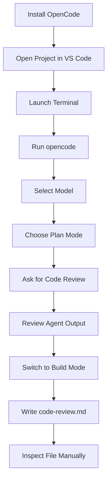
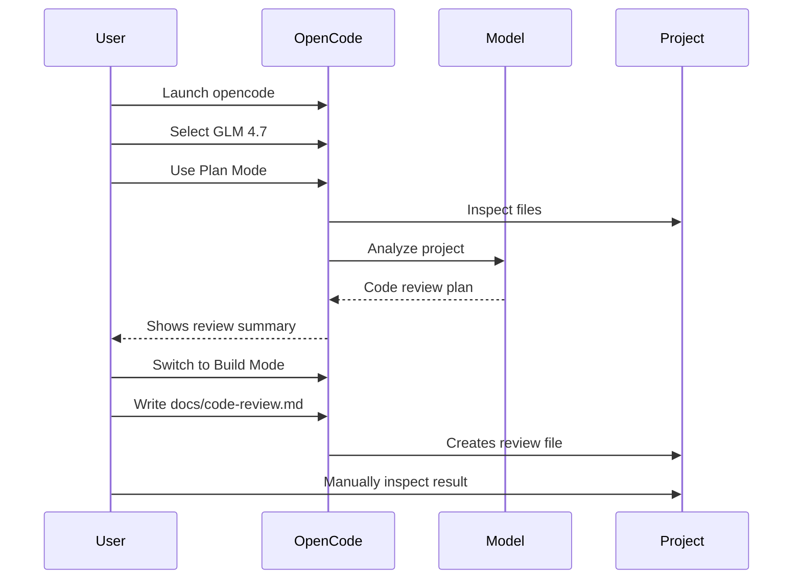
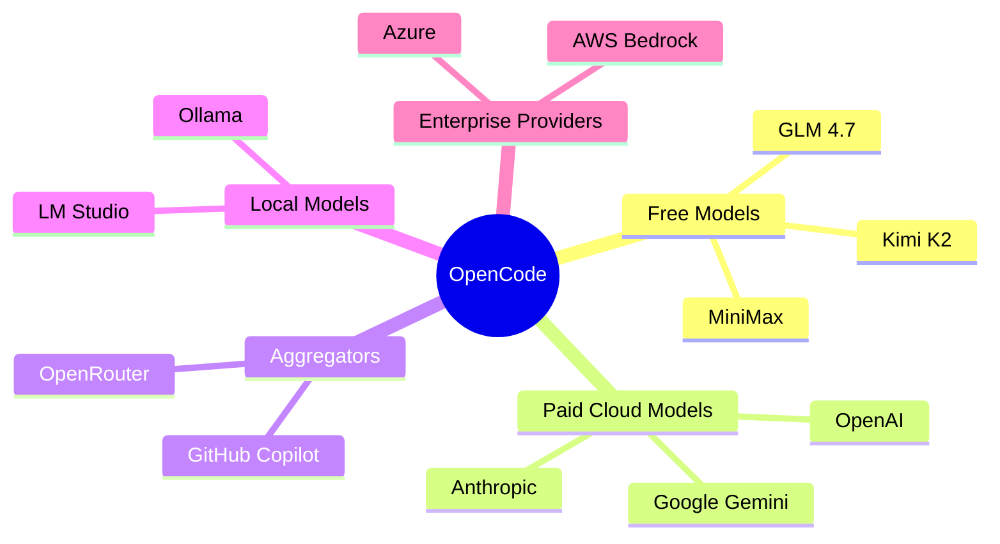

# 039 - Day 1 - OpenCode: Use Free Models Like GLM 4.7 as a Claude Code Alternative

## Lesson Information

| Item       | Details                                             |
| ---------- | --------------------------------------------------- |
| Lesson     | 039                                                 |
| Duration   | 11 minutes                                          |
| Week       | Week 2 - Claude Code & Vibe Engineering             |
| Module     | Week 2 Day 1 - Claude Code Fundamentals             |
| Main Tool  | OpenCode                                            |
| Main Topic | Using free or alternative models for agentic coding |

---

## Main Idea

OpenCode is an open-source alternative to Claude Code. It allows developers to run coding-agent workflows using many different models, including free or open models such as **GLM 4.7**, as well as models from OpenAI, Anthropic, Gemini, OpenRouter, GitHub Copilot, local Ollama models, and other providers.

The key idea of this lesson is not that OpenCode fully replaces Claude Code in every situation, but that it gives learners a flexible, low-cost way to experiment with AI coding agents.

---

## Learning Objectives

By the end of this lesson, learners should be able to:

* Understand what OpenCode is and how it compares with Claude Code.
* Install and launch OpenCode from the terminal.
* Switch between different models inside OpenCode.
* Use free models such as GLM 4.7 for code review and project analysis.
* Understand the difference between **Plan Mode** and **Build Mode**.
* Connect OpenCode to other providers such as OpenAI, Anthropic, OpenRouter, GitHub Copilot, Gemini, or local models.
* Recognize the trade-offs between free/open models and frontier models like Claude Opus.

---

## Why This Lesson Matters

Claude Code is powerful, but it is not the only option for agentic coding. OpenCode gives developers more flexibility because it supports many model providers and can even run with free models.

This matters because real-world AI coding workflows often depend on:

* Cost
* Model availability
* Provider preference
* Speed
* Context window size
* Coding reliability
* Reasoning strength
* Local or cloud-based execution

OpenCode helps learners understand that the coding-agent workflow is not locked to one platform.

---

## Core Concept 1: OpenCode as a Claude Code Alternative

OpenCode is an open-source coding agent that runs from the terminal, similar to Claude Code.

It can:

* Read and analyze a project.
* Perform code review.
* Write files.
* Modify code.
* Use different agent modes.
* Connect to multiple model providers.
* Use free, paid, hosted, or local models.

In this lesson, OpenCode is introduced as a flexible alternative for learners who want to experiment without depending entirely on Claude Code.

---

## Core Concept 2: Free and Open Models

One of OpenCode’s biggest advantages is that it can use free or open models.

Examples mentioned in the lesson include:

| Model               | Provider / Source  | Notes                                          |
| ------------------- | ------------------ | ---------------------------------------------- |
| GLM 4.7             | Z.ai / Zed         | Strong open model, useful for experimentation  |
| Kimi K2 / Kimi K2.5 | Moonshot AI        | Considered a powerful open-source coding model |
| MiniMax             | MiniMax            | Another strong model option                    |
| GPT models          | OpenAI             | Available if connected to OpenAI               |
| Claude models       | Anthropic          | Available through Claude Max or API key        |
| Gemini models       | Google             | Available through Google provider connection   |
| OpenRouter models   | OpenRouter         | Useful for accessing many free or cheap models |
| Local models        | Ollama / LM Studio | Possible, but requires strong hardware         |

Free models are useful for learning, experimentation, and low-cost workflows. However, they may have limits, rate restrictions, or reduced reliability compared with frontier models.

---

## Core Concept 3: Plan Mode vs Build Mode

OpenCode includes different working modes.

| Mode       | Purpose                                    | Best Use Case                                        |
| ---------- | ------------------------------------------ | ---------------------------------------------------- |
| Plan Mode  | Think first, analyze, propose actions      | Code review, architecture analysis, planning changes |
| Build Mode | Actually modify files or implement changes | Writing files, editing code, applying fixes          |

The lesson demonstrates a safe workflow:

1. Start in **Plan Mode**.
2. Ask OpenCode to review the project.
3. Inspect the proposed review.
4. Switch to **Build Mode**.
5. Ask it to write the result into a file.

This prevents the agent from making changes too early.

---

## Workflow Diagram



---

## OpenCode Installation Flow

The lesson shows OpenCode being installed from its website.

General flow:

```bash
# Install OpenCode using the command from opencode.ai
# Then open your project folder and run:
opencode
```

On different systems, installation may vary:

| System                  | Common Installation Method                  |
| ----------------------- | ------------------------------------------- |
| macOS                   | Shell install command from OpenCode website |
| Windows                 | Chocolatey or npm                           |
| Any system with Node.js | npm-based installation                      |

Since Node.js was already installed earlier in the course, npm is a convenient installation option.

---

## Basic OpenCode Usage

After installation, open a project folder in VS Code and launch OpenCode from the terminal:

```bash
opencode
```

Once OpenCode starts, it may automatically detect existing provider credentials, such as an OpenAI account or API key.

Inside OpenCode:

| Action                             | Shortcut / Command |
| ---------------------------------- | ------------------ |
| Switch between Plan and Build mode | `Tab`              |
| Change reasoning level             | `Ctrl + T`         |
| Open command menu                  | `/`                |
| Switch models                      | `/models`          |
| Connect providers                  | `/connect`         |

---

## Example Task: Code Review with GLM 4.7

In the lesson, the instructor selects a free model such as GLM 4.7 and asks OpenCode to perform a project review.

Example prompt:

```text
Please review the entire project, carry out a code review, and write your feedback to code-review.md in the docs directory.
```

Because the agent is in **Plan Mode**, it first analyzes the project but does not immediately write the file.

Then the instructor switches to **Build Mode** and asks:

```text
Please go ahead and write the code review to docs/code-review.md, but don't start any further work yet.
```

This is a good example of controlled agentic coding.

---

## Safe Agent Workflow



---

## What the Code Review Found

The generated review looked impressive and identified several common project issues, such as:

* Overall architecture quality
* Security hardening needs
* Authentication concerns
* TypeScript strictness improvements
* Code duplication
* Error handling opportunities
* Areas for refactoring

This shows that free models can be useful for analysis and review, especially when the task is clearly scoped.

---

## Claude Code vs OpenCode

| Feature             | Claude Code                          | OpenCode                              |
| ------------------- | ------------------------------------ | ------------------------------------- |
| Main strength       | Deep integration with Claude models  | Flexible model/provider support       |
| Model flexibility   | Mostly Claude-focused                | Supports many providers               |
| Free model support  | Limited                              | Stronger support for free/open models |
| User experience     | Highly polished for Claude workflows | More flexible and open                |
| Best for            | Serious Claude-based agentic coding  | Experimenting with many models        |
| Local model support | Not the main focus                   | Possible through tools like Ollama    |
| Reliability         | Strong with frontier Claude models   | Depends heavily on selected model     |

The instructor’s preference is still Claude Code for most serious work because Claude models are highly effective for agentic coding. However, OpenCode is a powerful alternative for learners who want flexibility and lower-cost experimentation.

---

## Provider Connection Options

OpenCode can connect to many providers.



Useful command:

```text
/connect
```

This allows you to connect OpenCode to providers such as:

* OpenCode Zen
* OpenAI
* Anthropic
* GitHub Copilot
* Google
* OpenRouter
* Azure
* AWS Bedrock
* Ollama
* LM Studio

---

## Using OpenRouter with OpenCode

OpenRouter is especially useful because it gives access to many models through a single API key.

A typical setup flow:

1. Create or open your OpenRouter account.
2. Get an OpenRouter API key.
3. In OpenCode, run:

```text
/connect
```

4. Select OpenRouter.
5. Paste your API key.
6. Choose a model.
7. Start coding or reviewing.

This is one of the easiest ways to experiment with different free or cheap models.

---

## Local Models with Ollama

OpenCode can also connect to local models through tools like Ollama.

However, local models require strong hardware.

For serious coding-agent work, small local models are usually not enough. A larger model requires significant GPU memory or unified memory. The lesson notes that a machine with around 64GB or more of memory may be necessary for worthwhile local model performance.

For most learners, cloud-hosted free models or OpenRouter are more practical.

---

## Important Trade-Offs

Free models are useful, but they come with trade-offs.

| Advantage                | Limitation                              |
| ------------------------ | --------------------------------------- |
| Lower cost               | May be rate-limited                     |
| Easy experimentation     | May be less reliable                    |
| Good for learning        | May struggle with large refactors       |
| Flexible model switching | Free availability may change            |
| Useful for code review   | Not always as strong as frontier models |

The instructor emphasizes that GLM 4.7 can produce impressive output, but it may not match Claude Opus-level reliability for complex implementation and refactoring.

---

## Recommended OpenCode Workflow

Use this workflow when trying OpenCode on a real project:

```text
1. Open your project in VS Code.
2. Launch OpenCode from the terminal.
3. Use /models to select a model.
4. Start with a free model such as GLM 4.7.
5. Use Plan Mode for analysis.
6. Ask for a code review or project explanation.
7. Inspect the result manually.
8. Switch to Build Mode only when ready.
9. Ask it to write or modify a specific file.
10. Review the diff before committing.
```

---

## Example Prompts

### Prompt 1: Project Review

```text
Please review the entire project and identify the highest-priority issues.
Do not modify any files yet.
```

### Prompt 2: Write Review to File

```text
Please write your review to docs/code-review.md.
Do not start any implementation work yet.
```

### Prompt 3: Compare Architecture

```text
Please analyze the project architecture and identify duplicated logic, unclear boundaries, or risky dependencies.
Stay in analysis mode only.
```

### Prompt 4: Controlled Refactor

```text
Please propose a refactor plan for the authentication module.
Do not edit files until I approve the plan.
```

---

## Practical Demo Summary

In the lesson, the instructor:

1. Opens the OpenCode website.
2. Installs OpenCode.
3. Opens a project in VS Code.
4. Runs `opencode`.
5. Notices OpenCode has detected an existing OpenAI setup.
6. Opens the model selector using `/models`.
7. Chooses a free model such as GLM 4.7.
8. Switches to Plan Mode.
9. Asks for a full project code review.
10. Switches to Build Mode.
11. Asks OpenCode to write the review into `docs/code-review.md`.
12. Reviews the generated document.
13. Compares the experience with Claude Code.

---

## Key Takeaways

* OpenCode is a serious open-source alternative to Claude Code.
* Its biggest advantage is model flexibility.
* Free models like GLM 4.7 can be useful for code review and learning.
* Plan Mode is important because it prevents premature file changes.
* Build Mode should be used only after reviewing the plan.
* OpenCode can connect to many providers, including OpenRouter and local models.
* Free models are powerful, but they may not match frontier models for complex coding tasks.
* Claude Code remains the instructor’s preferred tool for deep Claude-based workflows, but OpenCode is a strong alternative for experimentation.

---

## Practice Exercise

Try this on your own project:

1. Install OpenCode.
2. Open an existing project in VS Code.
3. Run:

```bash
opencode
```

4. Use:

```text
/models
```

5. Select a free model.
6. Ask:

```text
Please review this project and identify the top 5 technical risks.
Do not modify any files.
```

7. Review the output.
8. Switch to Build Mode.
9. Ask:

```text
Please write the review to docs/code-review.md.
```

10. Open the file and check whether the review is accurate.

---

## Lesson Summary

Lesson **039 - Day 1 - OpenCode: Use Free Models Like GLM 4.7 as a Claude Code Alternative** introduces OpenCode as a flexible coding-agent tool that can run with many different models, including free and open models.

The lesson shows how to install OpenCode, launch it inside a project, switch models, use Plan Mode and Build Mode, and generate a project code review with a free model.

The main message is that Claude Code may remain the best experience for Claude-based workflows, but OpenCode is an excellent alternative for learners who want more model flexibility, lower cost, and the ability to experiment with open or free coding models.

---

# Bài luyện tập

## Mục tiêu


## Đề bài


## Yêu cầu hoàn thành

- [ ] 
- [ ] 
- [ ] 

## Kết quả / lời giải


## Ghi chú
