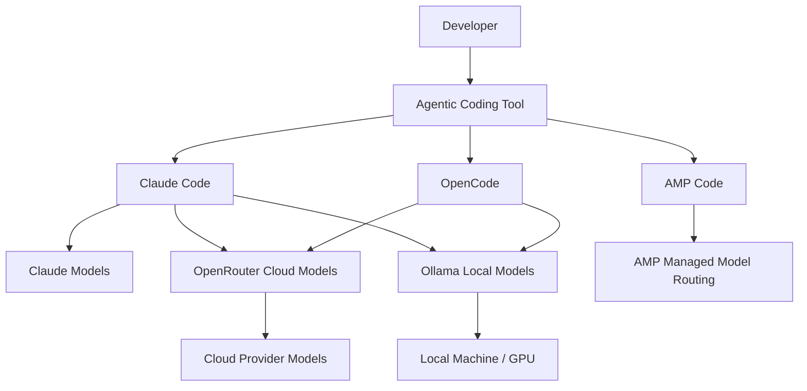
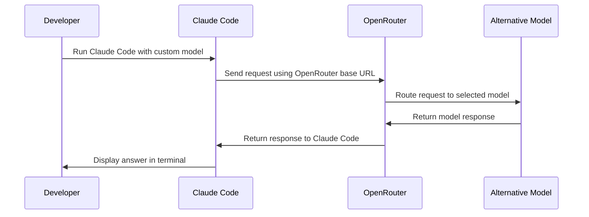
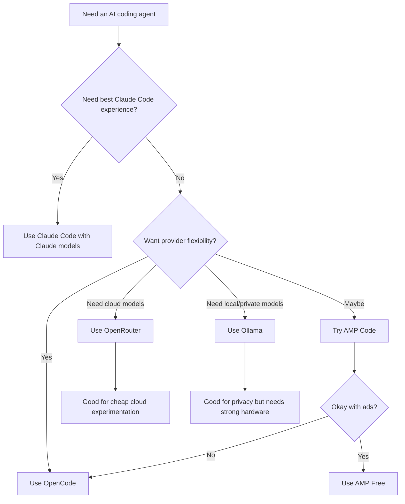
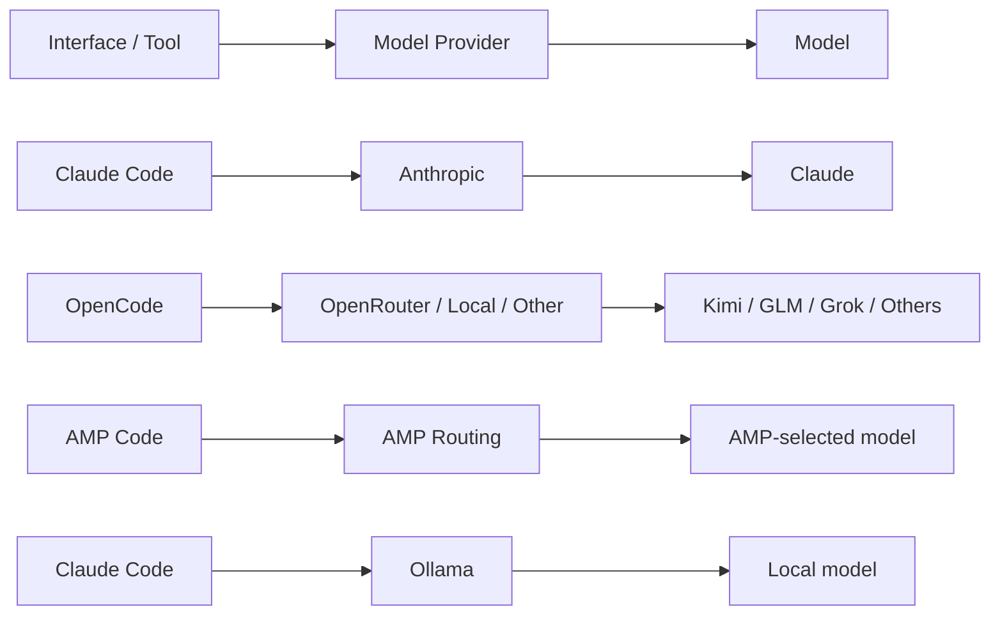

# 040 - Day 1 - AMP Code, OpenCode & Claude Code with OpenRouter and Ollama

## Lesson Information

| Item     | Details                                                 |
| -------- | ------------------------------------------------------- |
| Lesson   | 040                                                     |
| Duration | 14 minutes                                              |
| Week     | Week 2 - Claude Code & Vibe Engineering                 |
| Module   | Week 2 Day 1 - Claude Code Fundamentals                 |
| Topic    | AMP Code, OpenCode, Claude Code, OpenRouter, and Ollama |

---

## Main Idea

This lesson compares **AMP Code**, **OpenCode**, and **Claude Code** as agentic coding tools. It also demonstrates how Claude Code can be connected to alternative model providers such as **OpenRouter** for cloud models and **Ollama** for local models.

The key decision is not simply “which tool is best,” but **which workflow fits your needs** based on:

* Cost
* Privacy
* Speed
* Model quality
* Local vs cloud execution
* Ease of setup
* Reliability with coding agents

---

## Learning Objectives

By the end of this lesson, students will be able to:

* Understand the role of AMP Code as another Claude Code alternative.
* Compare AMP Code, OpenCode, and Claude Code.
* Explain how OpenRouter can be used to access different cloud models.
* Explain how Ollama can be used to run local models.
* Understand the trade-offs between cloud-based and local AI coding workflows.
* Choose the right tool based on cost, privacy, speed, and quality.

---

## 1. Where AMP Code Fits

AMP Code is an agentic coding tool similar in spirit to OpenCode. It is not tied to a single model provider. Instead, it gives developers a coding agent that can work across different models and providers.

AMP is available in:

* Terminal mode
* VS Code extension
* Cursor extension
* Windsurf extension

The terminal version is one of its most well-known forms.

---

## 2. AMP Free Plan

One notable feature of AMP is **AMP Free**.

At first, the plan can look confusing because it appears to mention money, but the idea is:

> AMP gives users a daily amount of model usage credit in exchange for viewing ads.

In the lesson demo, the instructor receives a daily free credit allocation and uses AMP to run a code review.

This creates a trade-off:

| Benefit                 | Cost                                    |
| ----------------------- | --------------------------------------- |
| Free model usage credit | Ads are shown in the interface          |
| Access to strong models | Less control over exact model selection |
| Easy setup              | Requires AMP account login              |

---

## 3. Using AMP Code

The basic AMP workflow is:

```bash
# Install AMP Code
# Command depends on AMP's current installation instructions

# Launch AMP
amp
```

On first launch, AMP asks the user to log in through a browser.

After login, AMP opens in the terminal and can be used like a coding agent.

Example task:

```text
Please review everything in this project.
Carry out a code review and write your conclusions to a file called code-review.md in the docs directory.
```

AMP then analyzes the project, uses context from the codebase, and writes a review file.

---

## 4. AMP Modes

AMP provides different working modes. In the lesson, the instructor mentions toggling modes with `Control + S`.

The main modes are:

| Mode  | Purpose                        |
| ----- | ------------------------------ |
| Smart | Balanced default mode          |
| Deep  | Slower, more careful reasoning |
| Rush  | Faster, lighter responses      |

For code review, the instructor chooses **Deep mode** because accuracy matters more than speed.

---

## 5. AMP Code Review Example

AMP is asked to review a project and write the result into a Markdown file.

It finds real issues, including:

* Hard-coded credentials
* Authentication weaknesses
* Security risks
* Possible implementation problems

This shows that AMP can perform useful project-level analysis, similar to other agentic coding tools.

However, compared with Claude Code, the instructor suggests that Claude Code still has an edge in overall coding-agent quality.

---

## 6. Tool Comparison

| Tool                     | Strengths                                                       | Weaknesses                                       | Best For                                       |
| ------------------------ | --------------------------------------------------------------- | ------------------------------------------------ | ---------------------------------------------- |
| Claude Code              | Strong coding workflow, deep tool integration, high reliability | Designed mainly for Claude models, can be costly | Serious agentic coding, refactoring, debugging |
| OpenCode                 | Flexible, open-source-friendly, provider-independent            | May require more configuration                   | Using open or alternative models               |
| AMP Code                 | Easy setup, free daily credit, good UX                          | Ads, less model visibility, less control         | Trying agentic coding with free credits        |
| Claude Code + OpenRouter | Access to many cloud models                                     | Janky setup, compatibility issues possible       | Experimenting with non-Claude cloud models     |
| Claude Code + Ollama     | Local execution, privacy, no cloud cost                         | Requires powerful hardware, slower               | Private local experimentation                  |

---

## 7. High-Level Architecture



---

## 8. Claude Code with OpenRouter

After testing AMP, the lesson returns to Claude Code and demonstrates how to redirect Claude Code away from Anthropic's default API and toward OpenRouter.

The idea is:

> Instead of sending requests to Anthropic's Claude models, configure environment variables so Claude Code sends requests to OpenRouter.

This allows Claude Code to use models such as:

* Moonshot AI Kimi K2
* GLM models
* Grok variants
* Other OpenRouter-supported models

---

## 9. Why This Setup Is Janky

Claude Code is designed and optimized for Claude models. Its tool use, reasoning behavior, and agentic workflow are most reliable with Anthropic models.

Using Claude Code with OpenRouter can work, but the experience may be unstable because:

* The model may not perfectly follow Claude Code’s expected tool format.
* Some models may struggle with large code reviews.
* Tool behavior can be inconsistent.
* Model routing requires manual environment variable configuration.

The instructor recommends using **OpenCode** or **AMP** for open-source or alternative model experimentation unless students specifically want to explore this advanced setup.

---

## 10. Claude Code + OpenRouter Flow



---

## 11. Environment Variable Concept

To use Claude Code with OpenRouter, the user sets environment variables such as:

```bash
export ANTHROPIC_BASE_URL="https://openrouter.ai/api"
export ANTHROPIC_AUTH_TOKEN="$OPENROUTER_API_KEY"
export ANTHROPIC_MODEL="moonshotai/kimi-k2"
export ANTHROPIC_DEFAULT_SONNET_MODEL="moonshotai/kimi-k2"
export ANTHROPIC_DEFAULT_OPUS_MODEL="moonshotai/kimi-k2"
```

Then Claude Code can be launched with a model argument:

```bash
claude --model moonshotai/kimi-k2
```

Important:

* Use placeholders instead of hard-coding real API keys.
* Do not commit `.env` files.
* Do not expose API keys in frontend code.
* Restarting the terminal can reset temporary environment variables.

---

## 12. Testing OpenRouter with Claude Code

The instructor keeps the test simple:

```text
Describe the purpose of this project.
```

This works successfully. Claude Code sends the request to OpenRouter, OpenRouter routes it to Kimi K2, and the response comes back inside the Claude Code terminal interface.

The instructor then verifies usage in the OpenRouter activity dashboard.

However, when trying a heavier code review task earlier, the result was poor. This demonstrates that not every model works equally well with every coding-agent workflow.

---

## 13. Claude Code with Ollama

The final experiment uses Claude Code with **Ollama**, which allows local models to run on the user’s own machine.

Ollama usually runs locally at:

```text
http://localhost:11434
```

The environment is configured so Claude Code points to the local Ollama server instead of a cloud API.

Example concept:

```bash
export ANTHROPIC_BASE_URL="http://localhost:11434"
export ANTHROPIC_MODEL="gpt-oss"
export ANTHROPIC_DEFAULT_SONNET_MODEL="gpt-oss"
export ANTHROPIC_DEFAULT_OPUS_MODEL="gpt-oss"

claude --model gpt-oss
```

The instructor then asks:

```text
Please summarize this project for me.
```

The local model responds successfully, although the machine’s GPU is heavily used.

---

## 14. Cloud Models vs Local Models

| Factor           | OpenRouter                                 | Ollama |
| ---------------- | ------------------------------------------ | ------ |
| Runs on          | Cloud                                      |        |
| Cost             | Pay per usage, often cheap                 |        |
| Privacy          | Data leaves local machine                  |        |
| Speed            | Usually fast                               |        |
| Hardware needed  | Minimal                                    |        |
| Model quality    | Can access strong frontier and open models |        |
| Setup difficulty | Medium                                     |        |

| Factor                                           | Ollama |
| ------------------------------------------------ | ------ |
| Runs on local machine                            |        |
| No per-token cloud cost                          |        |
| Better privacy                                   |        |
| Can be slow without strong hardware              |        |
| Requires enough RAM/VRAM                         |        |
| Model quality depends on local model             |        |
| Useful for experimentation and private workflows |        |

---

## 15. Decision Framework

Use this decision tree when choosing a tool:



---

## 16. Practical Recommendations

For most students:

| Situation                         | Recommended Tool                       |
| --------------------------------- | -------------------------------------- |
| Learning Claude Code seriously    | Claude Code with Claude models         |
| Trying free agentic coding        | AMP Code                               |
| Experimenting with many providers | OpenCode                               |
| Using cheap cloud models          | OpenRouter                             |
| Running models privately          | Ollama                                 |
| Doing serious code review         | Claude Code with a strong Claude model |
| Testing open-source models        | OpenCode or OpenRouter                 |
| Local-only experimentation        | Ollama                                 |

---

## 17. Key Warnings

### 1. Do not assume all models work well with coding agents

Some models may be good at chat but weak at tool use, codebase navigation, or multi-step refactoring.

### 2. Do not hard-code credentials

API keys should be stored in environment variables or secure secret managers.

Bad:

```js
const apiKey = "sk-real-key-here";
```

Better:

```js
const apiKey = process.env.API_KEY;
```

### 3. Do not use local models unless your machine can handle them

Local models can consume a lot of GPU, RAM, and CPU resources.

### 4. Do not expect Claude Code to be perfect with non-Claude models

Claude Code is optimized for Claude. Alternative models may work, but the experience can be inconsistent.

---

## 18. Suggested Practice

### Practice 1: Try AMP Code

Ask AMP to review a small project:

```text
Review this project and write your findings to docs/code-review.md.
Focus on security, architecture, and code quality.
```

### Practice 2: Try OpenRouter

Use a simple model through OpenRouter and ask:

```text
Summarize this project.
Identify the main technologies used.
List the entry points.
```

### Practice 3: Try Ollama

Run a small local model and ask it to summarize a project.

Keep the task simple because local models may be slower or weaker than cloud models.

---

## 19. Mental Model

Think of coding agents as three layers:



The coding agent interface is not the same thing as the model.

A tool like Claude Code provides the coding workflow, while the model provides the reasoning and text generation behind that workflow.

---

## 20. Why This Lesson Matters

This lesson is important because it shows that modern AI coding is not limited to one tool or one model provider.

Students learn that they can mix and match:

* Coding agents
* Model providers
* Cloud models
* Local models
* Free plans
* Paid credits
* Privacy-first workflows

This helps students become more flexible and practical as agentic engineers.

Instead of asking:

> Which AI coding tool is the best?

A better question is:

> Which tool, model, and workflow fit this task best?

---

## 21. Summary

In this lesson, students explored AMP Code, OpenCode, Claude Code, OpenRouter, and Ollama.

AMP Code provides an easy agentic coding experience with a free credit model supported by ads. OpenCode offers more provider flexibility. Claude Code remains one of the strongest experiences when used with Claude models, but it can also be experimentally redirected to OpenRouter or Ollama.

OpenRouter is useful for accessing many cloud models cheaply and quickly. Ollama is useful when privacy and local execution matter, but it requires strong hardware.

The main takeaway is that agentic coding is becoming modular. Developers can choose different combinations of tools and models depending on the task.

---

## 22. Key Takeaways

* AMP Code is a provider-independent agentic coding tool with a free credit model.
* AMP can perform useful code reviews and project analysis.
* Claude Code is strongest when used with Claude models.
* Claude Code can be redirected to OpenRouter, but the setup is not always smooth.
* OpenRouter gives access to many cloud models.
* Ollama allows local model execution.
* Local models offer privacy but require powerful hardware.
* Different models behave differently in agentic coding workflows.
* The best tool depends on cost, privacy, speed, and quality.
* Serious coding workflows still require review, testing, and human judgment.

---

## 23. Review Questions

1. What is AMP Code, and how is it similar to OpenCode?
2. What is the purpose of AMP Free?
3. What are the differences between Smart, Deep, and Rush modes?
4. Why is Claude Code usually best with Claude models?
5. What does OpenRouter allow developers to do?
6. Why can Claude Code with OpenRouter feel unstable?
7. What is Ollama used for?
8. When should you choose a local model instead of a cloud model?
9. Why should API keys never be hard-coded?
10. What factors should guide your choice of coding agent?

---

## 24. Final Lesson Message

This lesson completes the first day of Claude Code fundamentals by showing the broader ecosystem around agentic coding tools.

Students have now seen:

* Claude Code
* OpenCode
* AMP Code
* OpenRouter
* Ollama

The next step is to go deeper into Claude Code and learn how to become an advanced user of agentic coding workflows.

---

# Bài luyện tập

## Mục tiêu


## Đề bài


## Yêu cầu hoàn thành

- [ ] 
- [ ] 
- [ ] 

## Kết quả / lời giải


## Ghi chú
