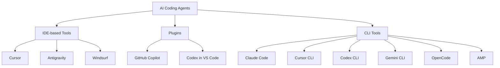
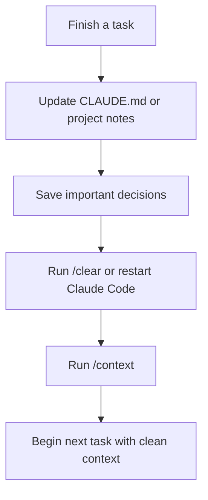
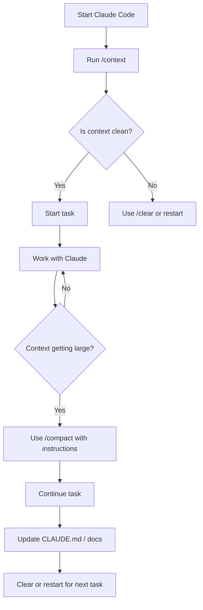
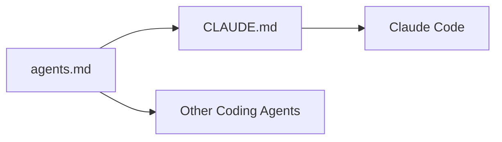
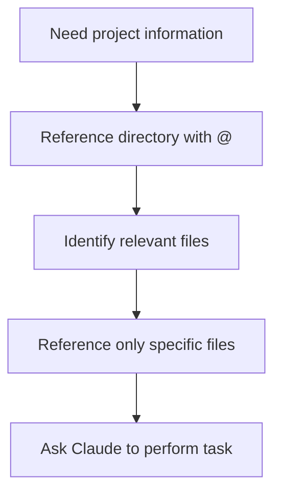

# 041 - Day 2 - Claude Code Commands, Shortcuts & Configuration Deep Dive

## Lesson Information

| Item       | Details                                                                             |
| ---------- | ----------------------------------------------------------------------------------- |
| Lesson     | 041                                                                                 |
| Duration   | 12 minutes                                                                          |
| Week       | Week 2 - Claude Code & Vibe Engineering                                             |
| Module     | Week 2 Day 2 - Claude Code Workflow                                                 |
| Main Topic | Claude Code commands, shortcuts, configuration, project rules, and workflow control |

---

## 1. Lesson Overview

This lesson goes deeper into **Claude Code** by exploring the commands, shortcuts, and configuration options that help you work faster and more safely with an AI coding agent.

The focus is not just on “using Claude Code,” but on learning how to **control the coding agent’s behavior**: how to inspect context, manage memory, reset conversations, configure permissions, choose models, and connect project documentation into Claude’s working context.

By the end of this lesson, you should understand how to move from casual Claude Code usage into a more disciplined, repeatable, and professional coding workflow.

---

## 2. Where Claude Code Fits in the Coding Agent Landscape

Modern AI coding tools can be grouped into three broad categories:



Claude Code belongs primarily to the **CLI agent** category. It is designed to run inside your terminal and operate directly on your project files.

Other tools may expose similar features through an IDE interface, plugin, or alternative CLI, but many of the core ideas are shared:

* Slash commands
* Project memory files
* Agent permissions
* Context management
* Planning versus editing modes
* Tool execution and file modification

Claude Code is especially important because its success helped popularize CLI-based agentic coding workflows.

---

## 3. Starting a Fresh Claude Code Session

A clean session is useful when you want to avoid old environment variables, stale context, or previous conversation state.

Inside VS Code, you can open a fresh terminal with:

```text
Ctrl + Shift + `
```

Then start Claude Code by running:

```bash
claude
```

Once inside Claude Code, you can use **slash commands** to control the tool.

Slash commands are not normal prompts sent to the model. They are commands handled by Claude Code itself.

---

## 4. Understanding Slash Commands

Claude Code commands usually begin with `/`.

For example:

```text
/help
/status
/context
/compact
/clear
/config
/usage
/stats
/model
/init
/permissions
```

You can discover available commands by typing `/` and using the arrow keys to browse the command list.

You can also use:

```text
/help
```

This shows a quick summary of important commands and shortcut keys.

---

## 5. Core Claude Code Commands

### 5.1 `/init`

The `/init` command initializes Claude Code for a project.

It usually creates or updates a project instruction file such as:

```text
CLAUDE.md
```

This file acts as project memory. It can contain:

* Project rules
* Coding conventions
* Architecture notes
* Testing instructions
* Agent behavior guidelines
* Important file paths
* Workflow preferences

Example:

```text
/init
```

However, it is often better to manually maintain this file yourself, because it gives you more control over what the agent reads and follows.

---

### 5.2 `/model`

The `/model` command shows which model Claude Code is currently using and allows you to switch models.

Example:

```text
/model
```

This is useful when you want to choose between faster, cheaper, or more capable models depending on the task.

For example:

| Task Type                 | Recommended Model Behavior |
| ------------------------- | -------------------------- |
| Small edits               | Fast model                 |
| Large refactor            | Strong reasoning model     |
| Debugging complex systems | More capable model         |
| Planning architecture     | Strong reasoning model     |
| Quick file edits          | Faster model               |

---

### 5.3 `/status`

The `/status` command gives an overview of the current Claude Code session.

It may show information such as:

* Claude Code version
* Current model
* Settings
* Session state
* Usage information
* Project configuration

Example:

```text
/status
```

This is useful when you want to quickly inspect the current working environment.

---

### 5.4 `/context`

The `/context` command shows what Claude Code currently has in context.

Example:

```text
/context
```

This is one of the most important commands to use regularly.

It helps you understand:

* What Claude remembers in the current session
* Whether the context is becoming too full
* Whether important project information is loaded
* Whether stale information may be influencing the agent

A clean context is often a good sign when starting a fresh task.

---

### 5.5 `/compact`

The `/compact` command compresses the current conversation history into a smaller summary.

Example:

```text
/compact
```

This is useful when the session is getting long and you want to preserve important information without keeping every message in full detail.

You can also provide custom instructions:

```text
/compact Keep the current implementation plan, known bugs, decisions made, and files changed.
```

This helps Claude retain the most important details.

However, compacting at the wrong time can sometimes cause the agent to lose coherence. It is usually safer to compact manually before the context becomes dangerously full, rather than waiting for the tool to do it automatically in the middle of a task.

---

### 5.6 `/clear`

The `/clear` command wipes the current conversation history.

Example:

```text
/clear
```

This is similar to exiting Claude Code and starting again.

Use this when you want a completely fresh session.

A good workflow is:



This workflow is especially useful if you prefer to keep project knowledge inside files rather than relying on conversation memory.

---

### 5.7 `/config`

The `/config` command shows configuration settings for Claude Code.

Example:

```text
/config
```

This may include behavior settings, permission-related options, or other environment-level configuration.

It is useful when debugging why Claude Code behaves a certain way.

---

### 5.8 `/usage`

The `/usage` command shows usage information.

Example:

```text
/usage
```

This can help you monitor token usage, plan limits, and current session consumption.

---

### 5.9 `/stats`

The `/stats` command shows a more visual usage summary.

Example:

```text
/stats
```

It may include:

* Usage overview
* Models used
* Tokens per day
* Historical usage patterns

This is useful for tracking how heavily you are using Claude Code over time.

---

### 5.10 `/permissions`

The `/permissions` command lets you inspect and manage what Claude Code is allowed to do.

Example:

```text
/permissions
```

This is connected to the permissions stored in the project’s `.claude/settings.json` file.

You can use it to:

* View current permissions
* Add new permission rules
* Remove old permission rules
* Control what commands Claude Code can run automatically

---

## 6. Important Shortcuts

Claude Code also includes useful keyboard shortcuts.

### 6.1 `Shift + Tab`

`Shift + Tab` toggles between interaction modes.

It can switch into modes such as:

* Plan mode
* Accept edits mode
* Normal mode

Plan mode encourages Claude to think through the task before editing.

Accept edits mode allows file edits to be accepted more automatically.

However, modern Claude Code is often good at deciding when to plan and when to act, especially with stronger models. So manually forcing plan mode may be less necessary than before.

---

### 6.2 `Ctrl + O`

`Ctrl + O` toggles detailed transcript mode.

When enabled, Claude Code shows more detailed internal activity, such as tool usage and execution details.

This can be useful when you want to inspect what the agent is doing more closely.

Press `Ctrl + O` again to toggle it off.

---

### 6.3 `Ctrl + C` Twice

Pressing `Ctrl + C` twice exits Claude Code.

This is useful when you want to fully stop the session and restart fresh.

A common workflow is:

```text
Ctrl + C
Ctrl + C
claude
/context
```

This gives you a clean restart and lets you immediately inspect the new context.

---

## 7. Context Management Workflow

Context management is one of the most important skills when using Claude Code.

A strong workflow looks like this:



The key idea is:

> Do not let Claude Code carry too much stale context. Keep durable project knowledge in files, and keep the active conversation focused.

---

## 8. Project Configuration with `.claude/settings.json`

Claude Code creates a `.claude` directory inside your project.

Inside it, you may find a file like:

```text
.claude/settings.json
```

This file stores configuration and permissions.

For example, when Claude Code asks whether it can run a command and you choose to allow it again in the future, that permission may be written into this settings file.

This means you can manually inspect or edit permissions.

Example structure:

```json
{
  "permissions": {
    "allow": [
      "Bash(npm test)",
      "Bash(git status)",
      "Bash(ls:*)"
    ]
  }
}
```

The exact structure may vary, but the concept is the same: Claude Code stores rules about what it is allowed to do.

---

## 9. Managing Permissions Safely

Permissions are powerful, but they should be handled carefully.

Good permissions:

```text
Allow Claude to run tests.
Allow Claude to inspect files.
Allow Claude to run harmless project commands.
```

Risky permissions:

```text
Allow Claude to delete files freely.
Allow Claude to run arbitrary shell commands.
Allow Claude to modify production configuration.
Allow Claude to access secrets.
```

Recommended practice:

| Permission Type                         | Recommendation                    |
| --------------------------------------- | --------------------------------- |
| `git status`, `ls`, `cat`, `grep`       | Usually safe                      |
| `npm test`, `pytest`, `pnpm test`       | Usually useful                    |
| `rm`, `sudo`, `chmod`, `curl pipe bash` | Be very careful                   |
| Database commands                       | Review manually                   |
| Deployment commands                     | Usually require confirmation      |
| Secret or token access                  | Avoid unless absolutely necessary |

A safe principle:

> Give Claude Code enough permission to be useful, but not enough permission to damage the project without your review.

---

## 10. Using `@` to Reference Files

Claude Code supports the `@` syntax to reference files.

For example, inside a prompt:

```text
Read @docs/plan.md and update the implementation based on it.
```

This brings the contents of the file into Claude’s context.

You can also use this inside `CLAUDE.md`.

Example:

```md
# Project Instructions

Follow the detailed implementation plan here:

@docs/plan.md
```

This means Claude Code can load the contents of `docs/plan.md` as part of the project instructions.

---

## 11. Using `@agents.md` from `CLAUDE.md`

A useful trick is to maintain a shared instruction file for multiple agents.

For example, you may have:

```text
agents.md
```

Then your `CLAUDE.md` can simply contain:

```md
@agents.md
```

This allows Claude Code to use the same instructions as other tools such as GitHub Copilot or other coding agents.

The benefit is that you maintain one source of truth instead of duplicating instructions across multiple files.



This is especially useful when a project may be edited by several AI coding tools.

---

## 12. Referencing Directories with `@`

You can also reference a directory.

Example:

```text
@docs/
```

When you reference a directory, Claude Code usually brings in the directory listing, not the full contents of every file.

This helps Claude understand the project structure without flooding the context.

Example use:

```text
Look at @docs/ and tell me which planning files are relevant to the auth refactor.
```

This is useful for navigation and project discovery.

---

## 13. Be Careful with Context Size

The `@` syntax is powerful, but it can quickly fill the context window if used carelessly.

For example:

```text
@large-file.md
```

could bring a huge file into context.

Better approach:

```text
Use @docs/ to inspect the folder structure first, then ask Claude which specific files are needed.
```

A good workflow:



---

## 14. Recommended Claude Code Workflow

A strong daily Claude Code workflow looks like this:

### Step 1: Start Clean

```bash
claude
```

Then inspect context:

```text
/context
```

### Step 2: Load Project Rules

Make sure your `CLAUDE.md` or `agents.md` contains the important project instructions.

Useful project rules include:

```md
# Coding Rules

- Do not change public APIs without asking.
- Always run tests after editing backend logic.
- Keep changes minimal and focused.
- Prefer existing project patterns.
- Update documentation when behavior changes.
```

### Step 3: Ask for a Plan When Needed

For complex tasks:

```text
Please inspect the relevant files and propose a plan before editing.
```

### Step 4: Let Claude Edit

For focused tasks:

```text
Implement the plan. Keep the diff minimal.
```

### Step 5: Review Changes

Ask Claude:

```text
Summarize the files changed and explain the reasoning.
```

### Step 6: Run Tests

```text
Run the relevant test suite.
```

### Step 7: Save Important Knowledge

Update:

```text
CLAUDE.md
docs/plan.md
docs/decisions.md
```

### Step 8: Reset Context

Use:

```text
/compact
```

or:

```text
/clear
```

depending on whether you want to continue or fully reset.

---

## 15. Command Summary Table

| Command        | Purpose                               | When to Use                                  |
| -------------- | ------------------------------------- | -------------------------------------------- |
| `/help`        | Show command help                     | When learning or checking available commands |
| `/init`        | Initialize Claude Code project memory | First time using Claude Code in a project    |
| `/model`       | View or switch model                  | When choosing model capability or cost       |
| `/status`      | Show session and environment status   | When checking current setup                  |
| `/context`     | Inspect current context               | Frequently, especially before major tasks    |
| `/compact`     | Summarize and compress context        | When context is getting full                 |
| `/clear`       | Clear conversation history            | When starting fresh                          |
| `/config`      | View configuration                    | When debugging behavior or settings          |
| `/usage`       | Show usage information                | When monitoring limits                       |
| `/stats`       | Show visual usage stats               | When reviewing historical usage              |
| `/permissions` | Manage allowed actions                | When controlling tool permissions            |

---

## 16. Shortcut Summary Table

| Shortcut           | Purpose                              |
| ------------------ | ------------------------------------ |
| `Ctrl + Shift + `` | Open a new VS Code terminal          |
| `Shift + Tab`      | Toggle Claude Code interaction modes |
| `Ctrl + O`         | Toggle detailed transcript mode      |
| `Ctrl + C` twice   | Exit Claude Code                     |

---

## 17. Key Concepts

### 17.1 Slash Commands

Slash commands are control commands for Claude Code itself. They are not regular prompts sent to the model.

They help you manage:

* Context
* Models
* Usage
* Permissions
* Configuration
* Session state

---

### 17.2 Context Hygiene

Context hygiene means keeping Claude’s working memory clean, relevant, and focused.

Poor context hygiene can cause:

* Confused edits
* Wrong assumptions
* Repeated mistakes
* Lost project direction
* Inconsistent behavior

Good context hygiene means:

* Use `/context` often
* Use `/compact` before context gets too large
* Use `/clear` when switching tasks
* Store durable knowledge in project files
* Avoid dumping huge files into context unnecessarily

---

### 17.3 Project Memory

Files like `CLAUDE.md` or `agents.md` are durable project memory.

They are better than relying only on conversation history because they remain available across sessions.

Good project memory should include:

* Architecture overview
* Coding standards
* Testing commands
* Common workflows
* Important constraints
* Do-not-touch areas
* Agent instructions

---

### 17.4 Permissions

Permissions define what Claude Code can do automatically.

They are important because Claude Code can interact with your actual local project.

Safe permission management prevents accidental damage.

---

### 17.5 File Referencing with `@`

The `@` syntax lets you bring files or directory listings into Claude’s context.

It is useful for:

* Loading plans
* Reading documentation
* Sharing requirements
* Referencing architecture files
* Pointing Claude to specific code areas

But it should be used carefully to avoid overloading the context.

---

## 18. Why This Lesson Matters

This lesson is important because effective Claude Code usage is not only about asking the AI to write code.

It is about learning how to operate the coding agent as a controlled development tool.

You need to know how to:

* Start clean sessions
* Inspect context
* Reset or compact memory
* Manage permissions
* Configure project behavior
* Reference files correctly
* Keep project instructions organized

These habits make Claude Code more reliable, safer, and easier to use on real projects.

---

## 19. Practical Exercise

Try the following workflow in a real project:

```text
1. Open a fresh terminal.
2. Run claude.
3. Run /context.
4. Run /status.
5. Run /model.
6. Run /help.
7. Inspect .claude/settings.json.
8. Create or update CLAUDE.md.
9. Add a reference to @docs/plan.md.
10. Ask Claude to inspect the project and propose a plan.
11. Use /compact with custom instructions.
12. Use /clear and restart with a clean context.
```

Example `CLAUDE.md`:

```md
# Project Instructions

## General Rules

- Keep changes focused and minimal.
- Explain before making large architectural changes.
- Run relevant tests after code edits.
- Do not modify environment files unless explicitly asked.
- Prefer existing project conventions.

## Project Plan

@docs/plan.md
```

---

## 20. Common Mistakes

### Mistake 1: Never Checking Context

If you never run `/context`, you may not know what Claude is actually remembering.

Better:

```text
/context
```

Use it regularly.

---

### Mistake 2: Letting Sessions Run Too Long

Long sessions can become messy.

Better:

```text
/compact
```

or:

```text
/clear
```

---

### Mistake 3: Giving Too Many Permissions

Do not blindly allow every command forever.

Review `.claude/settings.json` and remove risky permissions.

---

### Mistake 4: Putting Everything into Context

Do not reference huge files unless needed.

Better:

```text
@docs/
```

Then choose specific files.

---

### Mistake 5: Duplicating Agent Instructions

Instead of maintaining many separate files, consider using:

```md
@agents.md
```

inside `CLAUDE.md`.

This keeps instructions consistent across tools.

---

## 21. Best Practices

Use Claude Code like a professional development assistant:

* Keep `CLAUDE.md` updated.
* Use `/context` before important tasks.
* Use `/compact` before the session becomes overloaded.
* Use `/clear` when switching topics.
* Keep permissions minimal and intentional.
* Reference files with `@` instead of pasting huge content.
* Ask for a plan before large edits.
* Ask for a summary after changes.
* Run tests after implementation.
* Store important project decisions in documentation.

---

## 22. Final Summary

In this lesson, we explored the practical command system of Claude Code.

The most important commands are:

```text
/help
/init
/model
/status
/context
/compact
/clear
/config
/usage
/stats
/permissions
```

The most important habits are:

```text
Check context often.
Keep project memory in files.
Use compacting intentionally.
Clear sessions when needed.
Manage permissions carefully.
Use @ file references wisely.
```

Claude Code becomes much more powerful when you treat it not just as a chatbot, but as an agent operating inside your development environment.

The better you manage its context, permissions, and project instructions, the better and safer its coding work becomes.

---

# Bài luyện tập

## Mục tiêu


## Đề bài


## Yêu cầu hoàn thành

- [ ] 
- [ ] 
- [ ] 

## Kết quả / lời giải


## Ghi chú
